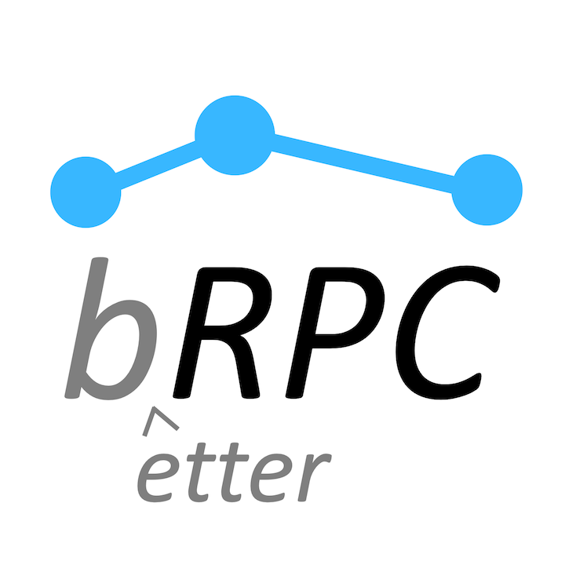

[English version](README.md)

# 

百度内最常使用的工业级RPC框架, 有1,000,000+个实例(不包含client)和上千种多种服务, 在百度内叫做"**baidu-rpc**". 目前只开源C++版本。

你可以使用它：

* 搭建能在**一个端口**支持多协议的服务, 或访问各种服务
  * restful http/https, [h2](https://http2.github.io/http2-spec)/[gRPC](https://grpc.io)。使用brpc的http实现比[libcurl](https://curl.haxx.se/libcurl/)方便多了。从其他语言通过HTTP/h2+json访问基于protobuf的协议.
  * [redis](docs/cn/redis_client.md)和[memcached](docs/cn/memcache_client.md), 线程安全，比官方client更方便。
  * [rtmp](https://github.com/brpc/brpc/blob/master/src/brpc/rtmp.h)/[flv](https://en.wikipedia.org/wiki/Flash_Video)/[hls](https://en.wikipedia.org/wiki/HTTP_Live_Streaming), 可用于搭建[流媒体服务](https://github.com/brpc/media-server).
  * hadoop_rpc(可能开源)
  * 支持[rdma](https://en.wikipedia.org/wiki/Remote_direct_memory_access)(即将开源)
  * 支持[thrift](docs/cn/thrift.md) , 线程安全，比官方client更方便
  * 各种百度内使用的协议: [baidu_std](docs/cn/baidu_std.md), [streaming_rpc](docs/cn/streaming_rpc.md), hulu_pbrpc, [sofa_pbrpc](https://github.com/baidu/sofa-pbrpc), nova_pbrpc, public_pbrpc, ubrpc和使用nshead的各种协议.
  * 基于工业级的[RAFT算法](https://raft.github.io)实现搭建[高可用](https://en.wikipedia.org/wiki/High_availability)分布式系统，已在[braft](https://github.com/brpc/braft)开源。
* Server能[同步](docs/cn/server.md)或[异步](docs/cn/server.md#异步service)处理请求。
* Client支持[同步](docs/cn/client.md#同步访问)、[异步](docs/cn/client.md#异步访问)、[半同步](docs/cn/client.md#半同步)，或使用[组合channels](docs/cn/combo_channel.md)简化复杂的分库或并发访问。
* [通过http界面](docs/cn/builtin_service.md)调试服务, 使用[cpu](docs/cn/cpu_profiler.md), [heap](docs/cn/heap_profiler.md), [contention](docs/cn/contention_profiler.md) profilers.
* 获得[更好的延时和吞吐](docs/cn/overview.md#更好的延时和吞吐).
* 把你组织中使用的协议快速地[加入brpc](docs/cn/new_protocol.md)，或定制各类组件, 包括[命名服务](docs/cn/load_balancing.md#命名服务) (dns, zk, etcd), [负载均衡](docs/cn/load_balancing.md#负载均衡) (rr, random, consistent hashing)

# 试一下!

* 通过[概述](docs/cn/overview.md)了解哪里可以用brpc及其优势。
* 阅读[编译步骤](docs/cn/getting_started.md)了解如何开始使用, 之后可以运行一下[示例程序](https://github.com/brpc/brpc/tree/master/example/).
* 文档:
  * [性能测试](docs/cn/benchmark.md)
  * [bvar](docs/cn/bvar.md)
    * [bvar_c++](docs/cn/bvar_c++.md)
  * [bthread](docs/cn/bthread.md)
    * [bthread or not](docs/cn/bthread_or_not.md)
    * [thread-local](docs/cn/thread_local.md)
    * [Execution Queue](docs/cn/execution_queue.md)
  * Client
    * [基础功能](docs/cn/client.md)
    * [错误码](docs/cn/error_code.md)
    * [组合channels](docs/cn/combo_channel.md)
    * [访问http/h2](docs/cn/http_client.md)
    * [访问gRPC](docs/cn/http_derivatives.md#h2grpc)
    * [访问thrift](docs/cn/thrift.md#client端访问thrift-server)
    * [访问UB](docs/cn/ub_client.md)
    * [Streaming RPC](docs/cn/streaming_rpc.md)
    * [访问redis](docs/cn/redis_client.md)
    * [访问memcached](docs/cn/memcache_client.md)
    * [Backup request](docs/cn/backup_request.md)
    * [Dummy server](docs/cn/dummy_server.md)
  * Server
    * [基础功能](docs/cn/server.md)
    * [搭建http/h2服务](docs/cn/http_service.md)
    * [搭建gRPC服务](docs/cn/http_derivatives.md#h2grpc)
    * [搭建thrift服务](docs/cn/thrift.md#server端处理thrift请求)
    * [搭建Nshead服务](docs/cn/nshead_service.md)
    * [高效率排查server卡顿](docs/cn/server_debugging.md)
    * [推送](docs/cn/server_push.md)
    * [雪崩](docs/cn/avalanche.md)
    * [自适应限流](docs/cn/auto_concurrency_limiter.md)
    * [流媒体服务](https://github.com/brpc/media-server)
    * [json2pb](docs/cn/json2pb.md)
  * [内置服务](docs/cn/builtin_service.md)
    * [status](docs/cn/status.md)
    * [vars](docs/cn/vars.md)
    * [connections](docs/cn/connections.md)
    * [flags](docs/cn/flags.md)
    * [rpcz](docs/cn/rpcz.md)
    * [cpu_profiler](docs/cn/cpu_profiler.md)
    * [heap_profiler](docs/cn/heap_profiler.md)
    * [contention_profiler](docs/cn/contention_profiler.md)
  * 工具
    * [rpc_press](docs/cn/rpc_press.md)
    * [rpc_replay](docs/cn/rpc_replay.md)
    * [rpc_view](docs/cn/rpc_view.md)
    * [benchmark_http](docs/cn/benchmark_http.md)
    * [parallel_http](docs/cn/parallel_http.md)
  * 其他
    * [IOBuf](docs/cn/iobuf.md)
    * [Streaming Log](docs/cn/streaming_log.md)
    * [FlatMap](docs/cn/flatmap.md)
    * [brpc外功修炼宝典](docs/cn/brpc_intro.pptx)(培训材料)
    * [搭建大型服务入门](docs/en/tutorial_on_building_services.pptx)(培训材料)
    * [brpc内功修炼宝典](docs/en/brpc_internal.pptx)(培训材料)
  * 深入RPC
    * [New Protocol](docs/cn/new_protocol.md)
    * [Atomic instructions](docs/cn/atomic_instructions.md)
    * [IO](docs/cn/io.md)
    * [Threading Overview](docs/cn/threading_overview.md)
    * [Load Balancing](docs/cn/load_balancing.md)
    * [Locality-aware](docs/cn/lalb.md)
    * [Consistent Hashing](docs/cn/consistent_hashing.md)
    * [Memory Management](docs/cn/memory_management.md)
    * [Timer keeping](docs/cn/timer_keeping.md)
    * [bthread_id](docs/cn/bthread_id.md)
  * Use cases inside Baidu
    * [百度地图api入口](docs/cn/case_apicontrol.md)
    * [联盟DSP](docs/cn/case_baidu_dsp.md)
    * [ELF学习框架](docs/cn/case_elf.md)
    * [云平台代理服务](docs/cn/case_ubrpc.md)

# 贡献代码

请参考[这里](CONTRIBUTING.md#chinese-version)。

# 反馈问题

bug、修改建议、疑惑都欢迎提在issue中，或加入qq群498837325交流源码方面的问题。
