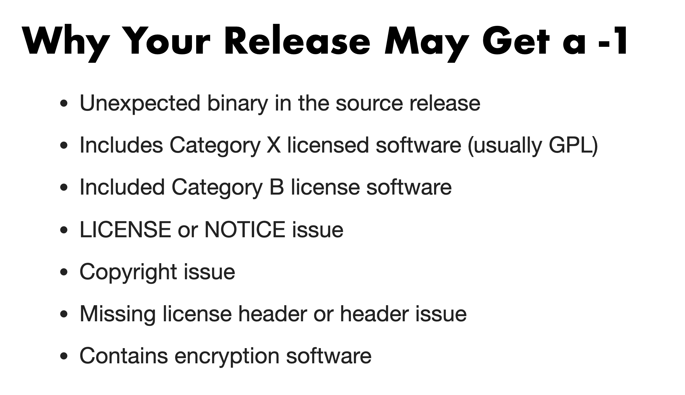

# brpc 发版时候的 Check List

## 文档背景：

当 Release Manager 在 dev 邮件群中发起发布投票的时候，需要 PMC 成员对发版相关信息进行检查，如果检查通过则在邮件群中回复通过并附上检查结果。本文档就是各个检查项。

## Checklist 资料来源

根据 Incubator PMC Chair Justin 在 ApacheCon North America 2019 的分享
https://training.apache.org/topics/ApacheWay/NavigatingASFIncubator/index.html

## 常见的问题导致 -1

## Vote 时候的检查项

毕业后检查时不再需要 `DISCLAIMER` 以及 `incubating`

1. ~~Incubating in name 即下载包的文件名是否带上了incubating~~
2. LICENSE and NOTICE are good
   -  LICENSE 是否符合 Apache 的要求
      - ASF 允许的 LICENSE:Category A(Apache V2, BSD 3, MIT etc)
      - ASF 建议不放到源码中的 LICENSE:Category B(EPL, MPL, CDDL, etc)
      - ASF 不允许的 LICENSE:Category X(GPL, LGPL, CC Non commercial, etc)
   -  NOTICE 是否符合 Apache 的要求
3. Signatures and hashes correct
4. All ASF  files have ASF headers
5. No unexpected binary files
6. Must have an incubating disclaimer
   - ~~Repo 根目录下应该有 DISCLAIMER 文件~~
   - 内容是 Apache 统一的内容

## Vote 时候的常用回复

>
> +1 (binding)
>
>    I checked:
>    - ~~incubating in name~~
>    - LICENSE and NOTICE are good
>    - signatures and hashes correct
>    - All ASF  files have ASF headers
>    - no unexpected binary files
>

## 注意：

1. 不要回复简单的 +1，需要加上执行的几个检查项和检查结果
2. 给出 -1 的时候，同样需要给出明确的理由
