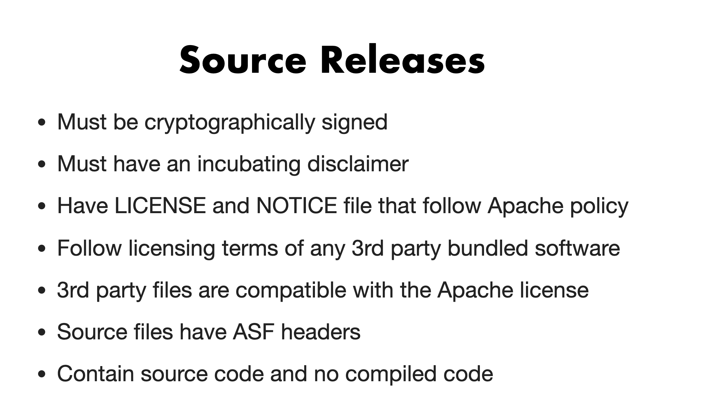

# brpc 发版时候的Check List

## 文档背景：
当Release Manager在dev邮件群中发起发布投票的时候，需要PMC成员对发版相关信息进行检查，如果检查通过则在邮件群中回复通过并附上检查结果。本文档就是各个检查项。

## Checklist 资料来源
根据Incubator PMC Chair Justin在ApacheCon North America 2019的分享
https://training.apache.org/topics/ApacheWay/NavigatingASFIncubator/index.html

## 常见的问题导致-1

## Vote时候的检查项
1. Incubating in name 即下载包的文件名是否带上了incubating
2. LICENSE and NOTICE are good
   -  LICENSE是否符合Apache的要求
      - ASF允许的LICENSE:Category A(Apache V2,BSD 3,MIT etc)
      - ASF建议不放到源码中的LICENSE:Category B(EPL,MPL,CDDL,etc)
      - ASF不允许的LICENSE:Category X(GPL,LGPL,CC Non commercial,etc)
   -  NOTICE是否符合Apache的要求
3. Signatures and hashes correct
4. All ASF  files have ASF headers
5. No unexpected binary files
6. Must have an incubating disclaimer
   - Repo根目录下应该有DISCLAIMER文件
   - 内容是Apache统一的内容

## Vote时候的常用回复

“+1 (binding)

    I checked:
    - incubating in name
    - LICENSE and NOTICE are good
    - signatures and hashes correct
    - All ASF  files have ASF headers
    - no unexpected binary files

## 注意：
1. 不要回复简单的+1，需要加上执行的几个检查项和检查结果
2. 给出-1的时候，同样需要给出明确的理由

