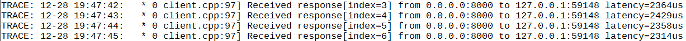
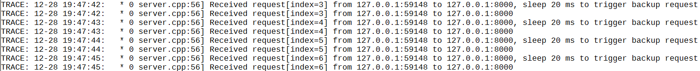
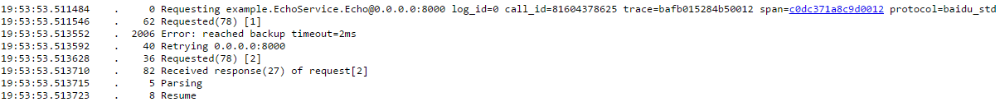
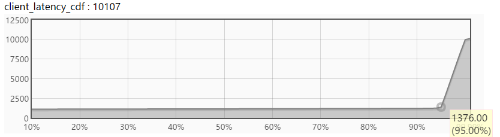

有时为了保证可用性，需要同时访问两路服务，哪个先返回就取哪个。在brpc中，这有多种做法：

# 当后端server可以挂在一个命名服务内时

Channel开启backup request。这个Channel会先向其中一个server发送请求，如果在ChannelOptions.backup_request_ms后还没回来，再向另一个server发送。之后哪个先回来就取哪个。在设置了合理的backup_request_ms后，大部分时候只会发一个请求，对后端服务只有一倍压力。

示例代码见[example/backup_request_c++](https://github.com/brpc/brpc/blob/master/example/backup_request_c++)。这个例子中，client设定了在2ms后发送backup request，server在碰到偶数位的请求后会故意睡眠20ms以触发backup request。

运行后，client端和server端的日志分别如下，“index”是请求的编号。可以看到server端在收到第一个请求后会故意sleep 20ms，client端之后发送另一个同样index的请求，最终的延时并没有受到故意sleep的影响。





/rpcz也显示client在2ms后触发了backup超时并发出了第二个请求。



## 选择合理的backup_request_ms

可以观察brpc默认提供的latency_cdf图，或自行添加。cdf图的y轴是延时（默认微秒），x轴是小于y轴延时的请求的比例。在下图中，选择backup_request_ms=2ms可以大约覆盖95.5%的请求，选择backup_request_ms=10ms则可以覆盖99.99%的请求。



自行添加的方法：

```c++
#include <bvar/bvar.h>
#include <butil/time.h>
...
bvar::LatencyRecorder my_func_latency("my_func");
...
butil::Timer tm;
tm.start();
my_func();
tm.stop();
my_func_latency << tm.u_elapsed();  // u代表微秒，还有s_elapsed(), m_elapsed(), n_elapsed()分别对应秒，毫秒，纳秒。
 
// 好了，在/vars中会显示my_func_qps, my_func_latency, my_func_latency_cdf等很多计数器。
```

# 当后端server不能挂在一个命名服务内时

【推荐】建立一个开启backup request的SelectiveChannel，其中包含两个sub channel。访问这个SelectiveChannel和上面的情况类似，会先访问一个sub channel，如果在ChannelOptions.backup_request_ms后没返回，再访问另一个sub channel。如果一个sub channel对应一个集群，这个方法就是在两个集群间做互备。SelectiveChannel的例子见[example/selective_echo_c++](https://github.com/brpc/brpc/tree/master/example/selective_echo_c++)，具体做法请参考上面的过程。

【不推荐】发起两个异步RPC后Join它们，它们的done内是相互取消的逻辑。示例代码见[example/cancel_c++](https://github.com/brpc/brpc/tree/master/example/cancel_c++)。这种方法的问题是总会发两个请求，对后端服务有两倍压力，这个方法怎么算都是不经济的，你应该尽量避免用这个方法。
