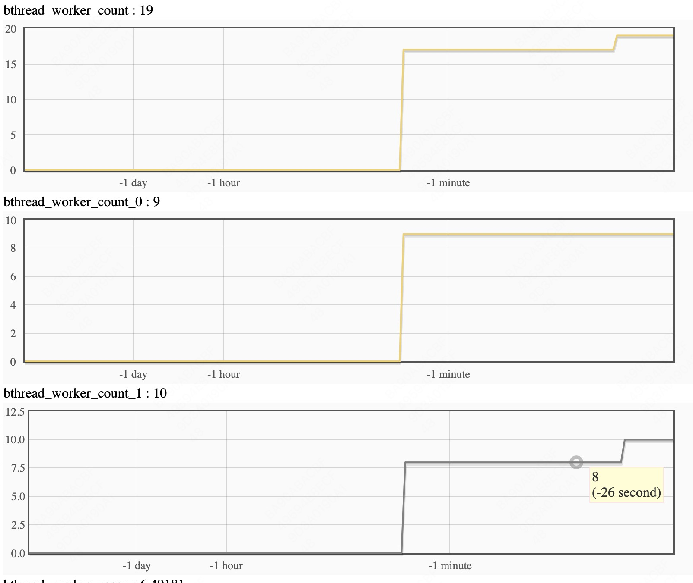
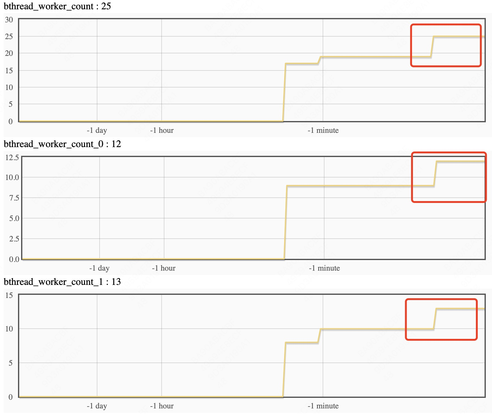

# Bthread tagged task group

在很多应用开发过程中都会有线程资源隔离的需求，比如服务分为控制层和数据层，数据层的请求压力大，不希望控制层受到影响；再比如，服务有多个磁盘，希望服务不同磁盘的线程之间没有什么影响；bthread的任务组打标签就是实现bthread的worker线程池按照tag分组，让不同分组之间达到没有互相影响的目的。服务是按照server级别做tag分组的，用户需要将不同分组的service安排到不同server上，不同server将使用不同端口。还有些场景需要有一些后台任务或者定时任务在单独的线程池中调度，这些任务没有service，这种情况也可以使用tag分组专门划分一个线程池，让这些任务在这个tag分组上执行，这个线程池的并发度任务数等都由用户自己控制。用户可以在这个基础上实现多种策略，比如，将tag组限制在NUMA的某个组，设置一些线程本地变量等。
实现的逻辑就是在bthread层面创建了多个worker分组，每个分组的处理逻辑和原来一样；bthread接口层面在bthread_attr_t里面增加了tag字段，让用户去设置；rpc层面在brpc::ServerOptions里面增加了bthread_tag字段，用于指定这个server在哪个worker分组上执行。


# 使用方式

在example/bthread_tag_echo_c++里面有一个实例代码,分别启动服务端和客户端，服务端将worker划分成3个tag（分组），例子里面可以设置FLAGS_tag1,FLAGS_tag2，给不同server打标签。剩下的一个tag（分组）给服务的后台任务使用。

```c++
服务端启动
./echo_server -task_group_ntags 3 -tag1 0 -tag2 1 -bthread_concurrency 20 -bthread_min_concurrency 12 -event_dispatcher_num 1

客户端启动
./echo_client -dummy_port 8888 -server "0.0.0.0:8002" -use_bthread true
./echo_client -dummy_port 8889 -server "0.0.0.0:8003" -use_bthread true
```

FLAGS_bthread_concurrency为所有分组的线程数的上限，FLAGS_bthread_min_concurrency为所有分组的线程数的下限，FLAGS_event_dispatcher_num为单个分组中事件驱动器的数量。FLAGS_bthread_current_tag为将要修改的分组的tag值，FLAGS_bthread_concurrency_by_tag设置这个分组的线程数。
一般情况应用创建的bthread不需要设置bthread_attr_t的tag字段，创建的bthread会在当前tag上下文中执行；如果希望创建的bthread不在当前tag上下文中执行，可以设置bthread_attr_t的tag字段为希望的值，这么做会对性能有些损失，关键路径上应该避免这么做。

Q：如何动态改变分组线程的数量？

A：server的线程数最少为4个，后台任务线程数最少为2个，所以上面的例子中，FLAGS_bthread_concurrency最小值为4+4+2=10，再设置FLAGS_bthread_min_concurrency=FLAGS_bthread_concurrency，之后再把FLAGS_bthread_concurrency改大一些，之后再设置FLAGS_bthread_current_tag和FLAGS_bthread_concurrency_by_tag来改变某个分组的线程数。对于server，如果设置了ServerOption.bthread_tag，num_threads的含义是这个分组的线程数；如果没有设置（相当于没有启用分组，默认值为BTHREAD_TAG_INVALID）,num_thread的含义是所有分组的线程数。

Q：不同分组之间有什么关系吗？

A：不同分组是独立的线程池和事件驱动器，完全没有关系。

Q：可以在分组之间做bthread的同步操作吗？

A：可以的，每个bthread都有自己的tag标签，挂起后重新投入运行将继续在这个tag的线程池上执行。

Q：客户端发送和接收RPC消息是在哪个分组上执行的？

A：这取决于客户端的上下文，如果客户端不在任何tag分组上，那将使用tag0分组收发消息；否则将在当前所在的tag分组收发消息。

Q：如何将一个分组的线程绑定到指定的一些cpu上面。

A：int bthread_set_tagged_worker_startfn(void (*start_fn)(bthread_tag_t))这个函数用于在某个分组上做一些初始化的工作，比如：可以实现绑核的代码，根据tag入参来确定不同分组绑定不同的cpu。

# 监控

目前监控按照tag划分的指标有，线程的数量、线程的使用量、bthread_count、连接信息

线程使用量：

动态调整tag1分组的线程数

设置tag1：
设置所有tag：
