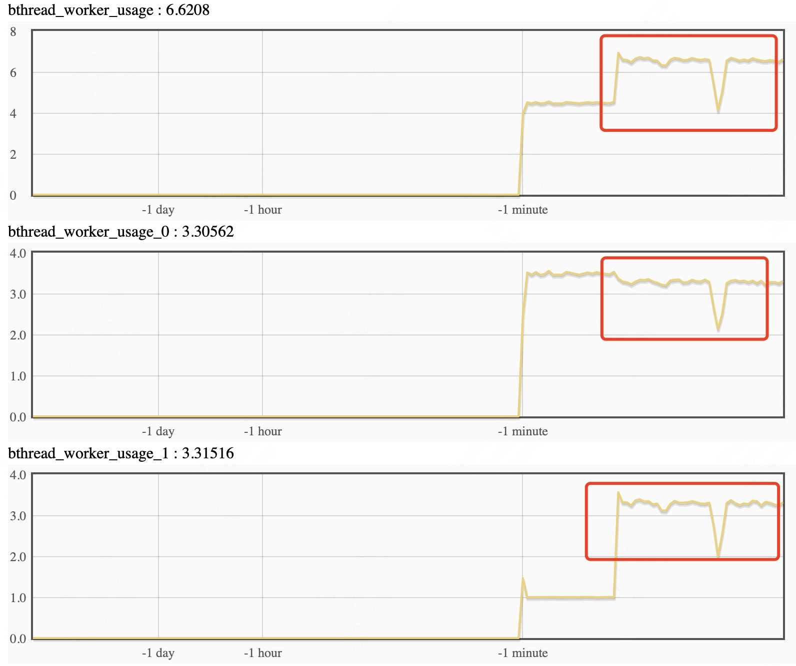

# Bthread tagged task group

在很多应用开发过程中都会有线程资源隔离的需求，比如服务分为控制层和数据层，数据层的请求压力大，不希望控制层受到影响；再比如，服务有多个磁盘，希望服务不同磁盘的线程之间没有什么影响；bthread的为任务组打标签就是实现bthread的worker线程池按照tag分组，让不同分组之间达到没有互相影响的目的。服务是按照server级别做tag分组的，用户需要将不同分组的service安排到不同server上，不同server将使用不同端口。还有些场景服务需要有一些后台任务或者定时任务在单独的线程池中调度，这些任务没有service，这种情况也可以使用tag分组专门划分一个线程池，让这些任务在这个tag分组上执行。后续在这个基础上还可以实现多种策略，比如，将tag组限制在NUMA的某个组，组内线程绑核等。

# 使用方式

在example/bthread_tag_echo_c++里面有一个实例代码,分别启动服务端和客户端，服务端将worker划分成3个tag（分组），例子里面可以设置FLAGS_tag1,FLAGS_tag2，给不同server打标签。剩下的一个tag（分组）给服务的后台任务使用。

```c++
服务端启动
./echo_server -task_group_ntags 3 -tag1 0 -tag2 1 -bthread_concurrency 20 -bthread_min_concurrency 12 -event_dispatcher_num 2

客户端启动
./echo_client -dummy_port 8888 -server "0.0.0.0:8002" -use_bthread true
./echo_client -dummy_port 8889 -server "0.0.0.0:8003" -use_bthread true
```

一般情况应用创建的bthread不需要设置bthread_attr_t的tag字段，创建的bthread会在当前tag上下文中执行；如果希望创建的bthread不在当前tag上下文中执行，可以设置bthread_attr_t的tag字段为希望的值，这么做会对性能有些损失，关键路径上应该避免这么做。

# 监控

目前监控上按照tag划分的指标有，线程的数量、线程的使用量、bthread_count、连接信息

线程使用量：

动态调整线程数，FLAGS_bthread_concurrency是所有线程池的线程数总和，设置FLAGS_bthread_concurrency会依次为每个线程池增加线程数量，直到线程总数为FLAGS_bthread_concurrency。要设置某个线程池的数量，先设置FLAGS_bthread_current_tag为要调整的tag，之后再设置FLAGS_bthread_concurrency_by_tag为指定的线程数量，但是所有线程池的总数量不能超过FLAGS_bthread_concurrency。

设置tag1：
设置所有tag：
