gdb（ptrace）+ gdb_bthread_stack.py主要的缺点是要慢和阻塞进程，需要一种高效的追踪bthread调用栈的方法。

bRPC框架的协作式用户态协程无法像Golang内建的抢占式协程一样实现高效的STW（Stop the World），框架也无法干预用户逻辑的执行，所以要追踪bthread调用栈是比较困难的。

在线追踪bthread调用栈需要解决以下问题：
1. 追踪挂起bthread的调用栈。 
2. 追踪运行中bthread的调用栈。

# bthread状态模型

以下是目前的bthread状态模型。



# 设计方案

## 核心思路

为了解决上述两个问题，该方案实现了STB（Stop The Bthread），核心思路可以简单总结为，在追踪bthread调用栈的过程中，状态不能流转到当前追踪方法不支持的状态。STB包含了两种追踪模式：上下文（context）追踪模式和信号追踪模式。

### 上下文（context）追踪模式
上下文追踪模式可以追踪挂起bthread的调用栈。挂起的bthread栈是稳定的，利用TaskMeta.stack中保存的上下文信息（x86_64下关键的寄存器主要是RIP、RSP、RBP），通过一些可以回溯指定上下文调用栈的库来追踪bthread调用栈。但是挂起的bthread随时可能会被唤醒，执行逻辑（包括jump_stack），则bthread栈会一直变化。不稳定的上下文是不能用来追踪调用栈的，需要在jump_stack前拦截bthread的调度，等到调用栈追踪完成后才继续运行bthread。所以，上下文追踪模式支持就绪、挂起这两个状态。

### 信号追踪模式

信号追踪模式可以追踪运行中bthread的调用栈。运行中bthread是不稳定的，不能使用TaskMeta.stack来追踪bthread调用栈。只能另辟蹊径，使用信号中断bthread运行逻辑，在信号处理函数中回溯bthread调用栈。使用信号有两个问题：

1. 异步信号安全问题。
2. 信号追踪模式不支持jump_stack。调用栈回溯需要寄存器信息，但jump_stack会操作寄存器，这个过程是不安全的，所以jump_stack不能被信号中断，需要在jump_stack前拦截bthread的调度，等到bthread调用栈追踪完成后才继续挂起bthread。

所以，追踪模式只支持运行状态。

### 小结

jump_stack是bthread挂起或者运行的必经之路，也是STB的拦截点。STB将状态分成三类：
1. 上下文追踪模式的状态：就绪、挂起。
2. 支持信号追踪模式的状态：运行。
3. 不支持追踪的状态。jump_stack的过程是不允许使用以上两种调用栈追踪方法，需要在jump_stack前拦截bthread的调度，等到调用栈追踪完成后才继续调度bthread。

### 详细流程

以下是引入STB后的bthread状态模型，在原来bthread状态模型的基础上，加入两个状态（拦截点）：将运行、挂起中。



经过上述分析，总结出STB的流程：

1. TaskTracer（实现STB的一个模块）收到追踪bthread调用栈的请求时，标识正在追踪。追踪完成后，标识追踪完成，并TaskTracer发信号通知可能处于将运行或者挂起中状态的bthread。根据bthread状态，TaskTracer执行不同的逻辑：
- 创建、就绪但还没分配栈、销毁：直接结束追踪。
- 挂起、就绪：使用上下文追踪模式追踪bthread的调用栈。
- 运行：使用信号追踪模式追踪bthread的调用栈。
- 将运行、挂起中：TaskTracer自旋等到bthread状态流转到下一个状态（挂起或者运行）后继续追踪。

2. TaskTracer追踪时，bthread根据状态也会执行不同的逻辑：
- 创建、就绪但还没分配栈、就绪：不需要额外处理。
- 挂起、运行：通知TaskTracer继续追踪。
- 将运行、挂起中、销毁：bthread通过条件变量等到TaskTracer追踪完成。TaskTracer追踪完成后会通过条件变量通知bthread继续执行jump_stack。

# 使用方法

1. 下载安装libunwind。
2. 给config_brpc.sh增加`--with-bthread-tracer`选项或者给cmake增加`-DWITH_BTHREAD_TRACER=ON`选项。
3. 访问服务的内置服务：`http://ip:port/bthreads/<bthread_id>?st=1`或者代码里调用`bthread::stack_trace()`函数。
4. 如果希望追踪pthread的调用栈，在对应pthread上调用`bthread::init_for_pthread_stack_trace()`函数获取一个伪bthread_t，然后使用步骤3即可获取pthread调用栈。

下面是追踪bthread调用栈的输出示例：
```shell
#0 0x00007fdbbed500b5 __clock_gettime_2
#1 0x000000000041f2b6 butil::cpuwide_time_ns()
#2 0x000000000041f289 butil::cpuwide_time_us()
#3 0x000000000041f1b9 butil::EveryManyUS::operator bool()
#4 0x0000000000413289 (anonymous namespace)::spin_and_log()
#5 0x00007fdbbfa58dc0 bthread::TaskGroup::task_runner()
```

# 相关flag

- `enable_fast_unwind`：是否启用快速回溯功能，默认为true。大多数情况下，不需要关闭快速回溯功能。除非你关注的调用栈函数名转换失败，显示为`<unknown>`，则可以尝试关闭快速回溯功能，但这会导致性能下降。以包含30帧的调用栈举例，快速回溯基本上在200us以内就可以完成，而关闭快速回溯则需要4ms左右，性能下降了近20倍。
- `signal_trace_timeout_ms`：信号追踪模式的超时时间，默认为50ms。虽然libunwind文档显示回溯功能是异步信号安全的，但是[gpertools社区发现libunwind在某些情况下会死锁](https://github.com/gperftools/gperftools/issues/775)，所以TaskTracer会设置了超时时间，超时后会放弃回溯，打破死锁。