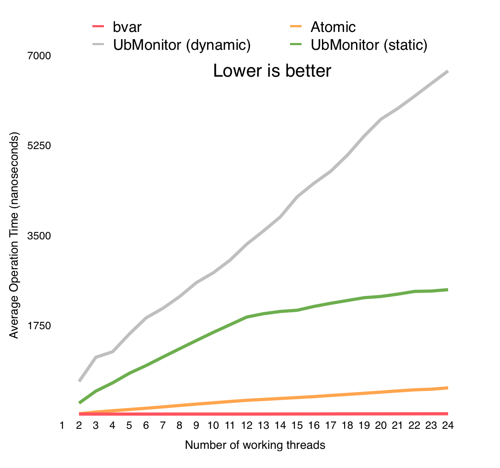
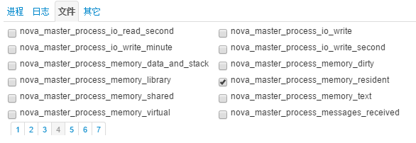
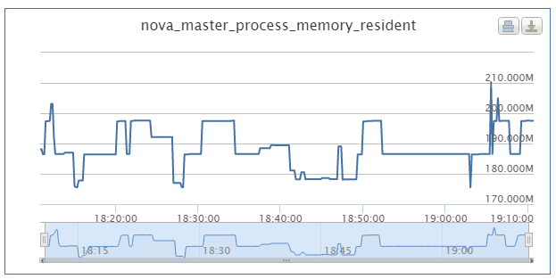

[English version](../en/bvar.md)

# 什么是bvar？

[bvar](https://github.com/apache/brpc/tree/master/src/bvar/)是多线程环境下的计数器类库，支持[单维度bvar](bvar_c++.md)和[多维度mbvar](mbvar_c++.md)，方便记录和查看用户程序中的各类数值，它利用了thread local存储减少了cache bouncing，相比UbMonitor(百度内的老计数器库)几乎不会给程序增加性能开销，也快于竞争频繁的原子操作。brpc集成了bvar，[/vars](vars.md)可查看所有曝光的bvar，[/vars/VARNAME](vars.md)可查阅某个bvar，在brpc中的使用方法请查看[vars](vars.md)。brpc大量使用了bvar提供统计数值，当你需要在多线程环境中计数并展现时，应该第一时间想到bvar。但bvar不能代替所有的计数器，它的本质是把写时的竞争转移到了读：读得合并所有写过的线程中的数据，而不可避免地变慢了。当你读写都很频繁或得基于最新值做一些逻辑判断时，你不应该用bvar。

为了理解bvar的原理，你得先阅读[Cacheline这节](atomic_instructions.md#cacheline)，其中提到的计数器例子便是bvar。当很多线程都在累加一个计数器时，每个线程只累加私有的变量而不参与全局竞争，在读取时累加所有线程的私有变量。虽然读比之前慢多了，但由于这类计数器的读多为低频的记录和展现，慢点无所谓。而写就快多了，极小的开销使得用户可以无顾虑地使用bvar监控系统，这便是我们设计bvar的目的。

下图是bvar和原子变量，静态UbMonitor，动态UbMonitor在被多个线程同时使用时的开销。可以看到bvar的耗时基本和线程数无关，一直保持在极低的水平（~20纳秒）。而动态UbMonitor在24核时每次累加的耗时达7微秒，这意味着使用300次bvar的开销才抵得上使用一次动态UbMonitor变量。



# 新增bvar

增加C++ bvar的方法请看[快速介绍](bvar_c++.md#quick-introduction). bvar默认统计了进程、系统的一些变量，以process\_, system\_等开头，比如：

```
process_context_switches_involuntary_second : 14
process_context_switches_voluntary_second : 15760
process_cpu_usage : 0.428
process_cpu_usage_system : 0.142
process_cpu_usage_user : 0.286
process_disk_read_bytes_second : 0
process_disk_write_bytes_second : 260902
process_faults_major : 256
process_faults_minor_second : 14
process_memory_resident : 392744960
system_core_count : 12
system_loadavg_15m : 0.040
system_loadavg_1m : 0.000
system_loadavg_5m : 0.020
```

还有像brpc内部的各类计数器：

```
bthread_switch_second : 20422
bthread_timer_scheduled_second : 4
bthread_timer_triggered_second : 4
bthread_timer_usage : 2.64987e-05
bthread_worker_count : 13
bthread_worker_usage : 1.33733
bvar_collector_dump_second : 0
bvar_collector_dump_thread_usage : 0.000307385
bvar_collector_grab_second : 0
bvar_collector_grab_thread_usage : 1.9699e-05
bvar_collector_pending_samples : 0
bvar_dump_interval : 10
bvar_revision : "34975"
bvar_sampler_collector_usage : 0.00106495
iobuf_block_count : 89
iobuf_block_count_hit_tls_threshold : 0
iobuf_block_memory : 729088
iobuf_newbigview_second : 10
```

# 监控bvar
打开bvar的[dump功能](bvar_c++.md#export-all-variables)以导出所有的bvar到文件，格式就如上文一样，每行是一对"名字:值"。打开dump功能后应检查monitor/目录下是否有数据，比如：

```
$ ls monitor/
bvar.echo_client.data  bvar.echo_server.data
 
$ tail -5 monitor/bvar.echo_client.data
process_swaps : 0
process_time_real : 2580.157680
process_time_system : 0.380942
process_time_user : 0.741887
process_username : "gejun"
```
每次导出都会覆盖之前的文件，这与普通log添加在后面是不同的。

监控系统应定期搜集每台单机导出的数据，并把它们汇总到一起。这里以百度内的noah为例，bvar定义的变量会出现在noah的指标项中，用户可勾选并查看历史曲线。




# 导出到Prometheus

将[Prometheus](https://prometheus.io)的抓取url地址的路径设置为`/brpc_metrics`即可，例如brpc server跑在本机的8080端口，则抓取url配置为`127.0.0.1:8080/brpc_metrics`。
