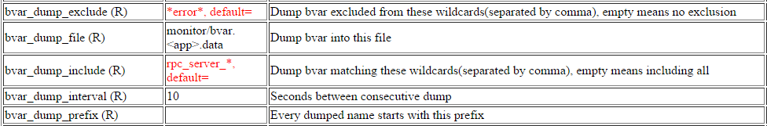

# Quick introduction

```c++
#include <bvar/bvar.h>

namespace foo {
namespace bar {

// bvar::Adder<T>用于累加，下面定义了一个统计read error总数的Adder。
bvar::Adder<int> g_read_error;
// 把bvar::Window套在其他bvar上就可以获得时间窗口内的值。
bvar::Window<bvar::Adder<int> > g_read_error_minute("foo_bar", "read_error", &g_read_error, 60);
//                                                     ^          ^                         ^
//                                                    前缀       监控项名称                  60秒,忽略则为10秒

// bvar::LatencyRecorder是一个复合变量，可以统计：总量、qps、平均延时，延时分位值，最大延时。
bvar::LatencyRecorder g_write_latency(“foo_bar", "write”);
//                                      ^          ^
//                                     前缀       监控项，别加latency！LatencyRecorder包含多个bvar，它们会加上各自的后缀，比如write_qps, write_latency等等。

// 定义一个统计“已推入task”个数的变量。
bvar::Adder<int> g_task_pushed("foo_bar", "task_pushed");
// 把bvar::PerSecond套在其他bvar上可以获得时间窗口内*平均每秒*的值，这里是每秒内推入task的个数。
bvar::PerSecond<bvar::Adder<int> > g_task_pushed_second("foo_bar", "task_pushed_second", &g_task_pushed);
//       ^                                                                                             ^
//    和Window不同，PerSecond会除以时间窗口的大小.                                   时间窗口是最后一个参数，这里没填，就是默认10秒。

}  // bar
}  // foo
```

在应用的地方：

```c++
// 碰到read error
foo::bar::g_read_error << 1;

// write_latency是23ms
foo::bar::g_write_latency << 23;

// 推入了1个task
foo::bar::g_task_pushed << 1;
```

注意Window<>和PerSecond<>都是衍生变量，会自动更新，你不用给它们推值。你当然也可以把bvar作为成员变量或局部变量。

常用的bvar有：

- `bvar::Adder<T>` : 计数器，默认0，varname << N相当于varname += N。
- `bvar::Maxer<T>` : 求最大值，默认std::numeric_limits<T>::min()，varname << N相当于varname = max(varname, N)。
- `bvar::Miner<T>` : 求最小值，默认std::numeric_limits<T>::max()，varname << N相当于varname = min(varname, N)。
- `bvar::IntRecorder` : 求自使用以来的平均值。注意这里的定语不是“一段时间内”。一般要通过Window衍生出时间窗口内的平均值。
- `bvar::Window<VAR>` : 获得某个bvar在一段时间内的累加值。Window衍生于已存在的bvar，会自动更新。
- `bvar::PerSecond<VAR>` : 获得某个bvar在一段时间内平均每秒的累加值。PerSecond也是会自动更新的衍生变量。
- `bvar::LatencyRecorder` : 专用于记录延时和qps的变量。输入延时，平均延时/最大延时/qps/总次数 都有了。

**确认变量名是全局唯一的！**否则会曝光失败，如果-bvar_abort_on_same_name为true，程序会直接abort。

程序中有来自各种模块不同的bvar，为避免重名，建议如此命名：**模块_类名_指标**

- **模块**一般是程序名，可以加上产品线的缩写，比如inf_ds，ecom_retrbs等等。
- **类名**一般是类名或函数名，比如storage_manager, file_transfer, rank_stage1等等。
- **指标**一般是count，qps，latency这类。

一些正确的命名如下：

```
iobuf_block_count : 29                          # 模块=iobuf   类名=block  指标=count
iobuf_block_memory : 237568                     # 模块=iobuf   类名=block  指标=memory
process_memory_resident : 34709504              # 模块=process 类名=memory 指标=resident
process_memory_shared : 6844416                 # 模块=process 类名=memory 指标=shared
rpc_channel_connection_count : 0                # 模块=rpc     类名=channel_connection  指标=count
rpc_controller_count : 1                        # 模块=rpc     类名=controller 指标=count
rpc_socket_count : 6                            # 模块=rpc     类名=socket     指标=count
```

目前bvar会做名字归一化，不管你打入的是foo::BarNum, foo.bar.num, foo bar num , foo-bar-num，最后都是foo_bar_num。

关于指标：

- 个数以_count为后缀，比如request_count, error_count。
- 每秒的个数以_second为后缀，比如request_second, process_inblocks_second，已经足够明确，不用写成_count_second或_per_second。
- 每分钟的个数以_minute为后缀，比如request_minute, process_inblocks_minute

如果需要使用定义在另一个文件中的计数器，需要在头文件中声明对应的变量。

```c++
namespace foo {
namespace bar {
// 注意g_read_error_minute和g_task_pushed_per_second都是衍生的bvar，会自动更新，不要声明。
extern bvar::Adder<int> g_read_error;
extern bvar::LatencyRecorder g_write_latency;
extern bvar::Adder<int> g_task_pushed;
}  // bar
}  // foo
```

**不要跨文件定义全局Window或PerSecond**。不同编译单元中全局变量的初始化顺序是[未定义的](https://isocpp.org/wiki/faq/ctors#static-init-order)。在foo.cpp中定义`Adder<int> foo_count`，在foo_qps.cpp中定义`PerSecond<Adder<int> > foo_qps(&foo_count);`是**错误**的做法。

About thread-safety:

- bvar是线程兼容的。你可以在不同的线程里操作不同的bvar。比如你可以在多个线程中同时expose或hide**不同的**bvar，它们会合理地操作需要共享的全局数据，是安全的。
- **除了读写接口**，bvar的其他函数都是线程不安全的：比如说你不能在多个线程中同时expose或hide**同一个**bvar，这很可能会导致程序crash。一般来说，读写之外的其他接口也没有必要在多个线程中同时操作。

计时可以使用butil::Timer，接口如下：

```c++
#include <butil/time.h>
namespace butil {
class Timer {
public:
    enum TimerType { STARTED };

    Timer();

    // butil::Timer tm(butil::Timer::STARTED);  // tm is already started after creation.
    explicit Timer(TimerType);

    // Start this timer
    void start();

    // Stop this timer
    void stop();

    // Get the elapse from start() to stop().
    int64_t n_elapsed() const;  // in nanoseconds
    int64_t u_elapsed() const;  // in microseconds
    int64_t m_elapsed() const;  // in milliseconds
    int64_t s_elapsed() const;  // in seconds
};
}  // namespace butil
```

# bvar::Variable

Variable是所有bvar的基类，主要提供全局注册，列举，查询等功能。

用户以默认参数建立一个bvar时，这个bvar并未注册到任何全局结构中，在这种情况下，bvar纯粹是一个更快的计数器。我们称把一个bvar注册到全局表中的行为为“曝光”，可通过`expose`函数曝光：
```c++
// Expose this variable globally so that it's counted in following functions:
//   list_exposed
//   count_exposed
//   describe_exposed
//   find_exposed
// Return 0 on success, -1 otherwise.
int expose(const butil::StringPiece& name);
int expose_as(const butil::StringPiece& prefix, const butil::StringPiece& name);
```
全局曝光后的bvar名字便为name或prefix + name，可通过以_exposed为后缀的static函数查询。比如Variable::describe_exposed(name)会返回名为name的bvar的描述。

当相同名字的bvar已存在时，expose会打印FATAL日志并返回-1。如果选项**--bvar_abort_on_same_name**设为true (默认是false)，程序会直接abort。

下面是一些曝光bvar的例子：
```c++
bvar::Adder<int> count1;

count1 << 10 << 20 << 30;   // values add up to 60.
count1.expose("count1");  // expose the variable globally
CHECK_EQ("60", bvar::Variable::describe_exposed("count1"));
count1.expose("another_name_for_count1");  // expose the variable with another name
CHECK_EQ("", bvar::Variable::describe_exposed("count1"));
CHECK_EQ("60", bvar::Variable::describe_exposed("another_name_for_count1"));

bvar::Adder<int> count2("count2");  // exposed in constructor directly
CHECK_EQ("0", bvar::Variable::describe_exposed("count2"));  // default value of Adder<int> is 0

bvar::Status<std::string> status1("count2", "hello");  // the name conflicts. if -bvar_abort_on_same_name is true,
                                                       // program aborts, otherwise a fatal log is printed.
```

为避免重名，bvar的名字应加上前缀，建议为`<namespace>_<module>_<name>`。为了方便使用，我们提供了**expose_as**函数，接收一个前缀。
```c++
// Expose this variable with a prefix.
// Example:
//   namespace foo {
//   namespace bar {
//   class ApplePie {
//       ApplePie() {
//           // foo_bar_apple_pie_error
//           _error.expose_as("foo_bar_apple_pie", "error");
//       }
//   private:
//       bvar::Adder<int> _error;
//   };
//   }  // foo
//   }  // bar
int expose_as(const butil::StringPiece& prefix, const butil::StringPiece& name);
```

# Export all variables

最常见的导出需求是通过HTTP接口查询和写入本地文件。前者在brpc中通过[/vars](vars.md)服务提供，后者则已实现在bvar中，默认不打开。有几种方法打开这个功能：

- 用[gflags](flags.md)解析输入参数，在程序启动时加入-bvar_dump，或在brpc中也可通过[/flags](flags.md)服务在启动后动态修改。gflags的解析方法如下，在main函数处添加如下代码:

```c++
  #include <gflags/gflags.h>
  ...
  int main(int argc, char* argv[]) {
      google::ParseCommandLineFlags(&argc, &argv, true/*表示把识别的参数从argc/argv中删除*/);
      ...
  }
```

- 不想用gflags解析参数，希望直接在程序中默认打开，在main函数处添加如下代码：

```c++
#include <gflags/gflags.h>
...
int main(int argc, char* argv[]) {
    if (google::SetCommandLineOption("bvar_dump", "true").empty()) {
        LOG(FATAL) << "Fail to enable bvar dump";
    }
    ...
}
```

dump功能由如下gflags控制：

| 名称                 | 默认值                     | 作用                                       |
| ------------------ | ----------------------- | ---------------------------------------- |
| bvar_dump          | false                   | Create a background thread dumping all bvar periodically, all bvar_dump_* flags are not effective when this flag is off |
| bvar_dump_exclude  | ""                      | Dump bvar excluded from these wildcards(separated by comma), empty means no exclusion |
| bvar_dump_file     | monitor/bvar.<app>.data | Dump bvar into this file                 |
| bvar_dump_include  | ""                      | Dump bvar matching these wildcards(separated by comma), empty means including all |
| bvar_dump_interval | 10                      | Seconds between consecutive dump         |
| bvar_dump_prefix   | \<app\>                 | Every dumped name starts with this prefix |
| bvar_dump_tabs     | \<check the code\>      | Dump bvar into different tabs according to the filters (seperated by semicolon), format: *(tab_name=wildcards) |

当bvar_dump_file不为空时，程序会启动一个后台导出线程以bvar_dump_interval指定的间隔更新bvar_dump_file，其中包含了被bvar_dump_include匹配且不被bvar_dump_exclude匹配的所有bvar。

比如我们把所有的gflags修改为下图：



导出文件为：

```
$ cat bvar.echo_server.data
rpc_server_8002_builtin_service_count : 20
rpc_server_8002_connection_count : 1
rpc_server_8002_nshead_service_adaptor : brpc::policy::NovaServiceAdaptor
rpc_server_8002_service_count : 1
rpc_server_8002_start_time : 2015/07/24-21:08:03
rpc_server_8002_uptime_ms : 14740954
```

像”`iobuf_block_count : 8`”被bvar_dump_include过滤了，“`rpc_server_8002_error : 0`”则被bvar_dump_exclude排除了。

如果你的程序没有使用brpc，仍需要动态修改gflag（一般不需要），可以调用google::SetCommandLineOption()，如下所示：
```c++
#include <gflags/gflags.h>
...
if (google::SetCommandLineOption("bvar_dump_include", "*service*").empty()) {
    LOG(ERROR) << "Fail to set bvar_dump_include";
    return -1;
}
LOG(INFO) << "Successfully set bvar_dump_include to *service*";
```
请勿直接设置FLAGS_bvar_dump_file / FLAGS_bvar_dump_include / FLAGS_bvar_dump_exclude。
一方面这些gflag类型都是std::string，直接覆盖是线程不安全的；另一方面不会触发validator（检查正确性的回调），所以也不会启动后台导出线程。

用户也可以使用dump_exposed函数自定义如何导出进程中的所有已曝光的bvar：
```c++
// Implement this class to write variables into different places.
// If dump() returns false, Variable::dump_exposed() stops and returns -1.
class Dumper {
public:
    virtual bool dump(const std::string& name, const butil::StringPiece& description) = 0;
};

// Options for Variable::dump_exposed().
struct DumpOptions {
    // Contructed with default options.
    DumpOptions();
    // If this is true, string-type values will be quoted.
    bool quote_string;
    // The ? in wildcards. Wildcards in URL need to use another character
    // because ? is reserved.
    char question_mark;
    // Separator for white_wildcards and black_wildcards.
    char wildcard_separator;
    // Name matched by these wildcards (or exact names) are kept.
    std::string white_wildcards;
    // Name matched by these wildcards (or exact names) are skipped.
    std::string black_wildcards;
};

class Variable {
    ...
    ...
    // Find all exposed variables matching `white_wildcards' but
    // `black_wildcards' and send them to `dumper'.
    // Use default options when `options' is NULL.
    // Return number of dumped variables, -1 on error.
    static int dump_exposed(Dumper* dumper, const DumpOptions* options);
};
```

# bvar::Reducer

Reducer用二元运算符把多个值合并为一个值，运算符需满足结合律，交换律，没有副作用。只有满足这三点，我们才能确保合并的结果不受线程私有数据如何分布的影响。像减法就不满足结合律和交换律，它无法作为此处的运算符。
```c++
// Reduce multiple values into one with `Op': e1 Op e2 Op e3 ...
// `Op' shall satisfy:
//   - associative:     a Op (b Op c) == (a Op b) Op c
//   - commutative:     a Op b == b Op a;
//   - no side effects: a Op b never changes if a and b are fixed.
// otherwise the result is undefined.
template <typename T, typename Op>
class Reducer : public Variable;
```
reducer << e1 << e2 << e3的作用等价于reducer = e1 op e2 op e3。

常见的Redcuer子类有bvar::Adder, bvar::Maxer, bvar::Miner。

## bvar::Adder

顾名思义，用于累加，Op为+。
```c++
bvar::Adder<int> value;
value << 1 << 2 << 3 << -4;
CHECK_EQ(2, value.get_value());

bvar::Adder<double> fp_value;  // 可能有warning
fp_value << 1.0 << 2.0 << 3.0 << -4.0;
CHECK_DOUBLE_EQ(2.0, fp_value.get_value());
```
Adder<>可用于非基本类型，对应的类型至少要重载`T operator+(T, T)`。一个已经存在的例子是std::string，下面的代码会把string拼接起来：
```c++
// This is just proof-of-concept, don't use it for production code because it makes a
// bunch of temporary strings which is not efficient, use std::ostringstream instead.
bvar::Adder<std::string> concater;
std::string str1 = "world";
concater << "hello " << str1;
CHECK_EQ("hello world", concater.get_value());
```

## bvar::Maxer
用于取最大值，运算符为std::max。
```c++
bvar::Maxer<int> value;
value << 1 << 2 << 3 << -4;
CHECK_EQ(3, value.get_value());
```
Since Maxer<> use std::numeric_limits<T>::min() as the identity, it cannot be applied to generic types unless you specialized std::numeric_limits<> (and overloaded operator<, yes, not operator>).

## bvar::Miner

用于取最小值，运算符为std::min。
```c++
bvar::Maxer<int> value;
value << 1 << 2 << 3 << -4;
CHECK_EQ(-4, value.get_value());
```
Since Miner<> use std::numeric_limits<T>::max() as the identity, it cannot be applied to generic types unless you specialized std::numeric_limits<> (and overloaded operator<).

# bvar::IntRecorder

用于计算平均值。
```c++
// For calculating average of numbers.
// Example:
//   IntRecorder latency;
//   latency << 1 << 3 << 5;
//   CHECK_EQ(3, latency.average());
class IntRecorder : public Variable;
```

# bvar::LatencyRecorder

专用于计算latency和qps的计数器。只需填入latency数据，就能获得latency / max_latency / qps / count。统计窗口是最后一个参数，不填为bvar_dump_interval（这里没填）。

注意：LatencyRecorder没有继承Variable，而是多个bvar的组合。
```c++
LatencyRecorder write_latency("table2_my_table_write");  // produces 4 variables:
                                                         //   table2_my_table_write_latency
                                                         //   table2_my_table_write_max_latency
                                                         //   table2_my_table_write_qps
                                                         //   table2_my_table_write_count
// In your write function
write_latency << the_latency_of_write;
```

# bvar::Window

获得之前一段时间内的统计值。Window不能独立存在，必须依赖于一个已有的计数器。Window会自动更新，不用给它发送数据。出于性能考虑，Window的数据来自于每秒一次对原计数器的采样，在最差情况下，Window的返回值有1秒的延时。
```c++
// Get data within a time window.
// The time unit is 1 second fixed.
// Window relies on other bvar which should be constructed before this window and destructs after this window.
// R must:
// - have get_sampler() (not require thread-safe)
// - defined value_type and sampler_type
template <typename R>
class Window : public Variable;
```

# bvar::PerSecond

获得之前一段时间内平均每秒的统计值。它和Window基本相同，除了返回值会除以时间窗口之外。
```c++
bvar::Adder<int> sum;

// sum_per_second.get_value()是sum在之前60秒内*平均每秒*的累加值，省略最后一个时间窗口的话默认为bvar_dump_interval。
bvar::PerSecond<bvar::Adder<int> > sum_per_second(&sum, 60);
```
**PerSecond并不总是有意义**

上面的代码中没有Maxer，因为一段时间内的最大值除以时间窗口是没有意义的。
```c++
bvar::Maxer<int> max_value;

// 错误！最大值除以时间是没有意义的
bvar::PerSecond<bvar::Maxer<int> > max_value_per_second_wrong(&max_value);

// 正确，把Window的时间窗口设为1秒才是正确的做法
bvar::Window<bvar::Maxer<int> > max_value_per_second(&max_value, 1);
```

## 和Window的差别

比如要统计内存在上一分钟内的变化，用Window<>的话，返回值的含义是”上一分钟内存增加了18M”，用PerSecond<>的话，返回值的含义是“上一分钟平均每秒增加了0.3M”。

Window的优点是精确值，适合一些比较小的量，比如“上一分钟的错误数“，如果这用PerSecond的话，得到可能是”上一分钟平均每秒产生了0.0167个错误"，这相比于”上一分钟有1个错误“显然不够清晰。另外一些和时间无关的量也要用Window，比如统计上一分钟cpu占用率的方法是用一个Adder同时累加cpu时间和真实时间，然后用Window获得上一分钟的cpu时间和真实时间，两者相除就得到了上一分钟的cpu占用率，这和时间无关，用PerSecond会产生错误的结果。

# bvar::Status

记录和显示一个值，拥有额外的set_value函数。
```c++

// Display a rarely or periodically updated value.
// Usage:
//   bvar::Status<int> foo_count1(17);
//   foo_count1.expose("my_value");
//
//   bvar::Status<int> foo_count2;
//   foo_count2.set_value(17);
//
//   bvar::Status<int> foo_count3("my_value", 17);
//
// Notice that Tp needs to be std::string or acceptable by boost::atomic<Tp>.
template <typename Tp>
class Status : public Variable;
```

# bvar::PassiveStatus

按需显示值。在一些场合中，我们无法set_value或不知道以何种频率set_value，更适合的方式也许是当需要显示时才打印。用户传入打印回调函数实现这个目的。
```c++
// Display a updated-by-need value. This is done by passing in an user callback
// which is called to produce the value.
// Example:
//   int print_number(void* arg) {
//      ...
//      return 5;
//   }
//
//   // number1 : 5
//   bvar::PassiveStatus status1("number1", print_number, arg);
//
//   // foo_number2 : 5
//   bvar::PassiveStatus status2(typeid(Foo), "number2", print_number, arg);
template <typename Tp>
class PassiveStatus : public Variable;
```
虽然很简单，但PassiveStatus是最有用的bvar之一，因为很多统计量已经存在，我们不需要再次存储它们，而只要按需获取。比如下面的代码声明了一个在linux下显示进程用户名的bvar：
```c++

static void get_username(std::ostream& os, void*) {
    char buf[32];
    if (getlogin_r(buf, sizeof(buf)) == 0) {
        buf[sizeof(buf)-1] = '\0';
        os << buf;
    } else {
        os << "unknown";
    }
}
PassiveStatus<std::string> g_username("process_username", get_username, NULL);
```

# bvar::GFlag

Expose important gflags as bvar so that they're monitored (in noah).
```c++
DEFINE_int32(my_flag_that_matters, 8, "...");

// Expose the gflag as *same-named* bvar so that it's monitored (in noah).
static bvar::GFlag s_gflag_my_flag_that_matters("my_flag_that_matters");
//                                                ^
//                                            the gflag name

// Expose the gflag as a bvar named "foo_bar_my_flag_that_matters".
static bvar::GFlag s_gflag_my_flag_that_matters_with_prefix("foo_bar", "my_flag_that_matters");
```
