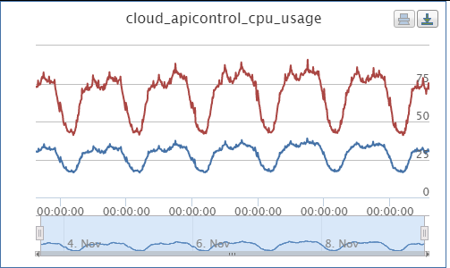
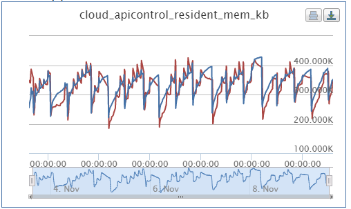
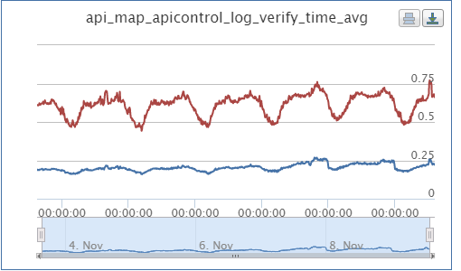
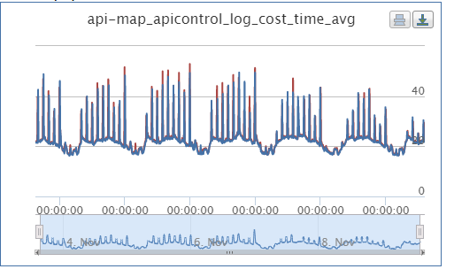
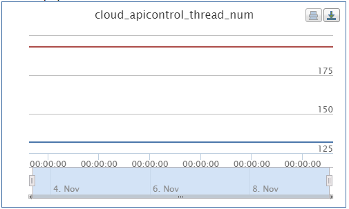

# 进展

| 时间          | 内容                                    | 说明             |
| ----------- | ------------------------------------- | -------------- |
| 8.11 - 8.28 | 调研 + 研发 + 自测                          | 自测性能报告见附件      |
| 9.8 - 9.22  | QA测试                                  | QA测试报告见附件      |
| 10.8        | 北京机房1台机器上线                            |                |
| 10.14       | 北京机房1台机器上线                            | 修复URL编码问题      |
| 10.19       | 北京机房7/35机器上线杭州和南京各2台机器上线              | 开始小流量上线        |
| 10.22       | 北京机房10/35机器上线杭州机房5/26机器上线南京机房5/19机器上线 | 修复http响应数据压缩问题 |
| 11.3        | 北京机房10/35机器上线                         | 修复RPC内存泄露问题    |
| 11.6        | 杭州机房5/26机器上线南京机房5/19机器上线              | 同北京机房版本        |
| 11.9        | 北京机房全流量上线                             |                |

截止目前，线上服务表现稳定。

# QA测试结论

1. 【性能测试】单机支持最大QPS：**9000+**。可以有效解决原来hulu_pbrpc中一个慢服务拖垮所有服务的问题。性能很好。
2. 【稳定性测试】长时间压测没问题。

QA测试结论：通过

# 性能提升实时统计

统计时间2015.11.3 15:00 – 2015.11.9 14:30，共**143.5**小时（近6天）不间断运行。北京机房升级前和升级后同机房各6台机器，共**12**台线上机器的Noah监控数据。

| 指标       | 升级**前**均值hulu_pbrpc | 升级**后**均值brpc | 收益对比         | 说明                       |
| -------- | ------------------- | ------------- | ------------ | ------------------------ |
| CPU占用率   | 67.35%              | 29.28%        | 降低**56.53**% |                          |
| 内存占用     | 327.81MB            | 336.91MB      | 基本持平         |                          |
| 鉴权平响(ms) | 0.605               | 0.208         | 降低**65.62**% |                          |
| 转发平响(ms) | 22.49               | 23.18         | 基本持平         | 依赖后端各个服务的性能              |
| 总线程数     | 193                 | 132           | 降低**31.61**% | Baidu RPC版本线程数使用率较低，还可降低 |
| 极限QPS    | 3000                | 9000          | 提升**3**倍     | 线下使用Geoconv和Geocoder服务测试 |

**CPU使用率(%)**（红色为升级前，蓝色为升级后）

**内存使用量(KB)**（红色为升级前，蓝色为升级后）

**鉴权平响(ms)**（红色为升级前，蓝色为升级后）

**转发平响(ms)**（红色为升级前，蓝色为升级后）

**总线程数(个)**（红色为升级前，蓝色为升级后）

