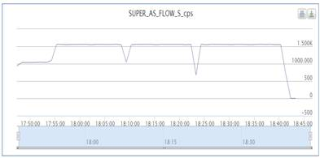
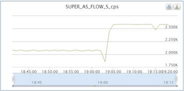
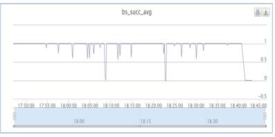
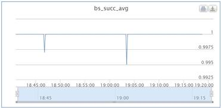
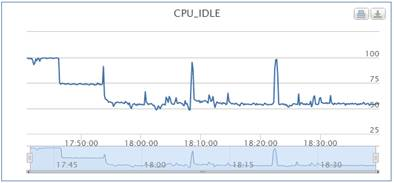
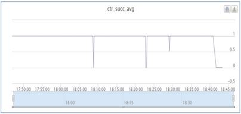
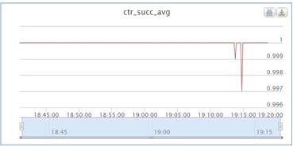
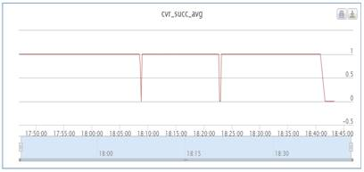
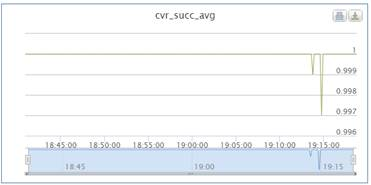

# 背景

baidu-dsp是联盟基于Ad Exchange和RTB模式的需求方平台，服务大客户、代理的投放产品体系。我们改造了多个模块，均取得了显著的效果。本文只介绍其中关于super-nova-as的改动。super-nova-as是的baidu-dsp的AS，之前使用ub-aserver编写，为了尽量减少改动，我们没有改造整个as，而只是把super-nova-as连接下游（ctr-server、cvr-server、super-nova-bs）的client从ubrpc升级为brpc。

# 结论

1. as的吞吐量有显著提升（不到1500 -> 2500+）
2. cpu优化：从1500qps 50%cpu_idle提高到2000qps 50% cpu_idle；
3. 超时率改善明显。

# 测试过程

1. 环境：1个as，1个bs，1个ctr，1个cvr；部署情况为：bs单机部署，as+ctr+cvr混布；ctr和cvr为brpc版本
2. 分别采用1000,1500压力对ubrpc版本的as进行压测，发现1500压力下，as对bs有大量的超时，as到达瓶颈；
3. 分别采用2000,2500压力对brpc版本的as进行压测，发现2500压力下，as机器的cpu_idle低于30%，as到达瓶颈。brpc对资源利用充分。

|          | ubrpc                                    | brpc                                |
| -------- | ---------------------------------------- | ---------------------------------------- |
| 流量       |  |  |
| bs成功率    |  |  |
| cpu_idle |  |  |
| ctr成功率   |  |  |
| cvr成功率   |  |  |
