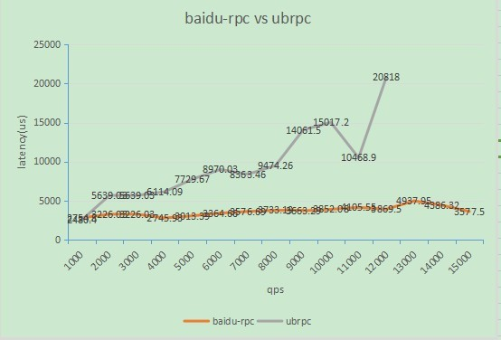
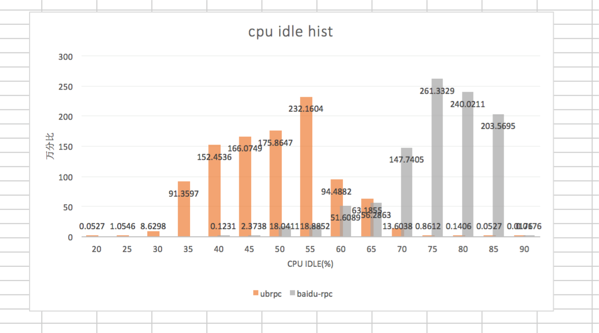

# 背景

云平台部把使用ubrpc的模块改造为使用brpc。由于使用了mcpack2pb的转换功能，这个模块既能被老的ubrpc client访问，也可以通过protobuf类的协议访问（baidu_std，sofa_pbrpc等）。

原有使用43台机器（对ubrpc也有富余），brpc使用3台机器即可（此时访问redis的io达到瓶颈）。当前流量4w qps，支持流量增长，考虑跨机房冗余，避免redis和vip瓶颈，brpc实际使用8台机器提供服务。 

brpc改造后的connecter收益明显，可以用较少的机器提供更优质的服务。收益分3个方面：

# 相同配置的机器qps和latency的比较 

通过逐渐缩容，不断增加connecter的压力，获得单机qps和latency的对应数据如下： 

机器配置：cpu: 24 Intel(R) Xeon(R) CPU  E5645  @ 2.40GHz || mem: 64G 

混布情况：同机部署了逻辑层2.0/3.0和C逻辑层，均有流量 

图中可以看到随着压力的增大：
* brpc的延时，增加微乎其微，提供了较为一致的延时体验
* ubrpc的延时，快速增大，到了6000~8000qps的时候，出现*queue full*，服务不可用。

# 不同配置机器qps和延时的比较
qps固定为6500，观察延时。

| 机器名称  | 略                                        | 略                                        |
| ----- | ---------------------------------------- | ---------------------------------------- |
| cpu   | 24 Intel(R) Xeon(R) CPU E5645  @ 2.40GHz | 24 Intel(R) Xeon(R) CPU E5-2620 0 @ 2.00GHz |
| ubrpc | 8363.46（us）                              | 12649.5（us）                              |
| brpc  | 3364.66（us）                              | 3382.15（us）                              |

有此可见： 

* ubrpc在不同配置下性能表现差异大，在配置较低的机器下表现较差。
* brpc表现的比ubrpc好，在较低配置的机器上也能有好的表现，因机器不同带来的差异不大。

# 相同配置机器idle分布的比较 

机器配置：cpu： 24 Intel(R) Xeon(R) CPU  E5645  @ 2.40GHz || mem：64G 

在线上缩容 不断增大压力过程中：

* ubrpc cpu idle分布在35%~60%，在55%最集中，最低30%； 
* brpc cpu idle分布在60%~85%，在75%最集中，最低50%； brpc比ubrpc对cpu的消耗低。
