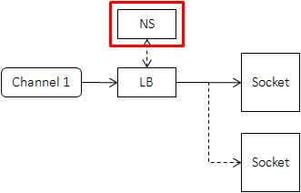
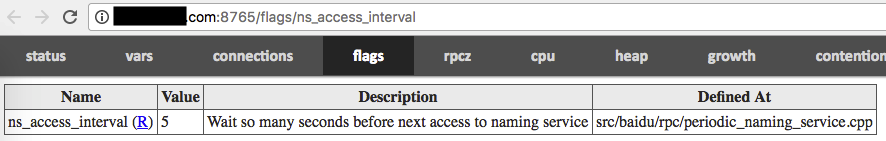
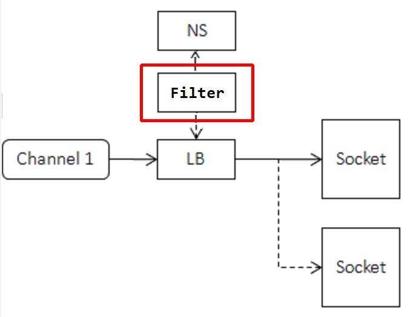
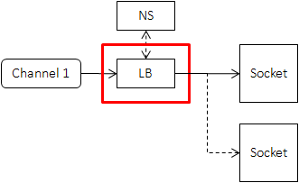
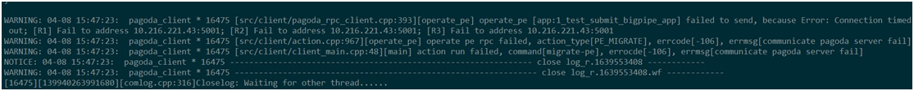
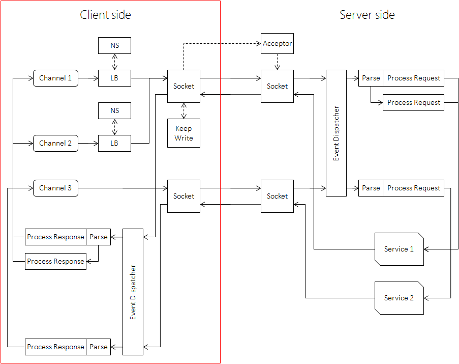

[English version](../en/client.md)

# 示例程序

Echo的[client端代码](https://github.com/apache/brpc/blob/master/example/echo_c++/client.cpp)。

# 事实速查

- Channel.Init()是线程不安全的。
- Channel.CallMethod()是线程安全的，一个Channel可以被所有线程同时使用。
- Channel可以分配在栈上。
- Channel在发送异步请求后可以析构。
- 没有brpc::Client这个类。

# Channel
Client指发起请求的一端，在brpc中没有对应的实体，取而代之的是[brpc::Channel](https://github.com/apache/brpc/blob/master/src/brpc/channel.h)，它代表和一台或一组服务器的交互通道，Client和Channel在角色上的差别在实践中并不重要，你可以把Channel视作Client。

Channel可以**被所有线程共用**，你不需要为每个线程创建独立的Channel，也不需要用锁互斥。不过Channel的创建和Init并不是线程安全的，请确保在Init成功后再被多线程访问，在没有线程访问后再析构。

一些RPC实现中有ClientManager的概念，包含了Client端的配置信息和资源管理。brpc不需要这些，以往在ClientManager中配置的线程数、长短连接等等要么被加入了brpc::ChannelOptions，要么可以通过gflags全局配置，这么做的好处：

1. 方便。你不需要在创建Channel时传入ClientManager，也不需要存储ClientManager。否则不少代码需要一层层地传递ClientManager，很麻烦。gflags使一些全局行为的配置更加简单。
2. 共用资源。比如server和channel可以共用后台线程。(bthread的工作线程)
3. 生命周期。析构ClientManager的过程很容易出错，现在由框架负责则不会有问题。

就像大部分类那样，Channel必须在**Init**之后才能使用，options为NULL时所有参数取默认值，如果你要使用非默认值，这么做就行了：
```c++
brpc::ChannelOptions options;  // 包含了默认值
options.xxx = yyy;
...
channel.Init(..., &options);
```
注意Channel不会修改options，Init结束后不会再访问options。所以options一般就像上面代码中那样放栈上。Channel.options()可以获得channel在使用的所有选项。

Init函数分为连接一台服务器和连接服务集群。

# 连接一台服务器

```c++
// options为NULL时取默认值
int Init(EndPoint server_addr_and_port, const ChannelOptions* options);
int Init(const char* server_addr_and_port, const ChannelOptions* options);
int Init(const char* server_addr, int port, const ChannelOptions* options);
```
这类Init连接的服务器往往有固定的ip地址，不需要命名服务和负载均衡，创建起来相对轻量。但是**请勿频繁创建使用域名的Channel**。这需要查询dns，可能最多耗时10秒(查询DNS的默认超时)。重用它们。

合法的“server_addr_and_port”：
- 127.0.0.1:80
- www.foo.com:8765
- localhost:9000
- [::1]:8080      # IPV6
- unix:path.sock  # Unix domain socket

不合法的"server_addr_and_port"：
- 127.0.0.1:90000     # 端口过大
- 10.39.2.300:8000   # 非法的ip

关于IPV6和Unix domain socket的使用，详见 [EndPoint](endpoint.md)。

# 连接服务集群

```c++
int Init(const char* naming_service_url,
         const char* load_balancer_name,
         const ChannelOptions* options);
```
这类Channel需要定期从`naming_service_url`指定的命名服务中获得服务器列表，并通过`load_balancer_name`指定的负载均衡算法选择出一台机器发送请求。

你**不应该**在每次请求前动态地创建此类（连接服务集群的）Channel。因为创建和析构此类Channel牵涉到较多的资源，比如在创建时得访问一次命名服务，否则便不知道有哪些服务器可选。由于Channel可被多个线程共用，一般也没有必要动态创建。

当`load_balancer_name`为NULL或空时，此Init等同于连接单台server的Init，`naming_service_url`应该是"ip:port"或"域名:port"。你可以通过这个Init函数统一Channel的初始化方式。比如你可以把`naming_service_url`和`load_balancer_name`放在配置文件中，要连接单台server时把`load_balancer_name`置空，要连接服务集群时则设置一个有效的算法名称。

## 命名服务

命名服务把一个名字映射为可修改的机器列表，在client端的位置如下：



有了命名服务后client记录的是一个名字，而不是每一台下游机器。而当下游机器变化时，就只需要修改命名服务中的列表，而不需要逐台修改每个上游。这个过程也常被称为“解耦上下游”。当然在具体实现上，上游会记录每一台下游机器，并定期向命名服务请求或被推送最新的列表，以避免在RPC请求时才去访问命名服务。使用命名服务一般不会对访问性能造成影响，对命名服务的压力也很小。

`naming_service_url`的一般形式是"**protocol://service_name**"

### bns://\<bns-name\>

BNS是百度内常用的命名服务，比如bns://rdev.matrix.all，其中"bns"是protocol，"rdev.matrix.all"是service-name。相关一个gflag是-ns_access_interval: 

如果BNS中显示不为空，但Channel却说找不到服务器，那么有可能BNS列表中的机器状态位（status）为非0，含义为机器不可用，所以不会被加入到server候选集中．状态位可通过命令行查看：

`get_instance_by_service [bns_node_name] -s`

### file://\<path\>

服务器列表放在`path`所在的文件里，比如"file://conf/machine_list"中的“conf/machine_list”对应一个文件:
 * 每行是一台服务器的地址。
 * \#之后的是注释会被忽略
 * 地址后出现的非注释内容被认为是tag，由一个或多个空格与前面的地址分隔，相同的地址+不同的tag被认为是不同的实例。
 * 当文件更新时, brpc会重新加载。
```
# 此行会被忽略
10.24.234.17:8080 tag1  # 这是注释，会被忽略
10.24.234.17:8090 tag2  # 此行和上一行被认为是不同的实例
10.24.234.18:8080
10.24.234.19:8080
```

优点: 易于修改，方便单测。

缺点: 更新时需要修改每个上游的列表文件，不适合线上部署。

### list://\<addr1\>,\<addr2\>...

服务器列表直接跟在list://之后，以逗号分隔，比如"list://db-bce-81-3-186.db01:7000,m1-bce-44-67-72.m1:7000,cp01-rd-cos-006.cp01:7000"中有三个地址。

地址后可以声明tag，用一个或多个空格分隔，相同的地址+不同的tag被认为是不同的实例。

优点: 可在命令行中直接配置，方便单测。

缺点: 无法在运行时修改，完全不能用于线上部署。

### http://\<url\>

连接一个域名下所有的机器, 例如http://www.baidu.com:80 ，注意连接单点的Init（两个参数）虽然也可传入域名，但只会连接域名下的一台机器。

优点: DNS的通用性，公网内网均可使用。

缺点: 受限于DNS的格式限制无法传递复杂的meta数据，也无法实现通知机制。

### https://\<url\>

和http前缀类似，只是会自动开启SSL。

### consul://\<service-name\>

通过consul获取服务名称为service-name的服务列表。consul的默认地址是localhost:8500，可通过gflags设置-consul\_agent\_addr来修改。consul的连接超时时间默认是200ms，可通过-consul\_connect\_timeout\_ms来修改。

默认在consul请求参数中添加[stale](https://www.consul.io/api/index.html#consistency-modes)和passing（仅返回状态为passing的服务列表），可通过gflags中-consul\_url\_parameter改变[consul请求参数](https://www.consul.io/api/health.html#parameters-2)。

除了对consul的首次请求，后续对consul的请求都采用[long polling](https://www.consul.io/api/index.html#blocking-queries)的方式，即仅当服务列表更新或请求超时后consul才返回结果，这里超时时间默认为60s，可通过-consul\_blocking\_query\_wait\_secs来设置。

若consul返回的服务列表[响应格式](https://www.consul.io/api/health.html#sample-response-2)有错误，或者列表中所有服务都因为地址、端口等关键字段缺失或无法解析而被过滤，consul naming server会拒绝更新服务列表，并在一段时间后（默认500ms，可通过-consul\_retry\_interval\_ms设置）重新访问consul。

如果consul不可访问，服务可自动降级到file naming service获取服务列表。此功能默认关闭，可通过设置-consul\_enable\_degrade\_to\_file\_naming\_service来打开。服务列表文件目录通过-consul \_file\_naming\_service\_dir来设置，使用service-name作为文件名。该文件可通过consul-template生成，里面会保存consul不可用之前最新的下游服务节点。当consul恢复时可自动恢复到consul naming service。


### nacos://\<service-name\>

NacosNamingService使用[Open-Api](https://nacos.io/zh-cn/docs/open-api.html)定时从nacos获取服务列表。
NacosNamingService支持[简单鉴权](https://nacos.io/zh-cn/docs/auth.html)。

`<service-name>`是一个http uri query，具体参数参见`/nacos/v1/ns/instance/list`文档。
注意：`<service-name>`需要urlencode。
```
nacos://serviceName=test&groupName=g&namespaceId=n&clusters=c&healthyOnly=true
```

NacosNamingService拉取列表的时间间隔为`/nacos/v1/ns/instance/list`api返回的`cacheMillis`。
NacosNamingService只支持整形的权重值。

| GFlags                             | 描述                       | 默认值                       |
| ---------------------------------- | -------------------------- | ---------------------------- |
| nacos_address                      | nacos http url             | ""                           |
| nacos_service_discovery_path       | nacos服务发现路径          | "/nacos/v1/ns/instance/list" |
| nacos_service_auth_path            | nacos登陆路径              | "/nacos/v1/auth/login"       |
| nacos_service_timeout_ms           | 连接nacos超时时间（毫秒）  | 200                          |
| nacos_username                     | 用户名（urlencode编码）    | ""                           |
| nacos_password                     | 密码（urlencode编码）      | ""                           |
| nacos_load_balancer                | nacos集群的负载均衡        | "rr"                         |


### 更多命名服务
用户可以通过实现brpc::NamingService来对接更多命名服务，具体见[这里](https://github.com/apache/brpc/blob/master/docs/cn/load_balancing.md#%E5%91%BD%E5%90%8D%E6%9C%8D%E5%8A%A1)

### 命名服务中的tag
每个地址可以附带一个tag，在常见的命名服务中，如果地址后有空格，则空格之后的内容均为tag。
相同的地址配合不同的tag被认为是不同的实例，brpc会建立不同的连接。用户可利用这个特性更灵活地控制与单个地址的连接方式。
如果你需要"带权重的轮询"，你应当优先考虑使用[wrr算法](#wrr)，而不是用tag来模拟。

### VIP相关的问题
VIP一般是4层负载均衡器的公网ip，背后有多个RS。当客户端连接至VIP时，VIP会选择一个RS建立连接，当客户端连接断开时，VIP也会断开与对应RS的连接。

如果客户端只与VIP建立一个连接(brpc中的单连接)，那么来自这个客户端的所有流量都会落到一台RS上。如果客户端的数量非常多，至少在集群的角度，所有的RS还是会分到足够多的连接，从而基本均衡。但如果客户端的数量不多，或客户端的负载差异很大，那么可能在个别RS上出现热点。另一个问题是当有多个VIP可选时，客户端分给它们的流量与各自后面的RS数量可能不一致。

解决这个问题的一种方法是使用连接池模式(pooled)，这样客户端对一个VIP就可能建立多个连接(约为一段时间内的最大并发度)，从而让负载落到多个RS上。如果有多个VIP，可以用[wrr负载均衡](#wrr)给不同的VIP声明不同的权重从而分到对应比例的流量，或给相同的VIP后加上多个不同的tag而被认为是多个不同的实例。

如果对性能有更高的要求，或要限制大集群中连接的数量，可以使用单连接并给相同的VIP加上不同的tag以建立多个连接。相比连接池一般连接数量更小，系统调用开销更低，但如果tag不够多，仍可能出现RS热点。

### 命名服务过滤器

当命名服务获得机器列表后，可以自定义一个过滤器进行筛选，最后把结果传递给负载均衡：



过滤器的接口如下：
```c++
// naming_service_filter.h
class NamingServiceFilter {
public:
    // Return true to take this `server' as a candidate to issue RPC
    // Return false to filter it out
    virtual bool Accept(const ServerNode& server) const = 0;
};
 
// naming_service.h
struct ServerNode {
    butil::EndPoint addr;
    std::string tag;
};
```
常见的业务策略如根据server的tag进行过滤。

自定义的过滤器配置在ChannelOptions中，默认为NULL（不过滤）。

```c++
class MyNamingServiceFilter : public brpc::NamingServiceFilter {
public:
    bool Accept(const brpc::ServerNode& server) const {
        return server.tag == "main";
    }
};
 
int main() {
    ...
    MyNamingServiceFilter my_filter;
    ...
    brpc::ChannelOptions options;
    options.ns_filter = &my_filter;
    ...
}
```

## 负载均衡

当下游机器超过一台时，我们需要分割流量，此过程一般称为负载均衡，在client端的位置如下图所示：



理想的算法是每个请求都得到及时的处理，且任意机器crash对全局影响较小。但由于client端无法及时获得server端的延迟或拥塞，而且负载均衡算法不能耗费太多的cpu，一般来说用户得根据具体的场景选择合适的算法，目前rpc提供的算法有（通过load_balancer_name指定）：

### rr

即round robin，总是选择列表中的下一台服务器，结尾的下一台是开头，无需其他设置。比如有3台机器a,b,c，那么brpc会依次向a, b, c, a, b, c, ...发送请求。注意这个算法的前提是服务器的配置，网络条件，负载都是类似的。

### wrr

即weighted round robin, 根据服务器列表配置的权重值来选择服务器。服务器被选到的机会正比于其权重值，并且该算法能保证同一服务器被选到的结果较均衡的散开。

实例的tag需要是表示权值的int32数字，如tag="50"。

### random

随机从列表中选择一台服务器，无需其他设置。和round robin类似，这个算法的前提也是服务器都是类似的。

### wr

即weighted random, 根据服务器列表配置的权重值来选择服务器，服务器被选到的机会正比于其权重值。

实例tag的要求同wrr。

### la

locality-aware，优先选择延时低的下游，直到其延时高于其他机器，无需其他设置。实现原理请查看[Locality-aware load balancing](lalb.md)。

### c_murmurhash or c_md5

一致性哈希，与简单hash的不同之处在于增加或删除机器时不会使分桶结果剧烈变化，特别适合cache类服务。

发起RPC前需要设置Controller.set_request_code()，否则RPC会失败。request_code一般是请求中主键部分的32位哈希值，**不需要和负载均衡使用的哈希算法一致**。比如用c_murmurhash算法也可以用md5计算哈希值。

[src/brpc/policy/hasher.h](https://github.com/apache/brpc/blob/master/src/brpc/policy/hasher.h)中包含了常用的hash函数。如果用std::string key代表请求的主键，controller.set_request_code(brpc::policy::MurmurHash32(key.data(), key.size()))就正确地设置了request_code。

注意甄别请求中的“主键”部分和“属性”部分，不要为了偷懒或通用，就把请求的所有内容一股脑儿计算出哈希值，属性的变化会使请求的目的地发生剧烈的变化。另外也要注意padding问题，比如struct Foo { int32_t a; int64_t b; }在64位机器上a和b之间有4个字节的空隙，内容未定义，如果像hash(&foo, sizeof(foo))这样计算哈希值，结果就是未定义的，得把内容紧密排列或序列化后再算。

实现原理请查看[Consistent Hashing](consistent_hashing.md)。

其他lb不需要设置Controller.set_request_code()，如果调用了request_code也不会被lb使用，例如：lb=rr调用了Controller.set_request_code()，即使所有RPC的request_code都相同，也依然是rr。

### 从集群宕机后恢复时的客户端限流

集群宕机指的是集群中所有server都处于不可用的状态。由于健康检查机制，当集群恢复正常后，server会间隔性地上线。当某一个server上线后，所有的流量会发送过去，可能导致服务再次过载。若熔断开启，则可能导致其它server上线前该server再次熔断，集群永远无法恢复。作为解决方案，brpc提供了在集群宕机后恢复时的限流机制：当集群中没有可用server时，集群进入恢复状态，假设正好能服务所有请求的server数量为min_working_instances，当前集群可用的server数量为q，则在恢复状态时，client接受请求的概率为q/min_working_instances，否则丢弃；若一段时间hold_seconds内q保持不变，则把流量重新发送全部可用的server上，并离开恢复状态。在恢复阶段时，可以通过判断controller.ErrorCode()是否等于brpc::ERJECT来判断该次请求是否被拒绝，被拒绝的请求不会被框架重试。

此恢复机制要求下游server的能力是类似的，所以目前只针对rr和random有效，开启方式是在*load_balancer_name*后面加上min_working_instances和hold_seconds参数的值，例如：
```c++
channel.Init("http://...", "random:min_working_instances=6 hold_seconds=10", &options);
```

## 健康检查

连接断开的server会被暂时隔离而不会被负载均衡算法选中，brpc会定期连接被隔离的server，以检查他们是否恢复正常，间隔由参数-health_check_interval控制:

| Name                      | Value | Description                              | Defined At              |
| ------------------------- | ----- | ---------------------------------------- | ----------------------- |
| health_check_interval （R） | 3     | seconds between consecutive health-checkings | src/brpc/socket_map.cpp |

在默认的配置下，一旦server被连接上，它会恢复为可用状态；brpc还提供了应用层健康检查的机制，框架会发送一个HTTP GET请求到该server，请求路径通过-health\_check\_path设置（默认为空），只有当server返回200时，它才会恢复。在两种健康检查机制下，都可通过-health\_check\_timeout\_ms设置超时（默认500ms）。如果在隔离过程中，server从命名服务中删除了，brpc也会停止连接尝试。

# 发起访问

一般来说，我们不直接调用Channel.CallMethod，而是通过protobuf生成的桩XXX_Stub，过程更像是“调用函数”。stub内没什么成员变量，建议在栈上创建和使用，而不必new，当然你也可以把stub存下来复用。Channel::CallMethod和stub访问都是**线程安全**的，可以被所有线程同时访问。比如：
```c++
XXX_Stub stub(&channel);
stub.some_method(controller, request, response, done);
```
甚至
```c++
XXX_Stub(&channel).some_method(controller, request, response, done);
```
一个例外是http/h2 client。访问http服务和protobuf没什么关系，直接调用CallMethod即可，除了Controller和done均为NULL，详见[访问http/h2服务](http_client.md)。

## 同步访问

指的是：CallMethod会阻塞到收到server端返回response或发生错误（包括超时）。

同步访问中的response/controller不会在CallMethod后被框架使用，它们都可以分配在栈上。注意，如果request/response字段特别多字节数特别大的话，还是更适合分配在堆上。
```c++
MyRequest request;
MyResponse response;
brpc::Controller cntl;
XXX_Stub stub(&channel);
 
request.set_foo(...);
cntl.set_timeout_ms(...);
stub.some_method(&cntl, &request, &response, NULL);
if (cntl->Failed()) {
    // RPC失败了. response里的值是未定义的，勿用。
} else {
    // RPC成功了，response里有我们想要的回复数据。
}
```

> 警告: 请勿在持有pthread锁的情况下，调用brpc的同步CallMethod！否则很容易导致死锁。
> 
> 解决方案（二选一）：
> 1. 将pthread锁换成bthread锁(bthread_mutex_t）
> 1. 在CallMethod之前将锁释放

## 异步访问

指的是：给CallMethod传递一个额外的回调对象done，CallMethod在发出request后就结束了，而不是在RPC结束后。当server端返回response或发生错误（包括超时）时，done->Run()会被调用。对RPC的后续处理应该写在done->Run()里，而不是CallMethod后。

由于CallMethod结束不意味着RPC结束，response/controller仍可能被框架及done->Run()使用，它们一般得创建在堆上，并在done->Run()中删除。如果提前删除了它们，那当done->Run()被调用时，将访问到无效内存。

你可以独立地创建这些对象，并使用[NewCallback](#使用NewCallback)生成done，也可以把Response和Controller作为done的成员变量，[一起new出来](#继承google::protobuf::Closure)，一般使用前一种方法。

发起异步请求后Request可以立刻析构。(SelectiveChannel是个例外，SelectiveChannel情况下必须在请求处理完成后再释放request对象）

发起异步请求后Channel可以立刻析构。

注意:这是说Request/Channel的析构可以立刻发生在CallMethod**之后**，并不是说析构可以和CallMethod同时发生，删除正被另一个线程使用的Channel是未定义行为（很可能crash）。

### 使用NewCallback
```c++
static void OnRPCDone(MyResponse* response, brpc::Controller* cntl) {
    // unique_ptr会帮助我们在return时自动删掉response/cntl，防止忘记。gcc 3.4下的unique_ptr是模拟版本。
    std::unique_ptr<MyResponse> response_guard(response);
    std::unique_ptr<brpc::Controller> cntl_guard(cntl);
    if (cntl->Failed()) {
        // RPC失败了. response里的值是未定义的，勿用。
    } else {
        // RPC成功了，response里有我们想要的数据。开始RPC的后续处理。    
    }
    // NewCallback产生的Closure会在Run结束后删除自己，不用我们做。
}
 
MyResponse* response = new MyResponse;
brpc::Controller* cntl = new brpc::Controller;
MyService_Stub stub(&channel);
 
MyRequest request;  // 你不用new request,即使在异步访问中.
request.set_foo(...);
cntl->set_timeout_ms(...);
stub.some_method(cntl, &request, response, brpc::NewCallback(OnRPCDone, response, cntl));
```
由于protobuf 3把NewCallback设置为私有，r32035后brpc把NewCallback独立于[src/brpc/callback.h](https://github.com/apache/brpc/blob/master/src/brpc/callback.h)（并增加了一些重载）。如果你的程序出现NewCallback相关的编译错误，把google::protobuf::NewCallback替换为brpc::NewCallback就行了。

### 继承google::protobuf::Closure

使用NewCallback的缺点是要分配三次内存：response, controller, done。如果profiler证明这儿的内存分配有瓶颈，可以考虑自己继承Closure，把response/controller作为成员变量，这样可以把三次new合并为一次。但缺点就是代码不够美观，如果内存分配不是瓶颈，别用这种方法。
```c++
class OnRPCDone: public google::protobuf::Closure {
public:
    void Run() {
        // unique_ptr会帮助我们在return时自动delete this，防止忘记。gcc 3.4下的unique_ptr是模拟版本。
        std::unique_ptr<OnRPCDone> self_guard(this);
          
        if (cntl->Failed()) {
            // RPC失败了. response里的值是未定义的，勿用。
        } else {
            // RPC成功了，response里有我们想要的数据。开始RPC的后续处理。
        }
    }
 
    MyResponse response;
    brpc::Controller cntl;
}
 
OnRPCDone* done = new OnRPCDone;
MyService_Stub stub(&channel);
 
MyRequest request;  // 你不用new request,即使在异步访问中.
request.set_foo(...);
done->cntl.set_timeout_ms(...);
stub.some_method(&done->cntl, &request, &done->response, done);
```

### 如果异步访问中的回调函数特别复杂会有什么影响吗?

没有特别的影响，回调会运行在独立的bthread中，不会阻塞其他的逻辑。你可以在回调中做各种阻塞操作。

### rpc发送处的代码和回调函数是在同一个线程里执行吗?

一定不在同一个线程里运行，即使该次rpc调用刚进去就失败了，回调也会在另一个bthread中运行。这可以在加锁进行rpc（不推荐）的代码中避免死锁。

## 等待RPC完成
注意：当你需要发起多个并发操作时，可能[ParallelChannel](combo_channel.md#parallelchannel)更方便。

如下代码发起两个异步RPC后等待它们完成。
```c++
const brpc::CallId cid1 = controller1->call_id();
const brpc::CallId cid2 = controller2->call_id();
...
stub.method1(controller1, request1, response1, done1);
stub.method2(controller2, request2, response2, done2);
...
brpc::Join(cid1);
brpc::Join(cid2);
```
**在发起RPC前**调用Controller.call_id()获得一个id，发起RPC调用后Join那个id。

Join()的行为是等到RPC结束**且done->Run()运行后**，一些Join的性质如下：

- 如果对应的RPC已经结束，Join将立刻返回。
- 多个线程可以Join同一个id，它们都会醒来。
- 同步RPC也可以在另一个线程中被Join，但一般不会这么做。 

Join()在之前的版本叫做JoinResponse()，如果你在编译时被提示deprecated之类的，修改为Join()。

在RPC调用后`Join(controller->call_id())`是**错误**的行为，一定要先把call_id保存下来。因为RPC调用后controller可能被随时开始运行的done删除。下面代码的Join方式是**错误**的。

```c++
static void on_rpc_done(Controller* controller, MyResponse* response) {
    ... Handle response ...
    delete controller;
    delete response;
}
 
Controller* controller1 = new Controller;
Controller* controller2 = new Controller;
MyResponse* response1 = new MyResponse;
MyResponse* response2 = new MyResponse;
...
stub.method1(controller1, &request1, response1, google::protobuf::NewCallback(on_rpc_done, controller1, response1));
stub.method2(controller2, &request2, response2, google::protobuf::NewCallback(on_rpc_done, controller2, response2));
...
brpc::Join(controller1->call_id());   // 错误，controller1可能被on_rpc_done删除了
brpc::Join(controller2->call_id());   // 错误，controller2可能被on_rpc_done删除了
```

## 半同步

Join可用来实现“半同步”访问：即等待多个异步访问完成。由于调用处的代码会等到所有RPC都结束后再醒来，所以controller和response都可以放栈上。
```c++
brpc::Controller cntl1;
brpc::Controller cntl2;
MyResponse response1;
MyResponse response2;
...
stub1.method1(&cntl1, &request1, &response1, brpc::DoNothing());
stub2.method2(&cntl2, &request2, &response2, brpc::DoNothing());
...
brpc::Join(cntl1.call_id());
brpc::Join(cntl2.call_id());
```
brpc::DoNothing()可获得一个什么都不干的done，专门用于半同步访问。它的生命周期由框架管理，用户不用关心。

注意在上面的代码中，我们在RPC结束后又访问了controller.call_id()，这是没有问题的，因为DoNothing中并不会像上节中的on_rpc_done中那样删除Controller。

## 取消RPC

brpc::StartCancel(call_id)可取消对应的RPC，call_id必须**在发起RPC前**通过Controller.call_id()获得，其他时刻都可能有race condition。

注意：是brpc::StartCancel(call_id)，不是controller->StartCancel()，后者被禁用，没有效果。后者是protobuf默认提供的接口，但是在controller对象的生命周期上有严重的竞争问题。

顾名思义，StartCancel调用完成后RPC并未立刻结束，你不应该碰触Controller的任何字段或删除任何资源，它们自然会在RPC结束时被done中对应逻辑处理。如果你一定要在原地等到RPC结束（一般不需要），则可通过Join(call_id)。

关于StartCancel的一些事实：

- call_id在发起RPC前就可以被取消，RPC会直接结束（done仍会被调用）。
- call_id可以在另一个线程中被取消。
- 取消一个已经取消的call_id不会有任何效果。推论：同一个call_id可以被多个线程同时取消，但最多一次有效果。
- 这里的取消是纯client端的功能，**server端未必会取消对应的操作**，server cancelation是另一个功能。

## 获取Server的地址和端口

remote_side()方法可知道request被送向了哪个server，返回值类型是[butil::EndPoint](https://github.com/apache/brpc/blob/master/src/butil/endpoint.h)，包含一个ip4地址和端口。在RPC结束前调用这个方法都是没有意义的。

打印方式：
```c++
LOG(INFO) << "remote_side=" << cntl->remote_side();
printf("remote_side=%s\n", butil::endpoint2str(cntl->remote_side()).c_str());
```
## 获取Client的地址和端口

r31384后通过local_side()方法可**在RPC结束后**获得发起RPC的地址和端口。

打印方式：
```c++
LOG(INFO) << "local_side=" << cntl->local_side(); 
printf("local_side=%s\n", butil::endpoint2str(cntl->local_side()).c_str());
```
## 应该重用brpc::Controller吗?

不用刻意地重用，但Controller是个大杂烩，可能会包含一些缓存，Reset()可以避免反复地创建这些缓存。

在大部分场景下，构造Controller(snippet1)和重置Controller(snippet2)的性能差异不大。
```c++
// snippet1
for (int i = 0; i < n; ++i) {
    brpc::Controller controller;
    ...
    stub.CallSomething(..., &controller);
}
 
// snippet2
brpc::Controller controller;
for (int i = 0; i < n; ++i) {
    controller.Reset();
    ...
    stub.CallSomething(..., &controller);
}
```
但如果snippet1中的Controller是new出来的，那么snippet1就会多出“内存分配”的开销，在一些情况下可能会慢一些。

# 设置

Client端的设置主要由三部分组成：

- brpc::ChannelOptions: 定义在[src/brpc/channel.h](https://github.com/apache/brpc/blob/master/src/brpc/channel.h)中，用于初始化Channel，一旦初始化成功无法修改。
- brpc::Controller: 定义在[src/brpc/controller.h](https://github.com/apache/brpc/blob/master/src/brpc/controller.h)中，用于在某次RPC中覆盖ChannelOptions中的选项，可根据上下文每次均不同。
- 全局gflags：常用于调节一些底层代码的行为，一般不用修改。请自行阅读服务[/flags页面](flags.md)中的说明。

Controller包含了request中没有的数据和选项。server端和client端的Controller结构体是一样的，但使用的字段可能是不同的，你需要仔细阅读Controller中的注释，明确哪些字段可以在server端使用，哪些可以在client端使用。

一个Controller对应一次RPC。一个Controller可以在Reset()后被另一个RPC复用，但一个Controller不能被多个RPC同时使用（不论是否在同一个线程发起）。

Controller的特点：
1. 一个Controller只能有一个使用者，没有特殊说明的话，Controller中的方法默认线程不安全。
2. 因为不能被共享，所以一般不会用共享指针管理Controller，如果你用共享指针了，很可能意味着出错了。
3. Controller创建于开始RPC前，析构于RPC结束后，常见几种模式：
   - 同步RPC前Controller放栈上，出作用域后自行析构。注意异步RPC的Controller绝对不能放栈上，否则其析构时异步调用很可能还在进行中，从而引发未定义行为。
   - 异步RPC前new Controller，done中删除。

## 线程数

和大部分的RPC框架不同，brpc中并没有独立的Client线程池。所有Channel和Server通过[bthread](bthread.md)共享相同的线程池. 如果你的程序同样使用了brpc的server, 仅仅需要设置Server的线程数。 或者可以通过[gflags](flags.md)设置[-bthread_concurrency](http://brpc.baidu.com:8765/flags/bthread_concurrency)来设置全局的线程数.

## 超时

**ChannelOptions.timeout_ms**是对应Channel上所有RPC的总超时，Controller.set_timeout_ms()可修改某次RPC的值。单位毫秒，默认值1秒，最大值2^31（约24天），-1表示一直等到回复或错误。

**ChannelOptions.connect_timeout_ms**是对应Channel上所有RPC的连接超时(单位毫秒)。-1表示等到连接建立或出错，此值被限制为不能超过timeout_ms。注意此超时独立于TCP的连接超时，一般来说前者小于后者，反之则可能在connect_timeout_ms未达到前由于TCP连接超时而出错。

注意1：brpc中的超时是deadline，超过就意味着RPC结束，超时后没有重试。其他实现可能既有单次访问的超时，也有代表deadline的超时。迁移到brpc时请仔细区分。

注意2：RPC超时的错误码为**ERPCTIMEDOUT (1008)**，ETIMEDOUT的意思是连接超时，且可重试。

## 重试

ChannelOptions.max_retry是该Channel上所有RPC的默认最大重试次数，默认值3，0表示不重试。Controller.set_max_retry()可修改某次RPC的值。

r32111后Controller.retried_count()返回重试次数。

r34717后Controller.has_backup_request()获知是否发送过backup_request。

**重试时框架会尽量避开之前尝试过的server。**

重试的触发条件有(条件之间是AND关系）：

* 连接出错
* 没到超时
* 有剩余重试次数
* 错误值得重试

### 连接出错

如果server一直没有返回，但连接没有问题，这种情况下不会重试。如果你需要在一定时间后发送另一个请求，使用backup request。

工作机制如下：如果response没有在backup_request_ms内返回，则发送另外一个请求，哪个先回来就取哪个。新请求会被尽量送到不同的server。注意如果backup_request_ms大于超时，则backup request总不会被发送。backup request会消耗一次重试次数。backup request不意味着server端cancel。

ChannelOptions.backup_request_ms影响该Channel上所有RPC，单位毫秒，默认值-1（表示不开启），Controller.set_backup_request_ms()可修改某次RPC的值。

### 没到超时

超时后RPC会尽快结束。

### 有剩余重试次数

Controller.set_max_retry(0)或ChannelOptions.max_retry=0关闭重试。

### 错误值得重试

一些错误重试是没有意义的，就不会重试，比如请求有错时(EREQUEST)不会重试，因为server总不会接受,没有意义。

用户可以通过继承[brpc::RetryPolicy](https://github.com/apache/brpc/blob/master/src/brpc/retry_policy.h)自定义重试条件。比如brpc默认不重试http/h2相关的错误，而你的程序中希望在碰到HTTP_STATUS_FORBIDDEN (403)时重试，可以这么做：

```c++
#include <brpc/retry_policy.h>
 
class MyRetryPolicy : public brpc::RetryPolicy {
public:
    bool DoRetry(const brpc::Controller* cntl) const {
        if (cntl->ErrorCode() == brpc::EHTTP && // http/h2错误
            cntl->http_response().status_code() == brpc::HTTP_STATUS_FORBIDDEN) {
            return true;
        }
        // 把其他情况丢给框架。
        return brpc::DefaultRetryPolicy()->DoRetry(cntl);
    }
};
...
 
// 给ChannelOptions.retry_policy赋值就行了。
// 注意：retry_policy必须在Channel使用期间保持有效，Channel也不会删除retry_policy，所以大部分情况下RetryPolicy都应以单例模式创建。
brpc::ChannelOptions options;
static MyRetryPolicy g_my_retry_policy;
options.retry_policy = &g_my_retry_policy;
...
```

一些提示：

* 通过cntl->response()可获得对应RPC的response。
* 对ERPCTIMEDOUT代表的RPC超时总是不重试，即使你继承的RetryPolicy中允许。


### 重试退避

对于一些暂时性的错误，如网络抖动等，等待一小会儿再重试的成功率比立即重试的成功率高，同时可以打散上游重试的时机，减轻服务端压力，避免重试风暴导致服务端出现瞬间流量洪峰。

框架支持两种重试退避策略：固定时间间隔退避策略和随机时间间隔退避策略。

固定时间间隔退避策略需要设置固定时间间隔（毫秒）、无需重试退避的剩余rpc时间阈值（毫秒，当剩余rpc时间小于阈值，则不进行重试退避）、是否允许在pthread进行重试退避。使用方法如下：

```c++
// 给ChannelOptions.retry_policy赋值就行了。
// 注意：retry_policy必须在Channel使用期间保持有效，Channel也不会删除retry_policy，所以大部分情况下RetryPolicy都应以单例模式创建。
brpc::ChannelOptions options;
int32_t fixed_backoff_time_ms = 100; // 固定时间间隔（毫秒）
int32_t no_backoff_remaining_rpc_time_ms = 150; // 无需重试退避的剩余rpc时间阈值（毫秒）
bool retry_backoff_in_pthread = false;
static brpc::RpcRetryPolicyWithFixedBackoff g_retry_policy_with_fixed_backoff(
        fixed_backoff_time_ms, no_backoff_remaining_rpc_time_ms, retry_backoff_in_pthread);
options.retry_policy = &g_retry_policy_with_fixed_backoff;
...
```

随机时间间隔退避策略需要设置最小时间间隔（毫秒）、最大时间间隔（毫秒）、无需重试退避的剩余rpc时间阈值（毫秒，当剩余rpc时间小于阈值，则不进行重试退避）、是否允许在pthread做重试退避。每次策略会随机生成一个在最小时间间隔和最大时间间隔之间的重试退避间隔。使用方法如下：

```c++
// 给ChannelOptions.retry_policy赋值就行了。
// 注意：retry_policy必须在Channel使用期间保持有效，Channel也不会删除retry_policy，所以大部分情况下RetryPolicy都应以单例模式创建。
brpc::ChannelOptions options;
int32_t min_backoff_time_ms = 100; // 最小时间间隔（毫秒）
int32_t max_backoff_time_ms = 200; // 最大时间间隔（毫秒）
int32_t no_backoff_remaining_rpc_time_ms = 150; // 无需重试退避的剩余rpc时间阈值（毫秒）
bool retry_backoff_in_pthread = false; // 是否允许在pthread做重试退避
static brpc::RpcRetryPolicyWithJitteredBackoff g_retry_policy_with_jitter_backoff(
        min_backoff_time_ms, max_backoff_time_ms, 
        no_backoff_remaining_rpc_time_ms, retry_backoff_in_pthread);
options.retry_policy = &g_retry_policy_with_jitter_backoff;
...
```

用户可以通过继承[brpc::RetryPolicy](https://github.com/apache/brpc/blob/master/src/brpc/retry_policy.h)自定义重试退避策略。比如只需要针对服务端并发数超限的情况进行重试退避，可以这么做：

```c++
class MyRetryPolicy : public brpc::RetryPolicy {
public:
    bool DoRetry(const brpc::Controller* cntl) const {
        // 同《错误值得重试》一节
    }
    
    int32_t GetBackoffTimeMs(const brpc::Controller* cntl) const {
        if (controller->ErrorCode() == brpc::ELIMIT) {
            return 100; // 退避100毫秒
        }
        return 0; // 返回0表示不进行重试退避。
    }
    
    bool CanRetryBackoffInPthread() const {
        return true;
    }
};
...

// 给ChannelOptions.retry_policy赋值就行了。
// 注意：retry_policy必须在Channel使用期间保持有效，Channel也不会删除retry_policy，所以大部分情况下RetryPolicy都应以单例模式创建。
brpc::ChannelOptions options;
static MyRetryPolicy g_my_retry_policy;
options.retry_policy = &g_my_retry_policy;
...
```

如果用户希望使用框架默认的DoRetry，只实现自定义的重试退避策略，则可以继承[brpc::RpcRetryPolicy](https://github.com/apache/brpc/blob/master/src/brpc/retry_policy.h)。

一些提示：

- 当策略返回的重试退避时间大于等于剩余的rpc时间或者等于0，框架不会进行重试退避，而是立即进行重试。
- [brpc::RpcRetryPolicyWithFixedBackoff](https://github.com/apache/brpc/blob/master/src/brpc/retry_policy.h)（固定时间间隔退策略）和[brpc::RpcRetryPolicyWithJitteredBackoff](https://github.com/apache/brpc/blob/master/src/brpc/retry_policy.h)（随机时间间隔退策略）继承了[brpc::RpcRetryPolicy](https://github.com/apache/brpc/blob/master/src/brpc/retry_policy.h)，使用框架默认的DoRetry。
- 在pthread中进行重试退避（实际上通过bthread_usleep实现）会阻塞pthread，所以默认不会在pthread上进行重试退避。

### 重试应当保守

由于成本的限制，大部分线上server的冗余度是有限的，主要是满足多机房互备的需求。而激进的重试逻辑很容易导致众多client对server集群造成2-3倍的压力，最终使集群雪崩：由于server来不及处理导致队列越积越长，使所有的请求得经过很长的排队才被处理而最终超时，相当于服务停摆。默认的重试是比较安全的: 只要连接不断RPC就不会重试，一般不会产生大量的重试请求。用户可以通过RetryPolicy定制重试策略，但也可能使重试变成一场“风暴”。当你定制RetryPolicy时，你需要仔细考虑client和server的协作关系，并设计对应的异常测试，以确保行为符合预期。

## 熔断

具体方法见[这里](circuit_breaker.md)。

## 协议

Channel的默认协议是baidu_std，可通过设置ChannelOptions.protocol换为其他协议，这个字段既接受enum也接受字符串。

目前支持的有：

- PROTOCOL_BAIDU_STD 或 “baidu_std"，即[百度标准协议](baidu_std.md)，默认为单连接。
- PROTOCOL_HTTP 或 ”http", http/1.0或http/1.1协议，默认为连接池(Keep-Alive)。
  - 访问普通http服务的方法见[访问http/h2服务](http_client.md)
  - 通过http:json或http:proto访问pb服务的方法见[http/h2衍生协议](http_derivatives.md)
- PROTOCOL_H2 或 ”h2", http/2协议，默认是单连接。
  - 访问普通h2服务的方法见[访问http/h2服务](http_client.md)。
  - 通过h2:json或h2:proto访问pb服务的方法见[http/h2衍生协议](http_derivatives.md)
- "h2:grpc", [gRPC](https://grpc.io)的协议，也是h2的衍生协议，默认为单连接，具体见[h2:grpc](http_derivatives.md#h2grpc)。
- PROTOCOL_THRIFT 或 "thrift"，[apache thrift](https://thrift.apache.org)的协议，默认为连接池, 具体方法见[访问thrift](thrift.md)。
- PROTOCOL_MEMCACHE 或 "memcache"，memcached的二进制协议，默认为单连接。具体方法见[访问memcached](memcache_client.md)。
- PROTOCOL_REDIS 或 "redis"，redis 1.2后的协议(也是hiredis支持的协议)，默认为单连接。具体方法见[访问Redis](redis_client.md)。
- PROTOCOL_HULU_PBRPC 或 "hulu_pbrpc"，hulu的协议，默认为单连接。
- PROTOCOL_NOVA_PBRPC 或 ”nova_pbrpc“，网盟的协议，默认为连接池。
- PROTOCOL_SOFA_PBRPC 或 "sofa_pbrpc"，sofa-pbrpc的协议，默认为单连接。
- PROTOCOL_PUBLIC_PBRPC 或 "public_pbrpc"，public_pbrpc的协议，默认为连接池。
- PROTOCOL_UBRPC_COMPACK 或 "ubrpc_compack"，public/ubrpc的协议，使用compack打包，默认为连接池。具体方法见[ubrpc (by protobuf)](ub_client.md)。相关的还有PROTOCOL_UBRPC_MCPACK2或ubrpc_mcpack2，使用mcpack2打包。
- PROTOCOL_NSHEAD_CLIENT 或 "nshead_client"，这是发送baidu-rpc-ub中所有UBXXXRequest需要的协议，默认为连接池。具体方法见[访问UB](ub_client.md)。
- PROTOCOL_NSHEAD 或 "nshead"，这是发送NsheadMessage需要的协议，默认为连接池。具体方法见[nshead+blob](ub_client.md#nshead-blob) 。
- PROTOCOL_NSHEAD_MCPACK 或 "nshead_mcpack", 顾名思义，格式为nshead + mcpack，使用mcpack2pb适配，默认为连接池。
- PROTOCOL_ESP 或 "esp"，访问使用esp协议的服务，默认为连接池。

## 连接方式

brpc支持以下连接方式：

- 短连接：每次RPC前建立连接，结束后关闭连接。由于每次调用得有建立连接的开销，这种方式一般用于偶尔发起的操作，而不是持续发起请求的场景。没有协议默认使用这种连接方式，http/1.0对连接的处理效果类似短链接。
- 连接池：每次RPC前取用空闲连接，结束后归还，一个连接上最多只有一个请求，一个client对一台server可能有多条连接。http/1.1和各类使用nshead的协议都是这个方式。
- 单连接：进程内所有client与一台server最多只有一个连接，一个连接上可能同时有多个请求，回复返回顺序和请求顺序不需要一致，这是baidu_std，hulu_pbrpc，sofa_pbrpc协议的默认选项。

|                     | 短连接                                      | 连接池                   | 单连接                 |
| ------------------- | ---------------------------------------- | --------------------- | ------------------- |
| 长连接                 | 否                                        | 是                     | 是                   |
| server端连接数(单client) | qps*latency (原理见[little's law](https://en.wikipedia.org/wiki/Little%27s_law)) | qps*latency           | 1                   |
| 极限qps               | 差，且受限于单机端口数                              | 中等                    | 高                   |
| latency             | 1.5RTT(connect) + 1RTT + 处理时间            | 1RTT + 处理时间           | 1RTT + 处理时间         |
| cpu占用               | 高, 每次都要tcp connect                       | 中等, 每个请求都要一次sys write | 低, 合并写出在大流量时减少cpu占用 |

框架会为协议选择默认的连接方式，用户**一般不用修改**。若需要，把ChannelOptions.connection_type设为：

- CONNECTION_TYPE_SINGLE 或 "single" 为单连接

- CONNECTION_TYPE_POOLED 或 "pooled" 为连接池, 单个远端对应的连接池最多能容纳的连接数由-max_connection_pool_size控制。注意,此选项不等价于“最大连接数”。需要连接时只要没有闲置的，就会新建；归还时，若池中已有max_connection_pool_size个连接的话，会直接关闭。max_connection_pool_size的取值要符合并发，否则超出的部分会被频繁建立和关闭，效果类似短连接。若max_connection_pool_size为0，就近似于完全的短连接。

  | Name                         | Value | Description                              | Defined At          |
  | ---------------------------- | ----- | ---------------------------------------- | ------------------- |
  | max_connection_pool_size (R) | 100   | Max number of pooled connections to a single endpoint | src/brpc/socket.cpp |

- CONNECTION_TYPE_SHORT 或 "short" 为短连接

- 设置为“”（空字符串）则让框架选择协议对应的默认连接方式。

brpc支持[Streaming RPC](streaming_rpc.md)，这是一种应用层的连接，用于传递流式数据。

## 关闭连接池中的闲置连接

当连接池中的某个连接在-idle_timeout_second时间内没有读写，则被视作“闲置”，会被自动关闭。默认值为10秒。此功能只对连接池(pooled)有效。打开-log_idle_connection_close在关闭前会打印一条日志。

| Name                      | Value | Description                              | Defined At              |
| ------------------------- | ----- | ---------------------------------------- | ----------------------- |
| idle_timeout_second       | 10    | Pooled connections without data transmission for so many seconds will be closed. No effect for non-positive values | src/brpc/socket_map.cpp |
| log_idle_connection_close | false | Print log when an idle connection is closed | src/brpc/socket.cpp     |

## 延迟关闭连接

多个channel可能通过引用计数引用同一个连接，当引用某个连接的最后一个channel析构时，该连接将被关闭。但在一些场景中，channel在使用前才被创建，用完立刻析构，这时其中一些连接就会被无谓地关闭再被打开，效果类似短连接。

一个解决办法是用户把所有或常用的channel缓存下来，这样自然能避免channel频繁产生和析构，但目前brpc没有提供这样一个utility，用户自己（正确）实现有一些工作量。

另一个解决办法是设置全局选项-defer_close_second

| Name               | Value | Description                              | Defined At              |
| ------------------ | ----- | ---------------------------------------- | ----------------------- |
| defer_close_second | 0     | Defer close of connections for so many seconds even if the connection is not used by anyone. Close immediately for non-positive values | src/brpc/socket_map.cpp |

设置后引用计数清0时连接并不会立刻被关闭，而是会等待这么多秒再关闭，如果在这段时间内又有channel引用了这个连接，它会恢复正常被使用的状态。不管channel创建析构有多频率，这个选项使得关闭连接的频率有上限。这个选项的副作用是一些fd不会被及时关闭，如果延时被误设为一个大数值，程序占据的fd个数可能会很大。

## 连接的缓冲区大小

-socket_recv_buffer_size设置所有连接的接收缓冲区大小，默认-1（不修改）

-socket_send_buffer_size设置所有连接的发送缓冲区大小，默认-1（不修改）

| Name                    | Value | Description                              | Defined At          |
| ----------------------- | ----- | ---------------------------------------- | ------------------- |
| socket_recv_buffer_size | -1    | Set the recv buffer size of socket if this value is positive | src/brpc/socket.cpp |
| socket_send_buffer_size | -1    | Set send buffer size of sockets if this value is positive | src/brpc/socket.cpp |

## log_id

通过set_log_id()可设置64位整型log_id。这个id会和请求一起被送到服务器端，一般会被打在日志里，从而把一次检索经过的所有服务串联起来。字符串格式的需要转化为64位整形才能设入log_id。

## 附件

baidu_std和hulu_pbrpc协议支持附件，这段数据由用户自定义，不经过protobuf的序列化。站在client的角度，设置在Controller::request_attachment()的附件会被server端收到，response_attachment()则包含了server端送回的附件。附件不受压缩选项影响。

在http/h2协议中，附件对应[message body](http://www.w3.org/Protocols/rfc2616/rfc2616-sec4.html)，比如要POST的数据就设置在request_attachment()中。

## 开启SSL

要开启SSL，首先确保代码依赖了最新的openssl库。如果openssl版本很旧，会有严重的安全漏洞，支持的加密算法也少，违背了开启SSL的初衷。
然后设置`ChannelOptions.mutable_ssl_options()`，具体选项见[ssl_options.h](https://github.com/apache/brpc/blob/master/src/brpc/ssl_options.h)。ChannelOptions.has_ssl_options()可查询是否设置过ssl_options, ChannelOptions.ssl_options()可访问到设置过的只读ssl_options。

```c++
// 开启客户端SSL并使用默认值。
options.mutable_ssl_options();

// 开启客户端SSL并定制选项。
options.mutable_ssl_options()->ciphers_name = "...";
options.mutable_ssl_options()->sni_name = "...";
```
- 连接单点和集群的Channel均可以开启SSL访问（初始实现曾不支持集群）。
- 开启后，该Channel上任何协议的请求，都会被SSL加密后发送。如果希望某些请求不加密，需要额外再创建一个Channel。
- 针对HTTPS做了些易用性优化：Channel.Init能自动识别`https://`前缀并自动开启SSL；开启-http_verbose也会输出证书信息。

## 认证

client端的认证一般分为2种：

1. 基于请求的认证：每次请求都会带上认证信息。这种方式比较灵活，认证信息中可以含有本次请求中的字段，但是缺点是每次请求都会需要认证，性能上有所损失
2. 基于连接的认证：当TCP连接建立后，client发送认证包，认证成功后，后续该连接上的请求不再需要认证。相比前者，这种方式灵活度不高（一般认证包里只能携带本机一些静态信息），但性能较好，一般用于单连接/连接池场景

针对第一种认证场景，在实现上非常简单，将认证的格式定义加到请求结构体中，每次当做正常RPC发送出去即可；针对第二种场景，brpc提供了一种机制，只要用户继承实现：

```c++
class Authenticator {
public:
    virtual ~Authenticator() {}

    // Implement this method to generate credential information
    // into `auth_str' which will be sent to `VerifyCredential'
    // at server side. This method will be called on client side.
    // Returns 0 on success, error code otherwise
    virtual int GenerateCredential(std::string* auth_str) const = 0;
};
```

那么当用户并发调用RPC接口用单连接往同一个server发请求时，框架会自动保证：建立TCP连接后，连接上的第一个请求中会带有上述`GenerateCredential`产生的认证包，其余剩下的并发请求不会带有认证信息，依次排在第一个请求之后。整个发送过程依旧是并发的，并不会等第一个请求先返回。若server端认证成功，那么所有请求都能成功返回；若认证失败，一般server端则会关闭连接，这些请求则会收到相应错误。

目前自带协议中支持客户端认证的有：[baidu_std](baidu_std.md)(默认协议), HTTP, hulu_pbrpc, ESP。对于自定义协议，一般可以在组装请求阶段，调用Authenticator接口生成认证串，来支持客户端认证。

## 重置

调用Reset方法可让Controller回到刚创建时的状态。

别在RPC结束前重置Controller，行为是未定义的。

## 压缩

set_request_compress_type()设置request的压缩方式，默认不压缩。

注意：附件不会被压缩。

http/h2 body的压缩方法见[client压缩request body](http_client.md#压缩request-body)。

支持的压缩方法有：

- brpc::CompressTypeSnappy : [snappy压缩](http://google.github.io/snappy/)，压缩和解压显著快于其他压缩方法，但压缩率最低。
- brpc::CompressTypeGzip : [gzip压缩](http://en.wikipedia.org/wiki/Gzip)，显著慢于snappy，但压缩率高
- brpc::CompressTypeZlib : [zlib压缩](http://en.wikipedia.org/wiki/Zlib)，比gzip快10%~20%，压缩率略好于gzip，但速度仍明显慢于snappy。

下表是多种压缩算法应对重复率很高的数据时的性能，仅供参考。

| Compress method | Compress size(B) | Compress time(us) | Decompress time(us) | Compress throughput(MB/s) | Decompress throughput(MB/s) | Compress ratio |
| --------------- | ---------------- | ----------------- | ------------------- | ------------------------- | --------------------------- | -------------- |
| Snappy          | 128              | 0.753114          | 0.890815            | 162.0875                  | 137.0322                    | 37.50%         |
| Gzip            | 10.85185         | 1.849199          | 11.2488             | 66.01252                  | 47.66%                      |                |
| Zlib            | 10.71955         | 1.66522           | 11.38763            | 73.30581                  | 38.28%                      |                |
| Snappy          | 1024             | 1.404812          | 1.374915            | 695.1555                  | 710.2713                    | 8.79%          |
| Gzip            | 16.97748         | 3.950946          | 57.52106            | 247.1718                  | 6.64%                       |                |
| Zlib            | 15.98913         | 3.06195           | 61.07665            | 318.9348                  | 5.47%                       |                |
| Snappy          | 16384            | 8.822967          | 9.865008            | 1770.946                  | 1583.881                    | 4.96%          |
| Gzip            | 160.8642         | 43.85911          | 97.13162            | 356.2544                  | 0.78%                       |                |
| Zlib            | 147.6828         | 29.06039          | 105.8011            | 537.6734                  | 0.71%                       |                |
| Snappy          | 32768            | 16.16362          | 19.43596            | 1933.354                  | 1607.844                    | 4.82%          |
| Gzip            | 229.7803         | 82.71903          | 135.9995            | 377.7849                  | 0.54%                       |                |
| Zlib            | 240.7464         | 54.44099          | 129.8046            | 574.0161                  | 0.50%                       |                |

下表是多种压缩算法应对重复率很低的数据时的性能，仅供参考。

| Compress method | Compress size(B) | Compress time(us) | Decompress time(us) | Compress throughput(MB/s) | Decompress throughput(MB/s) | Compress ratio |
| --------------- | ---------------- | ----------------- | ------------------- | ------------------------- | --------------------------- | -------------- |
| Snappy          | 128              | 0.866002          | 0.718052            | 140.9584                  | 170.0021                    | 105.47%        |
| Gzip            | 15.89855         | 4.936242          | 7.678077            | 24.7294                   | 116.41%                     |                |
| Zlib            | 15.88757         | 4.793953          | 7.683384            | 25.46339                  | 107.03%                     |                |
| Snappy          | 1024             | 2.087972          | 1.06572             | 467.7087                  | 916.3403                    | 100.78%        |
| Gzip            | 32.54279         | 12.27744          | 30.00857            | 79.5412                   | 79.79%                      |                |
| Zlib            | 31.51397         | 11.2374           | 30.98824            | 86.90288                  | 78.61%                      |                |
| Snappy          | 16384            | 12.598            | 6.306592            | 1240.276                  | 2477.566                    | 100.06%        |
| Gzip            | 537.1803         | 129.7558          | 29.08707            | 120.4185                  | 75.32%                      |                |
| Zlib            | 519.5705         | 115.1463          | 30.07291            | 135.697                   | 75.24%                      |                |
| Snappy          | 32768            | 22.68531          | 12.39793            | 1377.543                  | 2520.582                    | 100.03%        |
| Gzip            | 1403.974         | 258.9239          | 22.25825            | 120.6919                  | 75.25%                      |                |
| Zlib            | 1370.201         | 230.3683          | 22.80687            | 135.6524                  | 75.21%                      |                |

# FAQ

### Q: brpc能用unix domain socket吗

支持，参考 [EndPoint](endpoint.md).

### Q: Fail to connect to xx.xx.xx.xx:xxxx, Connection refused

一般是对端server没打开端口（很可能挂了）。 

### Q: 经常遇到至另一个机房的Connection timedout



这个就是连接超时了，调大连接和RPC超时：

```c++
struct ChannelOptions {
    ...
    // Issue error when a connection is not established after so many
    // milliseconds. -1 means wait indefinitely.
    // Default: 200 (milliseconds)
    // Maximum: 0x7fffffff (roughly 30 days)
    int32_t connect_timeout_ms;
    
    // Max duration of RPC over this Channel. -1 means wait indefinitely.
    // Overridable by Controller.set_timeout_ms().
    // Default: 500 (milliseconds)
    // Maximum: 0x7fffffff (roughly 30 days)
    int32_t timeout_ms;
    ...
};
```

注意: 连接超时不是RPC超时，RPC超时打印的日志是"Reached timeout=..."。

### Q: 为什么同步方式是好的，异步就crash了

重点检查Controller，Response和done的生命周期。在异步访问中，RPC调用结束并不意味着RPC整个过程结束，而是在进入done->Run()时才会结束。所以这些对象不应在调用RPC后就释放，而是要在done->Run()里释放。你一般不能把这些对象分配在栈上，而应该分配在堆上。详见[异步访问](client.md#异步访问)。

### Q: 怎么确保请求只被处理一次

这不是RPC层面的事情。当response返回且成功时，我们确认这个过程一定成功了。当response返回且失败时，我们确认这个过程一定失败了。但当response没有返回时，它可能失败，也可能成功。如果我们选择重试，那一个成功的过程也可能会被再执行一次。一般来说带副作用的RPC服务都应当考虑[幂等](http://en.wikipedia.org/wiki/Idempotence)问题，否则重试可能会导致多次叠加副作用而产生意向不到的结果。只有读的检索服务大都没有副作用而天然幂等，无需特殊处理。而带写的存储服务则要在设计时就加入版本号或序列号之类的机制以拒绝已经发生的过程，保证幂等。

### Q: Invalid address=`bns://group.user-persona.dumi.nj03'
```
FATAL 04-07 20:00:03 7778 src/brpc/channel.cpp:123] Invalid address=`bns://group.user-persona.dumi.nj03'. You should use Init(naming_service_name, load_balancer_name, options) to access multiple servers.
```
访问命名服务要使用三个参数的Init，其中第二个参数是load_balancer_name，而这里用的是两个参数的Init，框架认为是访问单点，就会报这个错。

### Q: 两端都用protobuf，为什么不能互相访问

**协议 !=protobuf**。protobuf负责一个包的序列化，协议中的一个消息可能会包含多个protobuf包，以及额外的长度、校验码、magic number等等。打包格式相同不意味着协议可以互通。在brpc中写一份代码就能服务多协议的能力是通过把不同协议的数据转化为统一的编程接口完成的，而不是在protobuf层面。

### Q: 为什么C++ client/server 能够互相通信， 和其他语言的client/server 通信会报序列化失败的错误

检查一下C++ 版本是否开启了压缩 (Controller::set_compress_type), 目前其他语言的rpc框架还没有实现压缩，互相返回会出现问题。 

# 附:Client端基本流程



主要步骤：

1. 创建一个[bthread_id](https://github.com/apache/brpc/blob/master/src/bthread/id.h)作为本次RPC的correlation_id。
2. 根据Channel的创建方式，从进程级的[SocketMap](https://github.com/apache/brpc/blob/master/src/brpc/socket_map.h)中或从[LoadBalancer](https://github.com/apache/brpc/blob/master/src/brpc/load_balancer.h)中选择一台下游server作为本次RPC发送的目的地。
3. 根据连接方式（单连接、连接池、短连接），选择一个[Socket](https://github.com/apache/brpc/blob/master/src/brpc/socket.h)。
4. 如果开启验证且当前Socket没有被验证过时，第一个请求进入验证分支，其余请求会阻塞直到第一个包含认证信息的请求写入Socket。server端只对第一个请求进行验证。
5. 根据Channel的协议，选择对应的序列化函数把request序列化至[IOBuf](https://github.com/apache/brpc/blob/master/src/butil/iobuf.h)。
6. 如果配置了超时，设置定时器。从这个点开始要避免使用Controller对象，因为在设定定时器后随时可能触发超时->调用到用户的超时回调->用户在回调中析构Controller。
7. 发送准备阶段结束，若上述任何步骤出错，会调用Channel::HandleSendFailed。
8. 将之前序列化好的IOBuf写出到Socket上，同时传入回调Channel::HandleSocketFailed，当连接断开、写失败等错误发生时会调用此回调。
9. 如果是同步发送，Join correlation_id；否则至此CallMethod结束。
10. 网络上发消息+收消息。
11. 收到response后，提取出其中的correlation_id，在O(1)时间内找到对应的Controller。这个过程中不需要查找全局哈希表，有良好的多核扩展性。
12. 根据协议格式反序列化response。
13. 调用Controller::OnRPCReturned，可能会根据错误码判断是否需要重试，或让RPC结束。如果是异步发送，调用用户回调。最后摧毁correlation_id唤醒Join着的线程。
