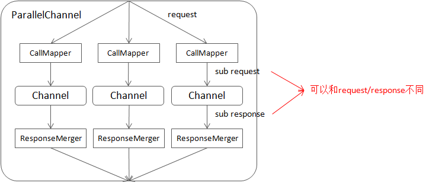

[English version](../en/combo_channel.md)

随着服务规模的增大，对下游的访问流程会越来越复杂，其中往往包含多个同时发起的RPC或有复杂的层次结构。但这类代码的多线程陷阱很多，用户可能写出了bug也不自知，复现和调试也比较困难。而且实现要么只能支持同步的情况，要么得为异步重写一套。以"在多个异步RPC完成后运行一些代码"为例，它的同步实现一般是异步地发起多个RPC，然后逐个等待各自完成；它的异步实现一般是用一个带计数器的回调，每当一个RPC完成时计数器减一，直到0时调用回调。可以看到它的缺点：

- 同步和异步代码不一致。用户无法轻易地从一个模式转为另一种模式。从设计的角度，不一致暗示了没有抓住本质。
- 往往不能被取消。正确及时地取消一个操作不是一件易事，何况是组合访问。但取消对于终结无意义的等待是很必要的。
- 不能继续组合。比如你很难把一个上述实现变成“更大"的访问模式的一部分。换个场景还得重写一套。

我们需要更好的抽象。如果我们能以不同的方式把一些Channel组合为更大的Channel，并把不同的访问模式置入其中，那么用户可以便用统一接口完成同步、异步、取消等操作。这种channel在brpc中被称为组合channel。

# ParallelChannel

ParallelChannel (有时被称为“pchan”)同时访问其包含的sub channel，并合并它们的结果。用户可通过CallMapper修改请求，通过ResponseMerger合并结果。ParallelChannel看起来就像是一个Channel：

- 支持同步和异步访问。
- 发起异步操作后可以立刻删除。
- 可以取消。
- 支持超时。

示例代码见[example/parallel_echo_c++](https://github.com/apache/brpc/tree/master/example/parallel_echo_c++/)。

任何brpc::ChannelBase的子类都可以加入ParallelChannel，包括ParallelChannel和其他组合Channel。用户可以设置ParallelChannelOptions.fail_limit来控制访问的最大失败次数，当失败的访问达到这个数目时，RPC会立刻结束而不等待超时。

一个sub channel可多次加入同一个ParallelChannel。当你需要对同一个服务发起多次异步访问并等待它们完成的话，这很有用。

ParallelChannel的内部结构大致如下：



## 插入sub channel

可通过如下接口把sub channel插入ParallelChannel：

```c++
int AddChannel(brpc::ChannelBase* sub_channel,
               ChannelOwnership ownership,
               CallMapper* call_mapper,
               ResponseMerger* response_merger);
```

当ownership为brpc::OWNS_CHANNEL时，sub_channel会在ParallelChannel析构时被删除。一个sub channel可能会多次加入一个ParallelChannel，如果其中一个指明了ownership为brpc::OWNS_CHANNEL，那个sub channel会在ParallelChannel析构时被最多删除一次。

访问ParallelChannel时调用AddChannel是**线程不安全**的。

## CallMapper

用于把对ParallelChannel的调用转化为对sub channel的调用。如果call_mapper是NULL，sub channel的请求就是ParallelChannel的请求，而response则New()自ParallelChannel的response。如果call_mapper不为NULL，则会在ParallelChannel析构时被删除。call_mapper内含引用计数，一个call_mapper可与多个sub channel关联。

```c++
class CallMapper {
public:
    virtual ~CallMapper();
 
    virtual SubCall Map(int channel_index/*starting from 0*/,
                        int channel_count,
                        const google::protobuf::MethodDescriptor* method,
                        const google::protobuf::Message* request,
                        google::protobuf::Message* response) = 0;
};
```

channel_index：该sub channel在ParallelChannel中的位置，从0开始计数。

channel_count：ParallelChannel中sub channel的数量。

method/request/response：ParallelChannel.CallMethod()的参数。

返回的SubCall被用于访问对应sub channel，SubCall有两个特殊值：

- 返回SubCall::Bad()则对ParallelChannel的该次访问立刻失败，Controller.ErrorCode()为EREQUEST。
- 返回SubCall::Skip()则跳过对该sub channel的访问，如果所有的sub channel都被跳过了，该次访问立刻失败，Controller.ErrorCode()为ECANCELED。

常见的Map()实现有：

- 广播request。这也是call_mapper为NULL时的行为：
```c++
  class Broadcaster : public CallMapper {
  public:
      SubCall Map(int channel_index/*starting from 0*/,
                  const google::protobuf::MethodDescriptor* method,
                  const google::protobuf::Message* request,
                  google::protobuf::Message* response) {
          // method/request和pchan保持一致.
          // response是new出来的，最后的flag告诉pchan在RPC结束后删除Response。
          return SubCall(method, request, response->New(), DELETE_RESPONSE);
      }
  };
```
- 修改request中的字段后再发。
```c++
  class ModifyRequest : public CallMapper {
  public:
    SubCall Map(int channel_index/*starting from 0*/,
                const google::protobuf::MethodDescriptor* method,
                const google::protobuf::Message* request,
                google::protobuf::Message* response) {
        FooRequest* copied_req = brpc::Clone<FooRequest>(request);
        copied_req->set_xxx(...);
        // 拷贝并修改request，最后的flag告诉pchan在RPC结束后删除Request和Response。
        return SubCall(method, copied_req, response->New(), DELETE_REQUEST | DELETE_RESPONSE);
    }
  };
```
- request和response已经包含了sub request/response，直接取出来。
```c++
  class UseFieldAsSubRequest : public CallMapper {
  public:
    SubCall Map(int channel_index/*starting from 0*/,
                const google::protobuf::MethodDescriptor* method,
                const google::protobuf::Message* request,
                google::protobuf::Message* response) {
        if (channel_index >= request->sub_request_size()) {
            // sub_request不够，说明外面准备数据的地方和pchan中sub channel的个数不符.
            // 返回Bad()让该次访问立刻失败
            return SubCall::Bad();
        }
        // 取出对应的sub request，增加一个sub response，最后的flag为0告诉pchan什么都不用删
        return SubCall(sub_method, request->sub_request(channel_index), response->add_sub_response(), 0);
    }
  };
```

## ResponseMerger

response_merger把sub channel的response合并入总的response，其为NULL时，则使用response->MergeFrom(*sub_response)，MergeFrom的行为可概括为“除了合并repeated字段，其余都是覆盖”。如果你需要更复杂的行为，则需实现ResponseMerger。response_merger是一个个执行的，所以你并不需要考虑多个Merge同时运行的情况。response_merger在ParallelChannel析构时被删除。response_merger内含引用计数，一个response_merger可与多个sub channel关联。

Result的取值有：
- MERGED: 成功合并。
- FAIL: sub_response没有合并成功，会被记作一次失败。比如有10个sub channels且fail_limit为4，只要有4个合并结果返回了FAIL，这次RPC就会达到fail_limit并立刻结束。
- FAIL_ALL: 使本次RPC直接结束。


## 获得访问sub channel时的controller

有时访问者需要了解访问sub channel时的细节，通过Controller.sub(i)可获得访问sub channel的controller.

```c++
// Get the controllers for accessing sub channels in combo channels.
// Ordinary channel:
//   sub_count() is 0 and sub() is always NULL.
// ParallelChannel/PartitionChannel:
//   sub_count() is #sub-channels and sub(i) is the controller for
//   accessing i-th sub channel inside ParallelChannel, if i is outside
//    [0, sub_count() - 1], sub(i) is NULL.
//   NOTE: You must test sub() against NULL, ALWAYS. Even if i is inside
//   range, sub(i) can still be NULL:
//   * the rpc call may fail and terminate before accessing the sub channel
//   * the sub channel was skipped
// SelectiveChannel/DynamicPartitionChannel:
//   sub_count() is always 1 and sub(0) is the controller of successful
//   or last call to sub channels.
int sub_count() const;
const Controller* sub(int index) const;
```

# SelectiveChannel

[SelectiveChannel](https://github.com/apache/brpc/blob/master/src/brpc/selective_channel.h) (有时被称为“schan”)按负载均衡算法访问其包含的Channel，相比普通Channel它更加高层：把流量分给sub channel，而不是具体的Server。SelectiveChannel主要用来支持机器组之间的负载均衡，它具备Channel的主要属性：

- 支持同步和异步访问。
- 发起异步操作后可以立刻删除。
- 可以取消。
- 支持超时。

示例代码见[example/selective_echo_c++](https://github.com/apache/brpc/tree/master/example/selective_echo_c++/)。

任何brpc::ChannelBase的子类都可加入SelectiveChannel，包括SelectiveChannel和其他组合Channel。

SelectiveChannel的重试独立于其中的sub channel，当SelectiveChannel访问某个sub channel失败后（本身可能重试），它会重试另外一个sub channel。

目前SelectiveChannel要求**request必须在RPC结束前有效**，其他channel没有这个要求。如果你使用SelectiveChannel发起异步操作，确保request在done中才被删除。

## 使用SelectiveChannel

SelectiveChannel的初始化和普通Channel基本一样，但Init不需要指定命名服务，因为SelectiveChannel通过AddChannel动态添加sub channel，而普通Channel通过命名服务动态管理server。

```c++
#include <brpc/selective_channel.h>
...
brpc::SelectiveChannel schan;
brpc::ChannelOptions schan_options;
schan_options.timeout_ms = ...;
schan_options.backup_request_ms = ...;
schan_options.max_retry = ...;
if (schan.Init(load_balancer, &schan_options) != 0) {
    LOG(ERROR) << "Fail to init SelectiveChannel";
    return -1;
}
```

初始化完毕后通过AddChannel加入sub channel。

```c++
if (schan.AddChannel(sub_channel, NULL/*ChannelHandle*/) != 0) {  // 第二个参数ChannelHandle用于删除sub channel，不用删除可填NULL
    LOG(ERROR) << "Fail to add sub_channel";
    return -1;
}
```

注意：

- 和ParallelChannel不同，SelectiveChannel的AddChannel可在任意时刻调用，即使该SelectiveChannel正在被访问（下一次访问时生效）
- SelectiveChannel总是own sub channel，这和ParallelChannel可选择ownership是不同的。
- 如果AddChannel第二个参数不为空，会填入一个类型为brpc::SelectiveChannel::ChannelHandle的值，这个handle可作为RemoveAndDestroyChannel的参数来动态删除一个channel。
- SelectiveChannel会用自身的超时覆盖sub channel初始化时指定的超时。比如某个sub channel的超时为100ms，SelectiveChannel的超时为500ms，实际访问时的超时是500ms。

访问SelectiveChannel的方式和普通Channel是一样的。

## 例子: 往多个命名服务分流

一些场景中我们需要向多个命名服务下的机器分流，原因可能有：

- 完成同一个检索功能的机器被挂载到了不同的命名服务下。
- 机器被拆成了多个组，流量先分流给一个组，再分流到组内机器。组间的分流方式和组内有所不同。

这都可以通过SelectiveChannel完成。

下面的代码创建了一个SelectiveChannel，并插入三个访问不同bns的普通Channel。

```c++
brpc::SelectiveChannel channel;
brpc::ChannelOptions schan_options;
schan_options.timeout_ms = FLAGS_timeout_ms;
schan_options.max_retry = FLAGS_max_retry;
if (channel.Init("c_murmurhash", &schan_options) != 0) {
    LOG(ERROR) << "Fail to init SelectiveChannel";
    return -1;
}
 
for (int i = 0; i < 3; ++i) {
    brpc::Channel* sub_channel = new brpc::Channel;
    if (sub_channel->Init(ns_node_name[i], "rr", NULL) != 0) {
        LOG(ERROR) << "Fail to init sub channel " << i;
        return -1;
    }
    if (channel.AddChannel(sub_channel, NULL/*handle for removal*/) != 0) {
        LOG(ERROR) << "Fail to add sub_channel to channel";
        return -1;
    } 
}
...
XXXService_Stub stub(&channel);
stub.FooMethod(&cntl, &request, &response, NULL);
...
```

# PartitionChannel

[PartitionChannel](https://github.com/apache/brpc/blob/master/src/brpc/partition_channel.h)是特殊的ParallelChannel，它会根据命名服务中的tag自动建立对应分库的sub channel。这样用户就可以把所有的分库机器挂在一个命名服务内，通过tag来指定哪台机器对应哪个分库。示例代码见[example/partition_echo_c++](https://github.com/apache/brpc/tree/master/example/partition_echo_c++/)。

ParititonChannel只能处理一种分库方法，当用户需要多种分库方法共存，或从一个分库方法平滑地切换为另一种分库方法时，可以使用DynamicPartitionChannel，它会根据不同的分库方式动态地建立对应的sub PartitionChannel，并根据容量把请求分配给不同的分库。示例代码见[example/dynamic_partition_echo_c++](https://github.com/apache/brpc/tree/master/example/dynamic_partition_echo_c++/)。

如果分库在不同的命名服务内，那么用户得自行用ParallelChannel组装，即每个sub channel对应一个分库（使用不同的命名服务）。ParellelChannel的使用方法见[上面](#ParallelChannel)。

## 使用PartitionChannel

首先定制PartitionParser。这个例子中tag的形式是N/M，N代表分库的index，M是分库的个数。比如0/3代表一共3个分库，这是第一个。

```c++
#include <brpc/partition_channel.h>
...
class MyPartitionParser : public brpc::PartitionParser {
public:
    bool ParseFromTag(const std::string& tag, brpc::Partition* out) {
        // "N/M" : #N partition of M partitions.
        size_t pos = tag.find_first_of('/');
        if (pos == std::string::npos) {
            LOG(ERROR) << "Invalid tag=" << tag;
            return false;
        }
        char* endptr = NULL;
        out->index = strtol(tag.c_str(), &endptr, 10);
        if (endptr != tag.data() + pos) {
            LOG(ERROR) << "Invalid index=" << butil::StringPiece(tag.data(), pos);
            return false;
        }
        out->num_partition_kinds = strtol(tag.c_str() + pos + 1, &endptr, 10);
        if (endptr != tag.c_str() + tag.size()) {
            LOG(ERROR) << "Invalid num=" << tag.data() + pos + 1;
            return false;
        }
        return true;
    }
};
```

然后初始化PartitionChannel。

```c++
#include <brpc/partition_channel.h>
...
brpc::PartitionChannel channel;
 
brpc::PartitionChannelOptions options;
options.protocol = ...;   // PartitionChannelOptions继承了ChannelOptions，后者有的前者也有
options.timeout_ms = ...; // 同上
options.fail_limit = 1;   // PartitionChannel自己的选项，意思同ParalellChannel中的fail_limit。这里为1的意思是只要有1个分库访问失败，这次RPC就失败了。
 
if (channel.Init(num_partition_kinds, new MyPartitionParser(),
                 server_address, load_balancer, &options) != 0) {
    LOG(ERROR) << "Fail to init PartitionChannel";
    return -1;
}
// 访问方法和普通Channel是一样的
```

## 使用DynamicPartitionChannel

DynamicPartitionChannel的使用方法和PartitionChannel基本上是一样的，先定制PartitionParser再初始化，但Init时不需要num_partition_kinds，因为DynamicPartitionChannel会为不同的分库方法动态建立不同的sub PartitionChannel。

下面演示一下使用DynamicPartitionChannel平滑地从3库变成4库。

首先分别在8004, 8005, 8006端口启动三个server。

```
$ ./echo_server -server_num 3
TRACE: 09-06 10:40:39:   * 0 server.cpp:159] EchoServer is serving on port=8004
TRACE: 09-06 10:40:39:   * 0 server.cpp:159] EchoServer is serving on port=8005
TRACE: 09-06 10:40:39:   * 0 server.cpp:159] EchoServer is serving on port=8006
TRACE: 09-06 10:40:40:   * 0 server.cpp:192] S[0]=0 S[1]=0 S[2]=0 [total=0]
TRACE: 09-06 10:40:41:   * 0 server.cpp:192] S[0]=0 S[1]=0 S[2]=0 [total=0]
TRACE: 09-06 10:40:42:   * 0 server.cpp:192] S[0]=0 S[1]=0 S[2]=0 [total=0]
```

启动后每个Server每秒会打印上一秒收到的流量，目前都是0。

在本地启动使用DynamicPartitionChannel的Client，初始化代码如下：

```c++
    ...
    brpc::DynamicPartitionChannel channel;
    brpc::PartitionChannelOptions options;
    // 访问任何分库失败都认为RPC失败。调大这个数值可以使访问更宽松，比如等于2的话表示至少两个分库失败才算失败。
    options.fail_limit = 1;
    if (channel.Init(new MyPartitionParser(), "file://server_list", "rr", &options) != 0) {
        LOG(ERROR) << "Fail to init channel";
        return -1;
    }
    ...
```

命名服务"file://server_list"的内容是：
```
0.0.0.0:8004  0/3  # 表示3分库中的第一个分库，其他依次类推
0.0.0.0:8004  1/3
0.0.0.0:8004  2/3
```

3分库方案的3个库都在8004端口对应的server上。启动Client后Client发现了8004，并向其发送流量。

```
$ ./echo_client            
TRACE: 09-06 10:51:10:   * 0 src/brpc/policy/file_naming_service.cpp:83] Got 3 unique addresses from `server_list'
TRACE: 09-06 10:51:10:   * 0 src/brpc/socket.cpp:779] Connected to 0.0.0.0:8004 via fd=3 SocketId=0 self_port=46544
TRACE: 09-06 10:51:11:   * 0 client.cpp:226] Sending EchoRequest at qps=132472 latency=371
TRACE: 09-06 10:51:12:   * 0 client.cpp:226] Sending EchoRequest at qps=132658 latency=370
TRACE: 09-06 10:51:13:   * 0 client.cpp:226] Sending EchoRequest at qps=133208 latency=369
```

同时Server端收到了3倍的流量：因为访问一次Client端要访问三次8004，分别对应每个分库。

```
TRACE: 09-06 10:51:11:   * 0 server.cpp:192] S[0]=398866 S[1]=0 S[2]=0 [total=398866]
TRACE: 09-06 10:51:12:   * 0 server.cpp:192] S[0]=398117 S[1]=0 S[2]=0 [total=398117]
TRACE: 09-06 10:51:13:   * 0 server.cpp:192] S[0]=398873 S[1]=0 S[2]=0 [total=398873]
```

开始修改分库，在server_list中加入4分库的8005：

```
0.0.0.0:8004  0/3
0.0.0.0:8004  1/3   
0.0.0.0:8004  2/3 
 
0.0.0.0:8005  0/4        
0.0.0.0:8005  1/4        
0.0.0.0:8005  2/4        
0.0.0.0:8005  3/4
```

观察Client和Server的输出变化。Client端发现了server_list的变化并重新载入，但qps并没有什么变化。

```
TRACE: 09-06 10:57:10:   * 0 src/brpc/policy/file_naming_service.cpp:83] Got 7 unique addresses from `server_list'
TRACE: 09-06 10:57:10:   * 0 src/brpc/socket.cpp:779] Connected to 0.0.0.0:8005 via fd=7 SocketId=768 self_port=39171
TRACE: 09-06 10:57:11:   * 0 client.cpp:226] Sending EchoRequest at qps=135346 latency=363
TRACE: 09-06 10:57:12:   * 0 client.cpp:226] Sending EchoRequest at qps=134201 latency=366
TRACE: 09-06 10:57:13:   * 0 client.cpp:226] Sending EchoRequest at qps=137627 latency=356
TRACE: 09-06 10:57:14:   * 0 client.cpp:226] Sending EchoRequest at qps=136775 latency=359
TRACE: 09-06 10:57:15:   * 0 client.cpp:226] Sending EchoRequest at qps=139043 latency=353
```

server端的变化比较大。8005收到了流量，并且和8004的流量比例关系约为4:3。

```
TRACE: 09-06 10:57:09:   * 0 server.cpp:192] S[0]=398597 S[1]=0 S[2]=0 [total=398597]
TRACE: 09-06 10:57:10:   * 0 server.cpp:192] S[0]=392839 S[1]=0 S[2]=0 [total=392839]
TRACE: 09-06 10:57:11:   * 0 server.cpp:192] S[0]=334704 S[1]=83219 S[2]=0 [total=417923]
TRACE: 09-06 10:57:12:   * 0 server.cpp:192] S[0]=206215 S[1]=273873 S[2]=0 [total=480088]
TRACE: 09-06 10:57:13:   * 0 server.cpp:192] S[0]=204520 S[1]=270483 S[2]=0 [total=475003]
TRACE: 09-06 10:57:14:   * 0 server.cpp:192] S[0]=207055 S[1]=273725 S[2]=0 [total=480780]
TRACE: 09-06 10:57:15:   * 0 server.cpp:192] S[0]=208453 S[1]=276803 S[2]=0 [total=485256]
```

一次RPC要访问三次8004或四次8005，8004和8005流量比是3:4，说明Client以1:1的比例访问了3分库和4分库。这个比例关系取决于其容量。容量的计算是递归的：

- 普通Channel的容量等于它其中所有server的容量之和。如果命名服务没有配置权值，单个server的容量为1。
- ParallelChannel或PartitionChannel的容量等于它其中Sub Channel容量的最小值。
- SelectiveChannel的容量等于它其中Sub Channel的容量之和。
- DynamicPartitionChannel的容量等于它其中Sub PartitionChannel的容量之和。

在这儿的场景中，3分库和4分库的容量都是1，因为所有的3库都在8004一台server上，所有的4库都在8005一台server上。

在4分库方案加入加入8006端口的server:

```
0.0.0.0:8004  0/3
0.0.0.0:8004  1/3   
0.0.0.0:8004  2/3
 
0.0.0.0:8005  0/4   
0.0.0.0:8005  1/4   
0.0.0.0:8005  2/4   
0.0.0.0:8005  3/4    
 
0.0.0.0:8006 0/4
0.0.0.0:8006 1/4
0.0.0.0:8006 2/4
0.0.0.0:8006 3/4
```

Client的变化仍旧不大：

```
TRACE: 09-06 11:11:51:   * 0 src/brpc/policy/file_naming_service.cpp:83] Got 11 unique addresses from `server_list'
TRACE: 09-06 11:11:51:   * 0 src/brpc/socket.cpp:779] Connected to 0.0.0.0:8006 via fd=8 SocketId=1280 self_port=40759
TRACE: 09-06 11:11:51:   * 0 client.cpp:226] Sending EchoRequest at qps=131799 latency=372
TRACE: 09-06 11:11:52:   * 0 client.cpp:226] Sending EchoRequest at qps=136217 latency=361
TRACE: 09-06 11:11:53:   * 0 client.cpp:226] Sending EchoRequest at qps=133531 latency=368
TRACE: 09-06 11:11:54:   * 0 client.cpp:226] Sending EchoRequest at qps=136072 latency=361
```

Server端可以看到8006收到了流量。三台server的流量比例约为3:4:4。这是因为3分库的容量仍为1，而4分库由于8006的加入变成了2。3分库和4分库的流量比例是3:8。4分库中的每个分库在8005和8006上都有实例，同一个分库的不同实例使用round robin分流，所以8005和8006平摊了流量。最后的效果就是3:4:4。

```
TRACE: 09-06 11:11:51:   * 0 server.cpp:192] S[0]=199625 S[1]=263226 S[2]=0 [total=462851]
TRACE: 09-06 11:11:52:   * 0 server.cpp:192] S[0]=143248 S[1]=190717 S[2]=159756 [total=493721]
TRACE: 09-06 11:11:53:   * 0 server.cpp:192] S[0]=133003 S[1]=178328 S[2]=178325 [total=489656]
TRACE: 09-06 11:11:54:   * 0 server.cpp:192] S[0]=135534 S[1]=180386 S[2]=180333 [total=496253]
```

尝试去掉3分库中的一个分库: (你可以在file://server_list中使用#注释一行)

```
 0.0.0.0:8004  0/3
 0.0.0.0:8004  1/3
#0.0.0.0:8004  2/3
 
 0.0.0.0:8005  0/4   
 0.0.0.0:8005  1/4   
 0.0.0.0:8005  2/4   
 0.0.0.0:8005  3/4    
 
 0.0.0.0:8006 0/4
 0.0.0.0:8006 1/4
 0.0.0.0:8006 2/4
 0.0.0.0:8006 3/4
```

Client端发现了这点。

```
TRACE: 09-06 11:17:47:   * 0 src/brpc/policy/file_naming_service.cpp:83] Got 10 unique addresses from `server_list'
TRACE: 09-06 11:17:47:   * 0 client.cpp:226] Sending EchoRequest at qps=131653 latency=373
TRACE: 09-06 11:17:48:   * 0 client.cpp:226] Sending EchoRequest at qps=120560 latency=407
TRACE: 09-06 11:17:49:   * 0 client.cpp:226] Sending EchoRequest at qps=124100 latency=395
TRACE: 09-06 11:17:50:   * 0 client.cpp:226] Sending EchoRequest at qps=123743 latency=397
```

Server端更明显，8004很快没有了流量。这是因为去掉的分库已经是3分库中最后的2/3分库，去掉后3分库的容量变为了0，导致8004分不到任何流量了。

```
TRACE: 09-06 11:17:47:   * 0 server.cpp:192] S[0]=130864 S[1]=174499 S[2]=174548 [total=479911]
TRACE: 09-06 11:17:48:   * 0 server.cpp:192] S[0]=20063 S[1]=230027 S[2]=230098 [total=480188]
TRACE: 09-06 11:17:49:   * 0 server.cpp:192] S[0]=0 S[1]=245961 S[2]=245888 [total=491849]
TRACE: 09-06 11:17:50:   * 0 server.cpp:192] S[0]=0 S[1]=250198 S[2]=250150 [total=500348]
```

在真实的线上环境中，我们会逐渐地增加4分库的server，同时下掉3分库中的server。DynamicParititonChannel会按照每种分库方式的容量动态切分流量。当某个时刻3分库的容量变为0时，我们便平滑地把Server从3分库变为了4分库，同时并没有修改Client的代码。
