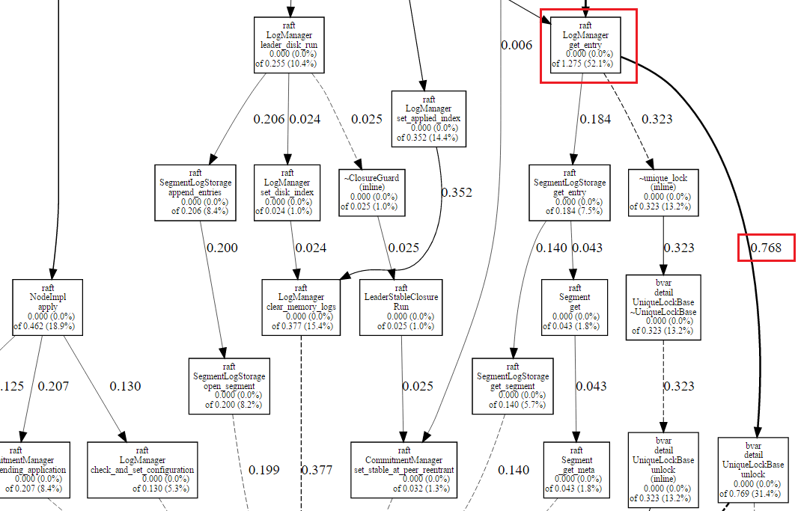
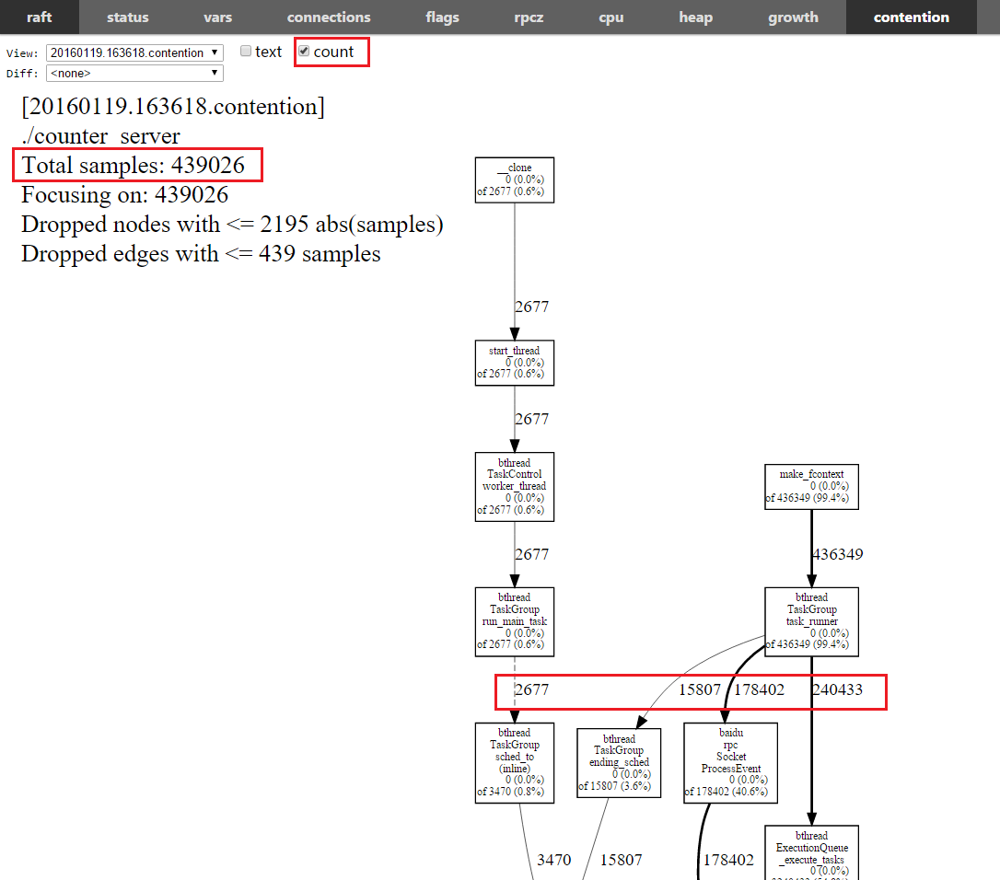

brpc可以分析花在等待锁上的时间及发生等待的函数。

# 开启方法

按需开启。无需配置，不依赖tcmalloc，不需要链接frame pointer或libunwind。如果只是brpc client或没有使用brpc，看[这里](dummy_server.md)。 

# 图示

当很多线程争抢同一把锁时，一些线程无法立刻获得锁，而必须睡眠直到某个线程退出临界区。这个争抢过程我们称之为**contention**。在多核机器上，当多个线程需要操作同一个资源却被一把锁挡住时，便无法充分发挥多个核心的并发能力。现代OS通过提供比锁更底层的同步原语，使得无竞争锁完全不需要系统调用，只是一两条wait-free，耗时10-20ns的原子操作，非常快。而锁一旦发生竞争，一些线程就要陷入睡眠，再次醒来触发了OS的调度代码，代价至少为3-5us。所以让锁尽量无竞争，让所有线程“一起飞”是需要高性能的server的永恒话题。

r31906后brpc支持contention profiler，可以分析在等待锁上花费了多少时间。等待过程中线程是睡着的不会占用CPU，所以contention profiler中的时间并不是cpu时间，也不会出现在[cpu profiler](cpu_profiler.md)中。cpu profiler可以抓到特别频繁的锁（以至于花费了很多cpu），但耗时真正巨大的临界区往往不是那么频繁，而无法被cpu profiler发现。**contention profiler和cpu profiler好似互补关系，前者分析等待时间（被动），后者分析忙碌时间。**还有一类由用户基于condition或sleep发起的主动等待时间，无需分析。

目前contention profiler支持pthread_mutex_t（非递归）和bthread_mutex_t，开启后每秒最多采集1000个竞争锁，这个数字由参数-bvar_collector_expected_per_second控制（同时影响rpc_dump）。

| Name                               | Value | Description                              | Defined At         |
| ---------------------------------- | ----- | ---------------------------------------- | ------------------ |
| bvar_collector_expected_per_second | 1000  | Expected number of samples to be collected per second | bvar/collector.cpp |

如果一秒内竞争锁的次数Ｎ超过了1000，那么每把锁会有1000/N的概率被采集。在我们的各类测试场景中（qps在10万-60万不等）没有观察到被采集程序的性能有明显变化。

我们通过实际例子来看下如何使用contention profiler，点击“contention”按钮（more左侧）后就会开启默认10秒的分析过程。下图是libraft中的一个示例程序的锁状况，这个程序是3个节点复制组的leader，qps在10-12万左右。左上角的**Total seconds: 2.449**是采集时间内（10秒）在锁上花费的所有等待时间。注意是“等待”，无竞争的锁不会被采集也不会出现在下图中。顺着箭头往下走能看到每份时间来自哪些函数。

 上图有点大，让我们放大一个局部看看。下图红框中的0.768是这个局部中最大的数字，它代表raft::LogManager::get_entry在等待涉及到bvar::detail::UniqueLockBase的函数上共等待了0.768秒（10秒内）。我们如果觉得这个时间不符合预期，就可以去排查代码。

点击上方的count选择框，可以查看锁的竞争次数。选择后左上角变为了**Total samples: 439026**，代表采集时间内总共的锁竞争次数（估算）。图中箭头上的数字也相应地变为了次数，而不是时间。对比同一份结果的时间和次数，可以更深入地理解竞争状况。

