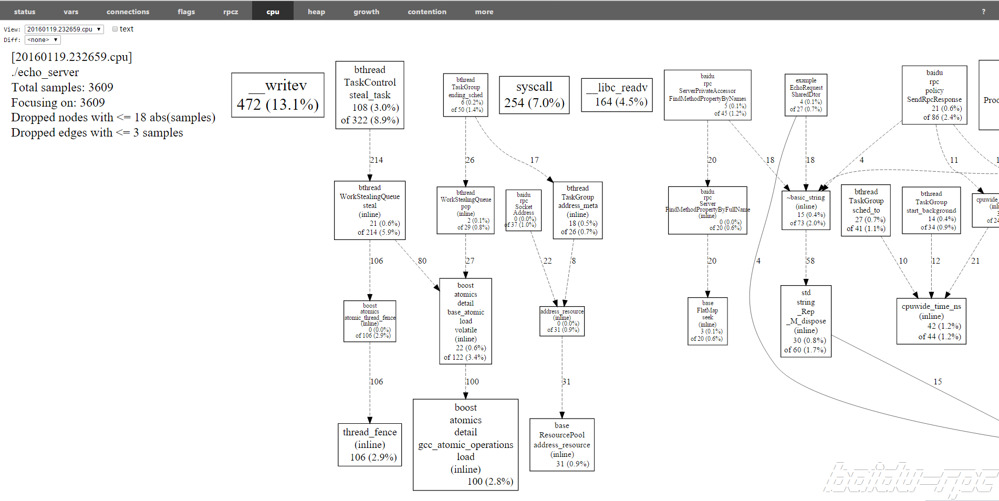

brpc可以分析程序中的热点函数。

# 开启方法

1. 链接`libtcmalloc_and_profiler.a`
   1. 这么写也开启了tcmalloc，不建议单独链接cpu profiler而不链接tcmalloc，可能越界访问导致[crash](https://github.com/gperftools/gperftools/blob/master/README#L226).可能由于tcmalloc不及时归还内存，越界访问不会crash。
   2. 如果tcmalloc使用frame pointer而不是libunwind回溯栈，请确保在CXXFLAGS或CFLAGS中加上`-fno-omit-frame-pointer`，否则函数间的调用关系会丢失，最后产生的图片中都是彼此独立的函数方框。
2. 定义宏BRPC_ENABLE_CPU_PROFILER, 一般加入编译参数-DBRPC_ENABLE_CPU_PROFILER。注意：BRPC_ENABLE_CPU_PROFILER宏需要定义在引用到brpc头文件(channel.h或server.h)的代码里。比如A模块引用B模块，B模块在实现中引用brpc头文件，必须在B模块的编译参数加上BRPC_ENABLE_CPU_PROFILER宏，在A模块加是没用的。
3. 如果只是brpc client或没有使用brpc，看[这里](dummy_server.md)。 

 注意要关闭Server端的认证，否则可能会看到这个：

```
$ tools/pprof --text localhost:9002/pprof/profile
Use of uninitialized value in substitution (s///) at tools/pprof line 2703.
http://localhost:9002/profile/symbol doesn't exist
```

server端可能会有这样的日志：

```
FATAL: 12-26 10:01:25:   * 0 [src/brpc/policy/giano_authenticator.cpp:65][4294969345] Giano fails to verify credentical, 70003
WARNING: 12-26 10:01:25:   * 0 [src/brpc/input_messenger.cpp:132][4294969345] Authentication failed, remote side(127.0.0.1:22989) of sockfd=5, close it
```

# 查看方法

1. 通过builtin service的 /hotspots/cpu 页面查看
1. 通过pprof 工具查看，如 tools/pprof --text localhost:9002/pprof/profile

# 控制采样频率

启动前设置环境变量：export CPUPROFILE_FREQUENCY=xxx

默认值为: 100

# 控制采样时间

url加上?seconds=秒数，如/hotspots/cpu?seconds=5

# 图示

下图是一次运行cpu profiler后的结果：

- 左上角是总体信息，包括时间，程序名，总采样数等等。
- View框中可以选择查看之前运行过的profile结果，Diff框中可选择查看和之前的结果的变化量，重启后清空。
- 代表函数调用的方框中的字段从上到下依次为：函数名，这个函数本身（除去所有子函数）占的采样数和比例，这个函数及调用的所有子函数累计的采样数和比例。采样数越大框越大。
- 方框之间连线上的数字表示被采样到的上层函数对下层函数的调用数，数字越大线越粗。

热点分析一般开始于找到最大的框最粗的线考察其来源及去向。

cpu profiler的原理是在定期被调用的SIGPROF handler中采样所在线程的栈，由于handler（在linux 2.6后）会被随机地摆放于活跃线程的栈上运行，cpu profiler在运行一段时间后能以很大的概率采集到所有活跃线程中的活跃函数，最后根据栈代表的函数调用关系汇总为调用图，并把地址转换成符号，这就是我们看到的结果图了。采集频率由环境变量CPUPROFILE_FREQUENCY控制，默认100，即每秒钟100次或每10ms一次。在实践中cpu profiler对原程序的影响不明显。



在Linux下，你也可以使用[pprof](https://github.com/brpc/brpc/blob/master/tools/pprof)或gperftools中的pprof进行profiling。

比如`pprof --text localhost:9002 --seconds=5`的意思是统计运行在本机9002端口的server的cpu情况，时长5秒。一次运行的例子如下：

```
$ tools/pprof --text 0.0.0.0:9002 --seconds=5
Gathering CPU profile from http://0.0.0.0:9002/pprof/profile?seconds=5 for 5 seconds to
  /home/gejun/pprof/echo_server.1419501210.0.0.0.0
Be patient...
Wrote profile to /home/gejun/pprof/echo_server.1419501210.0.0.0.0
Removing funlockfile from all stack traces.
Total: 2946 samples
    1161  39.4%  39.4%     1161  39.4% syscall
     248   8.4%  47.8%      248   8.4% bthread::TaskControl::steal_task
     227   7.7%  55.5%      227   7.7% writev
      87   3.0%  58.5%       88   3.0% ::cpp_alloc
      74   2.5%  61.0%       74   2.5% __read_nocancel
      46   1.6%  62.6%       48   1.6% tc_delete
      42   1.4%  64.0%       42   1.4% brpc::Socket::Address
      41   1.4%  65.4%       41   1.4% epoll_wait
      35   1.2%  66.6%       35   1.2% memcpy
      33   1.1%  67.7%       33   1.1% __pthread_getspecific
      33   1.1%  68.8%       33   1.1% brpc::Socket::Write
      33   1.1%  69.9%       33   1.1% epoll_ctl
      28   1.0%  70.9%       42   1.4% brpc::policy::ProcessRpcRequest
      27   0.9%  71.8%       27   0.9% butil::IOBuf::_push_back_ref
      27   0.9%  72.7%       27   0.9% bthread::TaskGroup::ending_sched
```

省略–text进入交互模式，如下图所示：

```
$ tools/pprof localhost:9002 --seconds=5       
Gathering CPU profile from http://0.0.0.0:9002/pprof/profile?seconds=5 for 5 seconds to
  /home/gejun/pprof/echo_server.1419501236.0.0.0.0
Be patient...
Wrote profile to /home/gejun/pprof/echo_server.1419501236.0.0.0.0
Removing funlockfile from all stack traces.
Welcome to pprof!  For help, type 'help'.
(pprof) top
Total: 2954 samples
    1099  37.2%  37.2%     1099  37.2% syscall
     253   8.6%  45.8%      253   8.6% bthread::TaskControl::steal_task
     240   8.1%  53.9%      240   8.1% writev
      90   3.0%  56.9%       90   3.0% ::cpp_alloc
      67   2.3%  59.2%       67   2.3% __read_nocancel
      47   1.6%  60.8%       47   1.6% butil::IOBuf::_push_back_ref
      42   1.4%  62.2%       56   1.9% brpc::policy::ProcessRpcRequest
      41   1.4%  63.6%       41   1.4% epoll_wait
      38   1.3%  64.9%       38   1.3% epoll_ctl
      37   1.3%  66.1%       37   1.3% memcpy
      35   1.2%  67.3%       35   1.2% brpc::Socket::Address
```

# MacOS的额外配置

在MacOS下，gperftools中的perl pprof脚本无法将函数地址转变成函数名，解决办法是：

1. 安装[standalone pprof](https://github.com/google/pprof)，并把下载的pprof二进制文件路径写入环境变量GOOGLE_PPROF_BINARY_PATH中
2. 安装llvm-symbolizer（将函数符号转化为函数名），直接用brew安装即可：`brew install llvm`

# 火焰图

若需要结果以火焰图的方式展示，请下载并安装[FlameGraph](https://github.com/brendangregg/FlameGraph)工具，将环境变量FLAMEGRAPH_PL_PATH正确设置到本地的/path/to/flamegraph.pl后启动server即可。
