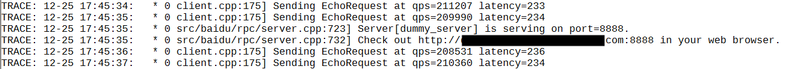

如果你的程序只使用了brpc的client或根本没有使用brpc，但你也想使用brpc的内置服务，只要在程序中启动一个空的server就行了，这种server我们称为**dummy server**。

# 使用了brpc的client

只要在程序运行目录建立dummy_server.port文件，填入一个端口号（比如8888），程序会马上在这个端口上启动一个dummy server。在浏览器中访问它的内置服务，便可看到同进程内的所有bvar。
  


# 没有使用brpc

你必须手动加入dummy server。你得先查看[Getting Started](getting_started.md)如何下载和编译brpc，然后在程序入口处加入如下代码片段：

```c++
#include <brpc/server.h>
 
...
 
int main() {
    ...
    brpc::StartDummyServerAt(8888/*port*/);
    ...
}
```
