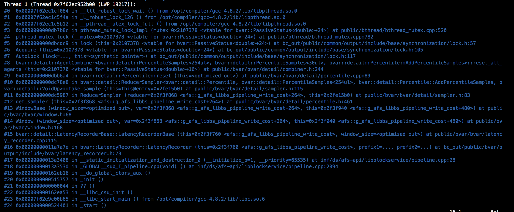

[English version](../en/getting_started.md)

# 构建

brpc鼓励静态链接依赖，以便于每个运行brpc服务的机器不必再安装依赖。

brpc有如下依赖：

* [gflags](https://github.com/gflags/gflags): Extensively used to define global options.
* [protobuf](https://github.com/google/protobuf): Serializations of messages, interfaces of services.
* [leveldb](https://github.com/google/leveldb): Required by [rpcz](rpcz.md) to record RPCs for tracing.

# 支持的环境

* [Ubuntu/LinuxMint/WSL](#ubuntulinuxmintwsl)
* [Fedora/CentOS](#fedoracentos)
* [自己构建依赖的Linux](#自己构建依赖的Linux)
* [MacOS](#macos)
* [docker](#docker)

## Ubuntu/LinuxMint/WSL
### 依赖准备

安装依赖：
```shell
sudo apt-get install -y git g++ make libssl-dev libgflags-dev libprotobuf-dev libprotoc-dev protobuf-compiler libleveldb-dev
```

如果你需要静态链接leveldb：
```shell
sudo apt-get install -y libsnappy-dev
```

如果你要在样例中启用cpu/heap的profiler：
```shell
sudo apt-get install -y libgoogle-perftools-dev
```

如果你要运行测试，那么要安装并编译libgtest-dev（它没有被默认编译）：
```shell
sudo apt-get install -y cmake libgtest-dev && cd /usr/src/gtest && sudo cmake . && sudo make && sudo mv lib/libgtest* /usr/lib/ && cd -
```
gtest源码目录可能变动，如果`/usr/src/gtest`不存在，请尝试`/usr/src/googletest/googletest`。

### 使用config_brpc.sh编译brpc
git克隆brpc，进入到项目目录，然后运行
```shell
$ sh config_brpc.sh --headers=/usr/include --libs=/usr/lib
$ make
```
修改编译器为clang，添加选项`--cxx=clang++ --cc=clang`。

不想链接调试符号，添加选项`--nodebugsymbols`，然后编译将会得到更轻量的二进制文件。

使用glog版的brpc，添加选项`--with-glog`。

要启用 [thrift 支持](../en/thrift.md)，首先安装thrift并且添加选项`--with-thrift`。

**运行样例**

```shell
$ cd example/echo_c++
$ make
$ ./echo_server &
$ ./echo_client
```

上述操作会链接brpc的静态库到样例中，如果你想链接brpc的共享库，请依次执行：`make clean`和`LINK_SO=1 make`

**运行测试**
```shell
$ cd test
$ make
$ sh run_tests.sh
```

### 使用cmake编译brpc

```shell
mkdir build && cd build && cmake .. && cmake --build . -j6
```
对于 cmake 3.13+ 也可以使用如下命令进行编译:
```shell
cmake -B build && cmake --build build -j6
```
要帮助VSCode或Emacs(LSP)去正确地理解代码，添加`-DCMAKE_EXPORT_COMPILE_COMMANDS=ON`选项去生成`compile_commands.json`。

要修改编译器为clang，请修改环境变量`CC`和`CXX`为`clang`和`clang++`。

不想链接调试符号，请移除`build/CMakeCache.txt`，然后用`-DWITH_DEBUG_SYMBOLS=OFF`选项执行cmake。

想要让brpc使用glog，用`-DWITH_GLOG=ON`选项执行cmake。

要启用 [thrift 支持](../en/thrift.md)，先安装thrift，然后用`-DWITH_THRIFT=ON`选项执行cmake。

**用cmake运行样例**

```shell
$ cd example/echo_c++
$ cmake -B build && cmake --build build -j4
$ ./echo_server &
$ ./echo_client
```

上述操作会链接brpc的静态库到样例中，如果你想链接brpc的共享库，请先移除`CMakeCache.txt`，然后用`-DLINK_SO=ON`选项重新执行cmake。

**运行测试**

```shell
$ mkdir build && cd build && cmake -DBUILD_UNIT_TESTS=ON .. && make && make test
```

## Fedora/CentOS

### 依赖准备

CentOS一般需要安装EPEL，否则很多包都默认不可用。
```shell
sudo yum install epel-release
```

安装依赖：
```shell
sudo yum install git gcc-c++ make openssl-devel gflags-devel protobuf-devel protobuf-compiler leveldb-devel
```

如果你要在样例中启用cpu/heap的profiler：
```shell
sudo yum install gperftools-devel
```

如果你要运行测试，那么要安装ligtest-dev:
```shell
sudo yum install gtest-devel
```

### 使用config_brpc.sh编译brpc

git克隆brpc，进入项目目录然后执行：

```shell
$ sh config_brpc.sh --headers="/usr/include" --libs="/usr/lib64 /usr/bin"
$ make
```
修改编译器为clang，添加选项`--cxx=clang++ --cc=clang`。

不想链接调试符号，添加选项`--nodebugsymbols` 然后编译将会得到更轻量的二进制文件。

想要让brpc使用glog，添加选项：`--with-glog`。

要启用 [thrift 支持](../en/thrift.md)，先安装thrift，然后添加选项：`--with-thrift`。

**运行样例**

```shell
$ cd example/echo_c++
$ make
$ ./echo_server &
$ ./echo_client
```

上述操作会链接brpc的静态库到样例中，如果你想链接brpc的共享库，请依次执行：`make clean`和`LINK_SO=1 make`

**运行测试**
```shell
$ cd test
$ make
$ sh run_tests.sh
```

### 使用cmake编译brpc
参考[这里](#使用cmake编译brpc)

### 使用vcpkg编译brpc

[vcpkg](https://github.com/microsoft/vcpkg) 是一个全平台支持的包管理器，你可以使用以下步骤vcpkg轻松编译brpc:

```shell
$ git clone https://github.com/microsoft/vcpkg.git
$ ./bootstrap-vcpkg.bat # 使用 powershell
$ ./bootstrap-vcpkg.sh # 使用 bash
$ ./vcpkg install brpc
```

## 自己构建依赖的Linux

### 依赖准备

brpc默认会构建出静态库和共享库，因此它也需要依赖有静态库和共享库两个版本。

以[gflags](https://github.com/gflags/gflags)为例，它默认不构建共享库，你需要给`cmake`指定选项去改变这一行为：
```shell
$ cmake . -DBUILD_SHARED_LIBS=1 -DBUILD_STATIC_LIBS=1
$ make
```

### 编译brpc

还以gflags为例，`../gflags_dev`表示gflags被克隆的位置。

git克隆brpc。进入到项目目录然后运行：

```shell
$ sh config_brpc.sh --headers="../gflags_dev /usr/include" --libs="../gflags_dev /usr/lib64"
$ make
```

这里我们给`--headers`和`--libs`传递多个路径使得脚本能够在多个地方进行检索。你也可以打包所有依赖和brpc一起放到一个目录中，然后把目录传递给 --headers/--libs选项，它会递归搜索所有子目录直到找到必须的文件。

修改编译器为clang，添加选项`--cxx=clang++ --cc=clang`。

不想链接调试符号，添加选项`--nodebugsymbols`，然后编译将会得到更轻量的二进制文件。

使用glog版的brpc，添加选项`--with-glog`。

要启用[thrift 支持](../en/thrift.md)，首先安装thrift并且添加选项`--with-thrift`。

```shell
$ ls my_dev
gflags_dev protobuf_dev leveldb_dev brpc_dev
$ cd brpc_dev
$ sh config_brpc.sh --headers=.. --libs=..
$ make
```

### 使用cmake编译brpc
参考[这里](#使用cmake编译brpc)

## MacOS

注意：在相同硬件条件下，MacOS版brpc的性能可能明显差于Linux版。如果你的服务是性能敏感的，请不要使用MacOS作为你的生产环境。

### Apple Silicon

master HEAD已支持M1系列芯片，M2未测试过。欢迎通过issues向我们报告遗留的warning/error。

### 依赖准备

安装依赖：
```shell
brew install openssl git gnu-getopt coreutils gflags protobuf leveldb
```

如果你要在样例中启用cpu/heap的profiler：
```shell
brew install gperftools
```

如果你要运行测试，需安装gtest。先运行`brew install googletest`看看homebrew是否支持（老版本没有），没有的话请下载和编译googletest：
```shell
git clone https://github.com/google/googletest -b release-1.10.0 && cd googletest/googletest && mkdir build && cd build && cmake -DCMAKE_CXX_FLAGS="-std=c++11" .. && make
```
在编译完成后，复制`include/`和`lib/`目录到`/usr/local/include`和`/usr/local/lib`目录中，以便于让所有应用都能使用gtest。

### OpenSSL
Monterey中openssl的安装位置可能不再位于`/usr/local/opt/openssl`，很可能会在`/opt/homebrew/Cellar`目录下，如果编译时报告找不到openssl：

* 先运行`brew link openssl --force`看看`/usr/local/opt/openssl`是否出现了
* 没有的话可以自行设置软链：`sudo ln -s /opt/homebrew/Cellar/openssl@3/3.0.3 /usr/local/opt/openssl`。请注意此命令中openssl的目录可能随环境变化而变化，可通过`brew info openssl`查看。

### 使用config_brpc.sh编译brpc
git克隆brpc，进入到项目目录然后运行：
```shell
$ sh config_brpc.sh --headers=/usr/local/include --libs=/usr/local/lib --cc=clang --cxx=clang++
$ make
```
MacOS Monterey下的brew安装路径可能改变，如有路径相关的错误，可考虑设置如下：

```shell
$ sh config_brpc.sh --headers=/opt/homebrew/include --libs=/opt/homebrew/lib --cc=clang --cxx=clang++
$ make
```

不想链接调试符号，添加选项`--nodebugsymbols`，然后编译将会得到更轻量的二进制文件。

使用glog版的brpc，添加选项`--with-glog`。

要启用[thrift 支持](../en/thrift.md)，首先安装thrift并且添加选项`--with-thrift`。

**运行样例**

```shell
$ cd example/echo_c++
$ make
$ ./echo_server &
$ ./echo_client
```
上述操作会链接brpc的静态库到样例中，如果你想链接brpc的共享库，请依次执行：`make clean`和`LINK_SO=1 make`

**运行测试**
```shell
$ cd test
$ make
$ sh run_tests.sh
```

### 使用cmake编译brpc
参考[这里](#使用cmake编译brpc)

## Docker
使用docker 编译brpc：

```shell
$ mkdir -p ~/brpc
$ cd ~/brpc
$ git clone https://github.com/apache/brpc.git
$ cd brpc
$ docker build -t brpc:master .
$ docker images
$ docker run -it brpc:master /bin/bash
```

# 支持的依赖

## GCC: 4.8-11.2

c++11被默认启用，以去除去boost的依赖（比如atomic）。

GCC7中over-aligned的问题暂时被禁止。

使用其他版本的gcc可能会产生编译警告，请联系我们予以修复。

请在makefile中给cxxflags增加`-D__const__=__unused__`选项以避免[gcc4+中的errno问题](thread_local.md).

## Clang: 3.5-4.0

无已知问题。

## glibc: 2.12-2.25

无已知问题。

## protobuf: 2.4+

同一个文件兼容pb 3.x版本和pb 2.x版本：
不要使用proto3新增的类型，并且在proto文件的起始位置添加`syntax=proto2;`声明。
[tools/add_syntax_equal_proto2_to_all.sh](https://github.com/apache/brpc/blob/master/tools/add_syntax_equal_proto2_to_all.sh)这个脚本可以给所有没有这行声明的proto文件添加`syntax="proto2"`声明。

pb 3.x中的Arena至今没被支持。

## gflags: 2.0-2.2.1

无已知问题。

## openssl: 0.97-1.1

被https功能需要。

## tcmalloc: 1.7-2.5

brpc默认**不**链接 [tcmalloc](http://goog-perftools.sourceforge.net/doc/tcmalloc.html)。用户按需要链接tcmalloc。

和glibc内置的ptmalloc相比，tcmalloc通常能提升性能。然而不同版本的tcmalloc可能表现迥异。例如：tcmalloc 2.1与 tcmalloc 1.7和2.5相比，可能会让brpc的多线程样例性能显著恶化（tcmalloc中的一个自旋锁导致的）。甚至不同的小版本号之间变现也可能不同。当你的程序表现不符合预期的时候，移除tcmalloc然后尝试其他版本。

用gcc4.8.2编译然后链接更早版本GCC编译的tcmalloc，可能会让程序中main()函数之前挂掉或者死锁，例如：



当你遇到这个问题的时候，请用同一个GCC重新编译tcmalloc。

另外一个使用tcmalloc的常见问题是，它不会像 ptmalloc一样及时地归还内存给系统。因此当有一个无效的内存访问的时候，程序可能不会直接挂掉，取而代之的是它可能在一个不相关的地方挂掉，或者甚至一直不挂掉。当你的程序出现怪异的内存问题的时候，尝试移除tcmalloc。

如果你要使用[cpu profiler](cpu_profiler.md)或[heap profiler](heap_profiler.md)，要链接`libtcmalloc_and_profiler.a`。这两个 profiler都是基于tcmalloc的。而[contention profiler](contention_profiler.md)不需要tcmalloc。

当你移除tcmalloc的时候，不仅要移除tcmalloc的链接，也要移除宏`-DBRPC_ENABLE_CPU_PROFILER`。

## glog: 3.3+

brpc实现了一个默认的[日志功能](../../src/butil/logging.h)它和glog冲突。要替换成glog，可以给config_brpc.sh增加*--with-glog*选项或者给cmake增加`-DWITH_GLOG=ON`选项。

## valgrind: 3.8+

brpc会自动检测valgrind（然后注册bthread的栈）。不支持老版本的valgrind（比如3.2）。

## thrift: 0.9.3-0.11.0

无已知问题。

# 实例追踪

我们提供了一个程序去帮助你追踪和监控所有brpc实例。 只需要在某处运行 [trackme_server](https://github.com/apache/brpc/tree/master/tools/trackme_server/) 然后再带着 -trackme_server=SERVER参数启动需要被追踪的实例。trackme_server将从实例周期性地收到ping消息然后打印日志。您可以从日志中聚合实例地址，并调用实例的内置服务以获取更多信息。
