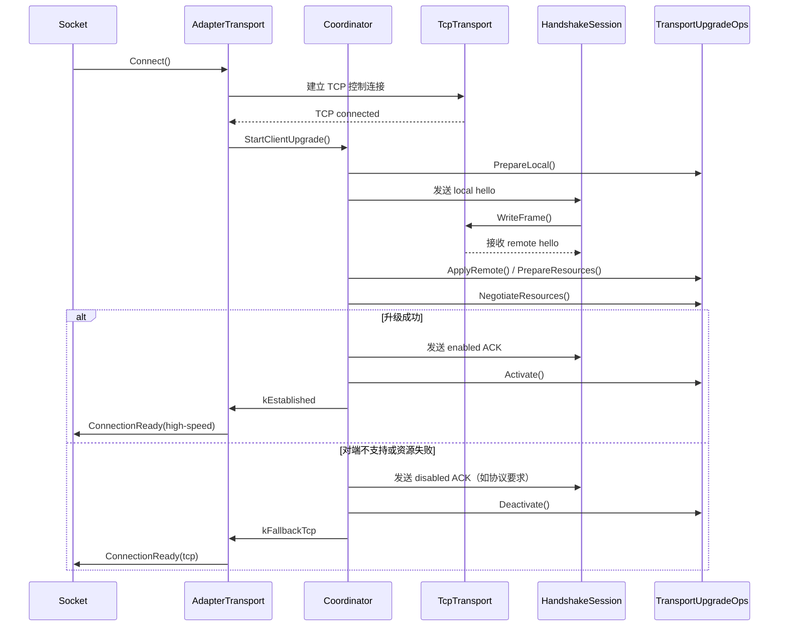
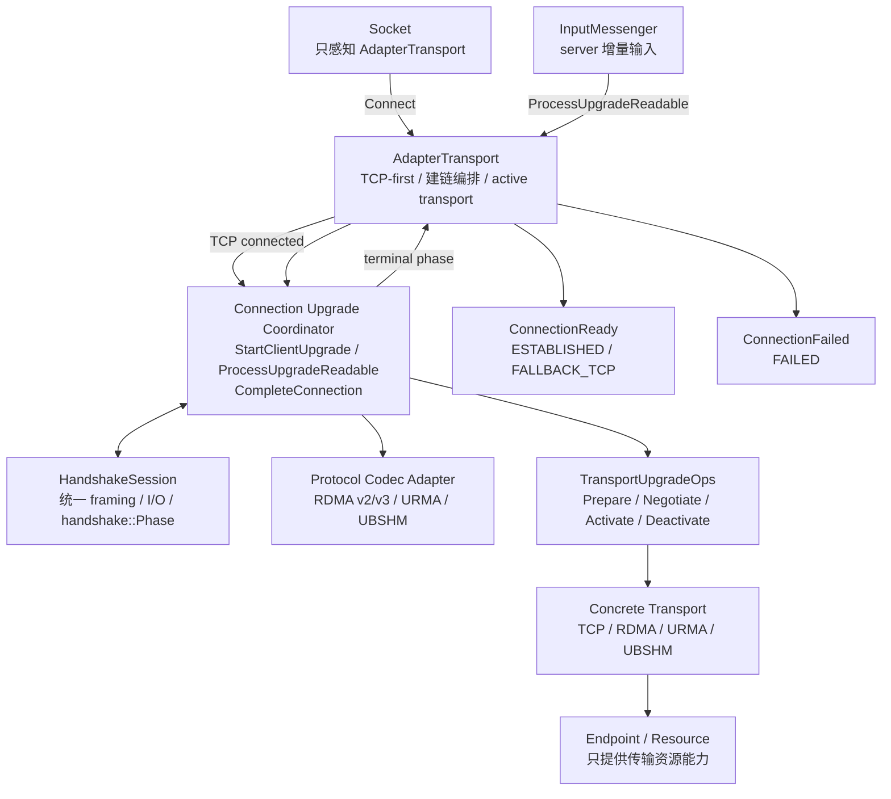

# RDMA、URMA、UBSHM 公共握手设计（修订版）

## 1. 文档目的

本文在现有公共 framing、`HandshakeSession` 和协议字段 adapter 的基础上，进一步明确四个职责边界：

1. `Socket` 只感知一个顶层 `AdapterTransport`，不感知 TCP、RDMA、URMA、UBSHM，也不感知握手 phase。
2. `AdapterTransport` 自动完成连接升级；升级成功或回退 TCP 后，统一通知 `Socket` 建链完成。
3. 具体 Transport 只提供握手所需的资源操作接口；握手顺序、状态转换和 fallback 由上层统一编排。
4. Transport 只负责数据传输和资源生命周期，不负责 TCP 建链、wire framing、握手状态机或握手流程编排。

本文只定义架构和迁移方向，不改变 RDMA/URMA/UBSHM 当前 wire format。

## 2. 当前问题

现有实现已经抽取了 `HandshakeSession`、`HandshakeCodec` 和公共 framing，但职责仍未完全收敛：

- `ProcessHandshakeAtClient` 仍位于具体 Transport 或 endpoint 路径中，client 的握手入口不统一。
- `RdmaTransport`、`UBShmTransport` 等仍通过各自的 `S_*` 常量暴露握手阶段；`HandshakePhases` 需要填入不同 transport 的 phase，公共 session 无法真正统一。
- server handshake adapter 需要通过 `Socket` 找到 `AdapterTransport`，再找到具体 Transport，并且直接驱动资源创建、激活和 fallback。
- `AdapterTransport` 虽然已经是 `Socket` 的顶层对象，但握手的 client/server 入口、连接完成通知和数据面切换仍分散在多个层次。
- “握手成功”与“Socket 建链完成”不是同一个明确事件，导致 TCP fallback、升级成功和异常退出的发布顺序难以验证。

根因是把“传输能力”和“建链流程”混在了一起。Transport 是被流程调用的参与者，不应成为流程的拥有者。

## 3. 目标架构

### 3.1 分层

```text
Socket
  |
  v
AdapterTransport                         Socket 唯一感知的 Transport
  |-- TcpTransport                       TCP 控制面和 fallback 数据面
  |-- HighSpeedTransport                 RDMA / URMA / UBSHM 数据面
  |-- ConnectionUpgradeCoordinator       统一的建链与升级编排
  |     |-- HandshakeSession              公共状态机、I/O、framing
  |     |-- HandshakeCodec                协议 wire 字段编解码
  |     |-- TransportUpgradeOps           被调用的资源阶段接口
  |     `-- SocketConnectionNotifier      建链完成/失败通知
  `-- ActiveTransport                    根据统一状态选择数据面
```

这里的 `ConnectionUpgradeCoordinator` 可以先作为 `AdapterTransport` 的内部实现，不要求立即新增独立公开类；重要的是职责必须集中在该层，而不是分散到具体 Transport。

### 3.2 依赖方向

```text
Socket -> AdapterTransport -> TcpTransport / HighSpeedTransport
Socket -> AdapterTransport -> ConnectionUpgradeCoordinator
ConnectionUpgradeCoordinator -> TransportUpgradeOps
ConnectionUpgradeCoordinator -> HandshakeSession
TransportUpgradeOps -> transport-specific endpoint/resource
```

禁止以下反向依赖：

- `Socket` 直接调用具体 Transport 或 handshake adapter。
- `TcpTransport` 调用具体高速度 Transport 的握手函数。
- `RdmaTransport`、`UrmaTransport`、`UBShmTransport` 调用 `ProcessHandshakeAtClient`、`RunServerHandshake` 等流程函数。
- 公共 `HandshakeSession` 依赖 `ibv_*`、`urma_*`、UBRING 类型。
- 具体 Transport 通过自定义 phase 影响 `Socket` 的建链判断。

## 4. 统一状态模型

### 4.1 握手状态由上层拥有

公共状态只描述连接升级流程，不描述某一种资源如何创建：

```cpp
namespace brpc {
namespace handshake {

enum class Phase {
    kUninitialized,
    kPreparing,
    kHelloSending,
    kHelloWaiting,
    kNegotiating,
    kAckSending,
    kAckWaiting,
    kEstablished,
    kFallbackTcp,
    kFailed,
};

enum class StepResult {
    kOk,
    kFallback,
    kNeedMore,
    kNotMine,
    kError,
};

}  // namespace handshake
}  // namespace brpc
```

`Socket` 和 `AdapterTransport` 只读取 `Phase` 的终态：`kEstablished`、`kFallbackTcp`、`kFailed`。中间状态只由 coordinator/session 使用。

### 4.2 删除 `HandshakePhases`

不再使用：

```cpp
struct HandshakePhases {
    int prepare_local;
    int hello_send;
    int hello_wait;
    int negotiate;
    int ack_send;
    int ack_wait;
};
```

原因是这些数字并不是协议字段，也不是数据面状态；它们只是历史实现中的日志/状态映射。公共 session 应使用固定的 `Phase`，具体 Transport 的资源子状态留在自身实现中，不向上暴露。

例如 RDMA 的 `S_ALLOC_QPCQ`、`S_BRINGUP_QP`、UBSHM 的 `S_ALLOC_SHM` 都只能是具体 Transport 的内部 debug 状态；它们不能再填入公共 `HandshakePhases`，也不能作为 `Socket` 判断建链完成的依据。

## 5. 模块职责

### 5.1 Socket

`Socket` 只保存和调用一个 `Transport*`，实际对象始终为 `AdapterTransport`。它只关心以下事件：

- TCP socket 是否连接成功；
- `AdapterTransport` 是否报告建链完成；
- 当前数据面读写是否可用；
- 连接是否失败或 EOF。

Socket 不直接读取 handshake phase，也不负责决定 TCP 还是高速度 Transport。

### 5.2 AdapterTransport

`AdapterTransport` 是顶层 Transport 和连接升级协调器的宿主，负责：

- 创建并持有 TCP Transport 和候选高速度 Transport；
- 建立 TCP 控制连接；
- 自动启动 client/server 的升级编排；
- 将 TCP 可读事件交给 coordinator，直到升级进入终态；
- 在 `kEstablished` 与 `kFallbackTcp` 之间选择 active data transport；
- 对升级结果执行一次性的连接完成通知；
- 保证 fallback 数据回放和状态发布的内存顺序。

建议的内部接口如下：

```cpp
class AdapterTransport : public Transport {
public:
    std::shared_ptr<AppConnect> Connect() override;
    void ProcessEvent(bthread_attr_t attr) override;

    // 由上层 Socket/连接流程使用，不暴露具体 Transport 类型。
    handshake::Phase connection_phase() const;

private:
    void StartClientUpgrade();
    void ProcessUpgradeReadable();
    void CompleteConnection(handshake::Phase terminal_phase);
    void ActivateTcp();
    void ActivateHighSpeed();

    handshake::HandshakeSession _handshake;
    std::unique_ptr<TcpTransport> _tcp_transport;
    std::unique_ptr<Transport> _high_speed_transport;
    std::unique_ptr<ConnectionUpgradeCoordinator> _upgrade;
};
```

`StartClientUpgrade` 和 `ProcessUpgradeReadable` 是上层编排入口。它们不能下沉到 `RdmaTransport`、`UBShmTransport` 或 endpoint。

### 5.3 ConnectionUpgradeCoordinator / HandshakeSession

该模块拥有连接升级的完整流程：

- 选择协议 codec；
- 通过 TCP 发送和接收 hello/ack；
- 增量 framing、半包和非本协议数据回放；
- 按固定顺序调用 Transport 能力接口；
- 将协议不支持、资源失败转换为 fallback；
- 发布 `kEstablished`、`kFallbackTcp` 或 `kFailed`；
- 在终态时通知 `AdapterTransport` 完成建链。

`HandshakeSession` 不知道 RDMA、URMA、UBSHM 的资源类型，只调用抽象的阶段接口。

### 5.4 具体 Transport

具体 Transport 只负责：

- 数据面读写、事件和 completion；
- 资源创建、导入、激活、停用和释放；
- 提供本端 hello 所需的只读能力/字段；
- 接收上层解析后的远端参数；
- 报告资源阶段成功、不可用或失败。

具体 Transport 不负责：

- TCP fd 读写；
- magic/length framing；
- hello/ack 的收发顺序；
- server 增量解析；
- fallback 决策；
- `Socket` 建链完成通知；
- 公共 handshake phase 的推进。

## 6. Transport 能力接口

Transport 提供的是“被上层调用的资源能力”，不是 handshake driver。建议抽象为以下接口；具体命名可根据现有类调整：

```cpp
class TransportUpgradeOps {
public:
    virtual ~TransportUpgradeOps() = default;

    // 返回本端能力和协议 adapter 所需的字段来源。
    virtual handshake::StepResult PrepareLocal() = 0;

    // 上层完成 wire parse/validate 后交付远端参数。
    virtual handshake::StepResult ApplyRemote(const RemoteParameters&) = 0;

    // 创建、导入或建立数据面资源。
    virtual handshake::StepResult PrepareResources() = 0;
    virtual handshake::StepResult NegotiateResources() = 0;

    // 握手 ACK 已发送/确认后切换数据面。
    virtual handshake::StepResult Activate() = 0;

    // fallback 或失败时关闭本次升级准备的资源。
    virtual void Deactivate() = 0;
};
```

说明：

- `PrepareLocal`、`ApplyRemote`、`PrepareResources`、`NegotiateResources` 的具体数量可以按现有资源模型合并，但调用顺序由 coordinator 固定。
- 只有 `TransportUpgradeOps` 的实现可以访问 endpoint 和 transport-specific 类型。
- 如果某种 Transport 不支持升级，应返回 `kFallback`，而不是创建一套假的握手状态机。
- `Activate` 成功后，coordinator 才能发布 `kEstablished`。
- 资源失败默认进入 `kFallbackTcp`；不可恢复的协议错误才进入 `kFailed`，具体策略由 coordinator 统一决定。

## 7. 协议 adapter 与公共编排的边界

每一种 wire protocol 保留自己的 `HandshakeCodec` 和字段 adapter：

```cpp
struct HandshakeCodec {
    int protocol_version;
    FrameSpec hello_frame;
    FrameSpec ack_frame;
    std::function<StepResult(bool, std::string*)> build_hello;
    std::function<StepResult(const std::string&)> parse_hello;
    std::function<StepResult(bool, std::string*)> build_ack;
    std::function<StepResult(const std::string&, bool*)> parse_ack;
};
```

adapter 只处理以下内容：

- magic、版本、字段序列化和反序列化；
- payload 合法性检查；
- 将字段转换为 `RemoteParameters`；
- 生成本端 hello 和 ack。

adapter 不再实现完整的 `RunServerHandshake` 或 `ProcessHandshakeAtClient`。这些函数中的流程代码应迁移到 coordinator；adapter 只提供 codec 和 `TransportUpgradeOps` 所需的字段转换。

server 端的 `HandshakeAdapter::ExecuteServerHandshake` 如果暂时需要保留以兼容 `InputMessenger`，其实现只能是薄适配层：

```text
InputMessenger -> AdapterTransport/Coordinator -> HandshakeSession
                                      |
                                      `-> protocol codec + TransportUpgradeOps
```

它不应再根据 `SocketMode` 选择不同的 phase，也不应直接调用具体 Transport 的握手流程。

## 8. Client 建链时序



关键约束：`ConnectionReady` 只发送一次，并且必须发生在 active transport 已设置、fallback 缓冲区已回放、终态已 release-store 之后。

## 9. Server 建链时序

server 收到 TCP 数据后，由 `AdapterTransport` 的上层 coordinator 处理；具体 Transport 不参与入口选择：

```text
TCP readable
  -> AdapterTransport::ProcessUpgradeReadable
  -> HandshakeSession::RunServer(input)
  -> 根据 magic 选择 codec
  -> 增量读取完整 hello
  -> codec parse/validate
  -> TransportUpgradeOps::ApplyRemote/NegotiateResources
  -> 发送 ACK
  -> Activate 或 Deactivate
  -> AdapterTransport::CompleteConnection
```

对于 `IOBuf` 增量输入：

- `kNeedMore` 时不得消费不完整 frame；
- magic 不匹配时必须把已检查的数据回放给 TCP parser；
- 已确认属于升级协议但资源失败时不能把完整握手 frame 当作普通 TCP 数据；
- ACK 没有 magic 时，选中的 codec 必须保存在 coordinator/session context 中，而不能依赖重新探测。

## 10. 连接终态与 Socket 通知

### 10.1 终态定义

| 终态 | active data transport | Socket 结果 | 说明 |
|---|---|---|---|
| `kEstablished` | 高速度 Transport | 建链完成 | `Activate()` 成功后发布 |
| `kFallbackTcp` | TCP Transport | 建链完成 | 协议不支持或资源不可用 |
| `kFailed` | 无 | 建链失败 | I/O、协议或不可恢复错误 |

`kFallbackTcp` 不是失败。它表示控制连接成功且连接可继续使用 TCP。

### 10.2 发布顺序

统一采用以下顺序：

```text
1. 设置 active transport
2. 回放 fallback 时已读但不属于握手的数据（仅 TCP fallback）
3. 发布终态 phase（release）
4. 通知 Socket::ConnectionReady / ConnectionFailed
```

事件线程观察到终态后，才能读取 active transport 和回放数据。禁止在 phase 发布后再修改 active transport。

### 10.3 TCP 数据保护

进入 `kEstablished` 后，TCP 只作为控制连接存在；如果收到额外 TCP 应用数据，应按协议错误处理，不能静默交给高速度数据面。进入 `kFallbackTcp` 后，后续数据全部交给 TCP Transport。

## 11. 现有实现迁移方案

### Phase 1：统一公共状态

- 用 `handshake::Phase` 替换 `HandshakePhases` 的六个 transport-specific 数值。
- `HandshakeSession` 只写入统一 phase。
- 保留具体 Transport 内部状态用于日志和资源调试，但不再通过 `handshake_phase()` 暴露给 Socket。

### Phase 2：收拢 client 入口

- 将所有 `ProcessHandshakeAtClient` 的调用点迁移到 `AdapterTransport::StartClientUpgrade`。
- 删除具体 Transport 中的 client handshake driver。
- 具体 Transport 改为实现 `TransportUpgradeOps`，只提供资源阶段操作。
- `AdapterTransport::Connect` 在 TCP connected 后自动启动 coordinator。

### Phase 3：收拢 server 入口

- `InputMessenger` 只把 handshake 输入交给 `AdapterTransport`/coordinator。
- `RdmaServerHandshakeAdapter`、`UBShmServerHandshakeAdapter` 等降级为 codec/字段 adapter 或薄兼容层。
- 删除 adapter 内按 `SocketMode` 选择 `S_ACK_WAIT` 等 phase 的逻辑。
- URMA 接入时直接实现统一的 codec 和 `TransportUpgradeOps`，不复制一套 server driver。

### Phase 4：统一连接完成通知

- 为 `AdapterTransport` 增加单一的 `CompleteConnection` 路径。
- 升级成功、TCP fallback、失败分别通过统一终态通知 Socket。
- 增加断言，确保 `ConnectionReady` 只发生一次，且发生在终态发布之后。

### Phase 5：删除旧路径

- 删除具体 Transport 的 `ProcessHandshakeAtClient`、`RunServerHandshake` 和握手 phase 映射。
- 删除 Socket 对具体 Transport 类型和 transport-specific phase 的依赖。
- 清理只为旧握手路径存在的 endpoint 回调。

## 12. 兼容性与测试要求

### 12.1 Wire compatibility

重构不得改变：

- RDMA v2/v3、URMA v2/v3、UBSHM v2 的 magic；
- frame length 的字节序和语义；
- hello/ack 的字段布局和 ACK bit；
- fallback hello 的兼容行为。

### 12.2 公共模块测试

至少覆盖：

- 2 字节和 4 字节 magic；
- fixed、U16 total length、U32 body length；
- 半包、粘包和多余数据；
- `kNeedMore` 不消费不完整输入；
- magic 不匹配的 push-back；
- I/O error、EOF、超时和协议错误；
- 终态发布顺序和一次性连接通知。

### 12.3 集成矩阵

| 场景 | 预期结果 |
|---|---|
| RDMA v2 ↔ RDMA v2 | 高速度 Transport 建链 |
| RDMA v3 ↔ RDMA v3 | 高速度 Transport 建链 |
| URMA v2/v3 ↔ 对应版本 | 高速度 Transport 建链 |
| UBSHM ↔ UBSHM | UBSHM 建链 |
| 高速度 client ↔ TCP server | TCP fallback，Socket 建链成功 |
| TCP client ↔ 高速度 server | TCP 建链成功 |
| hello 合法但资源创建失败 | TCP fallback |
| 已识别握手协议后发生协议错误 | 建链失败，不回放为 TCP 数据 |

## 13. 验收标准

设计落地后应满足：

1. `Socket::_transport` 永远只指向 `AdapterTransport`，Socket 源码中没有具体 Transport 类型判断。
2. client 和 server 都只有一个握手编排入口，代码库中不再存在具体 Transport 的 `ProcessHandshakeAtClient`。
3. 公共握手状态只有一套 `handshake::Phase`，不存在 RDMA/UBSHM/URMA 到公共 phase 的数字映射。
4. 具体 Transport 不读写 TCP fd，不解析 magic/length，不调用 `HandshakeSession::RunClient/RunServer`。
5. 升级成功和 TCP fallback 都由 `AdapterTransport` 自动完成 active transport 切换，并向 Socket 发出一次建链完成通知。
6. 在 wire compatibility 测试通过的前提下，握手流程、fallback 和连接完成通知可以通过公共 coordinator 单元测试验证。

## 14. 结论

最终边界如下：

```text
Socket
  只感知 AdapterTransport 和 ConnectionReady

AdapterTransport / Coordinator
  拥有 TCP-first、握手状态机、升级/fallback 编排、active transport 切换

HandshakeSession / Codec
  拥有公共 I/O、framing、协议字段编解码和统一状态

TransportUpgradeOps
  提供具体传输所需的资源阶段接口

RDMA / URMA / UBSHM Transport
  只拥有各自资源、数据面和 completion
```

一句话概括：**握手是上层连接编排，Transport 是被编排的数据传输能力；Socket 只通过 AdapterTransport 观察连接结果。**
## 15. 整体架构图



核心边界：`HandshakeSession` 负责公共握手流程，协议 Adapter 只负责 wire codec，`TransportUpgradeOps` 只负责资源能力；具体 Transport 不读取握手输入、不编排握手阶段，也不向 Socket 暴露 transport-specific phase。
