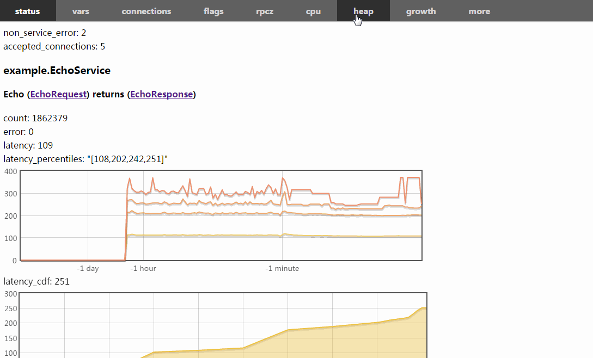
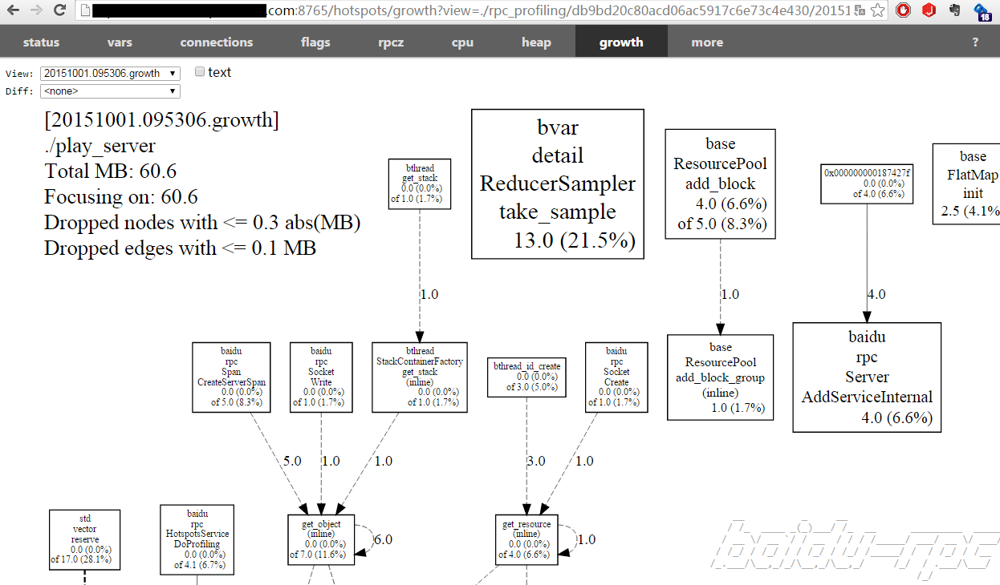

brpc可以分析内存是被哪些函数占据的。heap profiler的原理是每分配满一些内存就采样调用处的栈，“一些”由环境变量TCMALLOC_SAMPLE_PARAMETER控制，默认524288，即512K字节。根据栈表现出的函数调用关系汇总为我们看到的结果图。在实践中heap profiler对原程序的影响不明显。

# 开启方法

1. 链接`libtcmalloc_and_profiler.a`

   1. 如果tcmalloc使用frame pointer而不是libunwind回溯栈，请确保在CXXFLAGS或CFLAGS中加上`-fno-omit-frame-pointer`，否则函数间的调用关系会丢失，最后产生的图片中都是彼此独立的函数方框。

2. 在shell中`export TCMALLOC_SAMPLE_PARAMETER=524288`。该变量指每分配这么多字节内存时做一次统计，默认为0，代表不开启内存统计。[官方文档](http://goog-perftools.sourceforge.net/doc/tcmalloc.html)建议设置为524288。这个变量也可在运行前临时设置，如`TCMALLOC_SAMPLE_PARAMETER=524288 ./server`。如果没有这个环境变量，可能会看到这样的结果：

   ```
   $ tools/pprof --text localhost:9002/pprof/heap           
   Fetching /pprof/heap profile from http://localhost:9002/pprof/heap to
     /home/gejun/pprof/echo_server.1419559063.localhost.pprof.heap
   Wrote profile to /home/gejun/pprof/echo_server.1419559063.localhost.pprof.heap
   /home/gejun/pprof/echo_server.1419559063.localhost.pprof.heap: header size >= 2**16
   ```

3. 如果只是brpc client或没有使用brpc，看[这里](dummy_server.md)。 

注意要关闭Server端的认证，否则可能会看到这个：

```
$ tools/pprof --text localhost:9002/pprof/heap
Use of uninitialized value in substitution (s///) at tools/pprof line 2703.
http://localhost:9002/pprof/symbol doesn't exist
```

server端可能会有这样的日志：

```
FATAL: 12-26 10:01:25:   * 0 [src/brpc/policy/giano_authenticator.cpp:65][4294969345] Giano fails to verify credentical, 70003
WARNING: 12-26 10:01:25:   * 0 [src/brpc/input_messenger.cpp:132][4294969345] Authentication failed, remote side(127.0.0.1:22989) of sockfd=5, close it
```

# 图示


左上角是当前程序通过malloc分配的内存总量，顺着箭头上的数字可以看到内存来自哪些函数。

点击左上角的text选择框可以查看文本格式的结果，有时候这种按分配量排序的形式更方便。


左上角的两个选择框作用分别是：

- View：当前正在看的profile。选择\<new profile\>表示新建一个。新建完毕后，View选择框中会出现新profile，URL也会被修改为对应的地址。这意味着你可以通过粘贴URL分享结果，点击链接的人将看到和你一模一样的结果，而不是重做profiling的结果。你可以在框中选择之前的profile查看。历史profiie保留最近的32个，可通过[--max_profiles_kept](http://brpc.baidu.com:8765/flags/max_profiles_kept)调整。
- Diff：和选择的profile做对比。<none>表示什么都不选。如果你选择了之前的某个profile，那么将看到View框中的profile相比Diff框中profile的变化量。

下图演示了勾选Diff和Text的效果。



在Linux下，你也可以使用pprof脚本（tools/pprof）在命令行中查看文本格式结果：

```
$ tools/pprof --text db-rpc-dev00.db01:8765/pprof/heap    
Fetching /pprof/heap profile from http://db-rpc-dev00.db01:8765/pprof/heap to
  /home/gejun/pprof/play_server.1453216025.db-rpc-dev00.db01.pprof.heap
Wrote profile to /home/gejun/pprof/play_server.1453216025.db-rpc-dev00.db01.pprof.heap
Adjusting heap profiles for 1-in-524288 sampling rate
Heap version 2
Total: 38.9 MB
    35.8  92.0%  92.0%     35.8  92.0% ::cpp_alloc
     2.1   5.4%  97.4%      2.1   5.4% butil::FlatMap
     0.5   1.3%  98.7%      0.5   1.3% butil::IOBuf::append
     0.5   1.3% 100.0%      0.5   1.3% butil::IOBufAsZeroCopyOutputStream::Next
     0.0   0.0% 100.0%      0.6   1.5% MallocExtension::GetHeapSample
     0.0   0.0% 100.0%      0.5   1.3% ProfileHandler::Init
     0.0   0.0% 100.0%      0.5   1.3% ProfileHandlerRegisterCallback
     0.0   0.0% 100.0%      0.5   1.3% __do_global_ctors_aux
     0.0   0.0% 100.0%      1.6   4.2% _end
     0.0   0.0% 100.0%      0.5   1.3% _init
     0.0   0.0% 100.0%      0.6   1.5% brpc::CloseIdleConnections
     0.0   0.0% 100.0%      1.1   2.9% brpc::GlobalUpdate
     0.0   0.0% 100.0%      0.6   1.5% brpc::PProfService::heap
     0.0   0.0% 100.0%      1.9   4.9% brpc::Socket::Create
     0.0   0.0% 100.0%      2.9   7.4% brpc::Socket::Write
     0.0   0.0% 100.0%      3.8   9.7% brpc::Span::CreateServerSpan
     0.0   0.0% 100.0%      1.4   3.5% brpc::SpanQueue::Push
     0.0   0.0% 100.0%      1.9   4.8% butil::ObjectPool
     0.0   0.0% 100.0%      0.8   2.0% butil::ResourcePool
     0.0   0.0% 100.0%      1.0   2.6% butil::iobuf::tls_block
     0.0   0.0% 100.0%      1.0   2.6% bthread::TimerThread::Bucket::schedule
     0.0   0.0% 100.0%      1.6   4.1% bthread::get_stack
     0.0   0.0% 100.0%      4.2  10.8% bthread_id_create
     0.0   0.0% 100.0%      1.1   2.9% bvar::Variable::describe_series_exposed
     0.0   0.0% 100.0%      1.0   2.6% bvar::detail::AgentGroup
     0.0   0.0% 100.0%      0.5   1.3% bvar::detail::Percentile::operator
     0.0   0.0% 100.0%      0.5   1.3% bvar::detail::PercentileSamples
     0.0   0.0% 100.0%      0.5   1.3% bvar::detail::Sampler::schedule
     0.0   0.0% 100.0%      6.5  16.8% leveldb::Arena::AllocateNewBlock
     0.0   0.0% 100.0%      0.5   1.3% leveldb::VersionSet::LogAndApply
     0.0   0.0% 100.0%      4.2  10.8% pthread_mutex_unlock
     0.0   0.0% 100.0%      0.5   1.3% pthread_once
     0.0   0.0% 100.0%      0.5   1.3% std::_Rb_tree
     0.0   0.0% 100.0%      1.5   3.9% std::basic_string
     0.0   0.0% 100.0%      3.5   9.0% std::string::_Rep::_S_create
```

brpc还提供一个类似的growth profiler分析内存的分配去向（不考虑释放）。 



# MacOS的额外配置

1. 安装[standalone pprof](https://github.com/google/pprof)，并把下载的pprof二进制文件路径写入环境变量GOOGLE_PPROF_BINARY_PATH中
2. 安装llvm-symbolizer（将函数符号转化为函数名），直接用brew安装即可：`brew install llvm`
