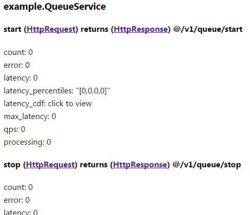

[English version](../en/http_service.md)

这里指我们通常说的http/h2服务，而不是可通过http/h2访问的pb服务。

虽然用不到pb消息，但brpc中的http/h2服务接口也得定义在proto文件中，只是request和response都是空的结构体。这确保了所有的服务声明集中在proto文件中，而不是散列在proto文件、程序、配置等多个地方。

#示例
[http_server.cpp](https://github.com/apache/brpc/blob/master/example/http_c++/http_server.cpp)。

# 关于h2

brpc把HTTP/2协议统称为"h2"，不论是否加密。然而未开启ssl的HTTP/2连接在/connections中会按官方名称h2c显示，而开启ssl的会显示为h2。

brpc中http和h2的编程接口基本没有区别。除非特殊说明，所有提到的http特性都同时对h2有效。

# URL类型

## 前缀为/ServiceName/MethodName

定义一个service名为ServiceName(不包含package名), method名为MethodName的pb服务，且让request和response定义为空，则该服务默认在/ServiceName/MethodName上提供http/h2服务。

request和response可为空是因为数据都在Controller中：

* http/h2 request的header在Controller.http_request()中，body在Controller.request_attachment()中。
* http/h2 response的header在Controller.http_response()中，body在Controller.response_attachment()中。

实现步骤如下：

1. 填写proto文件。

```protobuf
option cc_generic_services = true;
 
message HttpRequest { };
message HttpResponse { };
 
service HttpService {
      rpc Echo(HttpRequest) returns (HttpResponse);
};
```

2. 实现Service接口。和pb服务一样，也是继承定义在.pb.h中的service基类。

```c++
class HttpServiceImpl : public HttpService {
public:
    ...
    virtual void Echo(google::protobuf::RpcController* cntl_base,
                      const HttpRequest* /*request*/,
                      HttpResponse* /*response*/,
                      google::protobuf::Closure* done) {
        brpc::ClosureGuard done_guard(done);
        brpc::Controller* cntl = static_cast<brpc::Controller*>(cntl_base);
 
        // body是纯文本
        cntl->http_response().set_content_type("text/plain");
       
        // 把请求的query-string和body打印结果作为回复内容。
        butil::IOBufBuilder os;
        os << "queries:";
        for (brpc::URI::QueryIterator it = cntl->http_request().uri().QueryBegin();
                it != cntl->http_request().uri().QueryEnd(); ++it) {
            os << ' ' << it->first << '=' << it->second;
        }
        os << "\nbody: " << cntl->request_attachment() << '\n';
        os.move_to(cntl->response_attachment());
    }
};
```

3. 把实现好的服务插入Server后可通过如下URL访问，/HttpService/Echo后的部分在 cntl->http_request().unresolved_path()中。

| URL                        | 访问方法             | cntl->http_request().uri().path() | cntl->http_request().unresolved_path() |
| -------------------------- | ---------------- | --------------------------------- | -------------------------------------- |
| /HttpService/Echo          | HttpService.Echo | "/HttpService/Echo"               | ""                                     |
| /HttpService/Echo/Foo      | HttpService.Echo | "/HttpService/Echo/Foo"           | "Foo"                                  |
| /HttpService/Echo/Foo/Bar  | HttpService.Echo | "/HttpService/Echo/Foo/Bar"       | "Foo/Bar"                              |
| /HttpService//Echo///Foo// | HttpService.Echo | "/HttpService//Echo///Foo//"      | "Foo"                                  |
| /HttpService               | 访问错误             |                                   |                                        |

## 前缀为/ServiceName

资源类的http/h2服务可能需要这样的URL，ServiceName后均为动态内容。比如/FileService/foobar.txt代表./foobar.txt，/FileService/app/data/boot.cfg代表./app/data/boot.cfg。

实现方法：

1. proto文件中应以FileService为服务名，以default_method为方法名。

```protobuf
option cc_generic_services = true;

message HttpRequest { };
message HttpResponse { };

service FileService {
      rpc default_method(HttpRequest) returns (HttpResponse);
}
```

2. 实现Service。

```c++
class FileServiceImpl: public FileService {
public:
    ...
    virtual void default_method(google::protobuf::RpcController* cntl_base,
                                const HttpRequest* /*request*/,
                                HttpResponse* /*response*/,
                                google::protobuf::Closure* done) {
        brpc::ClosureGuard done_guard(done);
        brpc::Controller* cntl = static_cast<brpc::Controller*>(cntl_base);
        cntl->response_attachment().append("Getting file: ");
        cntl->response_attachment().append(cntl->http_request().unresolved_path());
    }
};
```

3. 实现完毕插入Server后可通过如下URL访问，/FileService之后的路径在cntl->http_request().unresolved_path()中i。

| URL                             | 访问方法                       | cntl->http_request().uri().path() | cntl->http_request().unresolved_path() |
| ------------------------------- | -------------------------- | --------------------------------- | -------------------------------------- |
| /FileService                    | FileService.default_method | "/FileService"                    | ""                                     |
| /FileService/123.txt            | FileService.default_method | "/FileService/123.txt"            | "123.txt"                              |
| /FileService/mydir/123.txt      | FileService.default_method | "/FileService/mydir/123.txt"      | "mydir/123.txt"                        |
| /FileService//mydir///123.txt// | FileService.default_method | "/FileService//mydir///123.txt//" | "mydir/123.txt"                        |

## Restful URL

brpc支持为service中的每个方法指定一个URL。API如下：

```c++
// 如果restful_mappings不为空, service中的方法可通过指定的URL被http/h2协议访问，而不是/ServiceName/MethodName.
// 映射格式："PATH1 => NAME1, PATH2 => NAME2 ..."
// PATHs是有效的路径, NAMEs是service中的方法名.
int AddService(google::protobuf::Service* service,
               ServiceOwnership ownership,
               butil::StringPiece restful_mappings);
```

下面的QueueService包含多个方法。如果我们像之前那样把它插入server，那么只能通过`/QueueService/start, /QueueService/stop`等url来访问。

```protobuf
service QueueService {
    rpc start(HttpRequest) returns (HttpResponse);
    rpc stop(HttpRequest) returns (HttpResponse);
    rpc get_stats(HttpRequest) returns (HttpResponse);
    rpc download_data(HttpRequest) returns (HttpResponse);
};
```

而在调用AddService时指定第三个参数(restful_mappings)就能定制URL了，如下所示：

```c++
if (server.AddService(&queue_svc,
                      brpc::SERVER_DOESNT_OWN_SERVICE,
                      "/v1/queue/start   => start,"
                      "/v1/queue/stop    => stop,"
                      "/v1/queue/stats/* => get_stats") != 0) {
    LOG(ERROR) << "Fail to add queue_svc";
    return -1;
}
 
// 星号可出现在中间
if (server.AddService(&queue_svc,
                      brpc::SERVER_DOESNT_OWN_SERVICE,
                      "/v1/*/start   => start,"
                      "/v1/*/stop    => stop,"
                      "*.data        => download_data") != 0) {
    LOG(ERROR) << "Fail to add queue_svc";
    return -1;
}
```

上面代码中AddService的第三个参数分了三行，但实际上是一个字符串。这个字符串包含以逗号(,)分隔的三个映射关系，每个映射告诉brpc：在遇到箭头左侧的URL时调用右侧的方法。"/v1/queue/stats/*"中的星号可匹配任意字串。

关于映射规则：

- 多个路径可映射至同一个方法。
- service不要求是纯http/h2，pb service也支持。
- 没有出现在映射中的方法仍旧通过/ServiceName/MethodName访问。出现在映射中的方法不再能通过/ServiceName/MethodName访问。
- ==> ===> ...都是可以的。开头结尾的空格，额外的斜杠(/)，最后多余的逗号，都不要紧。
- PATH和PATH/*两者可以共存。
- 支持后缀匹配: 星号后可以有更多字符。
- 一个路径中只能出现一个星号。

`cntl.http_request().unresolved_path()` 对应星号(*)匹配的部分，保证normalized：开头结尾都不包含斜杠(/)，中间斜杠不重复。比如：


或


unresolved_path都是`"foo/bar"`，左右、中间多余的斜杠被移除了。

 注意：`cntl.http_request().uri().path()`不保证normalized，这两个例子中分别为`"//v1//queue//stats//foo///bar//////"`和`"//vars///foo////bar/////"`

/status页面上的方法名后会加上所有相关的URL，形式是：@URL1 @URL2 ...



# HTTP参数

## HTTP headers

http header是一系列key/value对，有些由HTTP协议规定有特殊含义，其余则由用户自由设定。

query string也是key/value对，http headers与query string的区别:

* 虽然http headers由协议准确定义操作方式，但由于也不易在地址栏中被修改，常用于传递框架或协议层面的参数。
* query string是URL的一部分，**常见**形式是key1=value1&key2=value2&…，易于阅读和修改，常用于传递应用层参数。但query string的具体格式并不是HTTP规范的一部分，只是约定成俗。

```c++
// 获得header中"User-Agent"的值，大小写不敏感。
const std::string* user_agent_str = cntl->http_request().GetHeader("User-Agent");
if (user_agent_str != NULL) {  // has the header
    LOG(TRACE) << "User-Agent is " << *user_agent_str;
}
...
 
// 在header中增加"Accept-encoding: gzip"，大小写不敏感。
cntl->http_response().SetHeader("Accept-encoding", "gzip");
// 覆盖为"Accept-encoding: deflate"
cntl->http_response().SetHeader("Accept-encoding", "deflate");
// 增加一个value，逗号分隔，变为"Accept-encoding: deflate,gzip"
cntl->http_response().AppendHeader("Accept-encoding", "gzip");
```

## Content-Type

Content-type记录body的类型，是一个使用频率较高的header。它在brpc中被特殊处理，需要通过cntl->http_request().content_type()来访问，cntl->GetHeader("Content-Type")是获取不到的。

```c++
// Get Content-Type
if (cntl->http_request().content_type() == "application/json") {
    ...
}
...
// Set Content-Type
cntl->http_response().set_content_type("text/html");
```

如果RPC失败(Controller被SetFailed), Content-Type会框架强制设为text/plain，而response body设为Controller::ErrorText()。

## Status Code

status code是http response特有的字段，标记http请求的完成情况。可能的值定义在[http_status_code.h](https://github.com/apache/brpc/blob/master/src/brpc/http_status_code.h)中。

```c++
// Get Status Code
if (cntl->http_response().status_code() == brpc::HTTP_STATUS_NOT_FOUND) {
    LOG(FATAL) << "FAILED: " << controller.http_response().reason_phrase();
}
...
// Set Status code
cntl->http_response().set_status_code(brpc::HTTP_STATUS_INTERNAL_SERVER_ERROR);
cntl->http_response().set_status_code(brpc::HTTP_STATUS_INTERNAL_SERVER_ERROR, "My explanation of the error...");
```

比如，以下代码以302错误实现重定向：

```c++
cntl->http_response().set_status_code(brpc::HTTP_STATUS_FOUND);
cntl->http_response().SetHeader("Location", "http://bj.bs.bae.baidu.com/family/image001(4979).jpg");
```


## Query String

如上面的[HTTP headers](#http-headers)中提到的那样，我们按约定成俗的方式来理解query string，即key1=value1&key2=value2&...。只有key而没有value也是可以的，仍然会被GetQuery查询到，只是值为空字符串，这常被用做bool型的开关。接口定义在[uri.h](https://github.com/apache/brpc/blob/master/src/brpc/uri.h)。

```c++
const std::string* time_value = cntl->http_request().uri().GetQuery("time");
if (time_value != NULL) {  // the query string is present
    LOG(TRACE) << "time = " << *time_value;
}

...
cntl->http_request().uri().SetQuery("time", "2015/1/2");
```

# 调试

打开[-http_verbose](http://brpc.baidu.com:8765/flags/http_verbose)即可看到所有的http/h2 request和response，注意这应该只用于线下调试，而不是线上程序。

# 压缩response body

http服务常对http body进行压缩，可以有效减少网页的传输时间，加快页面的展现速度。

设置Controller::set_response_compress_type(brpc::COMPRESS_TYPE_GZIP)后将**尝试**用gzip压缩http body。“尝试“指的是压缩有可能不发生，条件有：

- 请求中没有设置Accept-encoding或不包含gzip。比如curl不加--compressed时是不支持压缩的，这时server总是会返回不压缩的结果。

- body尺寸小于-http_body_compress_threshold指定的字节数，默认是512。gzip并不是一个很快的压缩算法，当body较小时，压缩增加的延时可能比网络传输省下的还多。当包较小时不做压缩可能是个更好的选项。

  | Name                         | Value | Description                              | Defined At                            |
  | ---------------------------- | ----- | ---------------------------------------- | ------------------------------------- |
  | http_body_compress_threshold | 512   | Not compress http body when it's less than so many bytes. | src/brpc/policy/http_rpc_protocol.cpp |

# 解压request body

出于通用性考虑且解压代码不复杂，brpc不会自动解压request body，用户可以自己做，方法如下：

```c++
#include <brpc/policy/gzip_compress.h>
...
const std::string* encoding = cntl->http_request().GetHeader("Content-Encoding");
if (encoding != NULL && *encoding == "gzip") {
    butil::IOBuf uncompressed;
    if (!brpc::policy::GzipDecompress(cntl->request_attachment(), &uncompressed)) {
        LOG(ERROR) << "Fail to un-gzip request body";
        return;
    }
    cntl->request_attachment().swap(uncompressed);
}
// cntl->request_attachment()中已经是解压后的数据了
```

# 处理https请求
https是http over SSL的简称，SSL并不是http特有的，而是对所有协议都有效。开启服务端SSL的一般性方法见[这里](server.md#开启ssl)。

# 性能

没有极端性能要求的产品都有使用HTTP协议的倾向，特别是移动产品，所以我们很重视HTTP的实现质量，具体来说：

- 使用了node.js的[http parser](https://github.com/apache/brpc/blob/master/src/brpc/details/http_parser.h)解析http消息，这是一个轻量、优秀、被广泛使用的实现。
- 使用[rapidjson](https://github.com/miloyip/rapidjson)解析json，这是一个主打性能的json库。
- 在最差情况下解析http请求的时间复杂度也是O(N)，其中N是请求的字节数。反过来说，如果解析代码要求http请求是完整的，那么它可能会花费O(N^2)的时间。HTTP请求普遍较大，这一点意义还是比较大的。
- 来自不同client的http消息是高度并发的，即使相当复杂的http消息也不会影响对其他客户端的响应。其他rpc和[基于单线程reactor](threading_overview.md#单线程reactor)的各类http server往往难以做到这一点。

# 持续发送

brpc server支持发送超大或无限长的body。方法如下:

1. 调用Controller::CreateProgressiveAttachment()创建可持续发送的body。返回的ProgressiveAttachment对象需要用intrusive_ptr管理。
  ```c++
  #include <brpc/progressive_attachment.h>
  ...
  butil::intrusive_ptr<brpc::ProgressiveAttachment> pa = cntl->CreateProgressiveAttachment();
  ```

2. 调用ProgressiveAttachment::Write()发送数据。

   * 如果写入发生在server-side done调用前，发送的数据将会被缓存直到回调结束后才会开始发送。
   * 如果写入发生在server-side done调用后，发送的数据将立刻以chunked mode写出。

3. 发送完毕后确保所有的`butil::intrusive_ptr<brpc::ProgressiveAttachment>`都析构以释放资源。

另外，利用该特性可以轻松实现Server-Sent Events(SSE)服务，从而使客户端能够通过 HTTP 连接从服务器自动接收更新。非常适合构建诸如chatGPT这类实时应用程序，应用例子详见[http_server.cpp](https://github.com/apache/brpc/blob/master/example/http_c++/http_server.cpp)中的HttpSSEServiceImpl。

# 持续接收

目前brpc server不支持在收齐http请求的header部分后就调用服务回调，即brpc server不适合接收超长或无限长的body。

# FAQ

### Q: brpc前的nginx报了final fail

这个错误在于brpc server直接关闭了http连接而没有发送任何回复。

brpc server一个端口支持多种协议，当它无法解析某个http请求时无法说这个请求一定是HTTP。server会对一些基本可确认是HTTP的请求返回HTTP 400错误并关闭连接，但如果是HTTP method错误(在http包开头)或严重的格式错误（可能由HTTP client的bug导致），server仍会直接断开连接，导致nginx的final fail。

解决方案: 在使用Nginx转发流量时，通过指定$HTTP_method只放行允许的方法或者干脆设置proxy_method为指定方法。

### Q: brpc支持http chunked方式传输吗

支持。

### Q: HTTP请求的query string中含有BASE64编码过的value，为什么有时候无法正常解析

根据[HTTP协议](http://tools.ietf.org/html/rfc3986#section-2.2)中的要求，以下字符应该使用%编码

```
       reserved    = gen-delims / sub-delims

       gen-delims  = ":" / "/" / "?" / "#" / "[" / "]" / "@"

       sub-delims  = "!" / "$" / "&" / "'" / "(" / ")"
                   / "*" / "+" / "," / ";" / "="
```

但Base64 编码后的字符串中，会以"="或者"=="作为结尾，比如: ?wi=NDgwMDB8dGVzdA==&anothorkey=anothervalue。这个字段可能会被正确解析，也可能不会，取决于具体实现，原则上不应做任何假设.

一个解决方法是删除末尾的"=", 不影响Base64的[正常解码](http://en.wikipedia.org/wiki/Base64#Padding); 第二个方法是在对这个URI做[percent encoding](https://en.wikipedia.org/wiki/Percent-encoding)，解码时先做percent decoding再用Base64.
