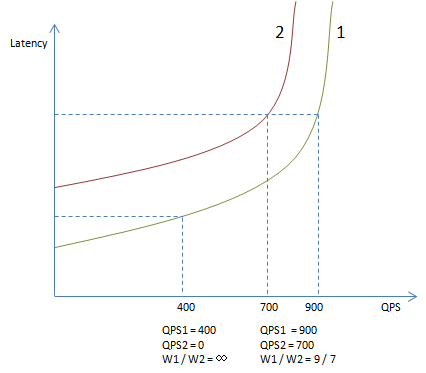
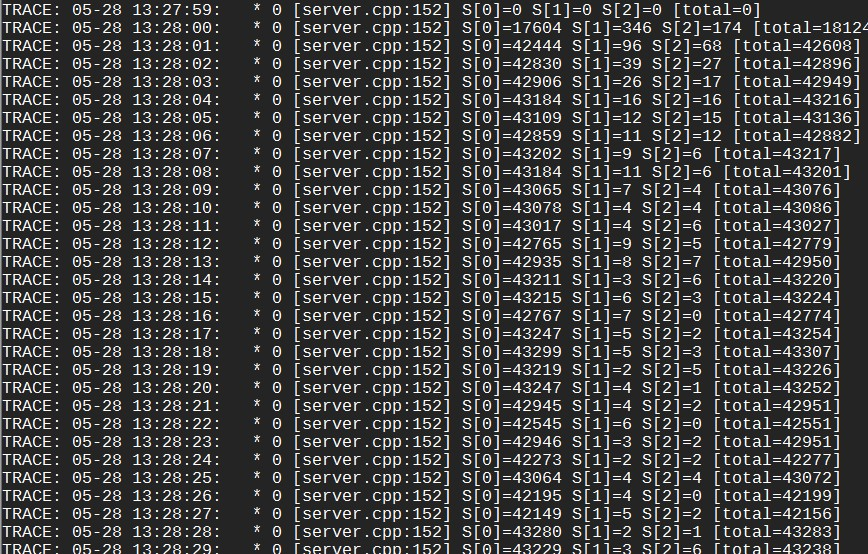
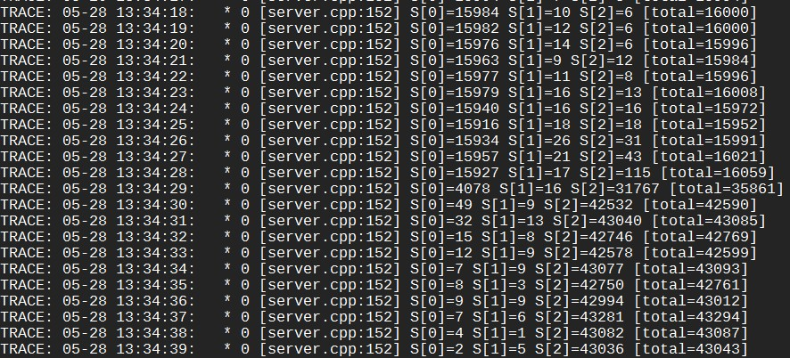
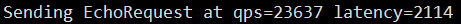
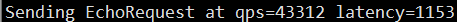

# 概述

LALB全称Locality-aware load balancing，是一个能把请求及时、自动地送到延时最低的下游的负载均衡算法，特别适合混合部署环境。该算法产生自DP系统，现已加入brpc！

LALB可以解决的问题：

- 下游的机器配置不同，访问延时不同，round-robin和随机分流效果不佳。
- 下游服务和离线服务或其他服务混部，性能难以预测。
- 自动地把大部分流量送给同机部署的模块，当同机模块出问题时，再跨机器。
- 优先访问本机房服务，出问题时再跨机房。

**…**

# 背景

最常见的分流算法是round robin和随机。这两个方法的前提是下游的机器和网络都是类似的，但在目前的线上环境下，特别是混部的产品线中，已经很难成立，因为：

- 每台机器运行着不同的程序组合，并伴随着一些离线任务，机器的可用资源在持续动态地变化着。
- 机器配置不同。
- 网络延时不同。

这些问题其实一直有，但往往被OP辛勤的机器监控和替换给隐藏了。框架层面也有过一些努力，比如UB中的[WeightedStrategy](https://svn.baidu.com/public/trunk/ub/ub_client/ubclient_weightstrategy.h)是根据下游的cpu占用率来进行分流，但明显地它解决不了延时相关的问题，甚至cpu的问题也解决不了：因为它被实现为定期reload一个权值列表，可想而知更新频率高不了，等到负载均衡反应过来，一大堆请求可能都超时了。并且这儿有个数学问题：怎么把cpu占用率转为权值。假设下游差异仅仅由同机运行的其他程序导致，机器配置和网络完全相同，两台机器权值之比是cpu idle之比吗？假如是的，当我们以这个比例给两台机器分流之后，它们的cpu idle应该会更接近对吧？而这会导致我们的分流比例也变得接近，从而使两台机器的cpu idle又出现差距。你注意到这个悖论了吗？这些因素使得这类算法的实际效果和那两个基本算法没什么差距，甚至更差，用者甚少。

我们需要一个能自适应下游负载、规避慢节点的通用分流算法。

# Locality-aware

在DP 2.0中我们使用了一种新的算法: Locality-aware load balancing，能根据下游节点的负载分配流量，还能快速规避失效的节点，在很大程度上，这种算法的延时也是全局最优的。基本原理非常简单：

> 以下游节点的吞吐除以延时作为分流权值。

比如只有两台下游节点，W代表权值，QPS代表吞吐，L代表延时，那么W1 = QPS1 / L1和W2 = QPS2 / L2分别是这两个节点的分流权值，分流时随机数落入的权值区间就是流量的目的地了。

一种分析方法如下：

- 稳定状态时的QPS显然和其分流权值W成正比，即W1 / W2 ≈ QPS1 / QPS2。
- 根据分流公式又有：W1 / W2 = QPS1 / QPS2 * (L2 / L1)。

故稳定状态时L1和L2应当是趋同的。当L1小于L2时，节点1会更获得相比其QPS1更大的W1，从而在未来获得更多的流量，直到**其延时高于平均值或没有更多的流量。**

注意这个算法并不是按照延时的比例来分流，不是说一个下游30ms，另一个60ms，它们的流量比例就是60 / 30。而是30ms的节点会一直获得流量直到它的延时高于60ms，或者没有更多流量了。以下图为例，曲线1和曲线2分别是节点1和节点2的延时与吞吐关系图，随着吞吐增大延时会逐渐升高，接近极限吞吐时，延时会飙升。左下的虚线标记了QPS=400时的延时，此时虽然节点1的延时有所上升，但还未高于节点2的基本延时（QPS=0时的延时），所以所有流量都会分给节点1，而不是按它们基本延时的比例（图中大约2:1）。当QPS继续上升达到1600时，分流比例会在两个节点延时相等时平衡，图中为9 : 7。很明显这个比例是高度非线性的，取决于不同曲线的组合，和单一指标的比例关系没有直接关联。在真实系统中，延时和吞吐的曲线也在动态变化着，分流比例更加动态。

我们用一个例子来看一下具体的分流过程。启动3台server，逻辑分别是sleep 1ms，2ms，3ms，对于client来说这些值就是延时。启动client（50个同步访问线程）后每秒打印的分流结果如下：

S[n]代表第n台server。由于S[1]和S[2]的平均延时大于1ms，LALB会发现这点并降低它们的权值。它们的权值会继续下降，直到被算法设定的最低值拦住。这时停掉server，反转延时并重新启动，即逻辑分别为sleep 3ms，2ms，1ms，运行一段时候后分流效果如下：

刚重连上server时，client还是按之前的权值把大部分流量都分给了S[0]，但由于S[0]的延时从1ms上升到了3ms，client的qps也降到了原来的1/3。随着数据积累，LALB逐渐发现S[2]才是最快的，而把大部分流量切换了过去。同样的服务如果用rr或random访问，则qps会显著下降：

"rr" or "random": 

"la" :                       

真实的场景中不会有这么显著的差异，但你应该能看到差别了。

这有很多应用场景：

- 如果本机有下游服务，LALB会优先访问这些最近的节点。比如CTR应用中有一个计算在1ms左右的receiver模块，被model模块访问，很多model和receiver是同机部署的，以前的分流算法必须走网络，使得receiver的延时开销较大(3-5ms)，特别是在晚上由于离线任务起来，很不稳定，失败率偏高，而LALB会优先访问本机或最近的receiver模块，很多流量都不走网络了，成功率一下子提升了很多。
- 如果同rack有下游服务，LALB也会优先访问，减少机房核心路由器的压力。甚至不同机房的服务可能不再需要隔离，LALB会优先走本机房的下游，当本机房下游出问题时再自动访问另一些机房。

但我们也不能仅看到“基本原理”，这个算法有它复杂的一面：

- 传统的经验告诉我们，不能把所有鸡蛋放一个篮子里，而按延时优化不可避免地会把很多流量送到同一个节点，如果这个节点出问题了，我们如何尽快知道并绕开它。
- 对吞吐和延时的统计都需要统计窗口，窗口越大数据越可信，噪声越少，但反应也慢了，一个异常的请求可能对统计值造不成什么影响，等我们看到统计值有显著变化时可能已经太晚了。
- 我们也不能只统计已经回来的，还得盯着路上的请求，否则我们可能会向一个已经出问题（总是不回）的节点傻傻地浪费请求。
- ”按权值分流”听上去好简单，但你能写出多线程和可能修改节点的前提下，在O(logN)时间内尽量不互斥的查找算法吗？

这些问题可以归纳为以下几个方面。

## DoublyBufferedData

LoadBalancer是一个读远多于写的数据结构：大部分时候，所有线程从一个不变的server列表中选取一台server。如果server列表真是“不变的”，那么选取server的过程就不用加锁，我们可以写更复杂的分流算法。一个方法是用读写锁，但当读临界区不是特别大时（毫秒级），读写锁并不比mutex快，而实用的分流算法不可能到毫秒级，否则开销也太大了。另一个方法是双缓冲，很多检索端用类似的方法实现无锁的查找过程，它大概这么工作：

- 数据分前台和后台。
- 检索线程只读前台，不用加锁。
- 只有一个写线程：修改后台数据，切换前后台，睡眠一段时间，以确保老前台（新后台）不再被检索线程访问。

这个方法的问题在于它假定睡眠一段时间后就能避免和前台读线程发生竞争，这个时间一般是若干秒。由于多次写之间有间隔，这儿的写往往是批量写入，睡眠时正好用于积累数据增量。

但这套机制对“server列表”不太好用：总不能插入一个server就得等几秒钟才能插入下一个吧，即使我们用批量插入，这个"冷却"间隔多少会让用户觉得疑惑：短了担心安全性，长了觉得没有必要。我们能尽量降低这个时间并使其安全么？

我们需要**写以某种形式和读同步，但读之间相互没竞争**。一种解法是，读拿一把thread-local锁，写需要拿到所有的thread-local锁。具体过程如下：

- 数据分前台和后台。
- 读拿到自己所在线程的thread-local锁，执行查询逻辑后释放锁。
- 同时只有一个写：修改后台数据，切换前后台，**挨个**获得所有thread-local锁并立刻释放，结束后再改一遍新后台（老前台）。

我们来分析下这个方法的基本原理：

- 当一个读正在发生时，它会拿着所在线程的thread-local锁，这把锁会挡住同时进行的写，从而保证前台数据不会被修改。
- 在大部分时候thread-local锁都没有竞争，对性能影响很小。
- 逐个获取thread-local锁并立刻释放是为了**确保对应的读线程看到了切换后的新前台**。如果所有的读线程都看到了新前台，写线程便可以安全地修改老前台（新后台）了。

其他特点：

- 不同的读之间没有竞争，高度并发。
- 如果没有写，读总是能无竞争地获取和释放thread-local锁，一般小于25ns，对延时基本无影响。如果有写，由于其临界区极小（拿到立刻释放），读在大部分时候仍能快速地获得锁，少数时候释放锁时可能有唤醒写线程的代价。由于写本身就是少数情况，读整体上几乎不会碰到竞争锁。

完成这些功能的数据结构是[DoublyBufferedData<>](https://github.com/apache/brpc/blob/master/src/butil/containers/doubly_buffered_data.h)，我们常简称为DBD。brpc中的所有load balancer都使用了这个数据结构，使不同线程在分流时几乎不会互斥。而其他rpc实现往往使用了全局锁，这使得它们无法写出复杂的分流算法：否则分流代码将会成为竞争热点。

这个结构有广泛的应用场景：

- reload词典。大部分时候词典都是只读的，不同线程同时查询时不应互斥。
- 可替换的全局callback。像butil/logging.cpp支持配置全局LogSink以重定向日志，这个LogSink就是一个带状态的callback。如果只是简单的全局变量，在替换后我们无法直接删除LogSink，因为可能还有都写线程在用。用DBD可以解决这个问题。

## weight tree

LALB的查找过程是按权值分流，O(N)方法如下：获得所有权值的和total，产生一个间于[0, total-1]的随机数R，逐个遍历权值，直到当前权值之和不大于R，而下一个权值之和大于R。

这个方法可以工作，也好理解，但当N达到几百时性能已经很差，这儿的主要因素是cache一致性：LALB是一个基于反馈的算法，RPC结束时信息会被反馈入LALB，被遍历的数据结构也一直在被修改。这意味着前台的O(N)读必须刷新每一行cacheline。当N达到数百时，一次查找过程可能会耗时百微秒，更别提更大的N了，LALB（将）作为brpc的默认分流算法，这个性能开销是无法接受的。

另一个办法是用完全二叉树。每个节点记录了左子树的权值之和，这样我们就能在O(logN)时间内完成查找。当N为1024时，我们最多跳转10次内存，总耗时可控制在1微秒内，这个性能是可接受的。这个方法的难点是如何和DoublyBufferedData结合。

- 我们不考虑不使用DoublyBufferedData，那样要么绕不开锁，要么写不出正确的算法。
- 前台后必须共享权值数据，否则切换前后台时，前台积累的权值数据没法同步到后台。
- “左子树权值之和”也被前后台共享，但和权值数据不同，它和位置绑定。比如权值结构的指针可能从位置10移动到位置5，但“左子树权值之和”的指针不会移动，算法需要从原位置减掉差值，而向新位置加上差值。
- 我们不追求一致性，只要最终一致即可，这能让我们少加锁。这也意味着“权值之和”，“左子树权值之和”，“节点权值”未必能精确吻合，查找算法要能适应这一点。

最困难的部分是增加和删除节点，它们需要在整体上对前台查找不造成什么影响，详细过程请参考代码。

## base_weight

QPS和latency使用一个循环队列统计，默认容量128。我们可以使用这么小的统计窗口，是因为inflight delay能及时纠正过度反应，而128也具备了一定的统计可信度。不过，这么计算latency的缺点是：如果server的性能出现很大的变化，那么我们需要积累一段时间才能看到平均延时的变化。就像上节例子中那样，server反馈延时后client需要积累很多秒的数据才能看到的平均延时的变化。目前我们并么有处理这个问题，因为真实生产环境中的server不太会像例子中那样跳变延时，大都是缓缓变慢。当集群有几百台机器时，即使我们反应慢点给个别机器少分流点也不会导致什么问题。如果在产品线中确实出现了性能跳变，并且集群规模不大，我们再处理这个问题。

权值的计算方法是base_weight = QPS * WEIGHT_SCALE / latency ^ p。其中WEIGHT_SCALE是一个放大系数，为了能用整数存储权值，又能让权值有足够的精度，类似定点数。p默认为2，延时的收敛速度大约为p=1时的p倍，选项quadratic_latency=false可使p=1。

权值计算在各个环节都有最小值限制，为了防止某个节点的权值过低而使其完全没有访问机会。即使一些延时远大于平均延时的节点，也应该有足够的权值，以确保它们可以被定期访问，否则即使它们变快了，我们也不会知道。

> 除了待删除节点，所有节点的权值绝对不会为0。

这也制造了一个问题：即使一个server非常缓慢（但没有断开连接），它的权值也不会为0，所以总会有一些请求被定期送过去而铁定超时。当qps不高时，为了降低影响面，探测间隔必须拉长。比如为了把对qps=1000的影响控制在1%%内，故障server的权值必须低至使其探测间隔为10秒以上，这降低了我们发现server变快的速度。这个问题的解决方法有：

- 什么都不干。这个问题也许没有想象中那么严重，由于持续的资源监控，线上服务很少出现“非常缓慢”的情况，一般性的变慢并不会导致请求超时。
- 保存一些曾经发向缓慢server的请求，用这些请求探测。这个办法的好处是不浪费请求。但实现起来耦合很多，比较麻烦。
- 强制backup request。
- 再选一次。

## inflight delay

我们必须追踪还未结束的RPC，否则我们就必须等待到超时或其他错误发生，而这可能会很慢（超时一般会是正常延时的若干倍），在这段时间内我们可能做出了很多错误的分流。最简单的方法是统计未结束RPC的耗时：

- 选择server时累加发出时间和未结束次数。
- 反馈时扣除发出时间和未结束次数。
- 框架保证每个选择总对应一次反馈。

这样“当前时间 - 发出时间之和 / 未结束次数”便是未结束RPC的平均耗时，我们称之为inflight delay。当inflight delay大于平均延时时，我们就线性地惩罚节点权值，即weight = base_weight * avg_latency / inflight_delay。当发向一个节点的请求没有在平均延时内回来时，它的权值就会很快下降，从而纠正我们的行为，这比等待超时快多了。不过这没有考虑延时的正常抖动，我们还得有方差，方差可以来自统计，也可简单线性于平均延时。不管怎样，有了方差bound后，当inflight delay > avg_latency + max(bound * 3, MIN_BOUND)时才会惩罚权值。3是正态分布中的经验数值。
