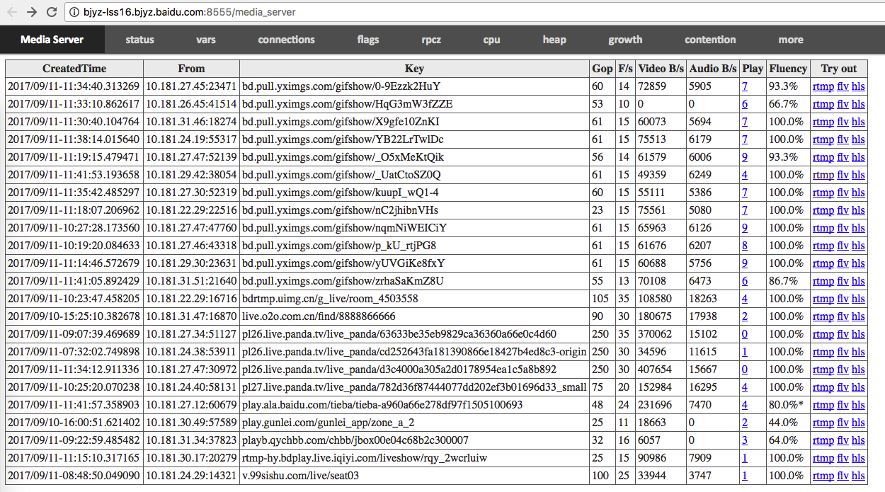

# Live-streaming services

You can build live-streaming services using APIs on rtmp/flv/hls offered by brpc. The [Live Streaming Service](https://cloud.baidu.com/product/lss.html) of [Baidu Cloud](https://cloud.baidu.com) is using media-server, which is a specialized server for hosting or proxying live streams from different customers.

