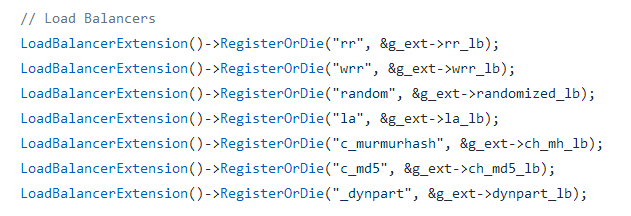

上游一般通过命名服务发现所有的下游节点，并通过多种负载均衡方法把流量分配给下游节点。当下游节点出现问题时，它可能会被隔离以提高负载均衡的效率。被隔离的节点定期被健康检查，成功后重新加入正常节点。

# 命名服务

在brpc中，[NamingService](https://github.com/brpc/brpc/blob/master/src/brpc/naming_service.h)用于获得服务名对应的所有节点。一个直观的做法是定期调用一个函数以获取最新的节点列表。但这会带来一定的延时（定期调用的周期一般在若干秒左右），作为通用接口不太合适。特别当命名服务提供事件通知时(比如zk)，这个特性没有被利用。所以我们反转了控制权：不是我们调用用户函数，而是用户在获得列表后调用我们的接口，对应[NamingServiceActions](https://github.com/brpc/brpc/blob/master/src/brpc/naming_service.h)。当然我们还是得启动进行这一过程的函数，对应NamingService::RunNamingService。下面以三个实现解释这套方式：

- bns：没有事件通知，所以我们只能定期去获得最新列表，默认间隔是[5秒](http://brpc.baidu.com:8765/flags/ns_access_interval)。为了简化这类定期获取的逻辑，brpc提供了[PeriodicNamingService](https://github.com/brpc/brpc/blob/master/src/brpc/periodic_naming_service.h) 供用户继承，用户只需要实现单次如何获取（GetServers）。获取后调用NamingServiceActions::ResetServers告诉框架。框架会对列表去重，和之前的列表比较，通知对列表有兴趣的观察者(NamingServiceWatcher)。这套逻辑会运行在独立的bthread中，即NamingServiceThread。一个NamingServiceThread可能被多个Channel共享，通过intrusive_ptr管理ownership。
- file：列表即文件。合理的方式是在文件更新后重新读取。[该实现](https://github.com/brpc/brpc/blob/master/src/brpc/policy/file_naming_service.cpp)使用[FileWatcher](https://github.com/brpc/brpc/blob/master/src/butil/files/file_watcher.h)关注文件的修改时间，当文件修改后，读取并调用NamingServiceActions::ResetServers告诉框架。
- list：列表就在服务名里（逗号分隔）。在读取完一次并调用NamingServiceActions::ResetServers后就退出了，因为列表再不会改变了。

如果用户需要建立这些对象仍然是不够方便的，因为总是需要一些工厂代码根据配置项建立不同的对象，鉴于此，我们把工厂类做进了框架，并且是非常方便的形式：

```
"protocol://service-name"
 
e.g.
bns://<node-name>            # baidu naming service
file://<file-path>           # load addresses from the file
list://addr1,addr2,...       # use the addresses separated by comma
http://<url>                 # Domain Naming Service, aka DNS.
```

这套方式是可扩展的，实现了新的NamingService后在[global.cpp](https://github.com/brpc/brpc/blob/master/src/brpc/global.cpp)中依葫芦画瓢注册下就行了，如下图所示：


看到这些熟悉的字符串格式，容易联想到ftp:// zk:// galileo://等等都是可以支持的。用户在新建Channel时传入这类NamingService描述，并能把这些描述写在各类配置文件中。

# 负载均衡

brpc中[LoadBalancer](https://github.com/brpc/brpc/blob/master/src/brpc/load_balancer.h)从多个服务节点中选择一个节点，目前的实现见[负载均衡](client.md#负载均衡)。

Load balancer最重要的是如何让不同线程中的负载均衡不互斥，解决这个问题的技术是[DoublyBufferedData](lalb.md#doublybuffereddata)。

和NamingService类似，我们使用字符串来指代一个load balancer，在global.cpp中注册：



# 健康检查

对于那些无法连接却仍在NamingService的节点，brpc会定期连接它们，成功后对应的Socket将被”复活“，并可能被LoadBalancer选择上，这个过程就是健康检查。注意：被健康检查或在LoadBalancer中的节点一定在NamingService中。换句话说，只要一个节点不从NamingService删除，它要么是正常的（会被LoadBalancer选上），要么在做健康检查。

传统的做法是使用一个线程做所有连接的健康检查，brpc简化了这个过程：为需要的连接动态创建一个bthread专门做健康检查（Socket::HealthCheckThread）。这个线程的生命周期被对应连接管理。具体来说，当Socket被SetFailed后，健康检查线程就可能启动（如果SocketOptions.health_check_interval为正数的话）：

- 健康检查线程先在确保没有其他人在使用Socket了后关闭连接。目前是通过对Socket的引用计数判断的。这个方法之所以有效在于Socket被SetFailed后就不能被Address了，所以引用计数只减不增。
- 定期连接直到远端机器被连接上，在这个过程中，如果Socket析构了，那么该线程也就随之退出了。
- 连上后复活Socket(Socket::Revive)，这样Socket就又能被其他地方，包括LoadBalancer访问到了（通过Socket::Address）。
