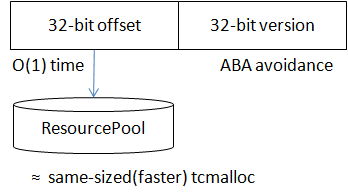

内存管理总是程序中的重要一环，在多线程时代，一个好的内存分配大都在如下两点间权衡：

- 线程间竞争少。内存分配的粒度大都比较小，对性能敏感，如果不同的线程在大多数分配时会竞争同一份资源或同一把锁，性能将会非常糟糕，原因无外乎和cache一致性有关，已被大量的malloc方案证明。
- 浪费的空间少。如果每个线程各申请各的，速度也许不错，但万一一个线程总是申请，另一个线程总是释放，内存就爆炸了。线程之间总是要共享内存的，如何共享就是方案的关键了。

一般的应用可以使用[tcmalloc](http://goog-perftools.sourceforge.net/doc/tcmalloc.html)、[jemalloc](https://github.com/jemalloc/jemalloc)等成熟的内存分配方案，但这对于较为底层，关注性能长尾的应用是不够的。多线程框架广泛地通过传递对象的ownership来让问题异步化，如何让分配这些小对象的开销变的更小是值得研究的问题。其中的一个特点较为显著：

- 大多数结构是等长的。

这个属性可以大幅简化内存分配的过程，获得比通用malloc更稳定、快速的性能。brpc中的ResourcePool<T>和ObjectPool<T>即提供这类分配。

> 这篇文章不鼓励用户使用ResourcePool<T>或ObjectPool<T>，事实上我们反对用户在程序中使用这两个类。因为”等长“的副作用是某个类型独占了一部分内存，这些内存无法再被其他类型使用，如果不加控制的滥用，反而会在程序中产生大量彼此隔离的内存分配体系，既浪费内存也不见得会有更好的性能。

# ResourcePool<T>

创建一个类型为T的对象并返回一个偏移量，这个偏移量可以在O(1)时间内转换为对象指针。这个偏移量相当于指针，但它的值在一般情况下小于2^32，所以我们可以把它作为64位id的一部分。对象可以被归还，但归还后对象并没有删除，也没有被析构，而是仅仅进入freelist。下次申请时可能会取到这种使用过的对象，需要重置后才能使用。当对象被归还后，通过对应的偏移量仍可以访问到对象，即ResourcePool只负责内存分配，并不解决ABA问题。但对于越界的偏移量，ResourcePool会返回空。

由于对象等长，ResourcePool通过批量分配和归还内存以避免全局竞争，并降低单次的开销。每个线程的分配流程如下：

1. 查看thread-local free block。如果还有free的对象，返回。没有的话步骤2。
2. 尝试从全局取一个free block，若取到的话回到步骤1，否则步骤3。
3. 从全局取一个block，返回其中第一个对象。

原理是比较简单的。工程实现上数据结构、原子变量、memory fence等问题会复杂一些。下面以bthread_t的生成过程说明ResourcePool是如何被应用的。

# ObjectPool<T>

这是ResourcePool<T>的变种，不返回偏移量，而直接返回对象指针。内部结构和ResourcePool类似，一些代码更加简单。对于用户来说，这就是一个多线程下的对象池，brpc里也是这么用的。比如Socket::Write中把每个待写出的请求包装为WriteRequest，这个对象就是用ObjectPool<WriteRequest>分配的。

# 生成bthread_t

用户期望通过创建bthread获得更高的并发度，所以创建bthread必须很快。 在目前的实现中创建一个bthread的平均耗时小于200ns。如果每次都要从头创建，是不可能这么快的。创建过程更像是从一个bthread池子中取一个实例，我们又同时需要一个id来指代一个bthread，所以这儿正是ResourcePool的用武之地。bthread在代码中被称作Task，其结构被称为TaskMeta，定义在[task_meta.h](https://github.com/brpc/brpc/blob/master/src/bthread/task_meta.h)中，所有的TaskMeta由ResourcePool<TaskMeta>分配。

bthread的大部分函数都需要在O(1)时间内通过bthread_t访问到TaskMeta，并且当bthread_t失效后，访问应返回NULL以让函数做出返回错误。解决方法是：bthread_t由32位的版本和32位的偏移量组成。版本解决[ABA问题](http://en.wikipedia.org/wiki/ABA_problem)，偏移量由ResourcePool<TaskMeta>分配。查找时先通过偏移量获得TaskMeta，再检查版本，如果版本不匹配，说明bthread失效了。注意：这只是大概的说法，在多线程环境下，即使版本相等，bthread仍可能随时失效，在不同的bthread函数中处理方法都是不同的，有些函数会加锁，有些则能忍受版本不相等。

这种id生成方式在brpc中应用广泛，brpc中的SocketId，bthread_id_t也是用类似的方法分配的。

# 栈

使用ResourcePool加快创建的副作用是：一个pool中所有bthread的栈必须是一样大的。这似乎限制了用户的选择，不过基于我们的观察，大部分用户并不关心栈的具体大小，而只需要两种大小的栈：尺寸普通但数量较少，尺寸小但数量众多。所以我们用不同的pool管理不同大小的栈，用户可以根据场景选择。两种栈分别对应属性BTHREAD_ATTR_NORMAL（栈默认为1M）和BTHREAD_ATTR_SMALL（栈默认为32K）。用户还可以指定BTHREAD_ATTR_LARGE，这个属性的栈大小和pthread一样，由于尺寸较大，bthread不会对其做caching，创建速度较慢。server默认使用BTHREAD_ATTR_NORMAL运行用户代码。

栈使用[mmap](http://linux.die.net/man/2/mmap)分配，bthread还会用mprotect分配4K的guard page以检测栈溢出。由于mmap+mprotect不能超过max_map_count（默认为65536），当bthread非常多后可能要调整此参数。另外当有很多bthread时，内存问题可能不仅仅是栈，也包括各类用户和系统buffer。

goroutine在1.3前通过[segmented stacks](https://gcc.gnu.org/wiki/SplitStacks)动态地调整栈大小，发现有[hot split](https://docs.google.com/document/d/1wAaf1rYoM4S4gtnPh0zOlGzWtrZFQ5suE8qr2sD8uWQ/pub)问题后换成了变长连续栈（类似于vector resizing，只适合内存托管的语言）。由于bthread基本只会在64位平台上使用，虚存空间庞大，对变长栈需求不明确。加上segmented stacks的性能有影响，bthread暂时没有变长栈的计划。
