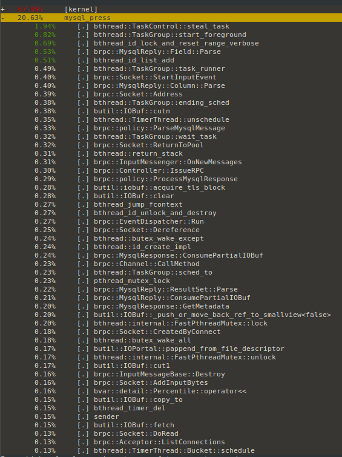
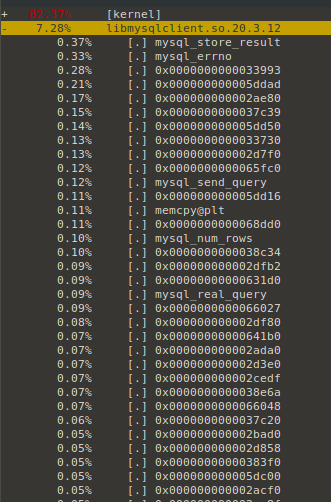

[mysql](https://www.mysql.com/)是著名的开源的关系型数据库，为了使用户更快捷地访问mysql并充分利用bthread的并发能力，brpc直接支持mysql协议。示例程序：[example/mysql_c++](https://github.com/brpc/brpc/tree/master/example/mysql_c++/)

**注意**：只支持MySQL 4.1 及之后的版本的文本协议，支持事务，不支持Prepared statement。目前支持的鉴权方式为mysql_native_password

相比使用[libmysqlclient](https://dev.mysql.com/downloads/connector/c/)(官方client)的优势有：

- 线程安全。用户不需要为每个线程建立独立的client。
- 支持同步、异步、半同步等访问方式，能使用[ParallelChannel等](combo_channel.md)组合访问方式。
- 支持多种[连接方式](client.md#连接方式)。支持超时、backup request、取消、tracing、内置服务等一系列brpc提供的福利。
- 明确的返回类型校验，如果使用了不正确的变量接受mysql的数据类型，将抛出异常。
- 调用mysql标准库会阻塞框架的并发能力，使用本实现将能充分利用brpc框架的并发能力。
- 使用brpc实现的mysql不会造成pthread的阻塞，使用libmysqlclient会阻塞pthread [相关信息](bthread.md.md)。
# 访问mysql

创建一个访问mysql的Channel：

```c++
# include <brpc/mysql.h>
# include <brpc/policy/mysql_authenticator.h>
# include <brpc/channel.h>

brpc::ChannelOptions options;
options.protocol = brpc::PROTOCOL_MYSQL;
options.connection_type = FLAGS_connection_type;
options.timeout_ms = FLAGS_timeout_ms /*milliseconds*/;
options.max_retry = FLAGS_max_retry;
options.auth = new brpc::policy::MysqlAuthenticator("yangliming01", "123456", "test", 
    "charset=utf8&collation_connection=utf8_unicode_ci");
if (channel.Init("127.0.0.1", 3306, &options) != 0) {
    LOG(ERROR) << "Fail to initialize channel";
    return -1;
}
```

向mysql发起命令。

```c++
// 执行各种mysql命令，可以批量执行命令如："select * from tab1;select * from tab2"
std::string command = "show databases"; // select,delete,update,insert,create,drop ...
brpc::MysqlRequest request;
if (!request.Query(command)) {
    LOG(ERROR) << "Fail to add command";
    return false;
}
brpc::MysqlResponse response;
brpc::Controller cntl;
channel.CallMethod(NULL, &cntl, &request, &response, NULL);
if (!cntl.Failed()) {
    std::cout << response << std::endl;
} else {
    LOG(ERROR) << "Fail to access mysql, " << cntl.ErrorText();
    return false;
}
return true;
```

上述代码的说明：

- 请求类型必须为MysqlRequest，回复类型必须为MysqlResponse，否则CallMethod会失败。不需要stub，直接调用channel.CallMethod，method填NULL。
- 调用request.Query()传入要执行的命令，可以批量执行命令，多个命令用分号隔开。
- 依次调用response.reply(X)弹出操作结果，根据返回类型的不同，选择不同的类型接收，如：MysqlReply::Ok，MysqlReply::Error，const MysqlReply::Columnconst MysqlReply::Row等。
- 如果只有一条命令则reply为1个，如果为批量操作返回的reply为多个。

目前支持的请求操作有：

```c++
bool Query(const butil::StringPiece& command);
```

对应的回复操作：

```c++
// 返回不同类型的结果
const MysqlReply::Auth& auth() const;
const MysqlReply::Ok& ok() const;
const MysqlReply::Error& error() const;
const MysqlReply::Eof& eof() const;
// 对result set结果集的操作
// get column number
uint64_t MysqlReply::column_number() const;
// get one column
const MysqlReply::Column& MysqlReply::column(const uint64_t index) const;
// get row number
uint64_t MysqlReply::row_number() const;
// get one row
const MysqlReply::Row& MysqlReply::next() const;
// 结果集中每个字段的操作
const MysqlReply::Field& MysqlReply::Row::field(const uint64_t index) const;
```

# 事务操作

```c++
 rpc::Channel channel;
// Initialize the channel, NULL means using default options.
brpc::ChannelOptions options;
options.protocol = brpc::PROTOCOL_MYSQL;
options.connection_type = FLAGS_connection_type;
options.timeout_ms = FLAGS_timeout_ms /*milliseconds*/;
options.connect_timeout_ms = FLAGS_connect_timeout_ms;
options.max_retry = FLAGS_max_retry;
options.auth = new brpc::policy::MysqlAuthenticator(
    FLAGS_user, FLAGS_password, FLAGS_schema, FLAGS_params);
if (channel.Init(FLAGS_server.c_str(), FLAGS_port, &options) != 0) {
    LOG(ERROR) << "Fail to initialize channel";
    return -1;
}

// create transaction
brpc::MysqlTransactionOptions options;
options.readonly = FLAGS_readonly;
options.isolation_level = brpc::MysqlIsolationLevel(FLAGS_isolation_level);
auto tx(brpc::NewMysqlTransaction(channel, options));
if (tx == NULL) {
    LOG(ERROR) << "Fail to create transaction";
    return false;
}

brpc::MysqlRequest request(tx.get());
if (!request.Query(*it)) {
    LOG(ERROR) << "Fail to add command";
    tx->rollback();
    return false;
}
brpc::MysqlResponse response;
brpc::Controller cntl;
channel.CallMethod(NULL, &cntl, &request, &response, NULL);
if (cntl.Failed()) {
    LOG(ERROR) << "Fail to access mysql, " << cntl.ErrorText();
    tx->rollback();
    return false;
}
// handle response
std::cout << response << std::endl;
bool rc = tx->commit();
```

# 性能测试

我在example/mysql_c++目录下面写了两个测试程序，mysql_press.cpp mysqlclient_press.cpp，一个是使用了brpc框架，一个是使用了的libmysqlclient访问mysql。

启动一个线程测试

./mysql_press -thread_num=1 -op_type=0

```
I0423 13:44:52.306762 19682 /home/yangliming/brpc/example/mysql_c++/mysql_press.cpp:227] Accessing mysql-server at qps=648 latency=1537
I0423 13:44:53.307566 19682 /home/yangliming/brpc/example/mysql_c++/mysql_press.cpp:227] Accessing mysql-server at qps=602 latency=1654
I0423 13:44:54.307695 19682 /home/yangliming/brpc/example/mysql_c++/mysql_press.cpp:227] Accessing mysql-server at qps=597 latency=1668
I0423 13:44:55.308079 19682 /home/yangliming/brpc/example/mysql_c++/mysql_press.cpp:227] Accessing mysql-server at qps=541 latency=1842
I0423 13:44:56.308351 19682 /home/yangliming/brpc/example/mysql_c++/mysql_press.cpp:227] Accessing mysql-server at qps=617 latency=1613
I0423 13:44:57.308570 19682 /home/yangliming/brpc/example/mysql_c++/mysql_press.cpp:227] Accessing mysql-server at qps=600 latency=1661
I0423 13:44:58.308918 19682 /home/yangliming/brpc/example/mysql_c++/mysql_press.cpp:227] Accessing mysql-server at qps=404 latency=2457
I0423 13:44:59.309187 19682 /home/yangliming/brpc/example/mysql_c++/mysql_press.cpp:227] Accessing mysql-server at qps=448 latency=2231
I0423 13:45:00.309383 19682 /home/yangliming/brpc/example/mysql_c++/mysql_press.cpp:227] Accessing mysql-server at qps=599 latency=1664
I0423 13:45:01.309547 19682 /home/yangliming/brpc/example/mysql_c++/mysql_press.cpp:227] Accessing mysql-server at qps=727 latency=1369
I0423 13:45:02.309775 19682 /home/yangliming/brpc/example/mysql_c++/mysql_press.cpp:227] Accessing mysql-server at qps=703 latency=1417
I0423 13:45:03.310142 19682 /home/yangliming/brpc/example/mysql_c++/mysql_press.cpp:227] Accessing mysql-server at qps=756 latency=1317
I0423 13:45:04.310840 19682 /home/yangliming/brpc/example/mysql_c++/mysql_press.cpp:227] Accessing mysql-server at qps=833 latency=1194
I0423 13:45:05.311066 19682 /home/yangliming/brpc/example/mysql_c++/mysql_press.cpp:227] Accessing mysql-server at qps=762 latency=1306
I0423 13:45:06.311316 19682 /home/yangliming/brpc/example/mysql_c++/mysql_press.cpp:227] Accessing mysql-server at qps=705 latency=1410
I0423 13:45:07.311570 19682 /home/yangliming/brpc/example/mysql_c++/mysql_press.cpp:227] Accessing mysql-server at qps=703 latency=1417
I0423 13:45:08.311754 19682 /home/yangliming/brpc/example/mysql_c++/mysql_press.cpp:227] Accessing mysql-server at qps=724 latency=1374
I0423 13:45:09.311934 19682 /home/yangliming/brpc/example/mysql_c++/mysql_press.cpp:227] Accessing mysql-server at qps=621 latency=1603
I0423 13:45:10.312272 19682 /home/yangliming/brpc/example/mysql_c++/mysql_press.cpp:227] Accessing mysql-server at qps=697 latency=1428
```

./mysqlclient_press -thread_num=1 -op_type=0

```
I0423 10:30:11.452513 18007 /home/yangliming/brpc/example/mysql_c++/mysqlclient_press.cpp:226] Accessing mysql-server at qps=702 latency=1419
I0423 10:30:12.454211 18007 /home/yangliming/brpc/example/mysql_c++/mysqlclient_press.cpp:226] Accessing mysql-server at qps=601 latency=1658
I0423 10:30:13.455104 18007 /home/yangliming/brpc/example/mysql_c++/mysqlclient_press.cpp:226] Accessing mysql-server at qps=536 latency=1861
I0423 10:30:14.455533 18007 /home/yangliming/brpc/example/mysql_c++/mysqlclient_press.cpp:226] Accessing mysql-server at qps=525 latency=1900
I0423 10:30:15.455700 18007 /home/yangliming/brpc/example/mysql_c++/mysqlclient_press.cpp:226] Accessing mysql-server at qps=663 latency=1503
I0423 10:30:16.456220 18007 /home/yangliming/brpc/example/mysql_c++/mysqlclient_press.cpp:226] Accessing mysql-server at qps=681 latency=1464
I0423 10:30:17.456804 18007 /home/yangliming/brpc/example/mysql_c++/mysqlclient_press.cpp:226] Accessing mysql-server at qps=689 latency=1446
I0423 10:30:18.457374 18007 /home/yangliming/brpc/example/mysql_c++/mysqlclient_press.cpp:226] Accessing mysql-server at qps=655 latency=1521
I0423 10:30:19.458235 18007 /home/yangliming/brpc/example/mysql_c++/mysqlclient_press.cpp:226] Accessing mysql-server at qps=547 latency=1823
I0423 10:30:20.458475 18007 /home/yangliming/brpc/example/mysql_c++/mysqlclient_press.cpp:226] Accessing mysql-server at qps=524 latency=1900
I0423 10:30:21.459120 18007 /home/yangliming/brpc/example/mysql_c++/mysqlclient_press.cpp:226] Accessing mysql-server at qps=552 latency=1806
I0423 10:30:22.459670 18007 /home/yangliming/brpc/example/mysql_c++/mysqlclient_press.cpp:226] Accessing mysql-server at qps=408 latency=2420
I0423 10:30:23.460059 18007 /home/yangliming/brpc/example/mysql_c++/mysqlclient_press.cpp:226] Accessing mysql-server at qps=473 latency=2129
I0423 10:30:24.460952 18007 /home/yangliming/brpc/example/mysql_c++/mysqlclient_press.cpp:226] Accessing mysql-server at qps=452 latency=2209
I0423 10:30:25.461151 18007 /home/yangliming/brpc/example/mysql_c++/mysqlclient_press.cpp:226] Accessing mysql-server at qps=592 latency=1683
I0423 10:30:26.461301 18007 /home/yangliming/brpc/example/mysql_c++/mysqlclient_press.cpp:226] Accessing mysql-server at qps=492 latency=2027
I0423 10:30:27.461465 18007 /home/yangliming/brpc/example/mysql_c++/mysqlclient_press.cpp:226] Accessing mysql-server at qps=677 latency=1472
I0423 10:30:28.461943 18007 /home/yangliming/brpc/example/mysql_c++/mysqlclient_press.cpp:226] Accessing mysql-server at qps=629 latency=1585
I0423 10:30:29.462272 18007 /home/yangliming/brpc/example/mysql_c++/mysqlclient_press.cpp:226] Accessing mysql-server at qps=757 latency=1316
I0423 10:30:30.462743 18007 /home/yangliming/brpc/example/mysql_c++/mysqlclient_press.cpp:226] Accessing mysql-server at qps=721 latency=1382
I0423 10:30:31.462891 18007 /home/yangliming/brpc/example/mysql_c++/mysqlclient_press.cpp:226] Accessing mysql-server at qps=752 latency=1325
I0423 10:30:32.463246 18007 /home/yangliming/brpc/example/mysql_c++/mysqlclient_press.cpp:226] Accessing mysql-server at qps=752 latency=1324
I0423 10:30:33.463935 18007 /home/yangliming/brpc/example/mysql_c++/mysqlclient_press.cpp:226] Accessing mysql-server at qps=822 latency=1212
I0423 10:30:34.464395 18007 /home/yangliming/brpc/example/mysql_c++/mysqlclient_press.cpp:226] Accessing mysql-server at qps=831 latency=1199
```

./mysql_press -thread_num=1 -op_type=1

```
I0423 17:26:05.472492 22361 /home/yangliming/brpc/example/mysql_c++/mysql_press.cpp:227] Accessing mysql-server at qps=1360 latency=727
I0423 17:26:06.472692 22361 /home/yangliming/brpc/example/mysql_c++/mysql_press.cpp:227] Accessing mysql-server at qps=1585 latency=623
I0423 17:26:07.472788 22361 /home/yangliming/brpc/example/mysql_c++/mysql_press.cpp:227] Accessing mysql-server at qps=1406 latency=703
I0423 17:26:08.472950 22361 /home/yangliming/brpc/example/mysql_c++/mysql_press.cpp:227] Accessing mysql-server at qps=1530 latency=646
I0423 17:26:09.473230 22361 /home/yangliming/brpc/example/mysql_c++/mysql_press.cpp:227] Accessing mysql-server at qps=1536 latency=643
I0423 17:26:10.473329 22361 /home/yangliming/brpc/example/mysql_c++/mysql_press.cpp:227] Accessing mysql-server at qps=1693 latency=584
I0423 17:26:11.473611 22361 /home/yangliming/brpc/example/mysql_c++/mysql_press.cpp:227] Accessing mysql-server at qps=1637 latency=603
I0423 17:26:12.473771 22361 /home/yangliming/brpc/example/mysql_c++/mysql_press.cpp:227] Accessing mysql-server at qps=1495 latency=662
I0423 17:26:13.474620 22361 /home/yangliming/brpc/example/mysql_c++/mysql_press.cpp:227] Accessing mysql-server at qps=1225 latency=807
I0423 17:26:14.474914 22361 /home/yangliming/brpc/example/mysql_c++/mysql_press.cpp:227] Accessing mysql-server at qps=986 latency=1003
I0423 17:26:15.475465 22361 /home/yangliming/brpc/example/mysql_c++/mysql_press.cpp:227] Accessing mysql-server at qps=1434 latency=689
I0423 17:26:16.475839 22361 /home/yangliming/brpc/example/mysql_c++/mysql_press.cpp:227] Accessing mysql-server at qps=1895 latency=520
I0423 17:26:17.476128 22361 /home/yangliming/brpc/example/mysql_c++/mysql_press.cpp:227] Accessing mysql-server at qps=1532 latency=645
I0423 17:26:18.476536 22361 /home/yangliming/brpc/example/mysql_c++/mysql_press.cpp:227] Accessing mysql-server at qps=1498 latency=660
I0423 17:26:19.476659 22361 /home/yangliming/brpc/example/mysql_c++/mysql_press.cpp:227] Accessing mysql-server at qps=1648 latency=599
I0423 17:26:20.476777 22361 /home/yangliming/brpc/example/mysql_c++/mysql_press.cpp:227] Accessing mysql-server at qps=1566 latency=632
I0423 17:26:21.477189 22361 /home/yangliming/brpc/example/mysql_c++/mysql_press.cpp:227] Accessing mysql-server at qps=1163 latency=851
I0423 17:26:22.477665 22361 /home/yangliming/brpc/example/mysql_c++/mysql_press.cpp:227] Accessing mysql-server at qps=1344 latency=736
I0423 17:26:23.477910 22361 /home/yangliming/brpc/example/mysql_c++/mysql_press.cpp:227] Accessing mysql-server at qps=1326 latency=746
I0423 17:26:24.478298 22361 /home/yangliming/brpc/example/mysql_c++/mysql_press.cpp:227] Accessing mysql-server at qps=1419 latency=695
I0423 17:26:25.478522 22361 /home/yangliming/brpc/example/mysql_c++/mysql_press.cpp:227] Accessing mysql-server at qps=1421 latency=696
I0423 17:26:26.478836 22361 /home/yangliming/brpc/example/mysql_c++/mysql_press.cpp:227] Accessing mysql-server at qps=1491 latency=663
I0423 17:26:27.479249 22361 /home/yangliming/brpc/example/mysql_c++/mysql_press.cpp:227] Accessing mysql-server at qps=1404 latency=704
```

./mysqlclient_press -thread_num=1 -op_type=1

```
I0423 17:23:00.923535 22351 /home/yangliming/brpc/example/mysql_c++/mysqlclient_press.cpp:226] Accessing mysql-server at qps=5109 latency=194
I0423 17:23:01.923684 22351 /home/yangliming/brpc/example/mysql_c++/mysqlclient_press.cpp:226] Accessing mysql-server at qps=5193 latency=191
I0423 17:23:02.923888 22351 /home/yangliming/brpc/example/mysql_c++/mysqlclient_press.cpp:226] Accessing mysql-server at qps=6333 latency=156
I0423 17:23:03.924171 22351 /home/yangliming/brpc/example/mysql_c++/mysqlclient_press.cpp:226] Accessing mysql-server at qps=7605 latency=130
I0423 17:23:04.924338 22351 /home/yangliming/brpc/example/mysql_c++/mysqlclient_press.cpp:226] Accessing mysql-server at qps=7570 latency=130
I0423 17:23:05.924439 22351 /home/yangliming/brpc/example/mysql_c++/mysqlclient_press.cpp:226] Accessing mysql-server at qps=4790 latency=207
I0423 17:23:06.924578 22351 /home/yangliming/brpc/example/mysql_c++/mysqlclient_press.cpp:226] Accessing mysql-server at qps=5151 latency=192
I0423 17:23:07.924747 22351 /home/yangliming/brpc/example/mysql_c++/mysqlclient_press.cpp:226] Accessing mysql-server at qps=6140 latency=161
I0423 17:23:08.924909 22351 /home/yangliming/brpc/example/mysql_c++/mysqlclient_press.cpp:226] Accessing mysql-server at qps=7995 latency=123
I0423 17:23:09.925047 22351 /home/yangliming/brpc/example/mysql_c++/mysqlclient_press.cpp:226] Accessing mysql-server at qps=5342 latency=185
I0423 17:23:10.925165 22351 /home/yangliming/brpc/example/mysql_c++/mysqlclient_press.cpp:226] Accessing mysql-server at qps=5226 latency=190
I0423 17:23:11.925288 22351 /home/yangliming/brpc/example/mysql_c++/mysqlclient_press.cpp:226] Accessing mysql-server at qps=5102 latency=194
I0423 17:23:12.925468 22351 /home/yangliming/brpc/example/mysql_c++/mysqlclient_press.cpp:226] Accessing mysql-server at qps=3832 latency=258
I0423 17:23:13.925680 22351 /home/yangliming/brpc/example/mysql_c++/mysqlclient_press.cpp:226] Accessing mysql-server at qps=4171 latency=237
I0423 17:23:14.925912 22351 /home/yangliming/brpc/example/mysql_c++/mysqlclient_press.cpp:226] Accessing mysql-server at qps=6809 latency=145
I0423 17:23:15.926260 22351 /home/yangliming/brpc/example/mysql_c++/mysqlclient_press.cpp:226] Accessing mysql-server at qps=4217 latency=235
I0423 17:23:16.929617 22351 /home/yangliming/brpc/example/mysql_c++/mysqlclient_press.cpp:226] Accessing mysql-server at qps=6187 latency=159
I0423 17:23:17.932048 22351 /home/yangliming/brpc/example/mysql_c++/mysqlclient_press.cpp:226] Accessing mysql-server at qps=8305 latency=119
I0423 17:23:18.932340 22351 /home/yangliming/brpc/example/mysql_c++/mysqlclient_press.cpp:226] Accessing mysql-server at qps=5089 latency=194
I0423 17:23:19.932484 22351 /home/yangliming/brpc/example/mysql_c++/mysqlclient_press.cpp:226] Accessing mysql-server at qps=4626 latency=214
I0423 17:23:20.932731 22351 /home/yangliming/brpc/example/mysql_c++/mysqlclient_press.cpp:226] Accessing mysql-server at qps=4775 latency=208
I0423 17:23:21.934988 22351 /home/yangliming/brpc/example/mysql_c++/mysqlclient_press.cpp:226] Accessing mysql-server at qps=6405 latency=154
I0423 17:23:22.935382 22351 /home/yangliming/brpc/example/mysql_c++/mysqlclient_press.cpp:226] Accessing mysql-server at qps=5912 latency=167
I0423 17:23:23.935776 22351 /home/yangliming/brpc/example/mysql_c++/mysqlclient_press.cpp:226] Accessing mysql-server at qps=7245 latency=136
I0423 17:23:24.935873 22351 /home/yangliming/brpc/example/mysql_c++/mysqlclient_press.cpp:226] Accessing mysql-server at qps=4859 latency=204
```

./mysql_press -thread_num=1 -op_type=2

```
I0423 17:11:14.094312 22309 /home/yangliming/brpc/example/mysql_c++/mysql_press.cpp:227] Accessing mysql-server at qps=381 latency=2632
I0423 17:11:15.094422 22309 /home/yangliming/brpc/example/mysql_c++/mysql_press.cpp:227] Accessing mysql-server at qps=360 latency=2768
I0423 17:11:16.094646 22309 /home/yangliming/brpc/example/mysql_c++/mysql_press.cpp:227] Accessing mysql-server at qps=420 latency=2375
I0423 17:11:17.094931 22309 /home/yangliming/brpc/example/mysql_c++/mysql_press.cpp:227] Accessing mysql-server at qps=444 latency=2243
I0423 17:11:18.095224 22309 /home/yangliming/brpc/example/mysql_c++/mysql_press.cpp:227] Accessing mysql-server at qps=371 latency=2689
I0423 17:11:19.095514 22309 /home/yangliming/brpc/example/mysql_c++/mysql_press.cpp:227] Accessing mysql-server at qps=448 latency=2223
I0423 17:11:20.095588 22309 /home/yangliming/brpc/example/mysql_c++/mysql_press.cpp:227] Accessing mysql-server at qps=478 latency=2084
I0423 17:11:21.096028 22309 /home/yangliming/brpc/example/mysql_c++/mysql_press.cpp:227] Accessing mysql-server at qps=392 latency=2543
I0423 17:11:22.096238 22309 /home/yangliming/brpc/example/mysql_c++/mysql_press.cpp:227] Accessing mysql-server at qps=500 latency=1993
I0423 17:11:23.096527 22309 /home/yangliming/brpc/example/mysql_c++/mysql_press.cpp:227] Accessing mysql-server at qps=317 latency=3099
I0423 17:11:24.096666 22309 /home/yangliming/brpc/example/mysql_c++/mysql_press.cpp:227] Accessing mysql-server at qps=412 latency=2456
I0423 17:11:25.096799 22309 /home/yangliming/brpc/example/mysql_c++/mysql_press.cpp:227] Accessing mysql-server at qps=504 latency=1978
I0423 17:11:26.097490 22309 /home/yangliming/brpc/example/mysql_c++/mysql_press.cpp:227] Accessing mysql-server at qps=500 latency=1992
I0423 17:11:27.097739 22309 /home/yangliming/brpc/example/mysql_c++/mysql_press.cpp:227] Accessing mysql-server at qps=439 latency=2272
I0423 17:11:28.099476 22309 /home/yangliming/brpc/example/mysql_c++/mysql_press.cpp:227] Accessing mysql-server at qps=411 latency=2422
I0423 17:11:29.099956 22309 /home/yangliming/brpc/example/mysql_c++/mysql_press.cpp:227] Accessing mysql-server at qps=427 latency=2333
I0423 17:11:30.100132 22309 /home/yangliming/brpc/example/mysql_c++/mysql_press.cpp:227] Accessing mysql-server at qps=482 latency=2068
I0423 17:11:31.100651 22309 /home/yangliming/brpc/example/mysql_c++/mysql_press.cpp:227] Accessing mysql-server at qps=457 latency=2184
I0423 17:11:32.100805 22309 /home/yangliming/brpc/example/mysql_c++/mysql_press.cpp:227] Accessing mysql-server at qps=412 latency=2419
I0423 17:11:33.101050 22309 /home/yangliming/brpc/example/mysql_c++/mysql_press.cpp:227] Accessing mysql-server at qps=470 latency=2120
I0423 17:11:34.101677 22309 /home/yangliming/brpc/example/mysql_c++/mysql_press.cpp:227] Accessing mysql-server at qps=463 latency=2153
I0423 17:11:35.102266 22309 /home/yangliming/brpc/example/mysql_c++/mysql_press.cpp:227] Accessing mysql-server at qps=490 latency=2033
I0423 17:11:36.102565 22309 /home/yangliming/brpc/example/mysql_c++/mysql_press.cpp:227] Accessing mysql-server at qps=526 latency=1895
I0423 17:11:37.102674 22309 /home/yangliming/brpc/example/mysql_c++/mysql_press.cpp:227] Accessing mysql-server at qps=462 latency=2158
```

./mysqlclient_press -thread_num=1 -op_type=2

```
I0423 17:12:20.102581 22323 /home/yangliming/brpc/example/mysql_c++/mysqlclient_press.cpp:226] Accessing mysql-server at qps=640 latency=1558
I0423 17:12:21.102965 22323 /home/yangliming/brpc/example/mysql_c++/mysqlclient_press.cpp:226] Accessing mysql-server at qps=488 latency=2043
I0423 17:12:22.103339 22323 /home/yangliming/brpc/example/mysql_c++/mysqlclient_press.cpp:226] Accessing mysql-server at qps=542 latency=1841
I0423 17:12:23.103479 22323 /home/yangliming/brpc/example/mysql_c++/mysqlclient_press.cpp:226] Accessing mysql-server at qps=493 latency=2023
I0423 17:12:24.103622 22323 /home/yangliming/brpc/example/mysql_c++/mysqlclient_press.cpp:226] Accessing mysql-server at qps=564 latency=1769
I0423 17:12:25.103812 22323 /home/yangliming/brpc/example/mysql_c++/mysqlclient_press.cpp:226] Accessing mysql-server at qps=610 latency=1636
I0423 17:12:26.104240 22323 /home/yangliming/brpc/example/mysql_c++/mysqlclient_press.cpp:226] Accessing mysql-server at qps=577 latency=1729
I0423 17:12:27.104442 22323 /home/yangliming/brpc/example/mysql_c++/mysqlclient_press.cpp:226] Accessing mysql-server at qps=543 latency=1836
I0423 17:12:28.104955 22323 /home/yangliming/brpc/example/mysql_c++/mysqlclient_press.cpp:226] Accessing mysql-server at qps=485 latency=2059
I0423 17:12:29.105208 22323 /home/yangliming/brpc/example/mysql_c++/mysqlclient_press.cpp:226] Accessing mysql-server at qps=539 latency=1851
I0423 17:12:30.105446 22323 /home/yangliming/brpc/example/mysql_c++/mysqlclient_press.cpp:226] Accessing mysql-server at qps=541 latency=1844
I0423 17:12:31.105569 22323 /home/yangliming/brpc/example/mysql_c++/mysqlclient_press.cpp:226] Accessing mysql-server at qps=513 latency=1944
I0423 17:12:32.106135 22323 /home/yangliming/brpc/example/mysql_c++/mysqlclient_press.cpp:226] Accessing mysql-server at qps=522 latency=1910
I0423 17:12:33.106223 22323 /home/yangliming/brpc/example/mysql_c++/mysqlclient_press.cpp:226] Accessing mysql-server at qps=586 latency=1702
I0423 17:12:34.106557 22323 /home/yangliming/brpc/example/mysql_c++/mysqlclient_press.cpp:226] Accessing mysql-server at qps=610 latency=1635
I0423 17:12:35.106850 22323 /home/yangliming/brpc/example/mysql_c++/mysqlclient_press.cpp:226] Accessing mysql-server at qps=589 latency=1685
I0423 17:12:36.106950 22323 /home/yangliming/brpc/example/mysql_c++/mysqlclient_press.cpp:226] Accessing mysql-server at qps=491 latency=2042
I0423 17:12:37.107048 22323 /home/yangliming/brpc/example/mysql_c++/mysqlclient_press.cpp:226] Accessing mysql-server at qps=611 latency=1633
I0423 17:12:38.107224 22323 /home/yangliming/brpc/example/mysql_c++/mysqlclient_press.cpp:226] Accessing mysql-server at qps=637 latency=1565
I0423 17:12:39.107469 22323 /home/yangliming/brpc/example/mysql_c++/mysqlclient_press.cpp:226] Accessing mysql-server at qps=546 latency=1826
I0423 17:12:40.107634 22323 /home/yangliming/brpc/example/mysql_c++/mysqlclient_press.cpp:226] Accessing mysql-server at qps=524 latency=1901
I0423 17:12:41.107844 22323 /home/yangliming/brpc/example/mysql_c++/mysqlclient_press.cpp:226] Accessing mysql-server at qps=454 latency=2200
I0423 17:12:42.108194 22323 /home/yangliming/brpc/example/mysql_c++/mysqlclient_press.cpp:226] Accessing mysql-server at qps=453 latency=2198
I0423 17:12:43.108463 22323 /home/yangliming/brpc/example/mysql_c++/mysqlclient_press.cpp:226] Accessing mysql-server at qps=373 latency=2673
I0423 17:12:44.108603 22323 /home/yangliming/brpc/example/mysql_c++/mysqlclient_press.cpp:226] Accessing mysql-server at qps=557 latency=1794
```


从以上测试结果看来，使用brpc实现的mysql协议和使用libmysqlclient在插入、修改、删除操作上性能是类似的，但是在查询操作看会逊色于libmysqlclient。

brpc实现的mysql协议函数调用耗时分析



libmysqlclient函数调用耗时分析




在内存占用上，运行了一个晚上，两个程序的内存占用


以上为我的一个简单测试，后续还将继续分析性能问题，优化协议，给出更多测试。