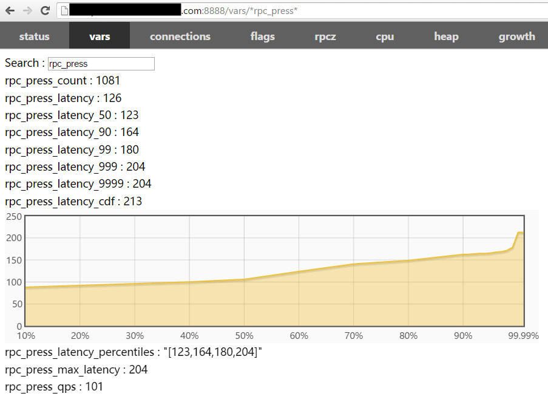

rpc_press无需写代码就压测各种rpc server，目前支持的协议有：

- baidu_std
- hulu-pbrpc
- sofa-pbrpc
- public_pbrpc
- nova_pbrpc

# 获取工具

先按照[Getting Started](getting_started.md)编译好brpc，再去tools/rpc_press编译。

在CentOS 6.3上如果出现找不到libssl.so.4的错误，可执行`ln -s /usr/lib64/libssl.so.6 libssl.so.4临时解决`

# 发压力

rpc_press会动态加载proto文件，无需把proto文件编译为c++源文件。rpc_press会加载json格式的输入文件，转为pb请求，发向server，收到pb回复后如有需要会转为json并写入用户指定的文件。

rpc_press的所有的选项都来自命令行参数，而不是配置文件.

如下的命令向下游0.0.0.0:8002用baidu_std重复发送两个pb请求，分别转自'{"message":"hello"}和'{"message":"world"}，持续压力直到按ctrl-c，qps为100。

json也可以写在文件中，假如./input.json包含了上述两个请求，-input=./input.json也是可以的。

必需参数：

- -proto：指定相关的proto文件名。
- -method：指定方法名，形式必须是package.service.method。
- -server：当-lb_policy为空时，是服务器的ip:port；当-lb_policy不为空时，是集群地址，比如bns://node-name, file://server_list等等。具体见[命名服务](client.md#命名服务)。
- -input: 指定json请求或包含json请求的文件。r32157后json间不需要分隔符，r32157前json间用分号分隔。

可选参数:

- -inc: 包含被import的proto文件的路径。rpc_press默认支持import目录下的其他proto文件，但如果proto文件在其他目录，就要通过这个参数指定，多个路径用分号(;)分隔。
- -lb_policy: 指定负载均衡算法，默认为空，可选项为: rr random la c_murmurhash c_md5，具体见[负载均衡](client.md#负载均衡)。
- -timeout_ms: 设定超时,单位是毫秒(milliseconds),默认是1000(1秒)
- -max_retry: 最大的重试次数,默认是3, 一般无需修改. brpc的重试行为具体请见[这里](client.md#重试).
- -protocol: 连接server使用的协议，可选项见[协议](client.md#协议), 默认是baidu_std
- -connection_type: 连接方式，可选项为: single pooled short，具体见[连接方式](client.md#连接方式)。默认会根据协议自动选择,无需指定.
- -output: 如果不为空，response会转为json并写入这个文件，默认为空。
- -duration：大于0时表示发送这么多秒的压力后退出，否则一直发直到按ctrl-c或进程被杀死。默认是0（一直发送）。
- -qps：大于0时表示以这个压力发送，否则以最大速度(自适应)发送。默认是100。
- -dummy_port：修改dummy_server的端口，默认是8888

常用的参数组合：

- 向下游0.0.0.0:8002、用baidu_std重复发送./input.json中的所有请求，持续压力直到按ctrl-c，qps为100。
  ./rpc_press -proto=echo.proto -method=example.EchoService.Echo -server=0.0.0.0:8002 -input=./input.json -qps=100
- 以round-robin分流算法向bns://node-name代表的所有下游机器、用baidu_std重复发送两个pb请求，持续压力直到按ctrl-c，qps为100。
  ./rpc_press -proto=echo.proto -method=example.EchoService.Echo -server=bns://node-name -lb_policy=rr -input='{"message":"hello"} {"message":"world"}' -qps=100
- 向下游0.0.0.0:8002、用hulu协议重复发送两个pb请求，持续压力直到按ctrl-c，qps为100。
  ./rpc_press -proto=echo.proto -method=example.EchoService.Echo -server=0.0.0.0:8002 -protocol=hulu_pbrpc -input='{"message":"hello"} {"message":"world"}' -qps=100
- 向下游0.0.0.0:8002、用baidu_std重复发送两个pb请求，持续最大压力直到按ctrl-c。
  ./rpc_press -proto=echo.proto -method=example.EchoService.Echo -server=0.0.0.0:8002 -input='{"message":"hello"} {"message":"world"}' -qps=0
- 向下游0.0.0.0:8002、用baidu_std重复发送两个pb请求，持续最大压力10秒钟。
  ./rpc_press -proto=echo.proto -method=example.EchoService.Echo -server=0.0.0.0:8002 -input='{"message":"hello"} {"message":"world"}' -qps=0 -duration=10
- echo.proto中import了另一个目录下的proto文件
  ./rpc_press -proto=echo.proto -inc=<another-dir-with-the-imported-proto> -method=example.EchoService.Echo -server=0.0.0.0:8002 -input='{"message":"hello"} {"message":"world"}' -qps=0 -duration=10

rpc_press启动后会默认在8888端口启动一个dummy server，用于观察rpc_press本身的运行情况：

```
./rpc_press -proto=echo.proto -service=example.EchoService -method=Echo -server=0.0.0.0:8002 -input=./input.json -duration=0 -qps=100
TRACE: 01-30 16:10:04:   * 0 src/brpc/server.cpp:733] Server[dummy_servers] is serving on port=8888.
TRACE: 01-30 16:10:04:   * 0 src/brpc/server.cpp:742] Check out http://xxx.com:8888 in your web browser.</code>
```

dummy_server启动时会在终端打印日志，一般按住ctrl点击那个链接可以直接打开对应的内置服务页面，就像这样：


切换到vars页面，在Search框中输入rpc_press可以看到当前压力的延时分布情况:



你可以通过-dummy_port参数修改dummy_server的端口，请确保端口可以在浏览器中访问。

如果你无法打开浏览器，命令行中也会定期打印信息：

```
2016/01/30-16:19:01     sent:101       success:101       error:0         total_error:0         total_sent:28379     
2016/01/30-16:19:02     sent:101       success:101       error:0         total_error:0         total_sent:28480     
2016/01/30-16:19:03     sent:101       success:101       error:0         total_error:0         total_sent:28581     
2016/01/30-16:19:04     sent:101       success:101       error:0         total_error:0         total_sent:28682     
2016/01/30-16:19:05     sent:101       success:101       error:0         total_error:0         total_sent:28783     
2016/01/30-16:19:06     sent:101       success:101       error:0         total_error:0         total_sent:28884     
2016/01/30-16:19:07     sent:101       success:101       error:0         total_error:0         total_sent:28985     
2016/01/30-16:19:08     sent:101       success:101       error:0         total_error:0         total_sent:29086     
2016/01/30-16:19:09     sent:101       success:101       error:0         total_error:0         total_sent:29187     
2016/01/30-16:19:10     sent:101       success:101       error:0         total_error:0         total_sent:29288     
[Latency]
  avg            122 us
  50%            122 us
  70%            135 us
  90%            161 us
  95%            164 us
  97%            166 us
  99%            172 us
  99.9%          199 us
  99.99%         199 us
  max            199 us
```

上方的字段含义应该是自解释的，在此略过。下方是延时信息，第一项"avg"是10秒内的平均延时，最后一项"max"是10秒内的最大延时，其余以百分号结尾的则代表延时分位值，即有左侧这么多比例的请求延时小于右侧的延时（单位微秒）。一般性能测试需要关注99%之后的长尾区域。

# FAQ

**Q: 如果下游是基于j-protobuf框架的服务模块，压力工具该如何配置？**

A：因为协议兼容性问题，启动rpc_press的时候需要带上-baidu_protocol_use_fullname=false
