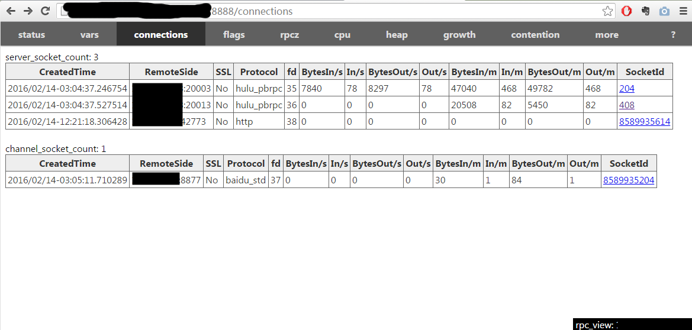

rpc_view可以转发端口被限的server的内置服务。像百度内如果一个服务的端口不在8000-8999，就只能在命令行下使用curl查看它的内置服务，没有历史趋势和动态曲线，也无法点击链接，排查问题不方便。rpc_view是一个特殊的http proxy：把对它的所有访问都转为对目标server的访问。只要把rpc_view的端口能在浏览器中被访问，我们就能通过它看到原本不能直接看到的server了。

# 获取工具

先按照[Getting Started](getting_started.md)编译好brpc，再去tools/rpc_view编译。

在CentOS 6.3上如果出现找不到libssl.so.4的错误，可执行`ln -s /usr/lib64/libssl.so.6 libssl.so.4临时解决`

# 访问目标server

确保你的机器能访问目标server，开发机应该都可以，一些测试机可能不行。运行./rpc_view <server-address>就可以了。

比如：

```
$ ./rpc_view 10.46.130.53:9970
TRACE: 02-14 12:12:20:   * 0 src/brpc/server.cpp:762] Server[rpc_view_server] is serving on port=8888.
TRACE: 02-14 12:12:20:   * 0 src/brpc/server.cpp:771] Check out http://db-rpc-dev00.db01.baidu.com:8888 in web browser.
```

打开rpc_view在8888端口提供的页面（在secureCRT中按住ctrl点url）：


这个页面正是目标server的内置服务，右下角的提示告诉我们这是rpc_view提供的。这个页面和真实的内置服务基本是一样的，你可以做任何操作。

# 更换目标server

你可以随时停掉rpc_view并更换目标server，不过你觉得麻烦的话，也可以在浏览器上操作：给url加上?changetarget=<new-server-address>就行了。

假如我们之前停留在原目标server的/connections页面：



加上?changetarge后就跳到新目标server的/connections页面了。接下来点击其他tab都会显示新目标server的。


