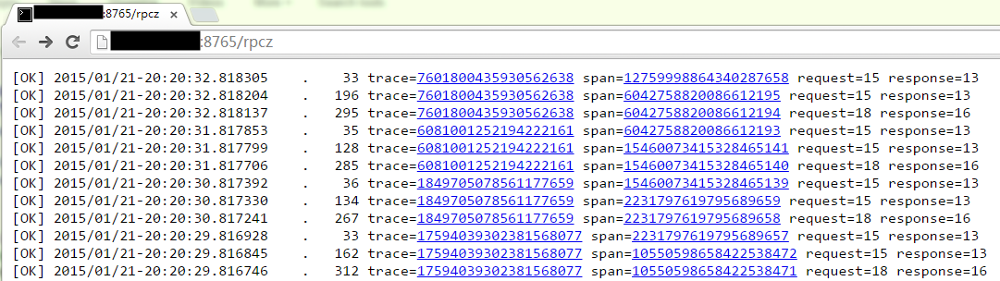
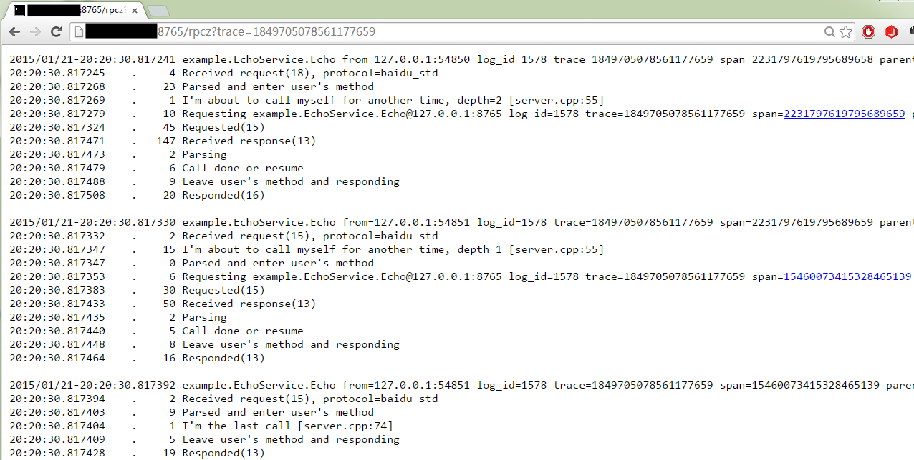

用户能通过/rpcz看到最近请求的详细信息，并可以插入注释（annotation），不同于tracing system（如[dapper](http://static.googleusercontent.com/media/research.google.com/en//pubs/archive/36356.pdf)）以全局视角看到整体系统的延时分布，rpcz更多是一个调试工具，虽然角色有所不同，但在brpc中rpcz和tracing的数据来源是一样的。当每秒请求数小于1万时，rpcz会记录所有的请求，超过1万时，rpcz会随机忽略一些请求把采样数控制在1万左右。rpcz可以淘汰时间窗口之前的数据，通过-span_keeping_seconds选项设置，默认1小时。[一个长期运行的例子](http://brpc.baidu.com:8765/rpcz)。

关于开销：我们的实现完全规避了线程竞争，开销极小，在qps 30万的测试场景中，观察不到明显的性能变化，对大部分应用而言应该是“free”的。即使采集了几千万条请求，rpcz也不会增加很多内存，一般在50兆以内。rpcz会占用一些磁盘空间（就像日志一样），如果设定为存一个小时的数据，一般在几百兆左右。

## 开关方法

默认不开启，加入[-enable_rpcz](http://brpc.baidu.com:8765/flags/*rpcz*)选项会在启动后开启。

| Name                       | Value                | Description                              | Defined At                             |
| -------------------------- | -------------------- | ---------------------------------------- | -------------------------------------- |
| enable_rpcz (R)            | true (default:false) | Turn on rpcz                             | src/baidu/rpc/builtin/rpcz_service.cpp |
| rpcz_hex_log_id (R)        | false                | Show log_id in hexadecimal               | src/baidu/rpc/builtin/rpcz_service.cpp |
| rpcz_database_dir          | ./rpc_data/rpcz      | For storing requests/contexts collected by rpcz. | src/baidu/rpc/span.cpp                 |
| rpcz_keep_span_db          | false                | Don't remove DB of rpcz at program's exit | src/baidu/rpc/span.cpp                 |
| rpcz_keep_span_seconds (R) | 3600                 | Keep spans for at most so many seconds   | src/baidu/rpc/span.cpp                 |

若启动时未加-enable_rpcz，则可在启动后访问SERVER_URL/rpcz/enable动态开启rpcz，访问SERVER_URL/rpcz/disable则关闭，这两个链接等价于访问SERVER_URL/flags/enable_rpcz?setvalue=true和SERVER_URL/flags/enable_rpcz?setvalue=false。在r31010之后，rpc在html版本中增加了一个按钮可视化地开启和关闭。


如果只是brpc client或没有使用brpc，看[这里](dummy_server.md)。 

## 数据展现

/rpcz展现的数据分为两层。

### 第一层

看到最新请求的概况，点击链接进入第二层。



### 第二层

看到某系列(trace)或某个请求(span)的详细信息。一般通过点击链接进入，也可以把trace=和span=作为query-string拼出链接



内容说明：

- 时间分为了绝对时间（如2015/01/21-20:20:30.817392，小数点后精确到微秒）和前一个时间的差值（如.    19，代表19微秒)。
- trace=ID有点像“session id”，对应一个系统中完成一次对外服务牵涉到的所有服务，即上下游server都共用一个trace-id。span=ID对应一个server或client中一个请求的处理过程。trace-id和span-id在概率上唯一。
- 第一层页面中的request=和response=后的是数据包的字节数，包括附件但不包括协议meta。第二层中request和response的字节数一般在括号里，比如"Responded(13)"中的13。
- 点击链接可能会访问其他server上的rpcz，点浏览器后退一般会返回到之前的页面位置。
- I'm the last call, I'm about to ...都是用户的annotation。

## Annotation

只要你使用了brpc，就可以使用[TRACEPRINTF](https://github.com/brpc/brpc/blob/master/src/brpc/traceprintf.h)打印内容到事件流中，比如：

```c++
TRACEPRINTF("Hello rpcz %d", 123);
```

这条annotation会按其发生时间插入到对应请求的rpcz中。从这个角度看，rpcz是请求级的日志。如果你用TRACEPRINTF打印了沿路的上下文，便可看到请求在每个阶段停留的时间，牵涉到的数据集和参数。这是个很有用的功能。

## 跨bthread传递trace上下文

有的业务在处理server请求的时候，会创建子bthread，在子bthread中发起rpc调用。默认情况下，子bthread中的rpc调用跟原来的请求无法建立关联，trace就会断掉。这种情况下，可以在创建子bthread时，指定BTHREAD_INHERIT_SPAN标志，来显式地建立trace上文关联，如：

```c++
bthread_attr_t attr = { BTHREAD_STACKTYPE_NORMAL, BTHREAD_INHERIT_SPAN, NULL };
bthread_start_urgent(&tid, &attr, thread_proc, arg);
```

注意：使用这种方式创建子bthread来发送rpc，请确保rpc在server返回response之前完成，否则可能导致使用被释放的Span对象而出core。
