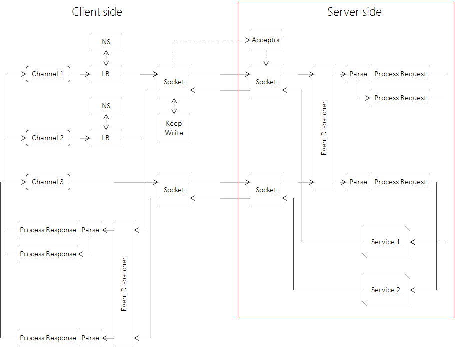

[English version](../en/server.md)

# 示例程序

Echo的[server端代码](https://github.com/brpc/brpc/blob/master/example/echo_c++/server.cpp)。

# 填写proto文件

请求、回复、服务的接口均定义在proto文件中。

```C++
# 告诉protoc要生成C++ Service基类，如果是java或python，则应分别修改为java_generic_services和py_generic_services
option cc_generic_services = true;
 
message EchoRequest {
      required string message = 1;
};
message EchoResponse {
      required string message = 1;
};
 
service EchoService {
      rpc Echo(EchoRequest) returns (EchoResponse);
};
```

protobuf的更多用法请阅读[protobuf官方文档](https://developers.google.com/protocol-buffers/docs/proto#options)。

# 实现生成的Service接口

protoc运行后会生成echo.pb.cc和echo.pb.h文件，你得include echo.pb.h，实现其中的EchoService基类：

```c++
#include "echo.pb.h"
...
class MyEchoService : public EchoService  {
public:
    void Echo(::google::protobuf::RpcController* cntl_base,
              const ::example::EchoRequest* request,
              ::example::EchoResponse* response,
              ::google::protobuf::Closure* done) {
        // 这个对象确保在return时自动调用done->Run()
        brpc::ClosureGuard done_guard(done);
         
        brpc::Controller* cntl = static_cast<brpc::Controller*>(cntl_base);
 
        // 填写response
        response->set_message(request->message());
    }
};
```

Service在插入[brpc.Server](https://github.com/brpc/brpc/blob/master/src/brpc/server.h)后才可能提供服务。

当客户端发来请求时，Echo()会被调用。参数的含义分别是：

**controller**

在brpc中可以静态转为brpc::Controller（前提是代码运行brpc.Server中），包含了所有request和response之外的参数集合，具体接口查阅[controller.h](https://github.com/brpc/brpc/blob/master/src/brpc/controller.h)

**request**

请求，只读的，来自client端的数据包。

**response**

回复。需要用户填充，如果存在**required**字段没有被设置，该次调用会失败。

**done**

done由框架创建，递给服务回调，包含了调用服务回调后的后续动作，包括检查response正确性，序列化，打包，发送等逻辑。

**不管成功失败，done->Run()必须在请求处理完成后被用户调用一次。**

为什么框架不自己调用done->Run()？这是为了允许用户把done保存下来，在服务回调之后的某事件发生时再调用，即实现**异步Service**。

强烈建议使用**ClosureGuard**确保done->Run()被调用，即在服务回调开头的那句：

```c++
brpc::ClosureGuard done_guard(done);
```

不管在中间还是末尾脱离服务回调，都会使done_guard析构，其中会调用done->Run()。这个机制称为[RAII](https://en.wikipedia.org/wiki/Resource_Acquisition_Is_Initialization)。没有这个的话你得在每次return前都加上done->Run()，**极易忘记**。

在异步Service中，退出服务回调时请求未处理完成，done->Run()不应被调用，done应被保存下来供以后调用，乍看起来，这里并不需要用ClosureGuard。但在实践中，异步Service照样会因各种原因跳出回调，如果不使用ClosureGuard，一些分支很可能会在return前忘记done->Run()，所以我们也建议在异步service中使用done_guard，与同步Service不同的是，为了避免正常脱离函数时done->Run()也被调用，你可以调用done_guard.release()来释放其中的done。

一般来说，同步Service和异步Service分别按如下代码处理done：

```c++
class MyFooService: public FooService  {
public:
    // 同步服务
    void SyncFoo(::google::protobuf::RpcController* cntl_base,
                 const ::example::EchoRequest* request,
                 ::example::EchoResponse* response,
                 ::google::protobuf::Closure* done) {
         brpc::ClosureGuard done_guard(done);
         ...
    }
 
    // 异步服务
    void AsyncFoo(::google::protobuf::RpcController* cntl_base,
                  const ::example::EchoRequest* request,
                  ::example::EchoResponse* response,
                  ::google::protobuf::Closure* done) {
         brpc::ClosureGuard done_guard(done);
         ...
         done_guard.release();
    }
};
```

ClosureGuard的接口如下：

```c++
// RAII: Call Run() of the closure on destruction.
class ClosureGuard {
public:
    ClosureGuard();
    // Constructed with a closure which will be Run() inside dtor.
    explicit ClosureGuard(google::protobuf::Closure* done);
    
    // Call Run() of internal closure if it's not NULL.
    ~ClosureGuard();
 
    // Call Run() of internal closure if it's not NULL and set it to `done'.
    void reset(google::protobuf::Closure* done);
 
    // Set internal closure to NULL and return the one before set.
    google::protobuf::Closure* release();
};
```

## 标记当前调用为失败

调用Controller.SetFailed()可以把当前调用设置为失败，当发送过程出现错误时，框架也会调用这个函数。用户一般是在服务的CallMethod里调用这个函数，比如某个处理环节出错，SetFailed()后确认done->Run()被调用了就可以跳出函数了(若使用了ClosureGuard，跳出函数时会自动调用done，不用手动)。Server端的done的逻辑主要是发送response回client，当其发现用户调用了SetFailed()后，会把错误信息送回client。client收到后，它的Controller::Failed()会为true（成功时为false），Controller::ErrorCode()和Controller::ErrorText()则分别是错误码和错误信息。

用户可以为http访问设置[status-code](http://www.w3.org/Protocols/rfc2616/rfc2616-sec10.html)，在server端一般是调用`controller.http_response().set_status_code()`，标准的status-code定义在[http_status_code.h](https://github.com/brpc/brpc/blob/master/src/brpc/http_status_code.h)中。Controller.SetFailed也会设置status-code，值是与错误码含义最接近的status-code，没有相关的则填500错误(brpc::HTTP_STATUS_INTERNAL_SERVER_ERROR)。如果你要覆盖status_code，设置代码一定要放在SetFailed()后，而不是之前。

## 获取Client的地址

`controller->remote_side()`可获得发送该请求的client地址和端口，类型是butil::EndPoint。如果client是nginx，remote_side()是nginx的地址。要获取真实client的地址，可以在nginx里设置`proxy_header ClientIp $remote_addr;`, 在rpc中通过`controller->http_request().GetHeader("ClientIp")`获得对应的值。

打印方式：

```c++
LOG(INFO) << "remote_side=" << cntl->remote_side(); 
printf("remote_side=%s\n", butil::endpoint2str(cntl->remote_side()).c_str());
```

## 获取Server的地址

controller->local_side()获得server端的地址，类型是butil::EndPoint。

打印方式：

```c++
LOG(INFO) << "local_side=" << cntl->local_side(); 
printf("local_side=%s\n", butil::endpoint2str(cntl->local_side()).c_str());
```

## 异步Service

即done->Run()在Service回调之外被调用。

有些server以等待后端服务返回结果为主，且处理时间特别长，为了及时地释放出线程资源，更好的办法是把done注册到被等待事件的回调中，等到事件发生后再调用done->Run()。

异步service的最后一行一般是done_guard.release()以确保正常退出CallMethod时不会调用done->Run()。例子请看[example/session_data_and_thread_local](https://github.com/brpc/brpc/tree/master/example/session_data_and_thread_local/)。

Service和Channel都可以使用done来表达后续的操作，但它们是**完全不同**的，请勿混淆：

* Service的done由框架创建，用户处理请求后调用done把response发回给client。
* Channel的done由用户创建，待RPC结束后被框架调用以执行用户的后续代码。

在一个会访问下游服务的异步服务中会同时接触两者，容易搞混，请注意区分。

# 加入Service

默认构造后的Server不包含任何服务，也不会对外提供服务，仅仅是一个对象。

通过如下方法插入你的Service实例。

```c++
int AddService(google::protobuf::Service* service, ServiceOwnership ownership);
```

若ownership参数为SERVER_OWNS_SERVICE，Server在析构时会一并删除Service，否则应设为SERVER_DOESNT_OWN_SERVICE。

插入MyEchoService代码如下：

```c++
brpc::Server server;
MyEchoService my_echo_service;
if (server.AddService(&my_echo_service, brpc::SERVER_DOESNT_OWN_SERVICE) != 0) {
    LOG(FATAL) << "Fail to add my_echo_service";
    return -1;
}
```

Server启动后你无法再修改其中的Service。

# 启动

调用以下[Server](https://github.com/brpc/brpc/blob/master/src/brpc/server.h)的接口启动服务。

```c++
int Start(const char* ip_and_port_str, const ServerOptions* opt);
int Start(EndPoint ip_and_port, const ServerOptions* opt);
int Start(int port, const ServerOptions* opt);
int Start(const char *ip_str, PortRange port_range, const ServerOptions *opt);  // r32009后增加
```

合法的`ip_and_port_str`：

- 127.0.0.1:80    # IPV4
- [::1]:8080      # IPV6
- unix:path.sock  # Unix domain socket

关于IPV6和Unix domain socket的使用，详见 [EndPoint](endpoint.md)。

`options`为NULL时所有参数取默认值，如果你要使用非默认值，这么做就行了：

```c++
brpc::ServerOptions options;  // 包含了默认值
options.xxx = yyy;
...
server.Start(..., &options);
```

## 监听多个端口

一个server只能监听一个端口（不考虑ServerOptions.internal_port），需要监听N个端口就起N个Server。

## 多进程监听一个端口

启动时开启`reuse_port`这个flag，就可以多进程共同监听一个端口（底层是SO_REUSEPORT）。

# 停止

```c++
server.Stop(closewait_ms); // closewait_ms实际无效，出于历史原因未删
server.Join();
```

Stop()不会阻塞，Join()会。分成两个函数的原因在于当多个Server需要退出时，可以先全部Stop再一起Join，如果一个个Stop/Join，可能得花费Server个数倍的等待时间。

不管closewait_ms是什么值，server在退出时会等待所有正在被处理的请求完成，同时对新请求立刻回复ELOGOFF错误以防止新请求加入。这么做的原因在于只要server退出时仍有处理线程运行，就有访问到已释放内存的风险。如果你的server“退不掉”，很有可能是由于某个检索线程没结束或忘记调用done了。

当client看到ELOGOFF时，会跳过对应的server，并在其他server上重试对应的请求。所以在一般情况下brpc总是“优雅退出”的，重启或上线时几乎不会或只会丢失很少量的流量。

RunUntilAskedToQuit()函数可以在大部分情况下简化server的运转和停止代码。在server.Start后，只需如下代码即会让server运行直到按到Ctrl-C。

```c++
// Wait until Ctrl-C is pressed, then Stop() and Join() the server.
server.RunUntilAskedToQuit();
 
// server已经停止了，这里可以写释放资源的代码。
```

Join()完成后可以修改其中的Service，并重新Start。

# 被http/h2访问

使用Protobuf的服务通常可以通过http/h2+json访问，存于body的json串可与对应protobuf消息相互自动转化。

以[echo server](https://github.com/brpc/brpc/blob/master/example/echo_c%2B%2B/server.cpp)为例，你可以用[curl](https://curl.haxx.se/)访问这个服务。

```shell
# -H 'Content-Type: application/json' is optional
$ curl -d '{"message":"hello"}' http://brpc.baidu.com:8765/EchoService/Echo
{"message":"hello"}
```

注意：也可以指定`Content-Type: application/proto`用http/h2+protobuf二进制串访问服务，序列化性能更好。

## json<=>pb

json字段通过匹配的名字和结构与pb字段一一对应。json中一定要包含pb的required字段，否则转化会失败，对应请求会被拒绝。json中可以包含pb中没有定义的字段，但它们会被丢弃而不会存入pb的unknown字段。转化规则详见[json <=> protobuf](json2pb.md)。

开启选项-pb_enum_as_number后，pb中的enum会转化为它的数值而不是名字，比如在`enum MyEnum { Foo = 1; Bar = 2; };`中不开启此选项时MyEnum类型的字段会转化为"Foo"或"Bar"，开启后为1或2。此选项同时影响client发出的请求和server返回的回复。由于转化为名字相比数值有更好的前后兼容性，此选项只应用于兼容无法处理enum为名字的老代码。

## 兼容早期版本client

早期的brpc允许一个pb service被http协议访问时不填充pb请求，即使里面有required字段。一般来说这种service会自行解析http请求和设置http回复，并不会访问pb请求。但这也是非常危险的行为，毕竟这是pb service，但pb请求却是未定义的。

这种服务在升级到新版本rpc时会遇到障碍，因为brpc已不允许这种行为。为了帮助这种服务升级，brpc允许经过一些设置后不把http body自动转化为pb request(从而可自行处理），方法如下：

```c++
brpc::ServiceOptions svc_opt;
svc_opt.ownership = ...;
svc_opt.restful_mappings = ...;
svc_opt.allow_http_body_to_pb = false; //关闭http/h2 body至pb request的自动转化
server.AddService(service, svc_opt);
```

如此设置后service收到http/h2请求后不会尝试把body转化为pb请求，所以pb请求总是未定义状态，用户得在`cntl->request_protocol() == brpc::PROTOCOL_HTTP || cntl->request_protocol() == brpc::PROTOCOL_H2`成立时自行解析body。

相应地，当cntl->response_attachment()不为空且pb回复不为空时，框架不再报错，而是直接把cntl->response_attachment()作为回复的body。这个功能和设置allow_http_body_to_pb与否无关。如果放开自由度导致过多的用户犯错，可能会有进一步的调整。

# 协议支持

server端会自动尝试其支持的协议，无需用户指定。`cntl->protocol()`可获得当前协议。server能从一个listen端口建立不同协议的连接，不需要为不同的协议使用不同的listen端口，一个连接上也可以传输多种协议的数据包, 但一般不会这么做(也不建议)，支持的协议有：

- [百度标准协议](baidu_std.md)，显示为"baidu_std"，默认启用。

- [流式RPC协议](streaming_rpc.md)，显示为"streaming_rpc", 默认启用。

- http/1.0和http/1.1协议，显示为”http“，默认启用。

- http/2和gRPC协议，显示为"h2c"(未加密)或"h2"(加密)，默认启用。

- RTMP协议，显示为"rtmp", 默认启用。

- hulu-pbrpc的协议，显示为"hulu_pbrpc"，默认启动。

- sofa-pbrpc的协议，显示为”sofa_pbrpc“, 默认启用。

- 百盟的协议，显示为”nova_pbrpc“, 默认不启用，开启方式：

  ```c++
  #include <brpc/policy/nova_pbrpc_protocol.h>
  ...
  ServerOptions options;
  ...
  options.nshead_service = new brpc::policy::NovaServiceAdaptor;
  ```

- public_pbrpc协议，显示为"public_pbrpc"，默认不启用，开启方式：

  ```c++
  #include <brpc/policy/public_pbrpc_protocol.h>
  ...
  ServerOptions options;
  ...
  options.nshead_service = new brpc::policy::PublicPbrpcServiceAdaptor;
  ```

- nshead+mcpack协议，显示为"nshead_mcpack"，默认不启用，开启方式：

  ```c++
  #include <brpc/policy/nshead_mcpack_protocol.h>
  ...
  ServerOptions options;
  ...
  options.nshead_service = new brpc::policy::NsheadMcpackAdaptor;
  ```

  顾名思义，这个协议的数据包由nshead+mcpack构成，mcpack中不包含特殊字段。不同于用户基于NsheadService的实现，这个协议使用了mcpack2pb，使得一份代码可以同时处理mcpack和pb两种格式。由于没有传递ErrorText的字段，当发生错误时server只能关闭连接。

- 和UB相关的协议请阅读[实现NsheadService](nshead_service.md)。

如果你有更多的协议需求，可以联系我们。

# fork without exec
一般来说，[fork](https://linux.die.net/man/3/fork)出的子进程应尽快调用[exec](https://linux.die.net/man/3/exec)以重置所有状态，中间只应调用满足async-signal-safe的函数。这么使用fork的brpc程序在之前的版本也不会有问题。

但在一些场景中，用户想直接运行fork出的子进程，而不调用exec。由于fork只复制其调用者的线程，其余线程便随之消失了。对应到brpc中，bvar会依赖一个sampling_thread采样各种信息，在fork后便消失了，现象是很多bvar归零。

最新版本的brpc会在fork后重建这个线程(如有必要)，从而使bvar在fork后能正常工作，再次fork也可以。已知问题是fork后cpu profiler不正常。然而，这并不意味着用户可随意地fork，不管是brpc还是上层应用都会大量地创建线程，它们在fork后不会被重建，因为：
* 大部分fork会紧接exec，浪费了重建
* 给代码编写带来很多的麻烦和复杂度

brpc的策略是按需创建这类线程，同时fork without exec必须发生在所有可能创建这些线程的代码前。具体地说，至少**发生在初始化所有Server/Channel/应用代码前**，越早越好，不遵守这个约定的fork会导致程序不正常。另外，不支持fork without exec的lib相当普遍，最好避免这种用法。

# 设置

## 版本

Server.set_version(...)可以为server设置一个名称+版本，可通过/version内置服务访问到。虽然叫做"version“，但设置的值请包含服务名，而不仅仅是一个数字版本。

## 关闭闲置连接

如果一个连接在ServerOptions.idle_timeout_sec对应的时间内没有读取或写出数据，则被视为”闲置”而被server主动关闭。默认值为-1，代表不开启。

打开[-log_idle_connection_close](http://brpc.baidu.com:8765/flags/log_idle_connection_close)后关闭前会打印一条日志。

| Name                      | Value | Description                              | Defined At          |
| ------------------------- | ----- | ---------------------------------------- | ------------------- |
| log_idle_connection_close | false | Print log when an idle connection is closed | src/brpc/socket.cpp |

## pid_file

如果设置了此字段，Server启动时会创建一个同名文件，内容为进程号。默认为空。

## 在每条日志后打印hostname

此功能只对[butil/logging.h](https://github.com/brpc/brpc/blob/master/src/butil/logging.h)中的日志宏有效。

打开[-log_hostname](http://brpc.baidu.com:8765/flags/log_hostname)后每条日志后都会带本机名称，如果所有的日志需要汇总到一起进行分析，这个功能可以帮助你了解某条日志来自哪台机器。

## 打印FATAL日志后退出程序

此功能只对[butil/logging.h](https://github.com/brpc/brpc/blob/master/src/butil/logging.h)中的日志宏有效，glog默认在FATAL日志时crash。

打开[-crash_on_fatal_log](http://brpc.baidu.com:8765/flags/crash_on_fatal_log)后如果程序使用LOG(FATAL)打印了异常日志或违反了CHECK宏中的断言，那么程序会在打印日志后abort，这一般也会产生coredump文件，默认不打开。这个开关可在对程序的压力测试中打开，以确认程序没有进入过严重错误的分支。

> 一般的惯例是，ERROR表示可容忍的错误，FATAL代表不可逆转的错误。

## 最低日志级别

此功能由[butil/logging.h](https://github.com/brpc/brpc/blob/master/src/butil/logging.h)和glog各自实现，为同名选项。

只有**不低于**-minloglevel指定的日志级别的日志才会被打印。这个选项可以动态修改。设置值和日志级别的对应关系：0=INFO 1=NOTICE 2=WARNING 3=ERROR 4=FATAL，默认为0。

未打印日志的开销只是一次if判断，也不会评估参数(比如某个参数调用了函数，日志不打，这个函数就不会被调用）。如果日志最终打印到自定义LogSink，那么还要经过LogSink的过滤。

## 归还空闲内存至系统

选项-free_memory_to_system_interval表示每过这么多秒就尝试向系统归还空闲内存，<= 0表示不开启，默认值为0，若开启建议设为10及以上的值。此功能支持tcmalloc，之前程序中对`MallocExtension::instance()->ReleaseFreeMemory()`的定期调用可改成设置此选项。

## 打印发送给client的错误

server的框架部分一般不针对个别client打印错误日志，因为当大量client出现错误时，可能导致server高频打印日志而严重影响性能。但有时为了调试问题，或就是需要让server打印错误，打开参数[-log_error_text](http://brpc.baidu.com:8765/flags/log_error_text)即可。

## 定制延时的分位值

显示的服务延时分位值**默认**为**80** (曾经为50), 90, 99, 99.9, 99.99，前三项可分别通过-bvar_latency_p1, -bvar_latency_p2, -bvar_latency_p3三个gflags定制。

以下是正确的设置：
```shell
-bvar_latency_p3=97   # p3从默认99修改为97
-bvar_latency_p1=60 -bvar_latency_p2=80 -bvar_latency_p3=95
```
以下是错误的设置：
```shell
-bvar_latency_p3=100   # 设置值必须在[1,99]闭区间内，gflags解析会失败
-bvar_latency_p1=-1    # 同上
```

## 设置栈大小

brpc的Server是运行在bthread之上，默认栈大小为1MB，而pthread默认栈大小为10MB，所以在pthread上正常运行的程序，在bthread上可能遇到栈不足。

可设置如下的gflag以调整栈的大小:
```shell
--stack_size_normal=10000000    # 表示调整栈大小为10M左右
--tc_stack_normal=1             # 默认为8，表示每个worker缓存的栈的个数(以加快分配速度)，size越大，缓存数目可以适当调小(以减少内存占用)
```
注意：不是说程序coredump就意味着”栈不够大“，只是因为这个试起来最容易，所以优先排除掉可能性。事实上百度内如此多的应用也很少碰到栈不够大的情况。

## 限制最大消息

为了保护server和client，当server收到的request或client收到的response过大时，server或client会拒收并关闭连接。此最大尺寸由[-max_body_size](http://brpc.baidu.com:8765/flags/max_body_size)控制，单位为字节。

超过最大消息时会打印如下错误日志：

```
FATAL: 05-10 14:40:05: * 0 src/brpc/input_messenger.cpp:89] A message from 127.0.0.1:35217(protocol=baidu_std) is bigger than 67108864 bytes, the connection will be closed. Set max_body_size to allow bigger messages
```

protobuf中有[类似的限制](https://github.com/google/protobuf/blob/master/src/google/protobuf/io/coded_stream.h#L364)，出错时会打印如下日志：

```
FATAL: 05-10 13:35:02: * 0 google/protobuf/io/coded_stream.cc:156] A protocol message was rejected because it was too big (more than 67108864 bytes). To increase the limit (or to disable these warnings), see CodedInputStream::SetTotalBytesLimit() in google/protobuf/io/coded_stream.h.
```

brpc移除了protobuf中的限制，全交由此选项控制，只要-max_body_size足够大，用户就不会看到错误日志。此功能对protobuf的版本没有要求。

## 压缩

set_response_compress_type()设置response的压缩方式，默认不压缩。

注意附件不会被压缩。HTTP body的压缩方法见[这里](http_service.md#压缩response-body)。

支持的压缩方法有：

- brpc::CompressTypeSnappy : [snanpy压缩](http://google.github.io/snappy/)，压缩和解压显著快于其他压缩方法，但压缩率最低。
- brpc::CompressTypeGzip : [gzip压缩](http://en.wikipedia.org/wiki/Gzip)，显著慢于snappy，但压缩率高
- brpc::CompressTypeZlib : [zlib压缩](http://en.wikipedia.org/wiki/Zlib)，比gzip快10%~20%，压缩率略好于gzip，但速度仍明显慢于snappy。

更具体的性能对比见[Client-压缩](client.md#压缩).

## 附件

baidu_std和hulu_pbrpc协议支持传递附件，这段数据由用户自定义，不经过protobuf的序列化。站在server的角度，设置在Controller.response_attachment()的附件会被client端收到，Controller.request_attachment()则包含了client端送来的附件。

附件不会被框架压缩。

在http协议中，附件对应[message body](http://www.w3.org/Protocols/rfc2616/rfc2616-sec4.html)，比如要返回的数据就设置在response_attachment()中。

## 开启SSL

要开启SSL，首先确保代码依赖了最新的openssl库。如果openssl版本很旧，会有严重的安全漏洞，支持的加密算法也少，违背了开启SSL的初衷。然后设置`ServerOptions.ssl_options`，具体见[ssl_options.h](https://github.com/brpc/brpc/blob/master/src/brpc/ssl_options.h)。

```c++
// Certificate structure
struct CertInfo {
    // Certificate in PEM format.
    // Note that CN and alt subjects will be extracted from the certificate,
    // and will be used as hostnames. Requests to this hostname (provided SNI
    // extension supported) will be encrypted using this certifcate.
    // Supported both file path and raw string
    std::string certificate;

    // Private key in PEM format.
    // Supported both file path and raw string based on prefix:
    std::string private_key;

    // Additional hostnames besides those inside the certificate. Wildcards
    // are supported but it can only appear once at the beginning (i.e. *.xxx.com).
    std::vector<std::string> sni_filters;
};

// SSL options at server side
struct ServerSSLOptions {
    // Default certificate which will be loaded into server. Requests
    // without hostname or whose hostname doesn't have a corresponding
    // certificate will use this certificate. MUST be set to enable SSL.
    CertInfo default_cert;
    
    // Additional certificates which will be loaded into server. These
    // provide extra bindings between hostnames and certificates so that
    // we can choose different certificates according to different hostnames.
    // See `CertInfo' for detail.
    std::vector<CertInfo> certs;
    
    // When set, requests without hostname or whose hostname can't be found in
    // any of the cerficates above will be dropped. Otherwise, `default_cert'
    // will be used.
    // Default: false
    bool strict_sni;
 
    // ... Other options
};
```

- Server端开启SSL**必须**要设置一张默认证书`default_cert`（默认SSL连接都用此证书），如果希望server能支持动态选择证书（如根据请求中域名，见[SNI](https://en.wikipedia.org/wiki/Server_Name_Indication)机制），则可以将这些证书加载到`certs`。最后用户还可以在Server运行时，动态增减这些动态证书：

  ```c++
  int AddCertificate(const CertInfo& cert);
  int RemoveCertificate(const CertInfo& cert);
  int ResetCertificates(const std::vector<CertInfo>& certs);
  ```

- 其余选项还包括：密钥套件选择（推荐密钥ECDHE-RSA-AES256-GCM-SHA384，chrome默认第一优先密钥，安全性很高，但比较耗性能）、session复用等。

- SSL层在协议层之下（作用在Socket层），即开启后，所有协议（如HTTP）都支持用SSL加密后传输到Server，Server端会先进行SSL解密后，再把原始数据送到各个协议中去。

- SSL开启后，端口仍然支持非SSL的连接访问，Server会自动判断哪些是SSL，哪些不是。如果要屏蔽非SSL访问，用户可通过`Controller::is_ssl()`判断是否是SSL，同时在[connections](connections.md)内置监控上也可以看到连接的SSL信息。

## 验证client身份

如果server端要开启验证功能，需要实现`Authenticator`中的接口:

```c++
class Authenticator {
public:
    // Implement this method to verify credential information `auth_str' from
    // `client_addr'. You can fill credential context (result) into `*out_ctx'
    // and later fetch this pointer from `Controller'.
    // Returns 0 on success, error code otherwise
    virtual int VerifyCredential(const std::string& auth_str,
                                 const base::EndPoint& client_addr,
                                 AuthContext* out_ctx) const = 0;
    }; 

class AuthContext {
public:
    const std::string& user() const;
    const std::string& group() const;
    const std::string& roles() const;
    const std::string& starter() const;
    bool is_service() const;
};
```

server的验证是基于连接的。当server收到连接上的第一个请求时，会尝试解析出其中的身份信息部分（如baidu_std里的auth字段、HTTP协议里的Authorization头），然后附带client地址信息一起调用`VerifyCredential`。若返回0，表示验证成功，用户可以把验证后的信息填入`AuthContext`，后续可通过`controller->auth_context()`获取，用户不需要关心其分配和释放。否则表示验证失败，连接会被直接关闭，client访问失败。

后续请求默认通过验证么，没有认证开销。

把实现的`Authenticator`实例赋值到`ServerOptions.auth`，即开启验证功能，需要保证该实例在整个server运行周期内都有效，不能被析构。

## worker线程数

设置ServerOptions.num_threads即可，默认是cpu core的个数（包含超线程的）。

注意: ServerOptions.num_threads仅仅是个**提示**。

你不能认为Server就用了这么多线程，因为进程内的所有Server和Channel会共享线程资源，线程总数是所有ServerOptions.num_threads和-bthread_concurrency中的最大值。比如一个程序内有两个Server，num_threads分别为24和36，bthread_concurrency为16。那么worker线程数为max(24, 36, 16) = 36。这不同于其他RPC实现中往往是加起来。

Channel没有相应的选项，但可以通过选项-bthread_concurrency调整。

另外，brpc**不区分IO线程和处理线程**。brpc知道如何编排IO和处理代码，以获得更高的并发度和线程利用率。

## 限制最大并发

“并发”可能有两种含义，一种是连接数，一种是同时在处理的请求数。这里提到的是后者。

在传统的同步server中，最大并发不会超过工作线程数，设定工作线程数量一般也限制了并发。但brpc的请求运行于bthread中，M个bthread会映射至N个worker中（一般M大于N），所以同步server的并发度可能超过worker数量。另一方面，虽然异步server的并发不受线程数控制，但有时也需要根据其他因素控制并发量。

brpc支持设置server级和method级的最大并发，当server或method同时处理的请求数超过并发度限制时，它会立刻给client回复**brpc::ELIMIT**错误，而不会调用服务回调。看到ELIMIT错误的client应重试另一个server。这个选项可以防止server出现过度排队，或用于限制server占用的资源。

默认不开启。

### 为什么超过最大并发要立刻给client返回错误而不是排队？

当前server达到最大并发并不意味着集群中的其他server也达到最大并发了，立刻让client获知错误，并去尝试另一台server在全局角度是更好的策略。

### 为什么不限制QPS?

QPS是一个秒级的指标，无法很好地控制瞬间的流量爆发。而最大并发和当前可用的重要资源紧密相关："工作线程"，“槽位”等，能更好地抑制排队。

另外当server的延时较为稳定时，限制并发的效果和限制QPS是等价的。但前者实现起来容易多了：只需加减一个代表并发度的计数器。这也是大部分流控都限制并发而不是QPS的原因，比如TCP中的“窗口"即是一种并发度。

### 计算最大并发数

最大并发度 = 极限QPS * 低负载延时  ([little's law](https://en.wikipedia.org/wiki/Little%27s_law))

极限QPS指的是server能达到的最大qps，低负载延时指的是server在没有严重积压请求的前提下时的平均延时。一般的服务上线都会有性能压测，把测得的QPS和延时相乘一般就是该服务的最大并发度。

### 限制server级别并发度

设置ServerOptions.max_concurrency，默认值0代表不限制。访问内置服务不受此选项限制。

Server.ResetMaxConcurrency()可在server启动后动态修改server级别的max_concurrency。

### 限制method级别并发度

server.MaxConcurrencyOf("...") = ...可设置method级别的max_concurrency。也可以通过设置ServerOptions.method_max_concurrency一次性为所有的method设置最大并发。
当ServerOptions.method_max_concurrency和server.MaxConcurrencyOf("...")=...同时被设置时，使用server.MaxConcurrencyOf()所设置的值。

```c++
ServerOptions.method_max_concurrency = 20;                   // Set the default maximum concurrency for all methods
server.MaxConcurrencyOf("example.EchoService.Echo") = 10;    // Give priority to the value set by server.MaxConcurrencyOf()
server.MaxConcurrencyOf("example.EchoService", "Echo") = 10;
server.MaxConcurrencyOf(&service, "Echo") = 10;
server.MaxConcurrencyOf("example.EchoService.Echo") = "10";  // You can also assign a string value
```

此设置一般**发生在AddService后，server启动前**。当设置失败时（比如对应的method不存在），server会启动失败同时提示用户修正MaxConcurrencyOf设置错误。

当method级别和server级别的max_concurrency都被设置时，先检查server级别的，再检查method级别的。

注意：没有service级别的max_concurrency。

### 使用自适应限流算法
实际生产环境中,最大并发未必一成不变，在每次上线前逐个压测和设置服务的最大并发也很繁琐。这个时候可以使用自适应限流算法。

自适应限流是method级别的。要使用自适应限流算法，把method的最大并发度设置为"auto"即可:

```c++
// Set auto concurrency limiter for all methods
brpc::ServerOptions options;
options.method_max_concurrency = "auto";

// Set auto concurrency limiter for specific method
server.MaxConcurrencyOf("example.EchoService.Echo") = "auto";
```
关于自适应限流的更多细节可以看[这里](auto_concurrency_limiter.md)

## pthread模式

用户代码（客户端的done，服务器端的CallMethod）默认在栈为1MB的bthread中运行。但有些用户代码无法在bthread中运行，比如：

- JNI会检查stack layout而无法在bthread中运行。
- 代码中广泛地使用pthread local传递session级别全局数据，在RPC前后均使用了相同的pthread local的数据，且数据有前后依赖性。比如在RPC前往pthread-local保存了一个值，RPC后又读出来希望和之前保存的相等，就会有问题。而像tcmalloc虽然也使用了pthread/LWP local，但每次使用之间没有直接的依赖，是安全的。

对于这些情况，brpc提供了pthread模式，开启**-usercode_in_pthread**后，用户代码均会在pthread中运行，原先阻塞bthread的函数转而阻塞pthread。

注意：开启-usercode_in_pthread后，brpc::thread_local_data()不保证能获取到值。

打开pthread模式后在性能上的注意点：

- 同步RPC都会阻塞worker pthread，server端一般需要设置更多的工作线程(ServerOptions.num_threads)，调度效率会略微降低。
- 运行用户代码的仍然是bthread，只是很特殊，会直接使用pthread worker的栈。这些特殊bthread的调度方式和其他bthread是一致的，这方面性能差异很小。
- bthread支持一个独特的功能：把当前使用的pthread worker 让给另一个新创建的bthread运行，以消除一次上下文切换。brpc client利用了这点，从而使一次RPC过程中3次上下文切换变为了2次。在高QPS系统中，消除上下文切换可以明显改善性能和延时分布。但pthread模式不具备这个能力，在高QPS系统中性能会有一定下降。
- pthread模式中线程资源是硬限，一旦线程被打满，请求就会迅速拥塞而造成大量超时。一个常见的例子是：下游服务大量超时后，上游服务可能由于线程大都在等待下游也被打满从而影响性能。开启pthread模式后请考虑设置ServerOptions.max_concurrency以控制server的最大并发。而在bthread模式中bthread个数是软限，对此类问题的反应会更加平滑。

pthread模式可以让一些老代码快速尝试brpc，但我们仍然建议逐渐地把代码改造为使用bthread local或最好不用TLS，从而最终能关闭这个开关。

## 安全模式

如果你的服务流量来自外部（包括经过nginx等转发），你需要注意一些安全因素：

### 对外隐藏内置服务

内置服务很有用，但包含了大量内部信息，不应对外暴露。有多种方式可以对外隐藏内置服务：

- 设置内部端口。把ServerOptions.internal_port设为一个**仅允许内网访问**的端口。你可通过internal_port访问到内置服务，但通过对外端口(Server.Start时传入的那个)访问内置服务时将看到如下错误：

  ```
  [a27eda84bcdeef529a76f22872b78305] Not allowed to access builtin services, try ServerOptions.internal_port=... instead if you're inside internal network
  ```

- http proxy指定转发路径。nginx等可配置URL的映射关系，比如下面的配置把访问/MyAPI的外部流量映射到`target-server`的`/ServiceName/MethodName`。当外部流量尝试访问内置服务，比如说/status时，将直接被nginx拒绝。
```nginx
  location /MyAPI {
      ...
      proxy_pass http://<target-server>/ServiceName/MethodName$query_string   # $query_string是nginx变量，更多变量请查询http://nginx.org/en/docs/http/ngx_http_core_module.html
      ...
  }
```
**请勿在对外服务上开启**-enable_dir_service和-enable_threads_service两个选项，它们虽然很方便，但会严重泄露服务器上的其他信息。检查对外的rpc服务是否打开了这两个开关：

```shell
curl -s -m 1 <HOSTNAME>:<PORT>/flags/enable_dir_service,enable_threads_service | awk '{if($3=="false"){++falsecnt}else if($3=="Value"){isrpc=1}}END{if(isrpc!=1||falsecnt==2){print "SAFE"}else{print "NOT SAFE"}}'
```
### 完全禁用内置服务

设置ServerOptions.has_builtin_services = false，可以完全禁用内置服务。

### 转义外部可控的URL

可调用brpc::WebEscape()对url进行转义，防止恶意URI注入攻击。

### 不返回内部server地址

可以考虑对server地址做签名。比如在设置ServerOptions.internal_port后，server返回的错误信息中的IP信息是其MD5签名，而不是明文。

## 定制/health页面

/health页面默认返回"OK"，若需定制/health页面的内容：先继承[HealthReporter](https://github.com/brpc/brpc/blob/master/src/brpc/health_reporter.h)，在其中实现生成页面的逻辑（就像实现其他http service那样），然后把实例赋给ServerOptions.health_reporter，这个实例不被server拥有，必须保证在server运行期间有效。用户在定制逻辑中可以根据业务的运行状态返回更多样的状态信息。

## 线程私有变量

百度内的检索程序大量地使用了[thread-local storage](https://en.wikipedia.org/wiki/Thread-local_storage) (缩写TLS)，有些是为了缓存频繁访问的对象以避免反复创建，有些则是为了在全局函数间隐式地传递状态。你应当尽量避免后者，这样的函数难以测试，不设置thread-local变量甚至无法运行。brpc中有三套机制解决和thread-local相关的问题。

### session-local

session-local data与一次server端RPC绑定: 从进入service回调开始，到调用server端的done结束，不管该service是同步还是异步处理。 session-local data会尽量被重用，在server停止前不会被删除。

设置ServerOptions.session_local_data_factory后访问Controller.session_local_data()即可获得session-local数据。若没有设置，Controller.session_local_data()总是返回NULL。

若ServerOptions.reserved_session_local_data大于0，Server会在提供服务前就创建这么多个数据。

**示例用法**

```c++
struct MySessionLocalData {
    MySessionLocalData() : x(123) {}
    int x;
};
 
class EchoServiceImpl : public example::EchoService {
public:
    ...
    void Echo(google::protobuf::RpcController* cntl_base,
              const example::EchoRequest* request,
              example::EchoResponse* response,
              google::protobuf::Closure* done) {
        ...
        brpc::Controller* cntl = static_cast<brpc::Controller*>(cntl_base);
 
        // Get the session-local data which is created by ServerOptions.session_local_data_factory
        // and reused between different RPC.
        MySessionLocalData* sd = static_cast<MySessionLocalData*>(cntl->session_local_data());
        if (sd == NULL) {
            cntl->SetFailed("Require ServerOptions.session_local_data_factory to be set with a correctly implemented instance");
            return;
        }
        ...
```

```c++
struct ServerOptions {
    ...
    // The factory to create/destroy data attached to each RPC session.
    // If this field is NULL, Controller::session_local_data() is always NULL.
    // NOT owned by Server and must be valid when Server is running.
    // Default: NULL
    const DataFactory* session_local_data_factory;
 
    // Prepare so many session-local data before server starts, so that calls
    // to Controller::session_local_data() get data directly rather than
    // calling session_local_data_factory->Create() at first time. Useful when
    // Create() is slow, otherwise the RPC session may be blocked by the
    // creation of data and not served within timeout.
    // Default: 0
    size_t reserved_session_local_data;
};
```

session_local_data_factory的类型为[DataFactory](https://github.com/brpc/brpc/blob/master/src/brpc/data_factory.h)，你需要实现其中的CreateData和DestroyData。

注意：CreateData和DestroyData会被多个线程同时调用，必须线程安全。

```c++
class MySessionLocalDataFactory : public brpc::DataFactory {
public:
    void* CreateData() const {
        return new MySessionLocalData;
    }  
    void DestroyData(void* d) const {
        delete static_cast<MySessionLocalData*>(d);
    }  
};

MySessionLocalDataFactory g_session_local_data_factory;

int main(int argc, char* argv[]) {
    ...
 
    brpc::Server server;
    brpc::ServerOptions options;
    ...
    options.session_local_data_factory = &g_session_local_data_factory;
    ...
```

### server-thread-local

server-thread-local与一次service回调绑定，从进service回调开始，到出service回调结束。所有的server-thread-local data会被尽量重用，在server停止前不会被删除。在实现上server-thread-local是一个特殊的bthread-local。

设置ServerOptions.thread_local_data_factory后访问brpc::thread_local_data()即可获得thread-local数据。若没有设置，brpc::thread_local_data()总是返回NULL。

若ServerOptions.reserved_thread_local_data大于0，Server会在启动前就创建这么多个数据。

**与session-local的区别**

session-local data得从server端的Controller获得， server-thread-local可以在任意函数中获得，只要这个函数直接或间接地运行在server线程中。

当service是同步时，session-local和server-thread-local基本没有差别，除了前者需要Controller创建。当service是异步时，且你需要在done->Run()中访问到数据，这时只能用session-local，因为server-thread-local在service回调外已经失效。

**示例用法**

```c++
struct MyThreadLocalData {
    MyThreadLocalData() : y(0) {}
    int y;
};
 
class EchoServiceImpl : public example::EchoService {
public:
    ...
    void Echo(google::protobuf::RpcController* cntl_base,
              const example::EchoRequest* request,
              example::EchoResponse* response,
              google::protobuf::Closure* done) {
        ...
        brpc::Controller* cntl = static_cast<brpc::Controller*>(cntl_base);
         
        // Get the thread-local data which is created by ServerOptions.thread_local_data_factory
        // and reused between different threads.
        // "tls" is short for "thread local storage".
        MyThreadLocalData* tls = static_cast<MyThreadLocalData*>(brpc::thread_local_data());
        if (tls == NULL) {
            cntl->SetFailed("Require ServerOptions.thread_local_data_factory "
                            "to be set with a correctly implemented instance");
            return;
        }
        ...
```

```c++
struct ServerOptions {
    ...    
    // The factory to create/destroy data attached to each searching thread
    // in server.
    // If this field is NULL, brpc::thread_local_data() is always NULL.
    // NOT owned by Server and must be valid when Server is running.
    // Default: NULL
    const DataFactory* thread_local_data_factory;
 
    // Prepare so many thread-local data before server starts, so that calls
    // to brpc::thread_local_data() get data directly rather than calling
    // thread_local_data_factory->Create() at first time. Useful when Create()
    // is slow, otherwise the RPC session may be blocked by the creation
    // of data and not served within timeout.
    // Default: 0
    size_t reserved_thread_local_data;
};
```

thread_local_data_factory的类型为[DataFactory](https://github.com/brpc/brpc/blob/master/src/brpc/data_factory.h)，你需要实现其中的CreateData和DestroyData。

注意：CreateData和DestroyData会被多个线程同时调用，必须线程安全。

```c++
class MyThreadLocalDataFactory : public brpc::DataFactory {
public:
    void* CreateData() const {
        return new MyThreadLocalData;
    }  
    void DestroyData(void* d) const {
        delete static_cast<MyThreadLocalData*>(d);
    }  
};
 
MyThreadLocalDataFactory g_thread_local_data_factory;

int main(int argc, char* argv[]) {
    ...
 
    brpc::Server server;
    brpc::ServerOptions options;
    ...
    options.thread_local_data_factory  = &g_thread_local_data_factory;
    ...
```

### bthread-local

Session-local和server-thread-local对大部分server已经够用。不过在一些情况下，我们需要更通用的thread-local方案。在这种情况下，你可以使用bthread_key_create, bthread_key_destroy, bthread_getspecific, bthread_setspecific等函数，它们的用法类似[pthread中的函数](http://linux.die.net/man/3/pthread_key_create)。

这些函数同时支持bthread和pthread，当它们在bthread中被调用时，获得的是bthread私有变量; 当它们在pthread中被调用时，获得的是pthread私有变量。但注意，这里的“pthread私有变量”不是通过pthread_key_create创建的，使用pthread_key_create创建的pthread-local是无法被bthread_getspecific访问到的，这是两个独立的体系。由gcc的__thread，c++11的thread_local等声明的私有变量也无法被bthread_getspecific访问到。

由于brpc会为每个请求建立一个bthread，server中的bthread-local行为特殊：一个server创建的bthread在退出时并不删除bthread-local，而是还回server的一个pool中，以被其他bthread复用。这可以避免bthread-local随着bthread的创建和退出而不停地构造和析构。这对于用户是透明的。

**主要接口**

```c++
// Create a key value identifying a slot in a thread-specific data area.
// Each thread maintains a distinct thread-specific data area.
// `destructor', if non-NULL, is called with the value associated to that key
// when the key is destroyed. `destructor' is not called if the value
// associated is NULL when the key is destroyed.
// Returns 0 on success, error code otherwise.
extern int bthread_key_create(bthread_key_t* key, void (*destructor)(void* data));
 
// Delete a key previously returned by bthread_key_create().
// It is the responsibility of the application to free the data related to
// the deleted key in any running thread. No destructor is invoked by
// this function. Any destructor that may have been associated with key
// will no longer be called upon thread exit.
// Returns 0 on success, error code otherwise.
extern int bthread_key_delete(bthread_key_t key);
 
// Store `data' in the thread-specific slot identified by `key'.
// bthread_setspecific() is callable from within destructor. If the application
// does so, destructors will be repeatedly called for at most
// PTHREAD_DESTRUCTOR_ITERATIONS times to clear the slots.
// NOTE: If the thread is not created by brpc server and lifetime is
// very short(doing a little thing and exit), avoid using bthread-local. The
// reason is that bthread-local always allocate keytable on first call to
// bthread_setspecific, the overhead is negligible in long-lived threads,
// but noticeable in shortly-lived threads. Threads in brpc server
// are special since they reuse keytables from a bthread_keytable_pool_t
// in the server.
// Returns 0 on success, error code otherwise.
// If the key is invalid or deleted, return EINVAL.
extern int bthread_setspecific(bthread_key_t key, void* data);
 
// Return current value of the thread-specific slot identified by `key'.
// If bthread_setspecific() had not been called in the thread, return NULL.
// If the key is invalid or deleted, return NULL.
extern void* bthread_getspecific(bthread_key_t key);
```

**使用方法**

用bthread_key_create创建一个bthread_key_t，它代表一种bthread私有变量。

用bthread_[get|set]specific查询和设置bthread私有变量。一个线程中第一次访问某个私有变量返回NULL。

在所有线程都不使用和某个bthread_key_t相关的私有变量后再删除它。如果删除了一个仍在被使用的bthread_key_t，相关的私有变量就泄露了。

```c++
static void my_data_destructor(void* data) {
    ...
}
 
bthread_key_t tls_key;
 
if (bthread_key_create(&tls_key, my_data_destructor) != 0) {
    LOG(ERROR) << "Fail to create tls_key";
    return -1;
}
```
```c++
// in some thread ...
MyThreadLocalData* tls = static_cast<MyThreadLocalData*>(bthread_getspecific(tls_key));
if (tls == NULL) {  // First call to bthread_getspecific (and before any bthread_setspecific) returns NULL
    tls = new MyThreadLocalData;   // Create thread-local data on demand.
    CHECK_EQ(0, bthread_setspecific(tls_key, tls));  // set the data so that next time bthread_getspecific in the thread returns the data.
}
```
**示例代码**

```c++
static void my_thread_local_data_deleter(void* d) {
    delete static_cast<MyThreadLocalData*>(d);
}  
 
class EchoServiceImpl : public example::EchoService {
public:
    EchoServiceImpl() {
        CHECK_EQ(0, bthread_key_create(&_tls2_key, my_thread_local_data_deleter));
    }
    ~EchoServiceImpl() {
        CHECK_EQ(0, bthread_key_delete(_tls2_key));
    };
    ...
private:
    bthread_key_t _tls2_key;
}
 
class EchoServiceImpl : public example::EchoService {
public:
    ...
    void Echo(google::protobuf::RpcController* cntl_base,
              const example::EchoRequest* request,
              example::EchoResponse* response,
              google::protobuf::Closure* done) {
        ...
        // You can create bthread-local data for your own.
        // The interfaces are similar with pthread equivalence:
        //   pthread_key_create  -> bthread_key_create
        //   pthread_key_delete  -> bthread_key_delete
        //   pthread_getspecific -> bthread_getspecific
        //   pthread_setspecific -> bthread_setspecific
        MyThreadLocalData* tls2 = static_cast<MyThreadLocalData*>(bthread_getspecific(_tls2_key));
        if (tls2 == NULL) {
            tls2 = new MyThreadLocalData;
            CHECK_EQ(0, bthread_setspecific(_tls2_key, tls2));
        }
        ...
```

# FAQ

### Q: Fail to write into fd=1865 SocketId=8905@10.208.245.43:54742@8230: Got EOF是什么意思

A: 一般是client端使用了连接池或短连接模式，在RPC超时后会关闭连接，server写回response时发现连接已经关了就报这个错。Got EOF就是指之前已经收到了EOF（对端正常关闭了连接）。client端使用单连接模式server端一般不会报这个。

### Q: Remote side of fd=9 SocketId=2@10.94.66.55:8000 was closed是什么意思

这不是错误，是常见的warning，表示对端关掉连接了（EOF)。这个日志有时对排查问题有帮助。

默认关闭，把参数-log_connection_close设置为true就打开了（支持[动态修改](flags.md#change-gflag-on-the-fly)）。

### Q: 为什么server端线程数设了没用

brpc同一个进程中所有的server[共用线程](#worker线程数)，如果创建了多个server，最终的工作线程数多半是最大的那个ServerOptions.num_threads。

### Q: 为什么client端的延时远大于server端的延时

可能是server端的工作线程不够用了，出现了排队现象。排查方法请查看[高效率排查服务卡顿](server_debugging.md)。

### Q: Fail to open /proc/self/io

有些内核没这个文件，不影响服务正确性，但如下几个bvar会无法更新：
```
process_io_read_bytes_second
process_io_write_bytes_second
process_io_read_second
process_io_write_second
```
### Q: json串"[1,2,3]"没法直接转为protobuf message

这不是标准的json。最外层必须是花括号{}包围的json object。

# 附:Server端基本流程


