# 1.检查工作线程的数量

查看 /vars/bthread_worker_**count** 和 /vars/bthread_worker_**usage**。分别是工作线程的个数，和正在被使用的工作线程个数。

> 如果usage和count接近，说明线程不够用了。

比如，下图中有24个工作线程，正在使用的是23.93个，说明所有的工作线程都被打满了，不够用了。

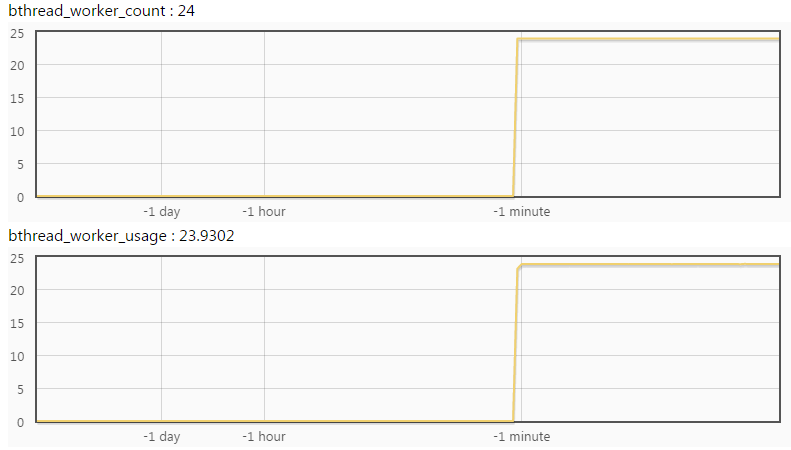

下图中正在使用的只有2.36个，工作线程明显是足够的。

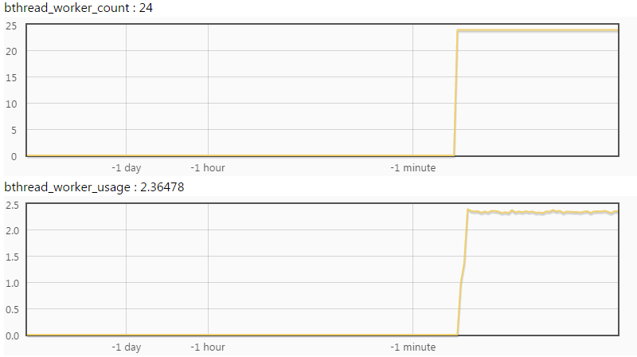

把 /vars/bthread_worker_count;bthread_worker_usage?expand 拼在服务url后直接看到这两幅图，就像[这样](http://brpc.baidu.com:8765/vars/bthread_worker_count;bthread_worker_usage?expand)。

# 2.检查CPU的使用程度

查看 /vars/system_core_**count** 和 /vars/process_cpu_**usage**。分别是cpu核心的个数，和正在使用的cpu核数。

> 如果usage和count接近，说明CPU不够用了。

下图中cpu核数为24，正在使用的核心数是20.9个，CPU是瓶颈了。

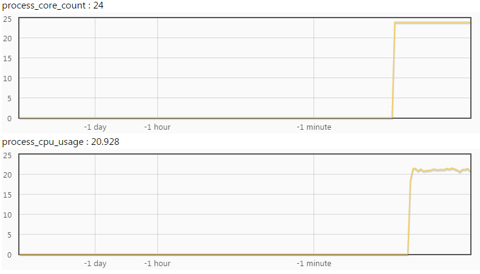

下图中正在使用的核心数是2.06，CPU是够用的。

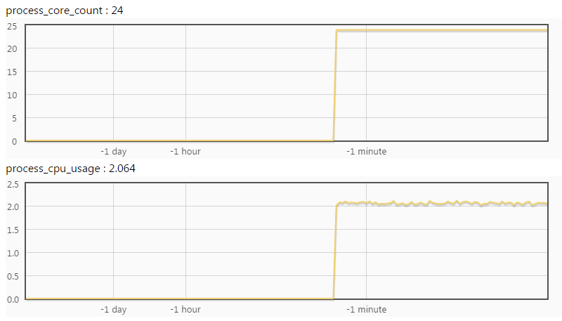

# 3.定位问题

如果process_cpu_usage和bthread_worker_usage接近，说明是cpu-bound，工作线程大部分时间在做计算。

如果process_cpu_usage明显小于bthread_worker_usage，说明是io-bound，工作线程大部分时间在阻塞。

1 - process_cpu_usage / bthread_worker_usage就是大约在阻塞上花费的时间比例，比如process_cpu_usage = 2.4，bthread_worker_usage = 18.5，那么工作线程大约花费了87.1% 的时间在阻塞上。

## 3.1 定位cpu-bound问题

原因可能是单机性能不足，或上游分流不均。

### 排除上游分流不均的嫌疑

在不同服务的[vars界面](http://brpc.baidu.com:8765/vars)输入qps，查看不同的qps是否符合预期，就像这样：

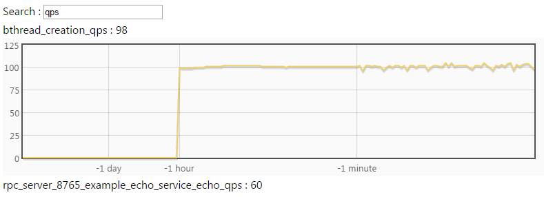

或者在命令行中用curl直接访问，像这样：

```shell
$ curl brpc.baidu.com:8765/vars/*qps*
bthread_creation_qps : 95
rpc_server_8765_example_echo_service_echo_qps : 57
```

如果不同机器的分流确实不均，且难以解决，可以考虑[限制最大并发](server.md#限制最大并发)。

### 优化单机性能

请使用[CPU profiler](cpu_profiler.md)分析程序的热点，用数据驱动优化。一般来说一个卡顿的cpu-bound程序一般能看到显著的热点。

## 3.2 定位io-bound问题

原因可能有：

- 线程确实配少了
- 访问下游服务的client不支持bthread，且延时过长
- 阻塞来自程序内部的锁，IO等等。

如果阻塞无法避免，考虑用异步。

### 排除工作线程数不够的嫌疑

如果线程数不够，你可以尝试动态调大工作线程数，切换到/flags页面，点击bthread_concurrency右边的(R):


进入后填入新的线程数确认即可：


回到/flags界面可以看到bthread_concurrency已变成了新值。

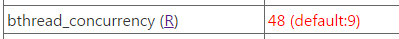

不过，调大线程数未必有用。如果工作线程是由于访问下游而大量阻塞，调大工作线程数是没有用的。因为真正的瓶颈在于后端的，调大线程后只是让每个线程的阻塞时间变得更长。

比如在我们这的例子中，调大线程后新增的工作线程仍然被打满了。

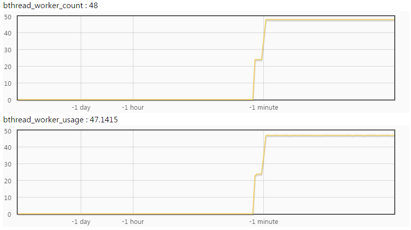

### 排除锁的嫌疑

如果程序被某把锁挡住了，也可能呈现出“io-bound”的特征。先用[contention profiler](contention_profiler.md)排查锁的竞争状况。

### 使用rpcz

rpcz可以帮助你看到最近的所有请求，和处理它们时在每个阶段花费的时间（单位都是微秒）。

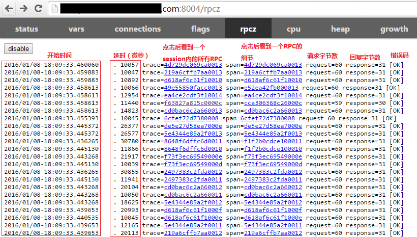

点击一个span链接后看到该次RPC何时开始，每个阶段花费的时间，何时结束。


这是一个典型的server在严重阻塞的例子。从接收到请求到开始运行花费了20ms，说明server已经没有足够的工作线程来及时完成工作了。

现在这个span的信息比较少，我们去程序里加一些。你可以使用TRACEPRINTF向rpcz打印日志。打印内容会嵌入在rpcz的时间流中。

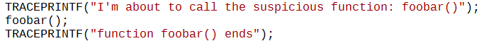

重新运行后，查看一个span，里面的打印内容果然包含了我们增加的TRACEPRINTF。

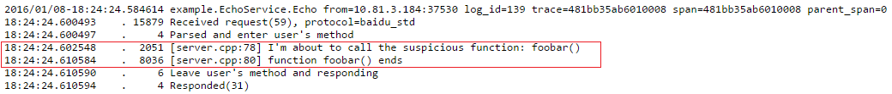

在运行到第一条TRACEPRINTF前，用户回调已运行了2051微秒（假设这符合我们的预期），紧接着foobar()却花费了8036微秒，我们本来以为这个函数会很快返回的。范围进一步缩小了。

重复这个过程，直到找到那个造成问题的函数。

### 使用bvar

TRACEPRINTF主要适合若干次的函数调用，如果一个函数调用了很多次，或者函数本身开销很小，每次都往rpcz打印日志是不合适的。这时候你可以使用bvar。

[bvar](bvar.md)是一个多线程下的计数库，可以以极低的开销统计用户递来的数值，相比“打日志大法”几乎不影响程序行为。你不用完全了解bvar的完整用法，只要使用bvar::LatencyRecorder即可。

仿照如下代码对foobar的运行时间进行监控。

```c++
#include <butil/time.h>
#include <bvar/bvar.h>
 
bvar::LatencyRecorder g_foobar_latency("foobar");
 
...
void search() {
    ...
    butil::Timer tm;
    tm.start();
    foobar();
    tm.stop();
    g_foobar_latency << tm.u_elapsed();
    ...
}
```

重新运行程序后，在vars的搜索框中键入foobar，显示如下：

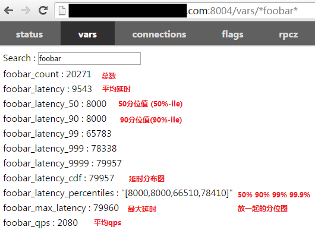

点击一个bvar可以看到动态图，比如点击cdf后看到

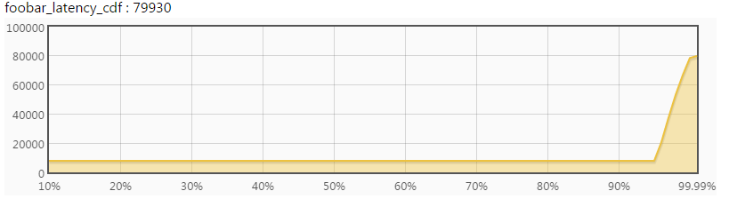

根据延时的分布，你可以推测出这个函数的整体行为，对大多数请求表现如何，对长尾表现如何。

你可以在子函数中继续这个过程，增加更多bvar，并比对不同的分布，最后定位来源。

### 只使用了brpc client

得打开dummy server提供内置服务，方法见[这里](dummy_server.md)。
