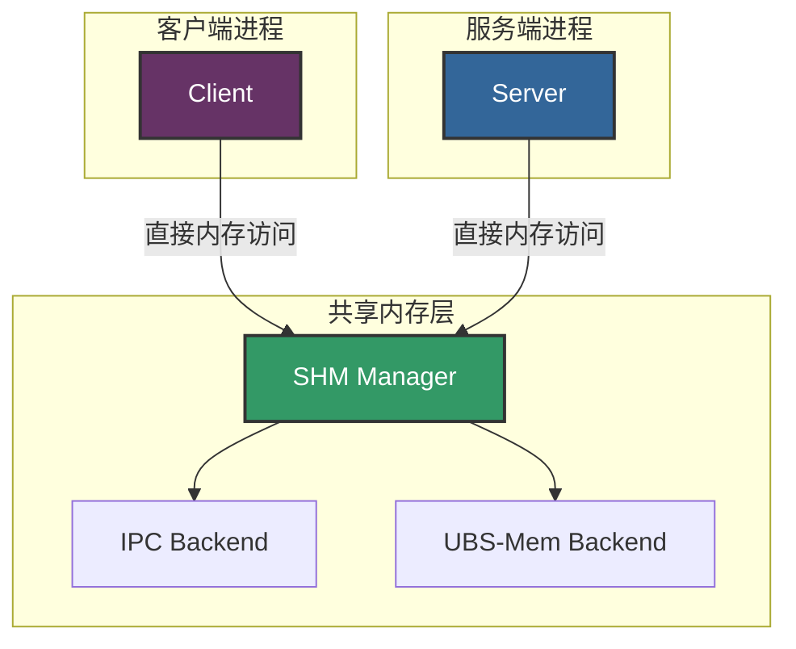

# UBRing: 高性能共享内存 RPC

UBRing 是 brpc 中的高性能 RPC 实现，它利用共享内存进行进程间通信（IPC）。它支持本地共享内存（POSIX IPC）和远端共享内存（ubs-mem）两种模式，提供微秒到纳秒级的进程间通信延迟。

## 技术背景

传统的 RPC 框架通常使用网络套接字进行通信，由于内核参与、上下文切换和数据拷贝等原因，会引入显著的开销。UBRing 通过使用共享内存作为通信介质来解决这个问题，允许进程之间直接内存访问，最小化内核干预。

UBRing 的主要优势：

- **超低延迟**：微秒级 RPC 延迟
- **高吞吐量**：每秒数百万次 RPC 调用
- **减少数据拷贝**：进程间直接内存访问
- **跨平台支持**：支持 Linux 和 macOS

## 支持的共享内存后端

UBRing 支持两种共享内存后端，通过 `ub_shm_type` 参数控制：

### 1. POSIX IPC 共享内存 (ub\_shm\_type = 1)

这是默认模式，使用标准 POSIX 共享内存进行本地 IPC。同一机器上的进程可以通过共享内存区域直接通信。

### 2. UBS-Mem 远端共享内存 (ub\_shm\_type = 2)

此模式使用 ubs-mem（Unified Block Storage Memory），这是来自 openEuler 的开源远端共享内存框架。它支持机架内节点之间的共享内存通信，类似于 RDMA 但部署要求更简单。

**UBS-Mem 开源地址**: <https://atomgit.com/openeuler/ubs-mem>

**所需库文件**:
- `libubsm_sdk.so` - UBS-Mem SDK 库（安装路径：`/usr/local/ubs_mem/lib/libubsm_sdk.so`）
- UBS-Mem 通过 `dlopen()` 动态加载该库，并使用 `ubsmem_initialize()`、`ubsmem_create_region()`、`ubsmem_shmem_allocate()`、`ubsmem_shmem_map()` 等函数

**UBS-Mem 关键函数**:
- `ubsmem_init_attributes()` - 初始化 UBS-Mem 属性
- `ubsmem_initialize()` - 初始化 UBS-Mem 库
- `ubsmem_finalize()` - 释放 UBS-Mem 库
- `ubsmem_create_region()` - 创建共享内存区域
- `ubsmem_shmem_allocate()` - 分配共享内存
- `ubsmem_shmem_map()` - 将共享内存映射到本地地址空间
- `ubsmem_shmem_unmap()` - 解除共享内存映射
- `ubsmem_shmem_deallocate()` - 释放共享内存
- `ubsmem_destroy_region()` - 销毁共享内存区域

### 未来扩展

该架构设计支持未来扩展 CXL（Compute Express Link）基于的远端共享内存，实现更灵活的分布式内存共享。

## 构建配置

### 使用 CMake 构建

要构建带有 UBRing 支持的 brpc，请使用以下命令：

```bash
# 构建 brpc 并启用 UBRing 支持
cd /path/to/brpc
cmake -B build -DCMAKE_EXPORT_COMPILE_COMMANDS=ON -DWITH_UBRING:BOOL=ON
cmake --build build -j 8

# 构建 ubring_performance 示例
cd /path/to/brpc/example/ubring_performance
cmake -B build
cmake --build build -j 8
```

### 使用 Bazel 构建

使用 Bazel 构建带有 UBRing 支持的 brpc：

```bash
# 构建 brpc 并启用 UBRing 支持
cd /path/to/brpc
bazel build //... --define=with_ubring=true

# 构建 ubring_performance 示例
bazel build //example/ubring_performance/...
```

### 选择共享内存后端

共享内存后端通过 `--ub_shm_type` 参数控制：

```bash
# 使用 POSIX IPC（默认）
./your_program --ub_shm_type=1

# 使用 UBS-Mem
./your_program --ub_shm_type=2
```

## 性能测试

### 示例: ubring\_performance

brpc 在 `example/ubring_performance/` 目录提供了性能测试示例。

#### 构建示例

```bash
cd example/ubring_performance
mkdir -p build && cd build
cmake ..
make
```

#### 运行服务端

```bash
# 使用 POSIX IPC
./ubring_performance_server --ub_shm_type=1

# 使用 UBS-Mem
./ubring_performance_server --ub_shm_type=2
```

#### 运行客户端

```bash
# 使用 POSIX IPC
./ubring_performance_client --ub_shm_type=1 --server=127.0.0.1:8000

# 使用 UBS-Mem
./ubring_performance_client --ub_shm_type=2 --server=<remote_ip>:8000
```

#### 测试选项

| 选项              | 描述                        | 默认值            |
| --------------- | ------------------------- | -------------- |
| `--ub_shm_type` | 共享内存类型 (1=IPC, 2=UBS-Mem) | 1              |
| `--server`      | 服务端地址                     | 127.0.0.1:8000 |
| `--thread_num`  | 客户端线程数                    | 1              |
| `--request_num` | 每线程请求总数                   | 1000000        |
| `--timeout_ms`  | 请求超时时间（毫秒）                | 1000           |

## 架构概述



### 架构细节

UBRing 架构包含以下组件：

1. **客户端/服务端进程**: 通过共享内存通信的应用进程
2. **SHM Manager**: 共享内存操作的中央管理器 (`shm_mgr.cpp`)
3. **IPC Backend**: 用于本地通信的 POSIX 共享内存实现
4. **UBS-Mem Backend**: 用于跨节点通信的远端共享内存实现

## 实现细节

### 共享内存管理

共享内存管理器 (`shm_mgr.cpp`) 为不同的共享内存后端提供统一接口：

- **初始化**: `ShmMgrInit()` - 初始化共享内存子系统
- **本地分配**: `ShmLocalMalloc()` - 分配本地共享内存
- **远端分配**: `ShmRemoteMalloc()` - 分配远程节点可访问的共享内存
- **释放**: `ShmFree()` - 释放共享内存资源

### 定时器管理

UBRing 使用高精度定时器系统 (`timer_mgr.cpp`) 进行连接管理和超时处理，支持 epoll（Linux）和 kqueue（macOS）。

## 参考资料

- [UBRing 特性提案](https://github.com/apache/brpc/issues/3226)
- [UBRing 技术讨论](https://github.com/apache/brpc/discussions/3217)
- [UBS-Mem 开源项目](https://atomgit.com/openeuler/ubs-mem)

## 相关文档

- [UB Client](ub_client.md) - 访问 UB 服务
- [RDMA 支持](rdma.md) - 远程直接内存访问

