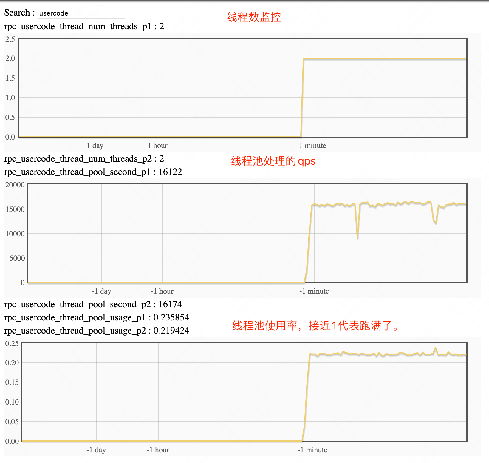

# 可配置线程池

默认情况下，brpc的网络IO和应用处理逻辑都是在brpc worker这组线程上执行，brpc本身具备请求在不同worker线程之间调度的能力，充分发挥多核心的能力，如果不同请求的处理耗时都比较类似或者都没有阻塞的调用，全部使用worker线程效率是最高的；但是应用的逻辑很多情况下需要把请求放到独立的线程上运行，这样可以避免某些方法阻塞brpc worker线程而影响其它方法的执行，比如：

1、应用有的接口延迟比较高，如果这些接口的请求比较多（超过worker数量）会导致其它接口请求的延迟增加，对于延迟敏感接口产生影响。
2、应用有的接口需要磁盘IO，有的不需要磁盘IO，磁盘IO请求会阻塞住worker线程，影响非磁盘IO请求执行。
3、应用有的接口阻塞了worker，导致任务在worker之间调度的频率增加，这也会影响bthread的调度，从而调度性能。

这些需求很难在应用层根据服务或者方法将任务很细致的划分到不同线程池，代码实现复杂度很高，维护性差，在框架层面实现能更加简单，可配置线程池能够根据应用的情况，为某些方法或者服务设置独立的线程池，请求从网络收到后会在配置的线程池上运行，独立于brpc worker线程。

## 使用方法

使用步骤
```c++
// 1、define gflags to change thread number
DEFINE_int32(num_threads, 2, "thread number for p1");
bool UserCodeThreadPValidate(const char*, int32_t val) {
    brpc::UserCodeThreadPool::SetPoolThreads("p1", val);
    return true;
}
BRPC_VALIDATE_GFLAG(num_threads, UserCodeThreadPValidate);

// define server
brpc::Server server;

// Instance of your service.
example::EchoServiceImpl echo_service_impl;

// Add the service into server. Notice the second parameter, because the
// service is put on stack, we don't want server to delete it, otherwise
// use brpc::SERVER_OWNS_SERVICE.
if (server.AddService(&echo_service_impl,
                      brpc::SERVER_DOESNT_OWN_SERVICE) != 0) {
    LOG(ERROR) << "Fail to add service";
    return -1;
}

// 2、define usercode thread pool assign policy
brpc::UserCodeThreadRandomAssignPolicy policy;

// 3、set thread pool for echo method
brpc::UserCodeThreadPoolConf conf("p1", FLAGS_num_threads, nullptr, &policy);
if (!server.SetThreadPool(&echo_service_impl, "Echo", conf)) {
    LOG(ERROR) << "Fail to set thread pool";
    return -1;
}

```

自定义线程分配选择策略

```c++
class MyUserCodeThreadAssignPolicy : public brpc::UserCodeThreadAssignPolicy {
public:
    MyUserCodeThreadAssignPolicy() {}
    virtual ~MyUserCodeThreadAssignPolicy() {}
    size_t Index(void* arg, size_t range) {
        auto myArg = static_cast<MyUserCodeThreadPoolArgs*>(arg);
        auto request = static_cast<const EchoRequest*>(myArg->request);
        auto hash = std::hash<std::string>{}(request->message());
        LOG(INFO) << "MyUserCodeThreadAssignPolicy message="
                  << request->message() << " hash=" << hash
                  << " range=" << range;
        return hash % range;
    }

private:
    DISALLOW_COPY_AND_ASSIGN(MyUserCodeThreadAssignPolicy);
};

MyUserCodeThreadAssignPolicy myPolicy;
brpc::UserCodeThreadPoolConf conf("p1", FLAGS_num_threads, nullptr, &myPolicy);

```

## 监控相关

可以通过在vars页面里面过滤usercode字段来找到相关监控
http://hostname:port/vars/*usercode*


