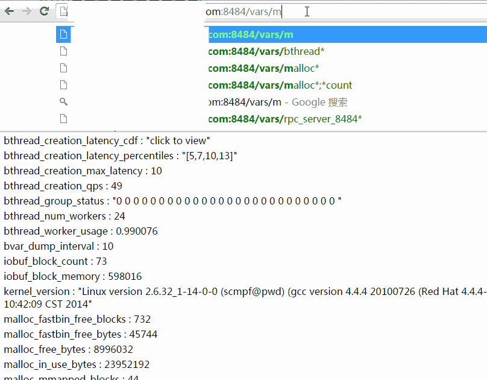

[English version](../en/vars.md)

[bvar](../../src/bvar)是多线程环境下的计数器类库，支持[单维度bvar](bvar_c++.md)和[多维度mbvar](mbvar_c++.md)，方便记录和查看用户程序中的各类数值，它利用了thread local存储减少了cache bouncing，相比UbMonitor(百度内的老计数器库)几乎不会给程序增加性能开销，也快于竞争频繁的原子操作。brpc集成了bvar，[/vars](vars.md)可查看所有曝光的bvar，[/vars/VARNAME](vars.md)可查阅某个bvar，增加计数器的方法请查看[单维度bvar](bvar_c++.md)和[多维度mbvar](mbvar_c++.md)。brpc大量使用了bvar提供统计数值，当你需要在多线程环境中计数并展现时，应该第一时间想到bvar。但bvar不能代替所有的计数器，它的本质是把写时的竞争转移到了读：读得合并所有写过的线程中的数据，而不可避免地变慢了。当你读写都很频繁或得基于最新值做一些逻辑判断时，你不应该用bvar。

## 查询方法

[/vars](vars.md) : 列出所有曝光的bvar

[/vars/NAME](vars.md)：查询名字为NAME的bvar

[/vars/NAME1,NAME2,NAME3](vars.md)：查询名字为NAME1或NAME2或NAME3的bvar

[/vars/foo*,b$r](vars.md)：查询名字与某一统配符匹配的bvar，注意用$代替?匹配单个字符，因为?是URL的保留字符。

以下动画演示了如何使用过滤功能。你可以把包含过滤表达式的url复制粘贴给他人，他们点开后将看到相同的计数器条目。(数值可能随运行变化)



/vars左上角有一个搜索框能加快寻找特定bvar的速度，在这个搜索框你只需键入bvar名称的一部分，框架将补上*进行模糊查找。不同的名称间可以逗号、分号或空格分隔。


你也可以在命令行中访问vars：

```
$ curl brpc.baidu.com:8765/vars/bthread*
bthread_creation_count : 125134
bthread_creation_latency : 3
bthread_creation_latency_50 : 3
bthread_creation_latency_90 : 5
bthread_creation_latency_99 : 7
bthread_creation_latency_999 : 12
bthread_creation_latency_9999 : 12
bthread_creation_latency_cdf : "click to view"
bthread_creation_latency_percentiles : "[3,5,7,12]"
bthread_creation_max_latency : 7
bthread_creation_qps : 100
bthread_group_status : "0 0 0 0 0 0 0 0 0 0 0 0 0 0 0 0 0 0 0 0 0 0 0 0 0 0 "
bthread_num_workers : 24
bthread_worker_usage : 1.01056
```

## 查看历史趋势

点击大部分数值型的bvar会显示其历史趋势。每个可点击的bvar记录了过去60秒，60分钟，24小时，30天总计174个值。当有1000个可点击bvar时大约会占1M内存。


## 统计和查看分位值

x%分位值（percentile）是指把一段时间内的N个统计值排序，排在第N * x%位的值。比如一段时间内有1000个值，先从小到大排序，排在第500位(1000 * 50%)的值是50%分位值（即中位数），排在第990位的是99%分位值(1000 * 99%)，排在第999位的是99.9%分位值。分位值能比平均值更准确的刻画数值的分布，对理解系统行为有重要意义。工业级应用的SLA一般在99.97%以上(此为百度对二级系统的要求，一级是99.99%以上)，一些系统即使平均值不错，但不佳的长尾区域也会明显拉低和打破SLA。分位值能帮助分析长尾区域。

分位值可以绘制为CDF曲线和按时间变化的曲线。

**下图是分位值的CDF**，横轴是比例(排序位置/总数)，纵轴是对应的分位值。比如横轴=50%处对应的纵轴值便是50%分位值。如果系统要求的性能指标是"99.9%的请求在xx毫秒内完成“，那么你就得看下99.9%那儿的值。


为什么叫它[CDF](https://en.wikipedia.org/wiki/Cumulative_distribution_function)? 当选定一个纵轴值y时，对应横轴的含义是"数值 <= y的比例”，由于数值一般来自随机采样，横轴也可以理解为“数值 <= y的概率”，或P(数值 <= y)，这就是CDF的定义。

CDF的导数是[概率密度函数](https://en.wikipedia.org/wiki/Probability_density_function)。如果把CDF的纵轴分为很多小段，对每个小段计算两端对应的横轴值之差，并把这个差作为新的横轴，那么我们便绘制了PDF曲线，就像顺时针旋转了90度的正态分布那样。但中位数的密度往往很高，在PDF中很醒目，这使得边上的长尾很扁而不易查看，所以大部分系统测量结果选择CDF曲线而不是PDF曲线。

可用一些简单规则衡量CDF曲线好坏：

- 越平越好。一条水平线是最理想的，这意味着所有的数值都相等，没有任何等待，拥塞，停顿。当然这是不可能的。
- 99%和100%间的面积越小越好：99%之后是长尾的聚集地，对大部分系统的SLA有重要影响。

一条缓慢上升且长尾区域面积不大的CDF便是不错的曲线。

**下图是按分位值按时间变化的曲线**，包含了4条曲线，横轴是时间，纵轴从上到下分别对应99.9%，99%，90%，50%分位值。颜色从上到下也越来越浅（从橘红到土黄）。


滑动鼠标可以阅读对应数据点的值，上图中显示的是”39秒种前的99%分位值是330**微秒**”。这幅图中不包含99.99%的曲线，因为99.99%分位值常明显大于99.9%及以下的分位值，画在一起的话会使得其他曲线变得很”矮“，难以辨认。你可以点击以"\_latency\_9999"结尾的bvar独立查看99.99%曲线。按时间变化曲线可以看到分位值的变化趋势，对分析系统的性能变化很实用。

brpc的服务都会自动统计延时分布，用户不用自己加了。如下图所示：


你可以用bvar::LatencyRecorder统计任何代码的延时，这么做(更具体的使用方法请查看[bvar-c++](bvar_c++.md)):

```c++
#include <bvar/bvar.h>

...
bvar::LatencyRecorder g_latency_recorder("client");  // expose this recorder
... 
void foo() {
    ...
    g_latency_recorder << my_latency;
    ...
}
```

如果这个程序使用了brpc server，那么你应该已经可以在/vars看到client_latency, client_latency_cdf等变量，点击便可查看动态曲线。如下图所示：


## 非brpc server

如果你的程序只是一个brpc client或根本没有使用brpc，并且你也想看到动态曲线，看[这里](dummy_server.md)。
