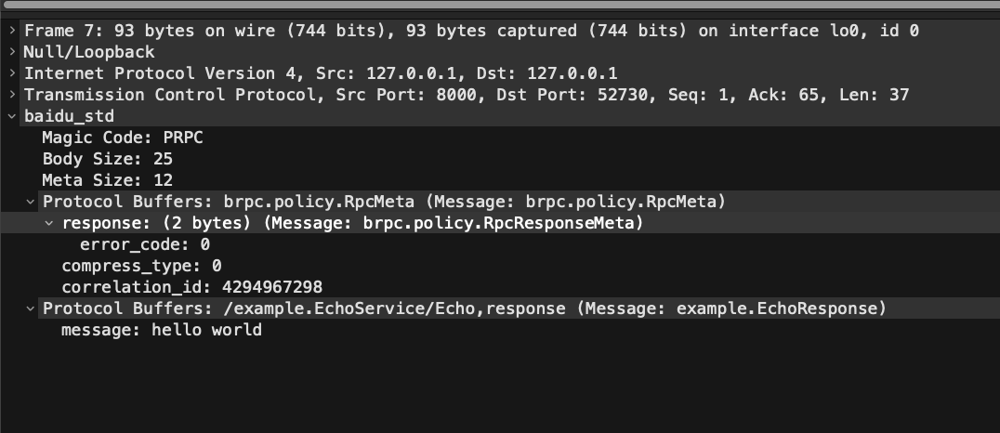
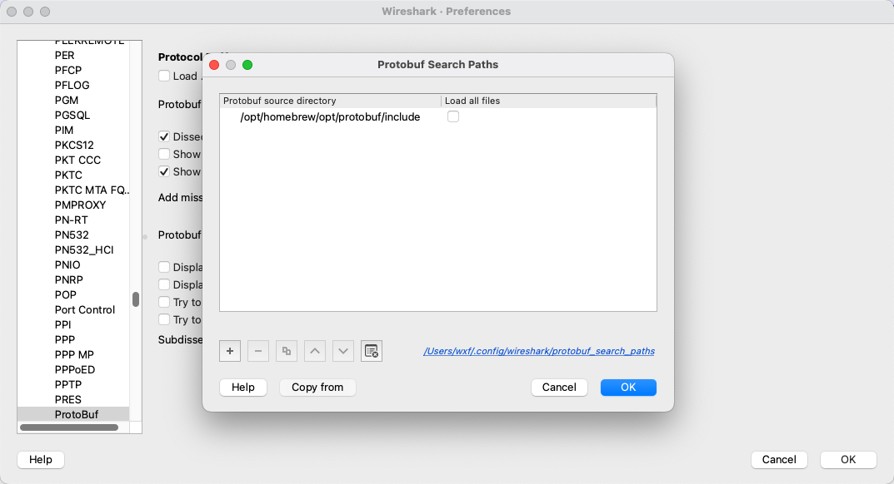

[English version](../en/wireshark_baidu_std.md)

# 介绍

`wireshark_baidu_std.lua` 是针对 [`baidu_std`](baidu_std.md) 协议的 `Wireshark` 解析插件，同时支持 [`streaming_rpc`](streaming_rpc.md) 协议的解析。

请求包的解析示例：

响应包的解析示例：

## 使用方式

1. 将 [`wireshark_baidu_std.lua`](../../tools/wireshark_baidu_std.lua) 放到 "Personal Lua Plugins" 目录下；
1. 将 [`options.proto`](../../src/brpc/options.proto)、[`streaming_rpc_meta.proto`](../../src/brpc/streaming_rpc_meta.proto) 以及 [`baidu_rpc_meta.proto`](../../src/brpc/policy/baidu_rpc_meta.proto) 放到 "Personal configuration" 目录下的 `protobuf` 目录中，目录如不存在可以手动创建；
1. 参考 [Wireshark Protobuf](https://wiki.wireshark.org/Protobuf#protobuf-search-paths-settings) 配置 `Protobuf` 系统 proto 文件路经，如：`/opt/homebrew/opt/protobuf/include`
   
1. 可选，如需想使用相关字段进行过滤，可打开如下选项：
   

上面提到的 "Personal Lua Plugins" 以及 "Personal configuration" 目录可查看 `About Wireshark` 的 `Folders` 页面，相关目录是平台相关的，macOS 下如：

