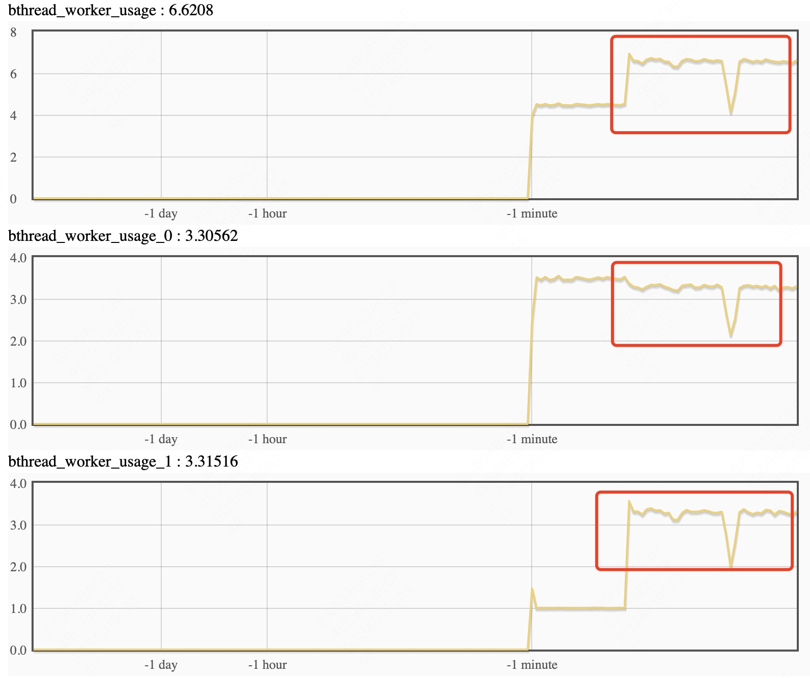
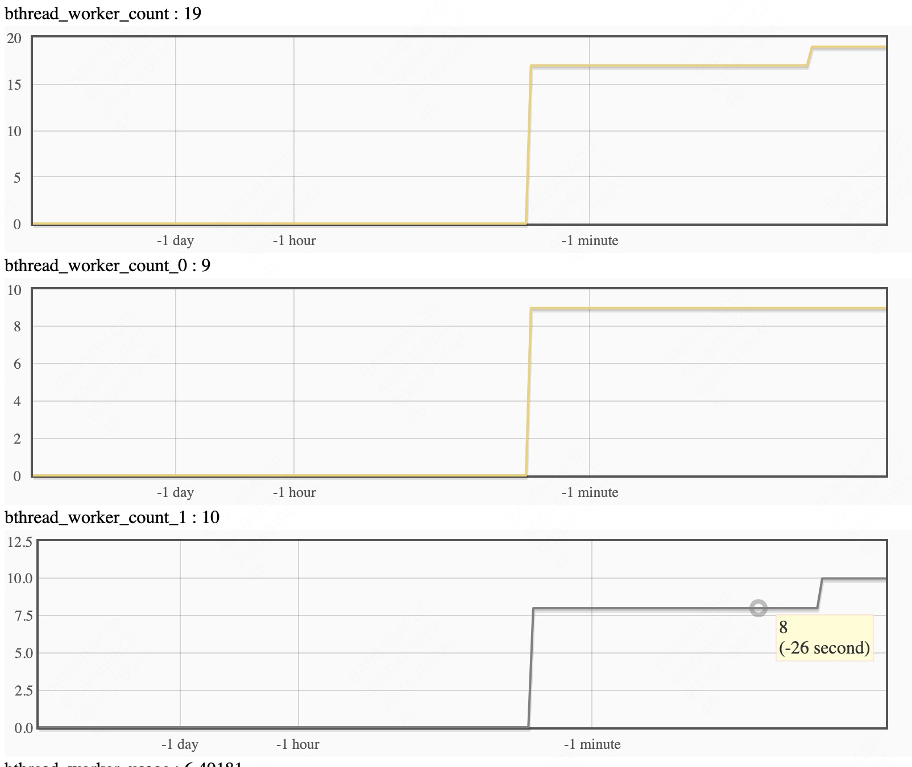
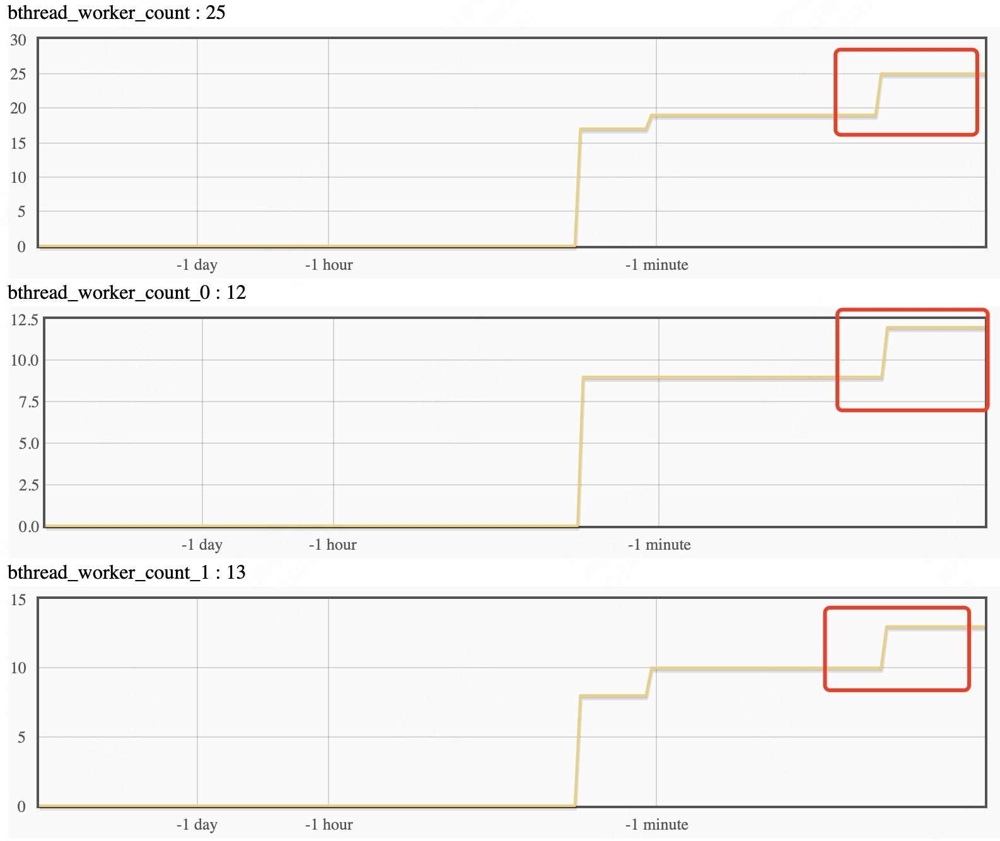

[中文版](../cn/bthread_tagged_task_group.md)

# Bthread tagged task group

Many applications need to isolate thread resources. For example a service has a control plane and a data plane, and heavy data-plane traffic should not starve the control plane. Or a service has several disks, and threads serving different disks should not interfere with each other. Tagging bthread task groups splits the bthread worker pool by tag so that groups do not affect one another.

Tagging is per server. Put services of different groups on different servers; those servers listen on different ports. Some background or timer jobs have no service at all and still need their own pool. You can give those jobs a dedicated tag, and you control that pool's concurrency yourself. On top of that you can add policies such as pinning a tag to a NUMA node or setting thread-local variables.

The implementation creates several worker groups at the bthread layer; each group runs the same logic as before. The bthread API adds a `tag` field on `bthread_attr_t`. The RPC layer adds `bthread_tag` on `brpc::ServerOptions` so a server can pick which worker group it runs on.

# Usage

`example/bthread_tag_echo_c++` has a sample. Start the server and clients separately. The server splits workers into 3 tags. `FLAGS_tag1` and `FLAGS_tag2` tag different servers. The remaining tag is for background jobs.

```bash
# Server
./echo_server -task_group_ntags 3 -tag1 0 -tag2 1 -bthread_concurrency 20 -bthread_min_concurrency 8 -event_dispatcher_num 1

# Clients
./echo_client -dummy_port 8888 -server "0.0.0.0:8002" -use_bthread true
./echo_client -dummy_port 8889 -server "0.0.0.0:8003" -use_bthread true
```

`FLAGS_bthread_concurrency` is the total number of threads. `FLAGS_bthread_min_concurrency` is the lower bound across all groups. `FLAGS_event_dispatcher_num` is the number of event dispatchers in one group. `FLAGS_bthread_current_tag` is the tag whose size you are about to change, and `FLAGS_bthread_concurrency_by_tag` sets that group's thread count.

Ordinary bthreads do not need to set `bthread_attr_t.tag`; they run in the current tag context. To run a bthread on another tag, set `bthread_attr_t.tag` to that value. That costs some performance and should be avoided on the hot path.

Q: How do I change a group's thread count at runtime?

A: You can size each group more freely for your service. At startup the pool is initialized from `bthread_concurrency`. If you set `bthread_min_concurrency`, that value is used instead. For a server, `num_threads` is the worker count of that tag. Change a group's size with `FLAGS_bthread_current_tag` and `FLAGS_bthread_concurrency_by_tag`. If those are unset (tagging is off, default `BTHREAD_TAG_INVALID`), `num_threads` means the total worker count across all groups.

Q: How do groups relate to each other?

A: They are independent thread pools and event dispatchers. They do not interact.

Q: Can I synchronize bthreads across groups?

A: Yes. Each bthread keeps its own tag. After it suspends and runs again, it continues on that tag's pool.

Q: On which group does a client send and receive RPC messages?

A: It depends on the client context. If the client is not on any tag, tag 0 is used; otherwise the current tag is used.

Q: How do I bind a group's threads to specific CPUs?

A: `int bthread_set_tagged_worker_startfn(void (*start_fn)(bthread_tag_t))` runs initialization on a group. You can implement CPU binding there, using the `tag` argument to pin different groups to different CPUs.

# Monitoring

Metrics split by tag today: thread count, thread usage, `bthread_count`, and connection info.

Thread usage: 

Dynamically changing tag 1's thread count:

Set tag 1: 

Set all tags: 
