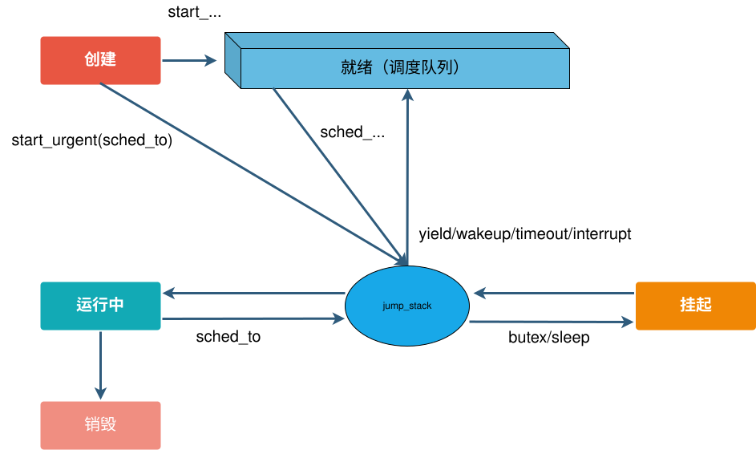
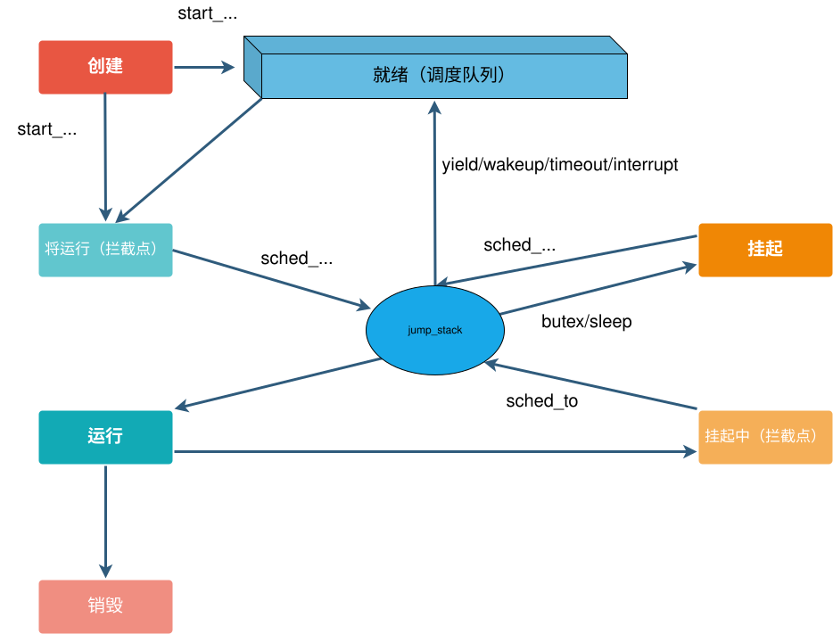

[中文版](../cn/bthread_tracer.md)

gdb (`ptrace`) plus `gdb_bthread_stack.py` is slow and blocks the process. We need a cheaper way to trace a bthread call stack.

brpc's cooperative userland threads cannot do an efficient STW (Stop The World) the way Go's preemptive goroutines can, and the framework cannot interrupt user logic. Tracing a bthread stack is therefore hard.

Online tracing has to solve:

1. Tracing a suspended bthread's call stack.
2. Tracing a running bthread's call stack.

# bthread status model

The current bthread status model:



# Design

## Core idea

To solve those two problems, this design implements STB (Stop The Bthread). While a bthread stack is being traced, the status must not move into a state that the current tracing method does not support. STB has two modes: context tracing and signal tracing.

### Context tracing

Context tracing covers suspended bthreads. A suspended stack is stable. Using the context saved in `TaskMeta.stack` (on x86_64 the important registers are mainly RIP, RSP, RBP), a library that can unwind a given context walks the stack. A suspended bthread may wake at any time, run (including `jump_stack`), and then the stack keeps changing. An unstable context cannot be unwound, so scheduling is intercepted before `jump_stack` and the bthread only continues after tracing finishes. Context tracing therefore supports the ready and suspended states.

### Signal tracing

Signal tracing covers running bthreads. A running bthread is unstable, so `TaskMeta.stack` cannot be used. Instead a signal interrupts the bthread and the signal handler unwinds the stack. Signals bring two issues:

1. Async-signal-safety.
2. Signal tracing does not support `jump_stack`. Unwinding needs register state, and `jump_stack` mutates registers, so interrupting `jump_stack` is unsafe. Scheduling is intercepted before `jump_stack` and the bthread only suspends after tracing finishes.

So this mode only supports the running state.

### Summary

`jump_stack` is on every path that suspends or runs a bthread, and it is the STB intercept point. STB splits states into three groups:

1. Context-tracing states: ready, suspended.
2. Signal-tracing states: running.
3. Unsupported states. Neither method can unwind during `jump_stack`. Scheduling is intercepted before `jump_stack` and continues only after tracing finishes.

### Flow

After STB, two intercept states are added on top of the original model: about-to-run and about-to-suspend.



STB flow:

1. When TaskTracer (the STB module) receives a trace request, it marks tracing in progress. When tracing finishes, it marks completion and signals bthreads that may be in about-to-run or about-to-suspend. TaskTracer then branches on status:
- created, ready but no stack yet, destroyed: finish immediately.
- suspended, ready: context tracing.
- running: signal tracing.
- about-to-run, about-to-suspend: spin until the bthread moves to the next state (suspended or running), then continue.

2. While TaskTracer is tracing, the bthread also branches on status:
- created, ready but no stack yet, ready: nothing extra.
- suspended, running: notify TaskTracer to continue.
- about-to-run, about-to-suspend, destroyed: wait on a condition variable until TaskTracer finishes. After that, TaskTracer wakes the bthread to continue `jump_stack`.

# Usage

1. Install libunwind and abseil-cpp. **Note: libunwind must be built from source. Do not use the distro package `libunwind-dev` / `libunwind-devel`**, or you will hit the crash in [Known issue: libunwind and libgcc_s `_Unwind_*` symbol conflict](#known-issue-libunwind-and-libgcc_s-_unwind_-symbol-conflict). Bazel builds can skip this step and use the libunwind version maintained in the brpc repo.
2. Pass `--with-bthread-tracer` to `config_brpc.sh`, or `-DWITH_BTHREAD_TRACER=ON` to cmake, or `--define with_bthread_tracer=true` to bazel (Bzlmod).
3. Hit the builtin service `http://ip:port/bthreads/<bthread_id>?st=1`, or call `bthread::stack_trace()` in code.
4. To trace a pthread, call `bthread::init_for_pthread_stack_trace()` on that pthread to get a fake `bthread_t`, then use step 3.

Example output:

```shell
#0 0x00007fdbbed500b5 __clock_gettime_2
#1 0x000000000041f2b6 butil::cpuwide_time_ns()
#2 0x000000000041f289 butil::cpuwide_time_us()
#3 0x000000000041f1b9 butil::EveryManyUS::operator bool()
#4 0x0000000000413289 (anonymous namespace)::spin_and_log()
#5 0x00007fdbbfa58dc0 bthread::TaskGroup::task_runner()
```

# Known issues

## Known issue: libunwind and libgcc_s `_Unwind_*` symbol conflict

### Symptom

With bthread tracer enabled, you may see an occasional segfault on `bthread_exit` / `pthread_exit` or on a C++ exception path, with a stack like:

```text
#0  0x0000000000000000 in ?? ()
#1  0x00007fa2b5d6458a in _ULx86_64_dwarf_find_proc_info ()
   from /root/.cache/bazel/_bazel_root/743b333b2429a1dbd390ef66b59c771d/execroot/_main/bazel-out/k8-fastbuild/bin/test/../_solib_k8/libexternal_Slibunwind~_Slibunwind.so
#2  0x00007fa2b5d6668d in fetch_proc_info ()
   from /root/.cache/bazel/_bazel_root/743b333b2429a1dbd390ef66b59c771d/execroot/_main/bazel-out/k8-fastbuild/bin/test/../_solib_k8/libexternal_Slibunwind~_Slibunwind.so
#3  0x00007fa2b5d681a1 in _ULx86_64_dwarf_make_proc_info ()
   from /root/.cache/bazel/_bazel_root/743b333b2429a1dbd390ef66b59c771d/execroot/_main/bazel-out/k8-fastbuild/bin/test/../_solib_k8/libexternal_Slibunwind~_Slibunwind.so
#4  0x00007fa2b5d70cfd in _ULx86_64_get_proc_info ()
   from /root/.cache/bazel/_bazel_root/743b333b2429a1dbd390ef66b59c771d/execroot/_main/bazel-out/k8-fastbuild/bin/test/../_solib_k8/libexternal_Slibunwind~_Slibunwind.so
#5  0x00007fa2b5d6c775 in __libunwind_Unwind_GetLanguageSpecificData ()
   from /root/.cache/bazel/_bazel_root/743b333b2429a1dbd390ef66b59c771d/execroot/_main/bazel-out/k8-fastbuild/bin/test/../_solib_k8/libexternal_Slibunwind~_Slibunwind.so
#6  0x00007fa2b503c6df in __gxx_personality_v0 () from /lib/x86_64-linux-gnu/libstdc++.so.6
#7  0x00007fa2b5452ce5 in ?? () from /lib/x86_64-linux-gnu/libgcc_s.so.1
#8  0x00007fa2b54533c0 in _Unwind_ForcedUnwind () from /lib/x86_64-linux-gnu/libgcc_s.so.1
#9  0x00007fa2b4ca57a4 in __GI___pthread_unwind (buf=<optimized out>) at ./nptl/unwind.c:130
#10 0x00007fa2b4c9dd22 in __do_cancel () at ../sysdeps/nptl/pthreadP.h:271
#11 __GI___pthread_exit (value=0x0) at ./nptl/pthread_exit.c:36
#12 0x0000000000000000 in ?? ()
```

### Root cause

libunwind's `src/unwind/*.c` implements GCC's `_Unwind_*` ABI compatibility layer (`_Unwind_GetLanguageSpecificData`, `_Unwind_ForcedUnwind`, `_Unwind_Resume`, and so on), which exports the same global symbols as `libgcc_s.so.1`. When libunwind is linked as a **shared library** and appears before `libgcc_s.so.1` in the final binary's `DT_NEEDED` list, the runtime linker `ld.so` resolves `_Unwind_*` calls from `pthread_exit` / exception handling to libunwind's DWARF implementation. That implementation needs an internal context that bRPC has not initialized on the `pthread_exit` path, so you get a null-pointer access.

This is an ELF **runtime symbol-resolution-order** issue. It is independent of the compiler (GCC / Clang). Clang's default runtime is also `libstdc++ + libgcc_s`, and it hits the same crash.

### Workaround

> **Important: do not use the distro libunwind** (for example `apt install libunwind-dev`, `yum install libunwind-devel`). Most distro `libunwind.so` builds still export `_Unwind_*` in the dynamic symbol table, which triggers the crash in this section.
>
> You must use **libunwind built from source**. Upstream `./configure` + `make` hides `_Unwind_*` as local via `-Wl,--version-script` by default, so they are not exported and the conflict goes away.

Recommended approach per build system:

| Build | Recommendation |
|---|---|
| `config_brpc.sh` + `make` | Build and install libunwind from source, then pass its include and lib dirs to `config_brpc.sh` |
| `cmake` | Build and install libunwind from source, then pass its include and lib dirs to `cmake` |
| `bazel` (Bzlmod) | Use the libunwind version maintained in the brpc repo |

### make (config_brpc.sh)

Build and install libunwind into a private prefix (do not pollute the system), then point `config_brpc.sh` at that prefix.

```bash
# 1) Build libunwind from source (v1.8.1 or newer recommended)
git clone https://github.com/libunwind/libunwind.git
cd libunwind && git checkout tags/v1.8.1
mkdir -p /opt/libunwind
autoreconf -i
./configure --prefix=/opt/libunwind
make -j$(nproc) && make install
cd ..

# 2) Make config_brpc.sh use headers and libs under /opt/libunwind
#    (do not let it pick up the system libunwind-dev)
cd brpc
sh config_brpc.sh \
    --with-bthread-tracer \
    --headers="/opt/libunwind/include /usr/include" \
    --libs="/opt/libunwind/lib /usr/lib /usr/lib64"
make -j$(nproc)
```

After the build, confirm `libunwind.so` does not export `_Unwind_*`:

```bash
nm -D /opt/libunwind/lib/libunwind.so | grep ' T _Unwind_' \
    && echo "WARN: _Unwind_* exported" \
    || echo "OK: _Unwind_* hidden"
```

### cmake

[`CMakeLists.txt`](../../CMakeLists.txt) looks up libunwind with `find_library(... NAMES unwind unwind-x86_64)`. Build libunwind from source into a private prefix as in the make section, then prefer that prefix with `CMAKE_PREFIX_PATH`:

```bash
# 1) Build libunwind from source (same as the make section)

# 2) Make cmake search headers and libs under /opt/libunwind first
cd brpc
mkdir build && cd build
cmake -DWITH_BTHREAD_TRACER=ON \
      -DCMAKE_PREFIX_PATH=/opt/libunwind \
      ..
make -j$(nproc)
```

> Tip: if `libunwind-dev` is already installed, `find_library` may still prefer `/usr/lib`. Pass
> `-DLIBUNWIND_LIB=/opt/libunwind/lib/libunwind.so -DLIBUNWIND_X86_64_LIB=/opt/libunwind/lib/libunwind-x86_64.so -DLIBUNWIND_INCLUDE_PATH=/opt/libunwind/include`
> to force the self-built copy.

### bazel (Bzlmod)

The brpc repo already maintains a Bzlmod overlay for libunwind under [`registry/modules/libunwind/`](../../registry/modules/libunwind/), used via `--registry=https://github.com/apache/brpc/registry` in [`.bazelrc`](../../.bazelrc). The version uses a `<base>.brpc-no-unwind` suffix (for example `1.8.3.brpc-no-unwind`) to distinguish it from the same base version on BCR. The overlay adds a switch:

```
--define libunwind_hide_unwind_symbols=true
```

When on, libunwind's `src/unwind/*.c` (the GCC `_Unwind_*` compatibility layer) is not compiled, matching upstream autoconf's default. bRPC only uses libunwind's native `unw_*` API (`unw_getcontext`, `unw_init_local`, `unw_step`, and so on) and does not need the `_Unwind_*` layer, so the switch is safe.

`.bazelrc` already turns this on for the `build:test` / `test` configs:

```
build:test --define libunwind_hide_unwind_symbols=true
test       --define libunwind_hide_unwind_symbols=true
```

Add `--define=with_bthread_tracer=true` as in usage step 2:

```bash
# Tests: the test config in .bazelrc already includes the hide switch
bazel test //test:bthread_unittest

# Non-test (production) builds need both defines
bazel build --define=with_bthread_tracer=true \
            --define=libunwind_hide_unwind_symbols=true \
            //...
```

> **Note**: a production build that sets only `--define=with_bthread_tracer=true` and omits `--define=libunwind_hide_unwind_symbols=true` can crash on `pthread_exit` / exception paths.

After the build, confirm the libunwind shared library does not export `_Unwind_*`:

```bash
nm -D bazel-bin/external/_solib_*/libexternal*libunwind*.so 2>/dev/null \
    | grep ' T _Unwind_' || echo "OK: no _Unwind_* exported by libunwind.so"
```

# Related flags

- `signal_trace_timeout_ms`: timeout for signal tracing, default 50ms.
