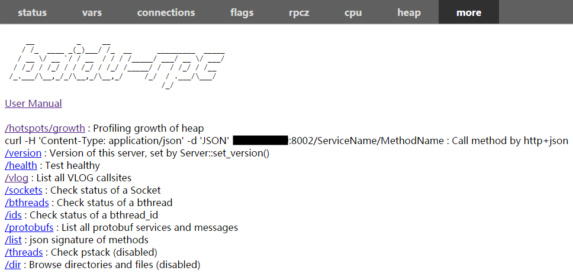
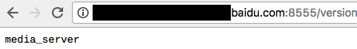

# About Builtin Services

Builtin services expose internal status of servers, making development and debugging more efficient over brpc. brpc serves builting services via `HTTP`, which can be easily accessed through curl and browsers.  Servers respond *plain text* or *html* according to `User-Agent` in the request header, or you can append `?console=1` to the *uri* which forces servers to respond *plain text*. Here's an [example](http://brpc.baidu.com:8765/) running on our machine, check it out for more information about the builtin services. If the listen port is filtered(e.g. not all ports can be accessed outside data centers in Baidu), you can run [rpc_view](rpc_view.md) to launch a proxy or run `curl \<SERVER-URL\>` inside data centers.

Accessed through browsers:

Accessed through terminal:

# Safe Mode

To stay safe from attack, you **must** disable builtin services in the servers on public network, including the ones accessed by proxies(nginx or other http servers). Click [here](../cn/server.md#安全模式) for more details.

# Main services:

[status](status.md)

[vars](vars.md)

[connections](../cn/connections.md)

[flags](../cn/flags.md)

[rpcz](../cn/rpcz.md)

[cpu profiler](../cn/cpu_profiler.md)

[heap profiler](../cn/heap_profiler.md)

[contention profiler](../cn/contention_profiler.md)

# Other services

[version service](http://brpc.baidu.com:8765/version) shows the version of the server。Invoke Server::set_version() to specify version of your server, or brpc would generate a default version in like `brpc_server_<service-name1>_<service-name2> ...`

[health service](http://brpc.baidu.com:8765/health) shows whether this server is alive or not.

[protobufs service](http://brpc.baidu.com:8765/protobufs) shows scheme of all the protobuf messages insides the server.

[vlog service](http://brpc.baidu.com:8765/vlog) shows all the [VLOG](streaming_log.md#VLOG) that can be enable(not work with glog).

