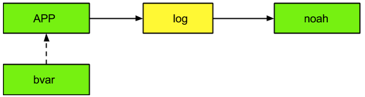

[中文版](../cn/bvar.md)

# What is bvar?

[bvar](https://github.com/brpc/brpc/tree/master/src/bvar/) is a set of counters to record and view miscellaneous statistics conveniently in multi-threaded applications. The implementation reduces cache bouncing by storing data in thread local storage(TLS), being much faster than UbMonitor(a legacy counting library inside Baidu) and even atomic operations in highly contended scenarios. brpc integrates bvar by default, namely all exposed bvars in a server are accessible through [/vars](http://brpc.baidu.com:8765/vars), and a single bvar is addressable by [/vars/VARNAME](http://brpc.baidu.com:8765/vars/rpc_socket_count). Read [vars](vars.md) to know how to query them in brpc servers. brpc extensively use bvar to expose internal status. If you are looking for an utility to collect and display metrics of your application, consider bvar in the first place. bvar definitely can't replace all counters, essentially it moves contentions occurred during write to read: which needs to combine all data written by all threads and becomes much slower than an ordinary read. If read and write on the counter are both frequent or decisions need to be made based on latest values, you should not use bvar.

To understand how bvar works, read [explaining cacheline](atomic_instructions.md#cacheline) first, in which the mentioned counter example is just bvar. When many threads are modifying a counter, each thread writes into its own area without joining the global contention and all private data are combined at read, which is much slower than an ordinary one, but OK for low-frequency logging or display. The much faster and very-little-overhead write enables users to monitor systems from all aspects without worrying about hurting performance. This is the purpose that we designed bvar.

Following graph compares overhead of bvar, atomics, static UbMonitor, dynamic UbMonitor when they're accessed by multiple threads simultaneously. We can see that overhead of bvar is not related to number of threads basically, and being constantly low (~20 nanoseconds). As a contrast, dynamic UbMonitor costs 7 microseconds on each operation when there're 24 threads, which is the overhead of using the bvar for 300 times.


# Monitor bvar

Following graph demonstrates how bvars in applications are monitored.



In which:

- APP means user's application which uses bvar API to record all sorts of metrics.
- bvar periodically prints exposed bvars into a file (represented by "log") under directory $PWD/monitor/ . The "log" is different from an ordinary log that it's overwritten by newer content rather than concatenated.
- The monitoring system collects dumped files (represented by noah), aggregates the data inside and plots curves.

The APP is recommended to meet following requirements:

- **Error**: Number of every kind of error that may occur. 
- **Latency**: latencies(average/percentile) of each public RPC interface, latencies of each RPC to back-end servers.
- **QPS**: QPS of each public RPC interface, QPS of each RPC to back-end servers.

Read [Quick introduction](bvar_c++.md#quick-introduction) to know how to add bvar in C++.  bvar already provides stats of many process-level and system-level variables by default, which are prefixed with `process_` and `system_`, such as:

```
process_context_switches_involuntary_second : 14
process_context_switches_voluntary_second : 15760
process_cpu_usage : 0.428
process_cpu_usage_system : 0.142
process_cpu_usage_user : 0.286
process_disk_read_bytes_second : 0
process_disk_write_bytes_second : 260902
process_faults_major : 256
process_faults_minor_second : 14
process_memory_resident : 392744960
system_core_count : 12
system_loadavg_15m : 0.040
system_loadavg_1m : 0.000
system_loadavg_5m : 0.020
```

and miscellaneous bvars used by brpc itself:

```
bthread_switch_second : 20422
bthread_timer_scheduled_second : 4
bthread_timer_triggered_second : 4
bthread_timer_usage : 2.64987e-05
bthread_worker_count : 13
bthread_worker_usage : 1.33733
bvar_collector_dump_second : 0
bvar_collector_dump_thread_usage : 0.000307385
bvar_collector_grab_second : 0
bvar_collector_grab_thread_usage : 1.9699e-05
bvar_collector_pending_samples : 0
bvar_dump_interval : 10
bvar_revision : "34975"
bvar_sampler_collector_usage : 0.00106495
iobuf_block_count : 89
iobuf_block_count_hit_tls_threshold : 0
iobuf_block_memory : 729088
iobuf_newbigview_second : 10
```

Turn on [dump feature](bvar_c++.md#export-all-variables) of bvar to export all exposed bvars to files, which are formatted just like above texts: each line is a pair of "name" and "value". Check if there're data under $PWD/monitor/ after enabling dump, for example:

```
$ ls monitor/
bvar.echo_client.data  bvar.echo_server.data
 
$ tail -5 monitor/bvar.echo_client.data
process_swaps : 0
process_time_real : 2580.157680
process_time_system : 0.380942
process_time_user : 0.741887
process_username : "gejun"
```

The monitoring system should combine data on every single machine periodically and provide on-demand queries. Take the "noah" system inside Baidu as an example, variables defined by bvar appear as metrics in noah, which can be checked by users to view historical curves.


# Dump to the format of other monitoring system

Currently monitoring system supported by bvar is [Prometheus](https://prometheus.io). All you need to do is to set the path in scraping target url to `/metrics`. For example, if brpc server is running in localhost on port 8080, the scraping target should be `127.0.0.1:8080/metrics`.
