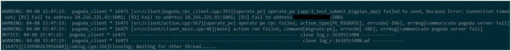

[中文版](../cn/client.md)

# Example

[client-side code](https://github.com/brpc/brpc/blob/master/example/echo_c++/client.cpp) of echo.

# Quick facts

- Channel.Init() is not thread-safe.
- Channel.CallMethod() is thread-safe and a Channel can be used by multiple threads simultaneously.
- Channel can be put on stack.
- Channel can be destructed just after sending asynchronous request.
- No class named brpc::Client.

# Channel
Client-side of RPC sends requests. It's called [Channel](https://github.com/brpc/brpc/blob/master/src/brpc/channel.h) rather than "Client" in brpc. A channel represents a communication line to one server or multiple servers, which can be used for calling services.

A Channel can be **shared by all threads** in the process. Yon don't need to create separate Channels for each thread, and you don't need to synchronize Channel.CallMethod with lock. However creation and destroying of Channel is **not** thread-safe,  make sure the channel is initialized and destroyed only by one thread.

Some RPC implementations have so-called "ClientManager", including configurations and resource management at the client-side, which is not needed by brpc. "thread-num", "connection-type" such parameters are either in brpc::ChannelOptions or global gflags. Advantages of doing so:

1. Convenience. You don't have to pass a "ClientManager" when the Channel is created, and you don't have to store the "ClientManager". Otherwise code has to pass "ClientManager" layer by layer, which is troublesome. gflags makes configurations of global behaviors easier.
2. Share resources. For example, servers and channels in brpc share background workers (of bthread).
3. Better management of Lifetime. Destructing a "ClientManager" is very error-prone, which is managed by brpc right now.

Like most classes, Channel must be **Init()**-ed before usage. Parameters take default values when `options` is NULL. If you want non-default values, code as follows:
```c++
brpc::ChannelOptions options;  // including default values
options.xxx = yyy;
...
channel.Init(..., &options);
```
Note that Channel neither modifies `options` nor accesses `options` after completion of Init(), thus options can be put on stack safely as in above code. Channel.options() gets options being used by the Channel.

Init() can connect one server or a cluster(multiple servers).

# Connect to a server

```c++
// Take default values when options is NULL.
int Init(EndPoint server_addr_and_port, const ChannelOptions* options);
int Init(const char* server_addr_and_port, const ChannelOptions* options);
int Init(const char* server_addr, int port, const ChannelOptions* options);
```
The server connected by these Init() has fixed address generally. The creation does not need NamingService or LoadBalancer, being relatively light-weight.  The address could be a hostname, but don't frequently create Channels connecting to a hostname, which requires a DNS lookup taking at most 10 seconds. (default timeout of DNS lookup). Reuse them.

Valid "server_addr_and_port":
- 127.0.0.1:80
- www.foo.com:8765
- localhost:9000

Invalid "server_addr_and_port":
- 127.0.0.1:90000     # too large port
- 10.39.2.300:8000   # invalid IP

# Connect to a cluster

```c++
int Init(const char* naming_service_url,
         const char* load_balancer_name,
         const ChannelOptions* options);
```
Channels created by above Init() get server list from the NamingService specified by `naming_service_url` periodically or driven-by-events, and send request to one server chosen from the list according to the algorithm specified by `load_balancer_name` .

You **should not** create such channels ad-hocly each time before a RPC, because creation and destroying of such channels relate to many resources, say NamingService needs to be accessed once at creation otherwise server candidates are unknown. On the other hand, channels are able to be shared by multiple threads safely and has no need to be created frequently.

If `load_balancer_name` is NULL or empty, this Init() is just the one for connecting single server and `naming_service_url` should be "ip:port" or "host:port" of the server. Thus you can unify initialization of all channels with this Init(). For example, you can put values of `naming_service_url` and `load_balancer_name` in configuration file, and set `load_balancer_name` to empty for single server and a valid algorithm for a cluster.

## Naming Service

Naming service maps a name to a modifiable list of servers. It's positioned as follows at client-side:


With the help of naming service, the client remembers a name instead of every concrete server. When the servers are added or removed, only mapping in the naming service is changed, rather than telling every client that may access the cluster. This process is called "decoupling up and downstreams". Back to implementation details, the client does remember every server and will access NamingService periodically or be pushed with latest server list. The impl. has minimal impact on RPC latencies and very small pressure on the system providing naming service.

General form of `naming_service_url`  is "**protocol://service_name**".

### bns://\<bns-name\>

BNS is the most common naming service inside Baidu. In "bns://rdev.matrix.all", "bns" is protocol and "rdev.matrix.all" is service-name. A related gflag is -ns_access_interval: 

If the list in BNS is non-empty, but Channel says "no servers", the status bit of the machine in BNS is probably non-zero, which means the machine is unavailable and as a correspondence not added as server candidates of the Channel. Status bits can be checked by:

`get_instance_by_service [bns_node_name] -s`

### file://\<path\>

Servers are put in the file specified by `path`. For example, in "file://conf/machine_list", "conf/machine_list" is the file:
 * in which each line is address of a server. 
 * contents after \# are comments and ignored.
 * non-comment contents after addresses are tags, which are separated from addresses by one or more spaces, same address + different tags are treated as different instances.
 * brpc reloads the file when it's updated.
```
# This line is ignored
10.24.234.17:8080 tag1  # a comment
10.24.234.17:8090 tag2  # an instance different from the instance on last line
10.24.234.18:8080
10.24.234.19:8080
```

Pros: easy to modify, convenient for unittests.

Cons: need to update every client when the list changes, not suitable for online deployment.

### list://\<addr1\>,\<addr2\>...

Servers are directly written after list://, separated by comma. For example: "list://db-bce-81-3-186.db01:7000,m1-bce-44-67-72.m1:7000,cp01-rd-cos-006.cp01:7000" has 3 addresses.

Tags can be appended to addresses, separated with one or more spaces. Same address + different tags are treated as different instances.

Pros: directly configurable in CLI, convenient for unittests.

Cons: cannot be updated at runtime, not suitable for online deployment at all.

### http://\<url\>

Connect all servers under the domain, for example: http://www.baidu.com:80. 

Note: although Init() for connecting single server(2 parameters) accepts hostname as well, it only connects one server under the domain.

Pros: Versatility of DNS, useable both in private or public network.

Cons: limited by transmission formats of DNS, unable to implement notification mechanisms.

### https://\<url\>

Similar with "http" prefix besides that the connections will be encrypted with SSL.

### consul://\<service-name\>

Get a list of servers with the specified service-name through consul. The default address of consul is localhost:8500, which can be modified by setting -consul\_agent\_addr in gflags. The connection timeout of consul is 200ms by default, which can be modified by -consul\_connect\_timeout\_ms. 

By default, [stale](https://www.consul.io/api/index.html#consistency-modes) and passing(only servers with passing in statuses are returned) are added to [parameters of the consul request]((https://www.consul.io/api/health.html#parameters-2)), which can be modified by -consul\_url\_parameter in gflags.

Except the first request to consul, the follow-up requests use the [long polling](https://www.consul.io/api/index.html#blocking-queries) feature. That is, the consul responds only when the server list is updated or the request times out. The timeout defaults to 60 seconds, which can be modified by -consul\_blocking\_query\_wait\_secs.

If the server list returned by the consul does not follow [response format](https://www.consul.io/api/health.html#sample-response-2), or all servers in the list are filtered because the key fields such as the address and port are missing or cannot be parsed, the server list will not be updated and the consul service will be revisited after a period of time(default 500ms, can be modified by -consul\_retry\_interval\_ms）.

If consul is not accessible, the naming service can be automatically downgraded to file naming service. This feature is turned off by default and can be turned on by setting -consul\_enable\_degrade\_to\_file\_naming\_service. After downgrading, in the directory specified by -consul\_file\_naming\_service\_dir, the file whose name is the service-name will be used. This file can be generated by the consul-template, which holds the latest server list before the consul is unavailable. The consul naming service is automatically restored when consul is restored.


### nacos://\<service-name\>

NacosNamingService gets a list of servers from nacos periodically by [Open-Api](https://nacos.io/en-us/docs/open-api.html).
NacosNamingService supports [simple authentication](https://nacos.io/en-us/docs/auth.html).

`<service-name>` is a http uri query，For more detail, refer to `/nacos/v1/ns/instance/list` api document.
NOTE: `<service-name>` must be url-encoded.
```
nacos://serviceName=test&groupName=g&namespaceId=n&clusters=c&healthyOnly=true
```

The server list is cached for `cacheMillis` milliseconds as specified in the response of `/nacos/v1/ns/instance/list` api.
NOTE: The value of server weight must be an integer.

| GFlags                             | Description                          | Default value                |
| ---------------------------------- | ------------------------------------ | ---------------------------- |
| nacos_address                      | nacos http url                       | ""                           |
| nacos_service_discovery_path       | path for discovery                   | "/nacos/v1/ns/instance/list" |
| nacos_service_auth_path            | path for login                       | "/nacos/v1/auth/login"       |
| nacos_service_timeout_ms           | timeout for connecting to nacos(ms)  | 200                          |
| nacos_username                     | url-encoded username                 | ""                           |
| nacos_password                     | url-encoded password                 | ""                           |
| nacos_load_balancer                | load balancer for nacos clusters     | "rr"                         |


### More naming services
User can extend to more naming services by implementing brpc::NamingService, check [this link](https://github.com/brpc/brpc/blob/master/docs/cn/load_balancing.md#%E5%91%BD%E5%90%8D%E6%9C%8D%E5%8A%A1) for details.

### The tag in naming service
Every address can be attached with a tag. The common implementation is that if there're spaces after the address, the content after the spaces is the tag.
Same address with different tag are treated as different instances which are interacted with separate connections. Users can use this feature to establish connections with remote servers in a more flexible way.
If you need weighted round-robin, you should consider using [wrr algorithm](#wrr) first rather than emulate "a coarse-grained version" with tags.

### VIP related issues
VIP is often the public IP of layer-4 load balancer, which proxies traffic to RS behide. When a client connects to the VIP, a connection is established to a chosen RS. When the client connection is broken, the connection to the RS is reset as well.

If one client establishes only one connection to the VIP("single" connection type in brpc), all traffic from the client lands on one RS. If number of clients are large enough, each RS should gets many connections and roughly balanced, at least from the cluster perspective. However, if clients are not large enough or workload from clients are very different, some RS may be overloaded. Another issue is that when multiple VIP are listed together, the traffic to them may not be proportional to the number of RS behide them.

One solution to these issues is to use "pooled" connection type, so that one client may create multiple connections to one VIP (roughly the max concurrency recently) to make traffic land on different RS. If more than one VIP are present, consider using [wrr load balancing](#wrr) to assign weights to different VIP, or add different tags to VIP to form more instances.

If higher performance is demanded, or number of connections is limited (in a large cluster), consider using single connection and attach same VIP with different tags to create different connections. Comparing to pooled connections, number of connections and overhead of syscalls are often lower, but if tags are not enough, RS hotspots may still present.

### Naming Service Filter

Users can filter servers got from the NamingService before pushing to LoadBalancer.


Interface of the filter:
```c++
// naming_service_filter.h
class NamingServiceFilter {
public:
    // Return true to take this `server' as a candidate to issue RPC
    // Return false to filter it out
    virtual bool Accept(const ServerNode& server) const = 0;
};

// naming_service.h
struct ServerNode {
    butil::EndPoint addr;
    std::string tag;
};
```
The most common usage is filtering by server tags.

Customized filter is set to ChannelOptions to take effects. NULL by default means not filter.

```c++
class MyNamingServiceFilter : public brpc::NamingServiceFilter {
public:
    bool Accept(const brpc::ServerNode& server) const {
        return server.tag == "main";
    }
};

int main() {
    ...
    MyNamingServiceFilter my_filter;
    ...
    brpc::ChannelOptions options;
    options.ns_filter = &my_filter;
    ...
}
```

## Load Balancer

When there're more than one server to access, we need to divide the traffic. The process is called load balancing, which is positioned as follows at client-side.


The ideal algorithm is to make every request being processed in-time, and crash of any server makes minimal impact. However clients are not able to know delays or congestions happened at servers in realtime, and load balancing algorithms should be light-weight generally, users need to choose proper algorithms for their use cases. Algorithms provided by brpc (specified by `load_balancer_name`):

### rr

which is round robin. Always choose next server inside the list, next of the last server is the first one. No other settings. For example there're 3 servers: a,b,c, brpc will send requests to a, b, c, a, b, c, … and so on. Note that presumption of using this algorithm is the machine specs, network latencies, server loads are similar.

### wrr

which is weighted round robin. Choose the next server according to the configured weight. The chances a server is selected is consistent with its weight, and the algorithm can make each server selection scattered.

The instance tag must be an int32 number representing the weight, eg. tag="50".

### random

Randomly choose one server from the list, no other settings. Similarly with round robin, the algorithm assumes that servers to access are similar.

### wr

which is weighted random. Choose the next server according to the configured weight. The chances a server is selected is consistent with its weight.

Requirements of instance tag is the same as wrr.

### la

which is locality-aware. Perfer servers with lower latencies, until the latency is higher than others, no other settings. Check out [Locality-aware load balancing](lalb.md) for more details.

### c_murmurhash or c_md5

which is consistent hashing. Adding or removing servers does not make destinations of requests change as dramatically as in simple hashing. It's especially suitable for caching services.

Need to set Controller.set_request_code() before RPC otherwise the RPC will fail. request_code is often a 32-bit hash code of "key part" of the request, and the hashing algorithm does not need to be same with the one used by load balancer. Say `c_murmurhash`  can use md5 to compute request_code of the request as well.

[src/brpc/policy/hasher.h](https://github.com/brpc/brpc/blob/master/src/brpc/policy/hasher.h) includes common hash functions. If `std::string key` stands for key part of the request, controller.set_request_code(brpc::policy::MurmurHash32(key.data(), key.size())) sets request_code correctly.

Do distinguish "key" and "attributes" of the request. Don't compute request_code by full content of the request just for quick. Minor change in attributes may result in totally different hash code and change destination dramatically. Another cause is padding, for example: `struct Foo { int32_t a; int64_t b; }` has a 4-byte undefined gap between `a` and `b` on 64-bit machines, result of `hash(&foo, sizeof(foo))` is undefined. Fields need to be packed or serialized before hashing.

Check out [Consistent Hashing](consistent_hashing.md) for more details.

Other kind of lb does not need to set Controller.set_request_code(). If request code is set, it will not be used by lb. For example, lb=rr, and call Controller.set_request_code(), even if request_code is the same for every request, lb will balance the requests using the rr policy.

### Client-side throttling for recovery from cluster downtime

Cluster downtime refers to the state in which all servers in the cluster are unavailable. Due to the health check mechanism, when the cluster returns to normal, server will go online one by one. When a server is online, all traffic will be sent to it, which may cause the service to be overloaded again. If circuit breaker is enabled, server may be offline again before the other servers go online, and the cluster can never be recovered. As a solution, brpc provides a client-side throttling mechanism for recovery after cluster downtime. When no server is available in the cluster, the cluster enters recovery state. Assuming that the minimum number of servers that can serve all requests is min_working_instances, current number of servers available in the cluster is q, then in recovery state, the probability of client accepting the request is q/min_working_instances, otherwise it is discarded. If q remains unchanged for a period of time(hold_seconds), the traffic is resent to all available servers and leaves recovery state. Whether the request is rejected in recovery state is indicated by whether controller.ErrorCode() is equal to brpc::ERJECT, and the rejected request will not be retried by the framework.

This recovery mechanism requires the capabilities of downstream servers to be similar, so it is currently only valid for rr and random. The way to enable it is to add the values of min_working_instances and hold_seconds parameters after *load_balancer_name*, for example:
```c++
channel.Init("http://...", "random:min_working_instances=6 hold_seconds=10", &options);
```

## Health checking

Servers whose connections are lost are isolated temporarily to prevent them from being selected by LoadBalancer. brpc connects isolated servers periodically to test if they're healthy again. The interval is controlled by gflag -health_check_interval:

| Name                      | Value | Description                              | Defined At              |
| ------------------------- | ----- | ---------------------------------------- | ----------------------- |
| health_check_interval (R) | 3     | seconds between consecutive health-checkings | src/brpc/socket_map.cpp |

Once a server is connected, it resumes as a server candidate inside LoadBalancer. If a server is removed from NamingService during health-checking, brpc removes it from health-checking as well.

# Launch RPC

Generally, we don't use Channel.CallMethod directly, instead we call XXX_Stub generated by protobuf, which feels more like a "method call". The stub has few member fields, being suitable(and recommended) to be put on stack instead of new(). Surely the stub can be saved and re-used as well. Channel.CallMethod and stub are both **thread-safe** and accessible by multiple threads simultaneously. For example:
```c++
XXX_Stub stub(&channel);
stub.some_method(controller, request, response, done);
```
Or even:
```c++
XXX_Stub(&channel).some_method(controller, request, response, done);
```
A exception is http/h2 client, which is not related to protobuf much. Call CallMethod directly to make a http call, setting all parameters to NULL except for `Controller` and `done`, check [Access http/h2](http_client.md) for details.

## Synchronous call

CallMethod blocks until response from server is received or error occurred (including timedout).

response/controller in synchronous call will not be used by brpc again after CallMethod, they can be put on stack safely. Note: if request/response has many fields and being large on size, they'd better be allocated on heap.
```c++
MyRequest request;
MyResponse response;
brpc::Controller cntl;
XXX_Stub stub(&channel);

request.set_foo(...);
cntl.set_timeout_ms(...);
stub.some_method(&cntl, &request, &response, NULL);
if (cntl.Failed()) {
    // RPC failed. fields in response are undefined, don't use.
} else {
    // RPC succeeded, response has what we want.
}
```

> WARNING: Do NOT use synchronous call when you are holding a pthread lock! Otherwise it is easy to cause deadlock.
> 
> Solution (choose one of the two):
> 1. Replace pthread lock with bthread lock (bthread_mutex_t)
> 1. Release the lock before CallMethod

## Asynchronous call

Pass a callback `done` to CallMethod, which resumes after sending request, rather than completion of RPC. When the response from server is received  or error occurred(including timedout), done->Run() is called. Post-processing code of the RPC should be put in done->Run() instead of after CallMethod.

Because end of CallMethod does not mean completion of RPC, response/controller may still be used by brpc or done->Run(). Generally they should be allocated on heap and deleted in done->Run(). If they're deleted too early, done->Run() may access invalid memory.

You can new these objects individually and create done by [NewCallback](#use-newcallback), or make response/controller be member of done and [new them together](#Inherit-google::protobuf::Closure). Former one is recommended.

Request can be destroyed immediately after asynchronous CallMethod. (SelectiveChannel is an exception, in the case of SelectiveChannel, the request object must be released after rpc finish)

Channel can be destroyed immediately after asynchronous CallMethod.

Note that "immediately" means destruction of Request/Channel can happen **after** CallMethod, not during CallMethod. Deleting a Channel just being used by another thread results in undefined behavior (crash at best).

### Use NewCallback
```c++
static void OnRPCDone(MyResponse* response, brpc::Controller* cntl) {
    // unique_ptr helps us to delete response/cntl automatically. unique_ptr in gcc 3.4 is an emulated version.
    std::unique_ptr<MyResponse> response_guard(response);
    std::unique_ptr<brpc::Controller> cntl_guard(cntl);
    if (cntl->Failed()) {
        // RPC failed. fields in response are undefined, don't use.
    } else {
        // RPC succeeded, response has what we want. Continue the post-processing.
    }
    // Closure created by NewCallback deletes itself at the end of Run.
}

MyResponse* response = new MyResponse;
brpc::Controller* cntl = new brpc::Controller;
MyService_Stub stub(&channel);

MyRequest request;  // you don't have to new request, even in an asynchronous call.
request.set_foo(...);
cntl->set_timeout_ms(...);
stub.some_method(cntl, &request, response, brpc::NewCallback(OnRPCDone, response, cntl));
```
Since protobuf 3 changes NewCallback to private, brpc puts NewCallback in [src/brpc/callback.h](https://github.com/brpc/brpc/blob/master/src/brpc/callback.h) after r32035 (and adds more overloads). If your program has compilation issues with NewCallback, replace google::protobuf::NewCallback with brpc::NewCallback.

### Inherit google::protobuf::Closure

Drawback of using NewCallback is that you have to allocate memory on heap at least 3 times: response, controller, done. If profiler shows that the memory allocation is a hotspot, you can consider inheriting Closure by your own, and enclose response/controller as member fields. Doing so combines 3 new into one, but the code will be worse to read. Don't do this if memory allocation is not an issue.
```c++
class OnRPCDone: public google::protobuf::Closure {
public:
    void Run() {
        // unique_ptr helps us to delete response/cntl automatically. unique_ptr in gcc 3.4 is an emulated version.
        std::unique_ptr<OnRPCDone> self_guard(this);

        if (cntl->Failed()) {
            // RPC failed. fields in response are undefined, don't use.
        } else {
            // RPC succeeded, response has what we want. Continue the post-processing.
        }
    }

    MyResponse response;
    brpc::Controller cntl;
}

OnRPCDone* done = new OnRPCDone;
MyService_Stub stub(&channel);

MyRequest request;  // you don't have to new request, even in an asynchronous call.
request.set_foo(...);
done->cntl.set_timeout_ms(...);
stub.some_method(&done->cntl, &request, &done->response, done);
```

### What will happen when the callback is very complicated?

No special impact, the callback will run in separate bthread, without blocking other sessions. You can do all sorts of things in the callback.

### Does the callback run in the same thread that CallMethod runs?

The callback runs in a different bthread, even the RPC fails just after entering CallMethod. This avoids deadlock when the RPC is ongoing inside a lock(not recommended).

## Wait for completion of RPC
NOTE: [ParallelChannel](combo_channel.md#parallelchannel) is probably more convenient to  launch multiple RPCs in parallel.

Following code starts 2 asynchronous RPC and waits them to complete.
```c++
const brpc::CallId cid1 = controller1->call_id();
const brpc::CallId cid2 = controller2->call_id();
...
stub.method1(controller1, request1, response1, done1);
stub.method2(controller2, request2, response2, done2);
...
brpc::Join(cid1);
brpc::Join(cid2);
```
Call `Controller.call_id()` to get an id **before launching RPC**, join the id after the RPC.

Join() blocks until completion of RPC **and end of done->Run()**,  properties of Join:

- If the RPC is complete, Join() returns immediately.
- Multiple threads can Join() one id, all of them will be woken up.
- Synchronous RPC can be Join()-ed in another thread, although we rarely do this.

Join() was called JoinResponse() before, if you meet deprecated issues during compilation, rename to Join().

Calling `Join(controller->call_id())` after completion of RPC is **wrong**, do save call_id before RPC, otherwise the controller may be deleted by done at any time. The Join in following code is **wrong**.

```c++
static void on_rpc_done(Controller* controller, MyResponse* response) {
    ... Handle response ...
    delete controller;
    delete response;
}

Controller* controller1 = new Controller;
Controller* controller2 = new Controller;
MyResponse* response1 = new MyResponse;
MyResponse* response2 = new MyResponse;
...
stub.method1(controller1, &request1, response1, google::protobuf::NewCallback(on_rpc_done, controller1, response1));
stub.method2(controller2, &request2, response2, google::protobuf::NewCallback(on_rpc_done, controller2, response2));
...
brpc::Join(controller1->call_id());   // WRONG, controller1 may be deleted by on_rpc_done
brpc::Join(controller2->call_id());   // WRONG, controller2 may be deleted by on_rpc_done
```

## Semi-synchronous call

Join can be used for implementing "Semi-synchronous" call: blocks until multiple asynchronous calls to complete. Since the callsite blocks until completion of all RPC, controller/response can be put on stack safely.
```c++
brpc::Controller cntl1;
brpc::Controller cntl2;
MyResponse response1;
MyResponse response2;
...
stub1.method1(&cntl1, &request1, &response1, brpc::DoNothing());
stub2.method2(&cntl2, &request2, &response2, brpc::DoNothing());
...
brpc::Join(cntl1.call_id());
brpc::Join(cntl2.call_id());
```
brpc::DoNothing() gets a closure doing nothing, specifically for semi-synchronous calls. Its lifetime is managed by brpc.

Note that in above example, we access `controller.call_id()` after completion of RPC, which is safe right here, because DoNothing does not delete controller as in `on_rpc_done` in previous example.

## Cancel RPC

`brpc::StartCancel(call_id)` cancels corresponding RPC, call_id must be got from Controller.call_id() **before launching RPC**, race conditions may occur at any other time.

NOTE: it is `brpc::StartCancel(call_id)`, not `controller->StartCancel()`, which is forbidden and useless. The latter one is provided by protobuf by default and has serious race conditions on lifetime of controller.

As the name implies, RPC may not complete yet after calling StartCancel, you should not touch any field in Controller or delete any associated resources, they should be handled inside done->Run(). If you have to wait for completion of RPC in-place(not recommended), call Join(call_id).

Facts about StartCancel:

- call_id can be cancelled before CallMethod, the RPC will end immediately(and done will be called).
- call_id can be cancelled in another thread.
- Cancel an already-cancelled call_id has no effect. Inference: One call_id can be cancelled by multiple threads simultaneously, but only one of them takes effect.
- Cancel here is a client-only feature, **the server-side may not cancel the operation necessarily**, server cancelation is a separate feature.

## Get server-side address and port

remote_side() tells where request was sent to, the return type is [butil::EndPoint](https://github.com/brpc/brpc/blob/master/src/butil/endpoint.h), which includes an ipv4 address and port. Calling this method before completion of RPC is undefined.

How to print:
```c++
LOG(INFO) << "remote_side=" << cntl->remote_side();
printf("remote_side=%s\n", butil::endpoint2str(cntl->remote_side()).c_str());
```
## Get client-side address and port

local_side() gets address and port of the client-side sending RPC after r31384

How to print:
```c++
LOG(INFO) << "local_side=" << cntl->local_side();
printf("local_side=%s\n", butil::endpoint2str(cntl->local_side()).c_str());
```
## Should brpc::Controller be reused?

Not necessary to reuse deliberately.

Controller has miscellaneous fields, some of them are buffers that can be re-used by calling Reset().

In most use cases, constructing a Controller(snippet1) and re-using a Controller(snippet2) perform similarily.
```c++
// snippet1
for (int i = 0; i < n; ++i) {
    brpc::Controller controller;
    ...
    stub.CallSomething(..., &controller);
}

// snippet2
brpc::Controller controller;
for (int i = 0; i < n; ++i) {
    controller.Reset();
    ...
    stub.CallSomething(..., &controller);
}
```
If the Controller in snippet1 is new-ed on heap, snippet1 has extra cost of "heap allcation" and may be a little slower in some cases.

# Settings

Client-side settings has 3 parts:

- brpc::ChannelOptions: defined in [src/brpc/channel.h](https://github.com/brpc/brpc/blob/master/src/brpc/channel.h), for initializing Channel, becoming immutable once the initialization is done.
- brpc::Controller: defined in [src/brpc/controller.h](https://github.com/brpc/brpc/blob/master/src/brpc/controller.h), for overriding fields in brpc::ChannelOptions for some RPC according to contexts.
- global gflags: for tuning global behaviors, being unchanged generally. Read comments in [/flags](flags.md) before setting.

Controller contains data and options that request may not have. server and client share the same Controller class, but they may set different fields. Read comments in Controller carefully before using.

A Controller corresponds to a RPC. A Controller can be re-used by another RPC after Reset(), but a Controller can't be used by multiple RPC simultaneously, no matter the RPCs are started from one thread or not.

Properties of Controller:
1.  A Controller can only have one user. Without explicit statement, methods in Controller are **not** thread-safe by default.
2.  Due to the fact that Controller is not shared generally, there's no need to manage Controller by shared_ptr. If you do, something might goes wrong.
3.  Controller is constructed before RPC and destructed after RPC, some common patterns:
   - Put Controller on stack before synchronous RPC, be destructed when out of scope. Note that Controller of asynchronous RPC **must not** be put on stack, otherwise the RPC may still run when the Controller is being destructed and result in undefined behavior.
   - new Controller before asynchronous RPC, delete in done.

## Number of worker pthreads

There's **no** independent thread pool for client in brpc. All Channels and Servers share the same backing threads via [bthread](bthread.md).  Setting number of worker pthreads in Server works for Client as well if Server is in used. Or just specify the [gflag](flags.md) [-bthread_concurrency](brpc.baidu.com:8765/flags/bthread_concurrency) to set the global number of worker pthreads.

## Timeout

**ChannelOptions.timeout_ms** is timeout in milliseconds for all RPCs via the Channel, Controller.set_timeout_ms() overrides value for one RPC. Default value is 1 second, Maximum value is 2^31 (about 24 days), -1 means wait indefinitely for response or connection error.

**ChannelOptions.connect_timeout_ms** is the timeout in milliseconds for establishing connections of RPCs over the Channel, and -1 means no deadline. This value is limited to be not greater than timeout_ms. Note that this connection timeout is different from the one in TCP, generally this one is smaller.

NOTE1: timeout_ms in brpc is **deadline**, which means once it's reached, the RPC ends without more retries. As a comparison, other implementations may have session timeouts and deadline timeouts. Do distinguish them before porting to brpc.

NOTE2: error code of RPC timeout is **ERPCTIMEDOUT (1008) **, ETIMEDOUT is connection timeout and retriable.

## Retry

ChannelOptions.max_retry is maximum retrying count for all RPC via the channel, Default value is 3, 0 means no retries. Controller.set_max_retry() overrides value for one RPC.

Controller.retried_count() returns number of retries.

Controller.has_backup_request() tells if backup_request was sent.

**Servers tried before are not retried by best efforts**

Conditions for retrying (AND relations):
- Broken connection.
- Timeout is not reached.
- Has retrying quota. Controller.set_max_retry(0) or ChannelOptions.max_retry = 0 disables retries.
- The retry makes sense. If the RPC fails due to request(EREQUEST), no retry will be done because server is very likely to reject the request again, retrying makes no sense here.

### Broken connection

If the server does not respond and connection is good, retry is not triggered. If you need to send another request after some timeout, use backup request.

How it works: If response does not return within the timeout specified by backup_request_ms, send another request, take whatever the first returned. New request will be sent to a different server that never tried before by best efforts. NOTE: If backup_request_ms is greater than timeout_ms, backup request will never be sent. backup request consumes one retry. backup request does not imply a server-side cancellation.

ChannelOptions.backup_request_ms affects all RPC via the Channel, unit is milliseconds, Default value is -1(disabled), Controller.set_backup_request_ms() overrides value for one RPC.

### Timeout is not reached

RPC will be ended soon after the timeout.

### Has retrying quota

Controller.set_max_retry(0) or ChannelOptions.max_retry = 0 disables retries.

### The retry makes sense

If the RPC fails due to request(EREQUEST), no retry will be done because server is very likely to reject the request again, retrying makes no sense here.

Users can inherit [brpc::RetryPolicy](https://github.com/brpc/brpc/blob/master/src/brpc/retry_policy.h) to customize conditions of retrying. For example brpc does not retry for http/h2 related errors by default. If you want to retry for HTTP_STATUS_FORBIDDEN(403) in your app, you can do as follows:

```c++
#include <brpc/retry_policy.h>

class MyRetryPolicy : public brpc::RetryPolicy {
public:
    bool DoRetry(const brpc::Controller* cntl) const {
        if (cntl->ErrorCode() == brpc::EHTTP && // http/h2 error
            cntl->http_response().status_code() == brpc::HTTP_STATUS_FORBIDDEN) {
            return true;
        }
        // Leave other cases to brpc.
        return brpc::DefaultRetryPolicy()->DoRetry(cntl);
    }
};
...

// Assign the instance to ChannelOptions.retry_policy.
// NOTE: retry_policy must be kept valid during lifetime of Channel, and Channel does not retry_policy, so in most cases RetryPolicy should be created by singleton..
brpc::ChannelOptions options;
static MyRetryPolicy g_my_retry_policy;
options.retry_policy = &g_my_retry_policy;
...
```

Some tips：

- Get response of the RPC by cntl->response().
- RPC deadline represented by ERPCTIMEDOUT is never retried, even it's allowed by your derived RetryPolicy.

### Retrying should be conservative

Due to maintaining costs, even very large scale clusters are deployed with "just enough" instances to survive major defects, namely offline of one IDC, which is at most 1/2 of all machines. However aggressive retries may easily make pressures from all clients double or even tripple against servers, and make the whole cluster down: More and more requests stuck in buffers, because servers can't process them in-time. All requests have to wait for a very long time to be processed and finally gets timed out, as if the whole cluster is crashed. The default retrying policy is safe generally: unless the connection is broken, retries are rarely sent. However users are able to customize starting conditions for retries by inheriting RetryPolicy, which may turn retries to be "a storm". When you customized RetryPolicy, you need to carefully consider how clients and servers interact and design corresponding tests to verify that retries work as expected.

## Circuit breaker

Check out [circuit_breaker](../cn/circuit_breaker.md) for more details.

## Protocols

The default protocol used by Channel is baidu_std, which is changeable by setting ChannelOptions.protocol. The field accepts both enum and string.

 Supported protocols:

- PROTOCOL_BAIDU_STD or "baidu_std", which is [the standard binary protocol inside Baidu](baidu_std.md), using single connection by default.
- PROTOCOL_HTTP or "http", which is http/1.0 or http/1.1, using pooled connection by default (Keep-Alive).
  - Methods for accessing ordinary http services are listed in [Access http/h2](http_client.md).
  - Methods for accessing pb services by using http:json or http:proto are listed in [http/h2 derivatives](http_derivatives.md)
- PROTOCOL_H2 or ”h2", which is http/2, using single connection by default.
  - Methods for accessing ordinary h2 services are listed in [Access http/h2](http_client.md).
  - Methods for accessing pb services by using h2:json or h2:proto are listed in [http/h2 derivatives](http_derivatives.md)
- "h2:grpc", which is the protocol of [gRPC](https://grpc.io) and based on h2, using single connection by default, check out [h2:grpc](http_derivatives.md#h2grpc) for details.
- PROTOCOL_THRIFT or "thrift", which is the protocol of [apache thrift](https://thrift.apache.org), using pooled connection by default, check out [Access thrift](thrift.md) for details.
- PROTOCOL_MEMCACHE or "memcache", which is binary protocol of memcached, using **single connection** by default. Check out [Access memcached](memcache_client.md) for details.
- PROTOCOL_REDIS or "redis", which is protocol of redis 1.2+ (the one supported by hiredis), using **single connection** by default. Check out [Access Redis](redis_client.md) for details.
- PROTOCOL_HULU_PBRPC or "hulu_pbrpc", which is protocol of hulu-pbrpc, using single connection by default.
- PROTOCOL_NOVA_PBRPC or "nova_pbrpc",  which is protocol of Baidu ads union, using pooled connection by default.
- PROTOCOL_SOFA_PBRPC or "sofa_pbrpc", which is protocol of sofa-pbrpc, using single connection by default.
- PROTOCOL_PUBLIC_PBRPC or "public_pbrpc", which is protocol of public_pbrpc, using pooled connection by default.
- PROTOCOL_UBRPC_COMPACK or "ubrpc_compack", which is protocol of public/ubrpc, packing with compack, using pooled connection by default. check out [ubrpc (by protobuf)](ub_client.md) for details. A related protocol is PROTOCOL_UBRPC_MCPACK2 or ubrpc_mcpack2, packing with mcpack2.
- PROTOCOL_NSHEAD_CLIENT or "nshead_client", which is required by UBXXXRequest in baidu-rpc-ub, using pooled connection by default. Check out [Access UB](ub_client.md) for details.
- PROTOCOL_NSHEAD or "nshead", which is required by sending NsheadMessage, using pooled connection by default. Check out [nshead+blob](ub_client.md#nshead-blob) for details.
- PROTOCOL_NSHEAD_MCPACK or "nshead_mcpack", which is as the name implies, nshead + mcpack (parsed by protobuf via mcpack2pb), using pooled connection by default.
- PROTOCOL_ESP or "esp", for accessing services with esp protocol, using pooled connection by default.

## Connection Type

brpc supports following connection types:

- short connection: Established before each RPC, closed after completion. Since each RPC has to pay the overhead of establishing connection, this type is used for occasionally launched RPC, not frequently launched ones. No protocol use this type by default. Connections in http/1.0 are handled similarly as short connections.
- pooled connection: Pick an unused connection from a pool before each RPC, return after completion. One connection carries at most one request at the same time. One client may have multiple connections to one server. http/1.1 and the protocols using nshead use this type by default.
- single connection: all clients in one process has at most one connection to one server, one connection may carry multiple requests at the same time. The sequence of received responses does not need to be same as sending requests. This type is used by baidu_std, hulu_pbrpc, sofa_pbrpc by default.

|                                          | short connection                         | pooled connection                       | single connection                        |
| ---------------------------------------- | ---------------------------------------- | --------------------------------------- | ---------------------------------------- |
| long connection                          | no                                       | yes                                     | yes                                      |
| \#connection at server-side (from a client) | qps*latency ([little's law](https://en.wikipedia.org/wiki/Little%27s_law)) | qps*latency                             | 1                                        |
| peak qps                                 | bad, and limited by max number of ports  | medium                                  | high                                     |
| latency                                  | 1.5RTT(connect) + 1RTT + processing time | 1RTT + processing time                  | 1RTT + processing time                   |
| cpu usage                                | high, tcp connect for each RPC           | medium, every request needs a sys write | low, writes can be combined to reduce overhead. |

brpc chooses best connection type for the protocol by default, users generally have no need to change it. If you do, set ChannelOptions.connection_type to:

- CONNECTION_TYPE_SINGLE or "single" : single connection

- CONNECTION_TYPE_POOLED or "pooled": pooled connection. Max number of pooled connections from one client to one server is limited by -max_connection_pool_size. Note the number is not same as "max number of connections". New connections are always created when there's no idle ones in the pool; the returned connections are closed immediately when the pool already has max_connection_pool_size connections. Value of max_connection_pool_size should respect the concurrency, otherwise the connnections that can't be pooled are created and closed frequently which behaves similarly as short connections. If max_connection_pool_size is 0, the pool behaves just like fully short connections. 

  | Name                         | Value | Description                              | Defined At          |
  | ---------------------------- | ----- | ---------------------------------------- | ------------------- |
  | max_connection_pool_size (R) | 100   | Max number of pooled connections to a single endpoint | src/brpc/socket.cpp |

- CONNECTION_TYPE_SHORT or "short" : short connection

- "" (empty string) makes brpc chooses the default one.

brpc also supports [Streaming RPC](streaming_rpc.md) which is an application-level connection for transferring streaming data.

## Close idle connections in pools

If a connection has no read or write within the seconds specified by -idle_timeout_second, it's tagged as "idle", and will be closed automatically. Default value is 10 seconds. This feature is only effective to pooled connections. If -log_idle_connection_close is true, a log is printed before closing.

| Name                      | Value | Description                              | Defined At              |
| ------------------------- | ----- | ---------------------------------------- | ----------------------- |
| idle_timeout_second       | 10    | Pooled connections without data transmission for so many seconds will be closed. No effect for non-positive values | src/brpc/socket_map.cpp |
| log_idle_connection_close | false | Print log when an idle connection is closed | src/brpc/socket.cpp     |

## Defer connection close

Multiple channels may share a connection via referential counting. When a channel releases last reference of the connection, the connection will be closed. But in some scenarios, channels are created just before sending RPC and destroyed after completion, in which case connections are probably closed and re-open again frequently, as costly as short connections.

One solution is to cache channels commonly used by user, which avoids frequent creation and destroying of channels.  However brpc does not offer an utility for doing this right now, and it's not trivial for users to implement it correctly.

Another solution is setting gflag -defer_close_second

| Name               | Value | Description                              | Defined At              |
| ------------------ | ----- | ---------------------------------------- | ----------------------- |
| defer_close_second | 0     | Defer close of connections for so many seconds even if the connection is not used by anyone. Close immediately for non-positive values | src/brpc/socket_map.cpp |

After setting, connection is not closed immediately after last referential count, instead it will be closed after so many seconds. If a channel references the connection again during the wait, the connection resumes to normal. No matter how frequent channels are created, this flag limits the frequency of closing connections. Side effect of the flag is that file descriptors are not closed immediately after destroying of channels, if the flag is wrongly set to be large, number of active file descriptors in the process may be large as well.

## Buffer size of connections

-socket_recv_buffer_size sets receiving buffer size of all connections, -1 by default (not modified)

-socket_send_buffer_size sets sending buffer size of all connections, -1 by default (not modified)

| Name                    | Value | Description                              | Defined At          |
| ----------------------- | ----- | ---------------------------------------- | ------------------- |
| socket_recv_buffer_size | -1    | Set the recv buffer size of socket if this value is positive | src/brpc/socket.cpp |
| socket_send_buffer_size | -1    | Set send buffer size of sockets if this value is positive | src/brpc/socket.cpp |

## log_id

set_log_id() sets a 64-bit integral log_id, which is sent to the server-side along with the request, and often printed in server logs to associate different services accessed in a session. String-type log-id must be converted to 64-bit integer before setting.

## Attachment

baidu_std and hulu_pbrpc supports attachments which are sent along with messages and set by users to bypass serialization of protobuf. As a client, data set in Controller::request_attachment() will be received by server and response_attachment() contains attachment sent back by the server.

Attachment is not compressed by framework.

In http/h2, attachment corresponds to [message body](http://www.w3.org/Protocols/rfc2616/rfc2616-sec4.html), namely the data to post to server is stored in request_attachment().

## Turn on SSL

Update openssl to the latest version before turning on SSL, since older versions of openssl may have severe security problems and support less encryption algorithms, which is against with the purpose of using SSL. 
Set ChannelOptions.mutable_ssl_options() to enable SSL. Refer to [ssl_options.h](https://github.com/brpc/brpc/blob/master/src/brpc/ssl_options.h) for the detailed options. ChannelOptions.has_ssl_options() checks if ssl_options was set; ChannelOptions.ssl_options() returns const reference to the ssl_options.

```c++
// Enable client-side SSL and use default values.
options.mutable_ssl_options();

// Enable client-side SSL and customize values.
options.mutable_ssl_options()->ciphers_name = "...";
options.mutable_ssl_options()->sni_name = "...";
```

- Channels connecting to a single server or a cluster both support SSL (the initial implementation does not support cluster)
- After turning on SSL, all requests through this Channel will be encrypted. Users should create another Channel for non-SSL requests if needed.
- Accessibility improvements for HTTPS: Channel.Init recognizes https:// prefix and turns on SSL automatically; -http_verbose prints certificate information when SSL is on.

## Authentication

Generally there are 2 ways of authentication at the client side:

1. Request-based authentication: Each request carries authentication information. It's more flexible since the authentication information can contain fields based on this particular request. However, this leads to a performance loss due to the extra payload in each request.
2. Connection-based authentication: Once a TCP connection has been established, the client sends an authentication packet. After it has been verfied by the server, subsequent requests on this connection no longer needs authentication. Compared with the former, this method can only carry some static information such as local IP in the authentication packet. However, it has better performance especially under single connection / connection pool scenario.

It's very simple to implement the first method by just adding authentication data format into the request proto definition. Then send it as normal RPC in each request. To achieve the second one, brpc provides an interface for users to implement:

```c++
class Authenticator {
public:
    virtual ~Authenticator() {}

    // Implement this method to generate credential information
    // into `auth_str' which will be sent to `VerifyCredential'
    // at server side. This method will be called on client side.
    // Returns 0 on success, error code otherwise
    virtual int GenerateCredential(std::string* auth_str) const = 0;
};
```

When the user calls the RPC interface with a single connection to the same server, the framework guarantee that once the TCP connection has been established, the first request on the connection will contain the authentication string generated by `GenerateCredential`. Subsequent requests will not carried that string. The entire sending process is still highly concurrent since it won't wait for the authentication result. If the verification succeeds, all requests return without error. Otherwise, if the verification fails, generally the server will close the connection and those requests will receive the corresponding error.

Currently only those protocols support client authentication: [baidu_std](../cn/baidu_std.md) (default protocol), HTTP, hulu_pbrpc, ESP. For customized protocols, generally speaking, users could call the `Authenticator`'s interface to generate authentication string during the request packing process in order to support authentication.

## Reset

This method makes Controller back to the state as if it's just created.

Don't call Reset() during a RPC, which is undefined.

## Compression

set_request_compress_type() sets compress-type of the request, no compression by default.

NOTE: Attachment is not compressed by brpc.

Check out [compress request body](http_client.md#compress-request-body) to compress http/h2 body.

Supported compressions:

- brpc::CompressTypeSnappy : [snanpy](http://google.github.io/snappy/), compression and decompression are very fast, but compression ratio is low.
- brpc::CompressTypeGzip : [gzip](http://en.wikipedia.org/wiki/Gzip), significantly slower than snappy, with a higher compression ratio.
- brpc::CompressTypeZlib : [zlib](http://en.wikipedia.org/wiki/Zlib), 10%~20% faster than gzip but still significantly slower than snappy, with slightly better compression ratio than gzip.

Following table lists performance of different methods compressing and decompressing **data with a lot of duplications**, just for reference.

| Compress method | Compress size(B) | Compress time(us) | Decompress time(us) | Compress throughput(MB/s) | Decompress throughput(MB/s) | Compress ratio |
| --------------- | ---------------- | ----------------- | ------------------- | ------------------------- | --------------------------- | -------------- |
| Snappy          | 128              | 0.753114          | 0.890815            | 162.0875                  | 137.0322                    | 37.50%         |
| Gzip            | 10.85185         | 1.849199          | 11.2488             | 66.01252                  | 47.66%                      |                |
| Zlib            | 10.71955         | 1.66522           | 11.38763            | 73.30581                  | 38.28%                      |                |
| Snappy          | 1024             | 1.404812          | 1.374915            | 695.1555                  | 710.2713                    | 8.79%          |
| Gzip            | 16.97748         | 3.950946          | 57.52106            | 247.1718                  | 6.64%                       |                |
| Zlib            | 15.98913         | 3.06195           | 61.07665            | 318.9348                  | 5.47%                       |                |
| Snappy          | 16384            | 8.822967          | 9.865008            | 1770.946                  | 1583.881                    | 4.96%          |
| Gzip            | 160.8642         | 43.85911          | 97.13162            | 356.2544                  | 0.78%                       |                |
| Zlib            | 147.6828         | 29.06039          | 105.8011            | 537.6734                  | 0.71%                       |                |
| Snappy          | 32768            | 16.16362          | 19.43596            | 1933.354                  | 1607.844                    | 4.82%          |
| Gzip            | 229.7803         | 82.71903          | 135.9995            | 377.7849                  | 0.54%                       |                |
| Zlib            | 240.7464         | 54.44099          | 129.8046            | 574.0161                  | 0.50%                       |                |

Following table lists performance of different methods compressing and decompressing **data with very few duplications**, just for reference.

| Compress method | Compress size(B) | Compress time(us) | Decompress time(us) | Compress throughput(MB/s) | Decompress throughput(MB/s) | Compress ratio |
| --------------- | ---------------- | ----------------- | ------------------- | ------------------------- | --------------------------- | -------------- |
| Snappy          | 128              | 0.866002          | 0.718052            | 140.9584                  | 170.0021                    | 105.47%        |
| Gzip            | 15.89855         | 4.936242          | 7.678077            | 24.7294                   | 116.41%                     |                |
| Zlib            | 15.88757         | 4.793953          | 7.683384            | 25.46339                  | 107.03%                     |                |
| Snappy          | 1024             | 2.087972          | 1.06572             | 467.7087                  | 916.3403                    | 100.78%        |
| Gzip            | 32.54279         | 12.27744          | 30.00857            | 79.5412                   | 79.79%                      |                |
| Zlib            | 31.51397         | 11.2374           | 30.98824            | 86.90288                  | 78.61%                      |                |
| Snappy          | 16384            | 12.598            | 6.306592            | 1240.276                  | 2477.566                    | 100.06%        |
| Gzip            | 537.1803         | 129.7558          | 29.08707            | 120.4185                  | 75.32%                      |                |
| Zlib            | 519.5705         | 115.1463          | 30.07291            | 135.697                   | 75.24%                      |                |
| Snappy          | 32768            | 22.68531          | 12.39793            | 1377.543                  | 2520.582                    | 100.03%        |
| Gzip            | 1403.974         | 258.9239          | 22.25825            | 120.6919                  | 75.25%                      |                |
| Zlib            | 1370.201         | 230.3683          | 22.80687            | 135.6524                  | 75.21%                      |                |

# FAQ

### Q: Does brpc support unix domain socket?

No. Local TCP sockets performs just a little slower than unix domain socket since traffic over local TCP sockets bypasses network. Some scenarios where TCP sockets can't be used may require unix domain sockets. We may consider the capability in future.

### Q: Fail to connect to xx.xx.xx.xx:xxxx, Connection refused

The remote server does not serve any more (probably crashed).

### Q: often met Connection timedout to another IDC



The TCP connection is not established within connection_timeout_ms, you have to tweak options:

```c++
struct ChannelOptions {
    ...
    // Issue error when a connection is not established after so many
    // milliseconds. -1 means wait indefinitely.
    // Default: 200 (milliseconds)
    // Maximum: 0x7fffffff (roughly 30 days)
    int32_t connect_timeout_ms;

    // Max duration of RPC over this Channel. -1 means wait indefinitely.
    // Overridable by Controller.set_timeout_ms().
    // Default: 500 (milliseconds)
    // Maximum: 0x7fffffff (roughly 30 days)
    int32_t timeout_ms;
    ...
};
```

NOTE: Connection timeout is not RPC timeout, which is printed as "Reached timeout=...".

### Q: synchronous call is good, asynchronous call crashes

Check lifetime of Controller, Response and done. In asynchronous call, finish of CallMethod is not completion of RPC which is entering of done->Run(). So the objects should not deleted just after CallMethod, instead they should be delete in done->Run(). Generally you should allocate the objects on heap instead of putting them on stack. Check out [Asynchronous call](client.md#asynchronous-call) for details.

### Q: How to make requests be processed once and only once

This issue is not solved on RPC layer. When response returns and being successful, we know the RPC is processed at server-side. When response returns and being rejected, we know the RPC is not processed at server-side. But when response is not returned, server may or may not process the RPC. If we retry, same request may be processed twice at server-side. Generally RPC services with side effects must consider [idempotence](http://en.wikipedia.org/wiki/Idempotence) of the service, otherwise retries may make side effects be done more than once and result in unexpected behavior. Search services with only read often have no side effects (during a search), being idempotent natually. But storage services that need to write have to design versioning or serial-number mechanisms to reject side effects that already happen, to keep idempoent.

### Q: Invalid address=`bns://group.user-persona.dumi.nj03'
```
FATAL 04-07 20:00:03 7778 src/brpc/channel.cpp:123] Invalid address=`bns://group.user-persona.dumi.nj03'. You should use Init(naming_service_name, load_balancer_name, options) to access multiple servers.
```
Accessing servers under naming service needs the Init() with 3 parameters(the second param is `load_balancer_name`). The Init() here is with 2 parameters and treated by brpc as accessing single server, producing the error.

### Q: Both sides use protobuf, why can't they communicate with each other

**protocol != protobuf**. protobuf serializes one package and a message of a protocol may contain multiple packages along with extra lengths, checksums, magic numbers. The capability offered by brpc that "write code once and serve multiple protocols" is implemented by converting data from different protocols to unified API, not on protobuf layer.

### Q: Why C++ client/server may fail to talk to client/server in other languages

Check if the C++ version turns on compression (Controller::set_compress_type), Currently RPC impl. in other languages do not support compression yet.

# PS: Workflow at Client-side


Steps:

1. Create a [bthread_id](https://github.com/brpc/brpc/blob/master/src/bthread/id.h) as correlation_id of current RPC.
2. According to how the Channel is initialized, choose a server from global [SocketMap](https://github.com/brpc/brpc/blob/master/src/brpc/socket_map.h) or [LoadBalancer](https://github.com/brpc/brpc/blob/master/src/brpc/load_balancer.h) as  destination of the request.
3. Choose a [Socket](https://github.com/brpc/brpc/blob/master/src/brpc/socket.h) according to connection type (single, pooled, short)
4. If authentication is turned on and the Socket is not authenticated yet, first request enters authenticating branch, other requests block until the branch writes authenticating information into the Socket. Server-side only verifies the first request.
5. According to protocol of the Channel, choose corresponding serialization callback to serialize request into [IOBuf](https://github.com/brpc/brpc/blob/master/src/butil/iobuf.h).
6. If timeout is set, setup timer. From this point on, avoid using Controller, since the timer may be triggered at anytime and calls user's callback for timeout, which may delete Controller.
7. Sending phase is completed. If error occurs at any step, Channel::HandleSendFailed is called.
8. Write IOBuf with serialized data into the Socket and add Channel::HandleSocketFailed into id_wait_list of the Socket. The callback will be called when the write is failed or connection is broken before completion of RPC.
9. In synchronous call, Join correlation_id; otherwise CallMethod() returns.
10. Send/receive messages to/from network.
11. After receiving response, get the correlation_id inside, find out associated Controller within O(1) time. The lookup does not need to lock a global hashmap, and scales well.
12. Parse response according to the protocol
13. Call Controller::OnRPCReturned, which may retry errorous RPC, or complete the RPC. Call user's done in asynchronous call. Destroy correlation_id and wakeup joining threads.
