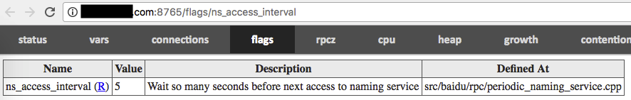

# Example

[client-side code](https://github.com/brpc/brpc/blob/master/example/echo_c++/client.cpp) of echo.

# Quick facts

- Channel.Init() is not thread-safe.
- Channel.CallMethod() is thread-safe and a Channel can be used by multiple threads simultaneously.
- Channel can be put on stack.
- Channel can be destructed just after sending asynchronous request.
- No class named brpc::Client.

# Channel
Client-side sends requests. It's called [Channel](https://github.com/brpc/brpc/blob/master/src/brpc/channel.h) rather than "Client" in brpc. A channel represents a communication line to one server or multiple servers, which can be used for calling services. 

A Channel can be **shared by all threads** in the process. Yon don't need to create separate Channels for each thread, and you don't need to synchronize Channel.CallMethod with lock. However creation and destroying of Channel is **not** thread-safe,  make sure the channel is initialized and destroyed only by one thread.

Some RPC implementations have so-called "ClientManager", including configurations and resource management at the client-side, which is not needed by brpc. "thread-num", "connection-type" such parameters are either in brpc::ChannelOptions or global gflags. Advantages of doing so:

1. Convenience. You don't have to pass a "ClientManager" when the Channel is created, and you don't have to store the "ClientManager". Otherwise code has to pass "ClientManager" layer by layer, which is troublesome. gflags makes configurations of global behaviors easier.
2. Share resources. For example, servers and channels in brpc share background workers (of bthread).
3. Better management of Lifetime. Destructing a "ClientManager" is very error-prone, which is managed by brpc right now.

Like most classes, Channel must be **Init()**-ed before usage. Parameters take default values when `options` is NULL. If you want non-default values, code as follows:
```c++
brpc::ChannelOptions options;  // including default values
options.xxx = yyy;
...
channel.Init(..., &options);
```
Note that Channel neither modifies `options` nor accesses `options` after completion of Init(), thus options can be put on stack safely as in above code. Channel.options() gets options being used by the Channel.

Init() can connect one server or a cluster(multiple servers).

# Connect a server

```c++
// Take default values when options is NULL.
int Init(EndPoint server_addr_and_port, const ChannelOptions* options);
int Init(const char* server_addr_and_port, const ChannelOptions* options);
int Init(const char* server_addr, int port, const ChannelOptions* options);
```
The server connected by these Init() has fixed address genrally. The creation does not need NamingService or LoadBalancer, being relatively light-weight.  The address could be a hostname, but don't frequently create Channels connecting to a hostname, which requires a DNS lookup taking at most 10 seconds. (default timeout of DNS lookup). Reuse them.

Valid "server_addr_and_port":
- 127.0.0.1:80
- www.foo.com:8765
- localhost:9000

Invalid "server_addr_and_port": 
- 127.0.0.1:90000     # too large port
- 10.39.2.300:8000   # invalid IP

# Connect a cluster

```c++
int Init(const char* naming_service_url,
         const char* load_balancer_name,
         const ChannelOptions* options);
```
Channels created by above Init() get server list from the NamingService specified by `naming_service_url` periodically or driven-by-events, and send request to one server chosen from the list according to the algorithm specified by `load_balancer_name` . 

You **should not** create such channels ad-hocly each time before a RPC, because creation and destroying of such channels relate to many resources, say NamingService needs to be accessed once at creation otherwise server candidates are unknown. On the other hand, channels are able to be shared by multiple threads safely and has no need to be created frequently.

If `load_balancer_name` is NULL or empty, this Init() is just the one for connecting single server and `naming_service_url` should be "ip:port" or "host:port" of the server. Thus you can unify initialization of all channels with this Init(). For example, you can put values of `naming_service_url` and `load_balancer_name` in configuration file, and set `load_balancer_name` to empty for single server and a valid algorithm for a cluster.

## Naming Service

Naming service maps a name to a modifiable list of servers. It's positioned as follows at client-side: 


With the help of naming service, the client remembers a name instead of every concrete server. When the servers are added or removed, only mapping in the naming service is changed, rather than telling every client that may access the cluster. This process is called "decoupling up and downstreams". Back to implementation details, the client does remember every server and will access NamingService periodically or be pushed with latest server list. The impl. has minimal impact on RPC latencies and very small pressure on the system providing naming service.

General form of `naming_service_url`  is "**protocol://service_name**".

### bns://\<bns-name\>

BNS is the most common naming service inside Baidu. In "bns://rdev.matrix.all", "bns" is protocol and "rdev.matrix.all" is service-name. A related gflag is -ns_access_interval: 

If the list in BNS is non-empty, but Channel says "no servers", the status bit of the machine in BNS is probably non-zero, which means the machine is unavailable and as a correspondence not added as server candidates of the Channel. Status bits can be checked by: 

`get_instance_by_service [bns_node_name] -s`

### file://\<path\>

Servers are put in the file specified by `path`. In "file://conf/local_machine_list", "conf/local_machine_list" is the file and each line in the file is address of a server. brpc reloads the file when it's updated.

### list://\<addr1\>,\<addr2\>...

Servers are directly written after list://, separated by comma. For example: "list://db-bce-81-3-186.db01:7000,m1-bce-44-67-72.m1:7000,cp01-rd-cos-006.cp01:7000" has 3 addresses.

### http://\<url\>

Connect all servers under the domain, for example: http://www.baidu.com:80. Note: although Init() for connecting single server(2 parameters) accepts hostname as well, it only connects one server under the domain.

### Naming Service Filter

Users can filter servers got from the NamingService before pushing to LoadBalancer.


Interface of the filter: 
```c++
// naming_service_filter.h
class NamingServiceFilter {
public:
    // Return true to take this `server' as a candidate to issue RPC
    // Return false to filter it out
    virtual bool Accept(const ServerNode& server) const = 0;
};
 
// naming_service.h
struct ServerNode {
    butil::EndPoint addr;
    std::string tag;
};
```
The most common usage is filtering by server tags.

Customized filter is set to ChannelOptions to take effects. NULL by default means not filter.

```c++
class MyNamingServiceFilter : public brpc::NamingServiceFilter {
public:
    bool Accept(const brpc::ServerNode& server) const {
        return server.tag == "main";
    }
};
 
int main() {
    ...
    MyNamingServiceFilter my_filter;
    ...
    brpc::ChannelOptions options;
    options.ns_filter = &my_filter;
    ...
}
```

## Load Balancer

When there're more than one server to access, we need to divide the traffic. The process is called load balancing, which is positioned as follows at client-side.


The ideal algorithm is to make every request being processed in-time, and crash of any server makes minimal impact. However clients are not able to know delays or congestions happened at servers in realtime, and load balancing algorithms should be light-weight generally, users need to choose proper algorithms for their use cases. Algorithms provided by brpc (specified by `load_balancer_name`): 

### rr

which is round robin. Always choose next server inside the list, next of the last server is the first one. No other settings. For example there're 3 servers: a,b,c, brpc will send requests to a, b, c, a, b, c, … and so on. Note that presumption of using this algorithm is the machine specs, network latencies, server loads are similar. 

### random

Randomly choose one server from the list, no other settings. Similarly with round robin, the algorithm assumes that servers to access are similar.

### la

which is locality-aware. Perfer servers with lower latencies, until the latency is higher than others, no other settings. Check out [Locality-aware load balancing](lalb.md) for more details.

### c_murmurhash or c_md5

which is consistent hashing. Adding or removing servers does not make destinations of requests change as dramatically as in simple hashing. It's especially suitable for caching services.

Need to set Controller.set_request_code() before RPC otherwise the RPC will fail. request_code is often a 32-bit hash code of "key part" of the request, and the hashing algorithm does not need to be same with the one used by load balancer. Say `c_murmurhash`  can use md5 to compute request_code of the request as well.

[src/brpc/policy/hasher.h](https://github.com/brpc/brpc/blob/master/src/brpc/policy/hasher.h) includes common hash functions. If `std::string key` stands for key part of the request, controller.set_request_code(brpc::policy::MurmurHash32(key.data(), key.size())) sets request_code correctly. 

Do distinguish "key" and "attributes" of the request. Don't compute request_code by full content of the request just for quick. Minor change in attributes may result in totally different hash code and change destination dramatically. Another cause is padding, for example: `struct Foo { int32_t a; int64_t b; }` has a 4-byte undefined gap between `a` and `b` on 64-bit machines, result of `hash(&foo, sizeof(foo))` is undefined. Fields need to be packed or serialized before hashing.

Check out [Consistent Hashing](consistent_hashing.md) for more details. 

## Health checking

Servers whose connections are lost are isolated temporarily to prevent them from being selected by LoadBalancer. brpc connects isolated servers periodically to test if they're healthy again. The interval is controlled by gflag -health_check_interval:

| Name                      | Value | Description                              | Defined At              |
| ------------------------- | ----- | ---------------------------------------- | ----------------------- |
| health_check_interval （R） | 3     | seconds between consecutive health-checkings | src/brpc/socket_map.cpp |

Once a server is connected, it resumes as a server candidate inside LoadBalancer. If a server is removed from NamingService during health-checking, brpc removes it from health-checking as well.

# Launch RPC

Generally, we don't use Channel.CallMethod directly, instead we call XXX_Stub generated by protobuf, which feels more like a "method call". The stub has few member fields, being suitable(and recommended) to be put on stack instead of new(). Surely the stub can be saved and re-used as well. Channel.CallMethod and stub are both **thread-safe** and accessible by multiple threads simultaneously. For example: 
```c++
XXX_Stub stub(&channel);
stub.some_method(controller, request, response, done);
```
Or even:
```c++
XXX_Stub(&channel).some_method(controller, request, response, done);
```
A exception is http client, which is not related to protobuf much. Call CallMethod directly to make a http call, setting all parameters to NULL except for `Controller` and `done`, check [Access HTTP](http_client.md) for details. 

## Synchronous call

CallMethod blocks until response from server is received or error occurred (including timedout). 

response/controller in synchronous call will not be used by brpc again after CallMethod, they can be put on stack safely. Note: if request/response has many fields and being large on size, they'd better be allocated on heap.
```c++
MyRequest request;
MyResponse response;
brpc::Controller cntl;
XXX_Stub stub(&channel);
 
request.set_foo(...);
cntl.set_timeout_ms(...);
stub.some_method(&cntl, &request, &response, NULL);
if (cntl->Failed()) {
    // RPC failed. fields in response are undefined, don't use. 
} else {
    // RPC succeeded, response has what we want. 
}
```

## Asynchronous call

Pass a callback `done` to CallMethod, which resumes after sending request, rather than completion of RPC. When the response from server is received  or error occurred(including timedout), done->Run() is called. Post-processing code of the RPC should be put in done->Run() instead of after CallMethod. 

Because end of CallMethod does not mean completion of RPC, response/controller may still be used by brpc or done->Run(). Generally they should be allocated on heap and deleted in done->Run(). If they're deleted too early, done->Run() may access invalid memory.

You can new these objects individually and create done by [NewCallback](#use-newcallback), or make response/controller be member of done and [new them together](#Inherit-google::protobuf::Closure). Former one is recommended. 

**Request and Channel can be destroyed immediately after asynchronous CallMethod**, which is different from response/controller. Note that "immediately" means destruction of request/Channel can happen **after** CallMethod, not during CallMethod. Deleting a Channel just being used by another thread results in undefined behavior (crash at best). 

### Use NewCallback
```c++
static void OnRPCDone(MyResponse* response, brpc::Controller* cntl) {
    // unique_ptr helps us to delete response/cntl automatically. unique_ptr in gcc 3.4 is an emulated version. 
    std::unique_ptr<MyResponse> response_guard(response);
    std::unique_ptr<brpc::Controller> cntl_guard(cntl);
    if (cntl->Failed()) {
        // RPC failed. fields in response are undefined, don't use. 
    } else {
        // RPC succeeded, response has what we want. Continue the post-processing.
    }
    // Closure created by NewCallback deletes itself at the end of Run. 
}
 
MyResponse* response = new MyResponse;
brpc::Controller* cntl = new brpc::Controller;
MyService_Stub stub(&channel);
 
MyRequest request;  // you don't have to new request, even in an asynchronous call.
request.set_foo(...);
cntl->set_timeout_ms(...);
stub.some_method(cntl, &request, response, google::protobuf::NewCallback(OnRPCDone, response, cntl));
```
Since protobuf 3 changes NewCallback to private, brpc puts NewCallback in [src/brpc/callback.h](https://github.com/brpc/brpc/blob/master/src/brpc/callback.h) after r32035 (and adds more overloads). If your program has compilation issues with NewCallback, replace google::protobuf::NewCallback with brpc::NewCallback. 

### Inherit google::protobuf::Closure

Drawback of using NewCallback is that you have to allocate memory on heap at least 3 times: response, controller, done. If profiler shows that the memory allocation is a hotspot, you can consider inheriting Closure by your own, and enclose response/controller as member fields. Doing so combines 3 new into one, but the code will be worse to read. Don't do this if memory allocation is not an issue.
```c++
class OnRPCDone: public google::protobuf::Closure {
public:
    void Run() {
        // unique_ptr helps us to delete response/cntl automatically. unique_ptr in gcc 3.4 is an emulated version.
        std::unique_ptr<OnRPCDone> self_guard(this);
          
        if (cntl->Failed()) {
            // RPC failed. fields in response are undefined, don't use.
        } else {
            // RPC succeeded, response has what we want. Continue the post-processing.
        }
    }
 
    MyResponse response;
    brpc::Controller cntl;
}
 
OnRPCDone* done = new OnRPCDone;
MyService_Stub stub(&channel);
 
MyRequest request;  // you don't have to new request, even in an asynchronous call.
request.set_foo(...);
done->cntl.set_timeout_ms(...);
stub.some_method(&done->cntl, &request, &done->response, done);
```

### What will happen when the callback is very complicated?

No special impact, the callback will run in separate bthread, without blocking other sessions. You can do all sorts of things in the callback.

### Does the callback run in the same thread that CallMethod runs?

The callback runs in a different bthread, even the RPC fails just after entering CallMethod. This avoids deadlock when the RPC is ongoing inside a lock(not recommended).

## Wait for completion of RPC
NOTE: [ParallelChannel](combo_channel.md#parallelchannel) is probably more convenient to  launch multiple RPCs in parallel.

Following code starts 2 asynchronous RPC and waits them to complete.
```c++
const brpc::CallId cid1 = controller1->call_id();
const brpc::CallId cid2 = controller2->call_id();
...
stub.method1(controller1, request1, response1, done1);
stub.method2(controller2, request2, response2, done2);
...
brpc::Join(cid1);
brpc::Join(cid2);
```
Call `Controller.call_id()` to get an id **before launching RPC**, join the id after the RPC. 

Join() blocks until completion of RPC **and end of done->Run()**,  properties of Join: 

- If the RPC is complete, Join() returns immediately.
- Multiple threads can Join() one id, all of them will be woken up. 
- Synchronous RPC can be Join()-ed in another thread, although we rarely do this.  

Join() was called JoinResponse() before, if you meet deprecated issues during compilation, rename to Join(). 

Calling `Join(controller->call_id())` after completion of RPC is **wrong**, do save call_id before RPC, otherwise the controller may be deleted by done at any time. The Join in following code is **wrong**. 

```c++
static void on_rpc_done(Controller* controller, MyResponse* response) {
    ... Handle response ...
    delete controller;
    delete response;
}
 
Controller* controller1 = new Controller;
Controller* controller2 = new Controller;
MyResponse* response1 = new MyResponse;
MyResponse* response2 = new MyResponse;
...
stub.method1(controller1, &request1, response1, google::protobuf::NewCallback(on_rpc_done, controller1, response1));
stub.method2(controller2, &request2, response2, google::protobuf::NewCallback(on_rpc_done, controller2, response2));
...
brpc::Join(controller1->call_id());   // WRONG, controller1 may be deleted by on_rpc_done
brpc::Join(controller2->call_id());   // WRONG, controller2 may be deleted by on_rpc_done
```

## Semi-synchronous

Join can be used for implementing "Semi-synchronous" call: blocks until multiple asynchronous calls to complete. Since the callsite blocks until completion of all RPC, controller/response can be put on stack safely. 
```c++
brpc::Controller cntl1;
brpc::Controller cntl2;
MyResponse response1;
MyResponse response2;
...
stub1.method1(&cntl1, &request1, &response1, brpc::DoNothing());
stub2.method2(&cntl2, &request2, &response2, brpc::DoNothing());
...
brpc::Join(cntl1.call_id());
brpc::Join(cntl2.call_id());
```
brpc::DoNothing() gets a closure doing nothing, specifically for semi-synchronous calls. Its lifetime is managed by brpc. 

Note that in above example, we access `controller.call_id()` after completion of RPC, which is safe right here, because DoNothing does not delete controller as in `on_rpc_done` in previous example.

## Cancel RPC

`brpc::StartCancel(call_id)` cancels corresponding RPC, call_id must be got from Controller.call_id() **before launching RPC**, race conditions may occur at any other time. 

NOTE: it is `brpc::StartCancel(call_id)`, not `controller->StartCancel()`, which is forbidden and useless. The latter one is provided by protobuf by default and has serious race conditions on lifetime of controller. 

As the name implies, RPC may not complete yet after calling StartCancel, you should not touch any field in Controller or delete any associated resources, they should be handled inside done->Run(). If you have to wait for completion of RPC in-place(not recommended), call Join(call_id).

Facts about StartCancel: 

- call_id can be cancelled before CallMethod, the RPC will end immediately(and done will be called). 
- call_id can be cancelled in another thread. 
- Cancel an already-cancelled call_id has no effect. Inference: One call_id can be cancelled by multiple threads simultaneously, but only one of them takes effect. 
- Cancel here is a client-only feature, **the server-side may not cancel the operation necessarily**, server cancelation is a separate feature. 

## Get server-side address and port

remote_side() tells where request was sent to, the return type is [butil::EndPoint](https://github.com/brpc/brpc/blob/master/src/butil/endpoint.h), which includes an ipv4 address and port. Calling this method before completion of RPC is undefined.

How to print: 
```c++
LOG(INFO) << "remote_side=" << cntl->remote_side();
printf("remote_side=%s\n", butil::endpoint2str(cntl->remote_side()).c_str());
```
## Get client-side address and port

local_side() gets address and port of the client-side sending RPC after r31384

How to print: 
```c++
LOG(INFO) << "local_side=" << cntl->local_side(); 
printf("local_side=%s\n", butil::endpoint2str(cntl->local_side()).c_str());
```
## Should brpc::Controller be reused?

Not necessary to reuse deliberately. 

Controller has miscellaneous fields, some of them are buffers that can be re-used by calling Reset(). 

In most use cases, constructing a Controller(snippet1) and re-using a Controller(snippet2) perform similarily.
```c++
// snippet1
for (int i = 0; i < n; ++i) {
    brpc::Controller controller;
    ...
    stub.CallSomething(..., &controller);
}
 
// snippet2
brpc::Controller controller;
for (int i = 0; i < n; ++i) {
    controller.Reset();
    ...
    stub.CallSomething(..., &controller);
}
```
If the Controller in snippet1 is new-ed on heap, snippet1 has extra cost of "heap allcation" and may be a little slower in some cases. 

# Settings

Client-side settings has 3 parts: 

- brpc::ChannelOptions: defined in [src/brpc/channel.h](https://github.com/brpc/brpc/blob/master/src/brpc/channel.h), for initializing Channel, becoming immutable once the initialization is done. 
- brpc::Controller: defined in [src/brpc/controller.h](https://github.com/brpc/brpc/blob/master/src/brpc/controller.h), for overriding fields in brpc::ChannelOptions for some RPC according to contexts. 
- global gflags: for tuning global behaviors, being unchanged generally. Read comments in [/flags](flags.md) before setting. 

Controller contains data and options that request may not have. server and client share the same Controller class, but they may set different fields. Read comments in Controller carefully before using. 

A Controller corresponds to a RPC. A Controller can be re-used by another RPC after Reset(), but a Controller can't be used by multiple RPC simultaneously, no matter the RPCs are started from one thread or not.

Properties of Controller: 
1.  A Controller can only have one user. Without explicit statement, methods in Controller are **not** thread-safe by default. 
2.  Due to the fact that Controller is not shared generally, there's no need to manage Controller by shared_ptr. If you do, something might goes wrong. 
3.  Controller is constructed before RPC and destructed after RPC, some common patterns: 
   - Put Controller on stack before synchronous RPC, be destructed when out of scope. Note that Controller of asynchronous RPC **must not** be put on stack, otherwise the RPC may still run when the Controller is being destructed and result in undefined behavior.
   - new Controller before asynchronous RPC, delete in done. 

## Timeout

**ChannelOptions.timeout_ms** is timeout in milliseconds for all RPCs via the Channel, Controller.set_timeout_ms() overrides value for one RPC. Default value is 1 second, Maximum value is 2^31 (about 24 days), -1 means wait indefinitely for response or connection error. 

**ChannelOptions.connect_timeout_ms** is timeout in milliseconds for connecting part of all RPC via the Channel, Default value is 1 second, and -1 means no timeout for connecting. This value is limited to be never greater than timeout_ms. Note that this timeout is different from the connection timeout in TCP, generally this timeout is smaller otherwise establishment of the connection may fail before this timeout due to timeout in TCP layer.

NOTE1: timeout_ms in brpc is **deadline**, which means once it's reached, the RPC ends, no retries after the timeout. Other impl. may have session timeout and deadline timeout, do distinguish them before porting to brpc.

NOTE2: error code of RPC timeout is **ERPCTIMEDOUT (1008) **, ETIMEDOUT is connection timeout and retriable.

## Retry

ChannelOptions.max_retry is maximum retrying count for all RPC via the channel, Controller.set_max_retry() overrides value for one RPC. Default value is 3. 0 means no retries. 

Controller.retried_count() returns number of retries.

Controller.has_backup_request() tells if backup_request was sent.

**servers tried before are not retried by best efforts**

Conditions for retrying (AND relations）: 
- Broken connection.
- Timeout is not reached. 
- Has retrying quota. Controller.set_max_retry(0) or ChannelOptions.max_retry = 0 disables retries. 
- The retry makes sense. If the RPC fails due to request(EREQUEST), no retry will be done because server is very likely to reject the request again, retrying makes no sense here. 

### Broken connection

If the server does not respond and connection is good, retry is not triggered. If you need to send another request after some timeout, use backup request.

How it works: If response does not return within the timeout specified by backup_request_ms, send another request, take whatever the first returned. New request will be sent to a different server that never tried before by best efforts. NOTE: If backup_request_ms is greater than timeout_ms, backup request will never be sent. backup request consumes one retry. backup request does not imply a server-side cancellation. 

ChannelOptions.backup_request_ms affects all RPC via the Channel, unit is milliseconds, Default value is -1(disabled), Controller.set_backup_request_ms() overrides value for one RPC. 

### Timeout is not reached

RPC will be ended soon after the timeout. 

### Has retrying quota

Controller.set_max_retry(0) or ChannelOptions.max_retry = 0 disables retries. 

### The retry makes sense

If the RPC fails due to request(EREQUEST), no retry will be done because server is very likely to reject the request again, retrying makes no sense here. 

Users can inherit [brpc::RetryPolicy](https://github.com/brpc/brpc/blob/master/src/brpc/retry_policy.h) to customize conditions of retrying. For example brpc does not retry for HTTP related errors by default. If you want to retry for HTTP_STATUS_FORBIDDEN(403) in your app, you can do as follows: 

```c++
#include <brpc/retry_policy.h>
 
class MyRetryPolicy : public brpc::RetryPolicy {
public:
    bool DoRetry(const brpc::Controller* cntl) const {
        if (cntl->ErrorCode() == brpc::EHTTP && // HTTP error
            cntl->http_response().status_code() == brpc::HTTP_STATUS_FORBIDDEN) {
            return true;
        }
        // Leave other cases to brpc.
        return brpc::DefaultRetryPolicy()->DoRetry(cntl);
    }
};
...
 
// Assign the instance to ChannelOptions.retry_policy. 
// NOTE: retry_policy must be kept valid during lifetime of Channel, and Channel does not retry_policy, so in most cases RetryPolicy should be created by singleton.. 
brpc::ChannelOptions options;
static MyRetryPolicy g_my_retry_policy;
options.retry_policy = &g_my_retry_policy;
...
```

Some tips：

- Get response of the RPC by cntl->response().
- RPC deadline represented by ERPCTIMEDOUT is never retried, even it's allowed by your derived RetryPolicy.

### Retrying should be conservative

Due to maintaining costs, even very large scale clusters are deployed with "just enough" instances to survive major defects, namely offline of one IDC, which is at most 1/2 of all machines. However aggressive retries may easily make pressures from all clients double or even tripple against servers, and make the whole cluster down: More and more requests stuck in buffers, because servers can't process them in-time. All requests have to wait for a very long time to be processed and finally gets timed out, as if the whole cluster is crashed. The default retrying policy is safe generally: unless the connection is broken, retries are rarely sent. However users are able to customize starting conditions for retries by inheriting RetryPolicy, which may turn retries to be "a storm". When you customized RetryPolicy, you need to carefully consider how clients and servers interact and design corresponding tests to verify that retries work as expected.

## Protocols

The default protocol used by Channel is baidu_std, which is changeable by setting ChannelOptions.protocol. The field accepts both enum and string.

 Supported protocols:

- PROTOCOL_BAIDU_STD or "baidu_std", which is [the standard binary protocol inside Baidu](baidu_std.md), using single connection by default. 
- PROTOCOL_HULU_PBRPC or "hulu_pbrpc", which is protocol of hulu-pbrpc, using single connection by default. 
- PROTOCOL_NOVA_PBRPC or "nova_pbrpc",  which is protocol of Baidu ads union, using pooled connection by default. 
- PROTOCOL_HTTP or "http", which is http 1.0 or 1.1, using pooled connection by default (Keep-Alive). Check out [Access HTTP service](http_client.md) for details. 
- PROTOCOL_SOFA_PBRPC or "sofa_pbrpc", which is protocol of sofa-pbrpc, using single connection by default.
- PROTOCOL_PUBLIC_PBRPC or "public_pbrpc", which is protocol of public_pbrpc, using pooled connection by default. 
- PROTOCOL_UBRPC_COMPACK or "ubrpc_compack", which is protocol of public/ubrpc, packing with compack, using pooled connection by default. check out [ubrpc (by protobuf)](ub_client.md) for details. A related protocol is PROTOCOL_UBRPC_MCPACK2 or ubrpc_mcpack2, packing with mcpack2. 
- PROTOCOL_NSHEAD_CLIENT or "nshead_client", which is required by UBXXXRequest in baidu-rpc-ub, using pooled connection by default. Check out [Access UB](ub_client.md) for details. 
- PROTOCOL_NSHEAD or "nshead", which is required by sending NsheadMessage, using pooled connection by default. Check out [nshead+blob](ub_client.md#nshead-blob) for details.
- PROTOCOL_MEMCACHE or "memcache", which is binary protocol of memcached, using **single connection** by default. Check out [access memcached](memcache_client.md) for details. 
- PROTOCOL_REDIS or "redis", which is protocol of redis 1.2+ (the one supported by hiredis), using **single connection** by default. Check out [Access Redis](redis_client.md) for details. 
- PROTOCOL_NSHEAD_MCPACK or "nshead_mcpack", which is as the name implies, nshead + mcpack (parsed by protobuf via mcpack2pb), using pooled connection by default. 
- PROTOCOL_ESP or "esp", for accessing services with esp protocol, using pooled connection by default. 

## Connection Type

brpc supports following connection types:

- short connection: Established before each RPC, closed after completion. Since each RPC has to pay the overhead of establishing connection, this type is used for occasionally launched RPC, not frequently launched ones. No protocol use this type by default. Connections in http 1.0 are handled similarly as short connections. 
- pooled connection: Pick an idle connection from a pool before each RPC, return after completion. One connection carries at most one request at the same time. One client may have multiple connections to one server.  http and the protocols using nshead use this type by default. 
- single connection: all clients in one process has at most one connection to one server, one connection may carry multiple requests at the same time. The sequence of returning responses does not need to be same as sending requests. This type is used by baidu_std, hulu_pbrpc, sofa_pbrpc by default. 

|                             | short connection                         | pooled connection                       | single connection                        |
| --------------------------- | ---------------------------------------- | --------------------------------------- | ---------------------------------------- |
| long connection             | no                                       | yes                                     | yes                                      |
| \#connection at server-side | qps*latency ([little's law](https://en.wikipedia.org/wiki/Little%27s_law)) | qps*latency                             | 1                                        |
| peak qps                    | bad, and limited by max number of ports  | medium                                  | high                                     |
| latency                     | 1.5RTT(connect) + 1RTT + processing time | 1RTT + processing time                  | 1RTT + processing time                   |
| cpu usage                   | high, tcp connect for each RPC           | medium, every request needs a sys write | low, writes can be combined to reduce overhead. |

brpc chooses best connection type for the protocol by default, users generally have no need to change it. If you do, set ChannelOptions.connection_type to: 

- CONNECTION_TYPE_SINGLE or "single" : single connection

- CONNECTION_TYPE_POOLED or "pooled": pooled connection. Max number of connections to one server is limited by -max_connection_pool_size:

  | Name                         | Value | Description                              | Defined At          |
  | ---------------------------- | ----- | ---------------------------------------- | ------------------- |
  | max_connection_pool_size (R) | 100   | maximum pooled connection count to a single endpoint | src/brpc/socket.cpp |

- CONNECTION_TYPE_SHORT or "short" : short connection

- "" (empty string) makes brpc chooses the default one.

brpc also supports [Streaming RPC](streaming_rpc.md) which is an application-level connection for transferring streaming data. 

## Close idle connections in pools

If a connection has no read or write within the seconds specified by -idle_timeout_second, it's tagged as "idle", and will be closed automatically. Default value is 10 seconds. This feature is only effective to pooled connections. If -log_idle_connection_close is true, a log is printed before closing.

| Name                      | Value | Description                              | Defined At              |
| ------------------------- | ----- | ---------------------------------------- | ----------------------- |
| idle_timeout_second       | 10    | Pooled connections without data transmission for so many seconds will be closed. No effect for non-positive values | src/brpc/socket_map.cpp |
| log_idle_connection_close | false | Print log when an idle connection is closed | src/brpc/socket.cpp     |

## Defer connection close

Multiple channels may share a connection via referential counting. When a channel releases last reference of the connection, the connection will be closed. But in some scenarios, channels are created just before sending RPC and destroyed after completion, in which case connections are probably closed and re-open again frequently, as costly as short connections. 

One solution is to cache channels commonly used by user, which avoids frequent creation and destroying of channels.  However brpc does not offer an utility for doing this right now, and it's not trivial for users to implement it correctly.

Another solution is setting gflag -defer_close_second

| Name               | Value | Description                              | Defined At              |
| ------------------ | ----- | ---------------------------------------- | ----------------------- |
| defer_close_second | 0     | Defer close of connections for so many seconds even if the connection is not used by anyone. Close immediately for non-positive values | src/brpc/socket_map.cpp |

After setting,  connection is not closed immediately after last referential count, instead it will be closed after so many seconds. If a channel references the connection again during the wait, the connection resumes to normal. No matter how frequent channels are created, this flag limits the frequency of closing connections. Side effect of the flag is that file descriptors are not closed immediately after destroying of channels, if the flag is wrongly set to be large, number of used file descriptors in the process may be large as well. 

## 连接的缓冲区大小

-socket_recv_buffer_size设置所有连接的接收缓冲区大小, 默认-1（不修改）

-socket_send_buffer_size设置所有连接的发送缓冲区大小, 默认-1（不修改）

| Name                    | Value | Description                              | Defined At          |
| ----------------------- | ----- | ---------------------------------------- | ------------------- |
| socket_recv_buffer_size | -1    | Set the recv buffer size of socket if this value is positive | src/brpc/socket.cpp |
| socket_send_buffer_size | -1    | Set send buffer size of sockets if this value is positive | src/brpc/socket.cpp |

## log_id

通过set_log_id()可设置log_id. 这个id会被送到服务器端, 一般会被打在日志里, 从而把一次检索经过的所有服务串联起来. 不同产品线可能有不同的叫法. 一些产品线有字符串格式的"s值", 内容也是64位的16进制数, 可以转成整型后再设入log_id. 

## 附件

标准协议和hulu协议支持附件, 这段数据由用户自定义, 不经过protobuf的序列化. 站在client的角度, 设置在Controller::request_attachment()的附件会被server端收到, response_attachment()则包含了server端送回的附件. 附件不受压缩选项影响. 

在http协议中, 附件对应[message body](http://www.w3.org/Protocols/rfc2616/rfc2616-sec4.html), 比如要POST的数据就设置在request_attachment()中. 

## giano认证
```

// Create a baas::CredentialGenerator using Giano's API
baas::CredentialGenerator generator = CREATE_MOCK_PERSONAL_GENERATOR(
    "mock_user", "mock_roles", "mock_group", baas::sdk::BAAS_OK);
 
// Create a brpc::policy::GianoAuthenticator using the generator we just created 
// and then pass it into brpc::ChannelOptions
brpc::policy::GianoAuthenticator auth(&generator, NULL);
brpc::ChannelOptions option;
option.auth = &auth;
```
首先通过调用Giano API生成验证器baas::CredentialGenerator, 具体可参看[Giano快速上手手册.pdf](http://wiki.baidu.com/download/attachments/37774685/Giano%E5%BF%A
B%E9%80%9F%E4%B8%8A%E6%89%8B%E6%89%8B%E5%86%8C.pdf?version=1&modificationDate=1421990746000&api=v2). 然后按照如上代码一步步将其设置到brpc::ChannelOptions里去. 

当client设置认证后, 任何一个新连接建立后都必须首先发送一段验证信息（通过Giano认证器生成）, 才能发送后续请求. 认证成功后, 该连接上的后续请求不会再带有验证消息. 

## 重置

调用Reset方法可让Controller回到刚创建时的状态. 

别在RPC结束前重置Controller, 行为是未定义的. 

## 压缩

set_request_compress_type()设置request的压缩方式, 默认不压缩. 注意: 附件不会被压缩. HTTP body的压缩方法见[client压缩request body](http_client#压缩request-body). 

支持的压缩方法有: 

- brpc::CompressTypeSnappy : [snanpy压缩](http://google.github.io/snappy/), 压缩和解压显著快于其他压缩方法, 但压缩率最低. 
- brpc::CompressTypeGzip : [gzip压缩](http://en.wikipedia.org/wiki/Gzip), 显著慢于snappy, 但压缩率高
- brpc::CompressTypeZlib : [zlib压缩](http://en.wikipedia.org/wiki/Zlib), 比gzip快10%~20%, 压缩率略好于gzip, 但速度仍明显慢于snappy. 

下表是多种压缩算法应对重复率很高的数据时的性能, 仅供参考. 

| Compress method | Compress size(B) | Compress time(us) | Decompress time(us) | Compress throughput(MB/s) | Decompress throughput(MB/s) | Compress ratio |
| --------------- | ---------------- | ----------------- | ------------------- | ------------------------- | --------------------------- | -------------- |
| Snappy          | 128              | 0.753114          | 0.890815            | 162.0875                  | 137.0322                    | 37.50%         |
| Gzip            | 10.85185         | 1.849199          | 11.2488             | 66.01252                  | 47.66%                      |                |
| Zlib            | 10.71955         | 1.66522           | 11.38763            | 73.30581                  | 38.28%                      |                |
| Snappy          | 1024             | 1.404812          | 1.374915            | 695.1555                  | 710.2713                    | 8.79%          |
| Gzip            | 16.97748         | 3.950946          | 57.52106            | 247.1718                  | 6.64%                       |                |
| Zlib            | 15.98913         | 3.06195           | 61.07665            | 318.9348                  | 5.47%                       |                |
| Snappy          | 16384            | 8.822967          | 9.865008            | 1770.946                  | 1583.881                    | 4.96%          |
| Gzip            | 160.8642         | 43.85911          | 97.13162            | 356.2544                  | 0.78%                       |                |
| Zlib            | 147.6828         | 29.06039          | 105.8011            | 537.6734                  | 0.71%                       |                |
| Snappy          | 32768            | 16.16362          | 19.43596            | 1933.354                  | 1607.844                    | 4.82%          |
| Gzip            | 229.7803         | 82.71903          | 135.9995            | 377.7849                  | 0.54%                       |                |
| Zlib            | 240.7464         | 54.44099          | 129.8046            | 574.0161                  | 0.50%                       |                |

下表是多种压缩算法应对重复率很低的数据时的性能, 仅供参考. 

| Compress method | Compress size(B) | Compress time(us) | Decompress time(us) | Compress throughput(MB/s) | Decompress throughput(MB/s) | Compress ratio |
| --------------- | ---------------- | ----------------- | ------------------- | ------------------------- | --------------------------- | -------------- |
| Snappy          | 128              | 0.866002          | 0.718052            | 140.9584                  | 170.0021                    | 105.47%        |
| Gzip            | 15.89855         | 4.936242          | 7.678077            | 24.7294                   | 116.41%                     |                |
| Zlib            | 15.88757         | 4.793953          | 7.683384            | 25.46339                  | 107.03%                     |                |
| Snappy          | 1024             | 2.087972          | 1.06572             | 467.7087                  | 916.3403                    | 100.78%        |
| Gzip            | 32.54279         | 12.27744          | 30.00857            | 79.5412                   | 79.79%                      |                |
| Zlib            | 31.51397         | 11.2374           | 30.98824            | 86.90288                  | 78.61%                      |                |
| Snappy          | 16384            | 12.598            | 6.306592            | 1240.276                  | 2477.566                    | 100.06%        |
| Gzip            | 537.1803         | 129.7558          | 29.08707            | 120.4185                  | 75.32%                      |                |
| Zlib            | 519.5705         | 115.1463          | 30.07291            | 135.697                   | 75.24%                      |                |
| Snappy          | 32768            | 22.68531          | 12.39793            | 1377.543                  | 2520.582                    | 100.03%        |
| Gzip            | 1403.974         | 258.9239          | 22.25825            | 120.6919                  | 75.25%                      |                |
| Zlib            | 1370.201         | 230.3683          | 22.80687            | 135.6524                  | 75.21%                      |                |

# FAQ

### Q: brpc能用unix domain socket吗

不能. 因为同机socket并不走网络, 相比domain socket性能只会略微下降, 替换为domain socket意义不大. 以后可能会扩展支持. 

### Q: Fail to connect to xx.xx.xx.xx:xxxx, Connection refused是什么意思

一般是对端server没打开端口（很可能挂了）.  

### Q: 经常遇到Connection timedout(不在一个机房)


这个就是连接超时了, 调大连接和RPC超时: 

```c++
struct ChannelOptions {
    ...
    // Issue error when a connection is not established after so many
    // milliseconds. -1 means wait indefinitely.
    // Default: 200 (milliseconds)
    // Maximum: 0x7fffffff (roughly 30 days)
    int32_t connect_timeout_ms;
    
    // Max duration of RPC over this Channel. -1 means wait indefinitely.
    // Overridable by Controller.set_timeout_ms().
    // Default: 500 (milliseconds)
    // Maximum: 0x7fffffff (roughly 30 days)
    int32_t timeout_ms;
    ...
};
```

注意连接超时不是RPC超时, RPC超时打印的日志是"Reached timeout=...". 

### Q: 为什么同步方式是好的, 异步就crash了

重点检查Controller, Response和done的生命周期. 在异步访问中, RPC调用结束并不意味着RPC整个过程结束, 而是要在done被调用后才会结束. 所以这些对象不应在调用RPC后就释放, 而是要在done里面释放. 所以你一般不能把这些对象分配在栈上, 而应该使用NewCallback等方式分配在堆上. 详见[异步访问](client.md#异步访问). 

### Q: 我怎么确认server处理了我的请求

不一定能. 当response返回且成功时, 我们确认这个过程一定成功了. 当response返回且失败时, 我们确认这个过程一定失败了. 但当response没有返回时, 它可能失败, 也可能成功. 如果我们选择重试, 那一个成功的过程也可能会被再执行一次. 所以一般来说RPC服务都应当考虑[幂等](http://en.wikipedia.org/wiki/Idempotence)问题, 否则重试可能会导致多次叠加副作用而产生意向不到的结果. 比如以读为主的检索服务大都没有副作用而天然幂等, 无需特殊处理. 而像写也很多的存储服务则要在设计时就加入版本号或序列号之类的机制以拒绝已经发生的过程, 保证幂等. 

### Q: BNS中机器列表已经配置了,但是RPC报"Fail to select server, No data available"错误

使用get_instance_by_service -s your_bns_name 来检查一下所有机器的status状态,   只有status为0的机器才能被client访问.

### Q: Invalid address=`bns://group.user-persona.dumi.nj03'是什么意思
```
FATAL 04-07 20:00:03 7778 src/brpc/channel.cpp:123] Invalid address=`bns://group.user-persona.dumi.nj03'. You should use Init(naming_service_name, load_balancer_name, options) to access multiple servers.
```
访问bns要使用三个参数的Init, 它第二个参数是load_balancer_name, 而你这里用的是两个参数的Init, 框架当你是访问单点, 就会报这个错. 

### Q: 两个产品线都使用protobuf, 为什么不能互相访问

协议 !=protobuf. protobuf负责打包, 协议负责定字段. 打包格式相同不意味着字段可以互通. 协议中可能会包含多个protobuf包, 以及额外的长度、校验码、magic number等等. 协议的互通是通过在RPC框架内转化为统一的编程接口完成的, 而不是在protobuf层面. 从广义上来说, protobuf也可以作为打包框架使用, 生成其他序列化格式的包, 像[idl<=>protobuf](mcpack2pb.md)就是通过protobuf生成了解析idl的代码. 

### Q: 为什么C++ client/server 能够互相通信,  和其他语言的client/server 通信会报序列化失败的错误

检查一下C++ 版本是否开启了压缩 (Controller::set_compress_type), 目前 python/JAVA版的rpc框架还没有实现压缩, 互相返回会出现问题.  

# 附:Client端基本流程


主要步骤: 

1. 创建一个[bthread_id](https://github.com/brpc/brpc/blob/master/src/bthread/id.h)作为本次RPC的correlation_id. 
2. 根据Channel的创建方式, 从进程级的[SocketMap](https://github.com/brpc/brpc/blob/master/src/brpc/socket_map.h)中或从[LoadBalancer](https://github.com/brpc/brpc/blob/master/src/brpc/load_balancer.h)中选择一台下游server作为本次RPC发送的目的地. 
3. 根据连接方式（单连接、连接池、短连接）, 选择一个[Socket](https://github.com/brpc/brpc/blob/master/src/brpc/socket.h). 
4. 如果开启验证且当前Socket没有被验证过时, 第一个请求进入验证分支, 其余请求会阻塞直到第一个包含认证信息的请求写入Socket. 这是因为server端只对第一个请求进行验证. 
5. 根据Channel的协议, 选择对应的序列化函数把request序列化至[IOBuf](https://github.com/brpc/brpc/blob/master/src/butil/iobuf.h). 
6. 如果配置了超时, 设置定时器. 从这个点开始要避免使用Controller对象, 因为在设定定时器后->有可能触发超时机制->调用到用户的异步回调->用户在回调中析构Controller. 
7. 发送准备阶段结束, 若上述任何步骤出错, 会调用Channel::HandleSendFailed. 
8. 将之前序列化好的IOBuf写出到Socket上, 同时传入回调Channel::HandleSocketFailed, 当连接断开、写失败等错误发生时会调用此回调. 
9. 如果是同步发送, Join correlation_id；如果是异步则至此client端返回. 
10. 网络上发消息+收消息. 
11. 收到response后, 提取出其中的correlation_id, 在O(1)时间内找到对应的Controller. 这个过程中不需要查找全局哈希表, 有良好的多核扩展性. 
12. 根据协议格式反序列化response. 
13. 调用Controller::OnRPCReturned, 其中会根据错误码判断是否需要重试. 如果是异步发送, 调用用户回调. 最后摧毁correlation_id唤醒Join着的线程. 
