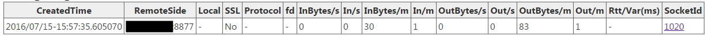

[connections service](http://brpc.baidu.com:8765/connections) can view all connections. A typical page is as follows:

server_socket_count: 5

| CreatedTime                | RemoteSide          | SSL  | Protocol  | fd   | BytesIn/s | In/s | BytesOut/s | Out/s | BytesIn/m | In/m | BytesOut/m | Out/m | SocketId |
| -------------------------- | ------------------- | ---- | --------- | ---- | --------- | ---- | ---------- | ----- | --------- | ---- | ---------- | ----- | -------- |
| 2015/09/21-21:32:09.630840 | 172.22.38.217:51379 | No   | http      | 19   | 1300      | 1    | 269        | 1     | 68844     | 53   | 115860     | 53    | 257      |
| 2015/09/21-21:32:09.630857 | 172.22.38.217:51380 | No   | http      | 20   | 1308      | 1    | 5766       | 1     | 68884     | 53   | 129978     | 53    | 258      |
| 2015/09/21-21:32:09.630880 | 172.22.38.217:51381 | No   | http      | 21   | 1292      | 1    | 1447       | 1     | 67672     | 52   | 143414     | 52    | 259      |
| 2015/09 / 21-21: 32: 01.324587 | 127.0.0.1:55385 | No | baidu_std | 15 | 1480 | 20 | 880 | 20 | 88020 | 1192 | 52260 | 1192 | 512 |
| 2015/09 / 21-21: 32: 01.325969 | 127.0.0.1:55387 | No | baidu_std | 17 | 4016 | 40 | 1554 | 40 | 238879 | 2384 | 92660 | 2384 | 1024 |

channel_socket_count: 1

| CreatedTime                | RemoteSide     | SSL  | Protocol  | fd   | BytesIn/s | In/s | BytesOut/s | Out/s | BytesIn/m | In/m | BytesOut/m | Out/m | SocketId |
| -------------------------- | -------------- | ---- | --------- | ---- | --------- | ---- | ---------- | ----- | --------- | ---- | ---------- | ----- | -------- |
| 2015/09 / 21-21: 32: 01.325870 | 127.0.0.1:8765 | No | baidu_std | 16 | 1554 | 40 | 4016 | 40 | 92660 | 2384 | 238879 | 2384 | 0 |

channel_short_socket_count: 0

The above information is divided into three paragraphs:

-The first paragraph is the connection that the server accepts (accept).
-The second segment is a single connection between the server and the downstream (established using brpc::Channel), and the fd is -1 is a virtual connection, which corresponds to all the same RemoteSide connections in the third segment.
-The third segment is the short connection or pooled connections between the server and the downstream. These connections are subordinate to the virtual connection of the same RemoteSide in the second segment.

The meaning of the table title:

-RemoteSide: remote ip and port.
-SSL: Whether to use SSL encryption, if Yes, it is usually HTTPS connection.
-Protocol: The protocol used may be baidu_std hulu_pbrpc sofa_pbrpc memcache http public_pbrpc nova_pbrpc nshead_server etc.
-fd: file descriptor (file descriptor), may be -1.
-BytesIn/s: The number of bytes read in the last second
-In/s: The number of messages read in the last second (message is a collective term for request and response)
-BytesOut/s: The number of bytes written in the last second
-Out/s: The number of messages written in the last second
-BytesIn/m: The number of bytes read in the last minute
-In/m: The number of messages read in the last minute
-BytesOut/m: The number of bytes written in the last minute
-Out/m: The number of messages written in the last minute
-SocketId: Internal id, used for debugging, users don't need to care.

Typical screenshots are as follows:

Single connection: 

Connection pool: 

Short connection: 
