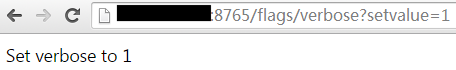

brpc使用gflags管理配置。如果你的程序也使用gflags，那么你应该已经可以修改和brpc相关的flags，你可以浏览[flags服务](http://brpc.baidu.com:8765/flags)了解每个flag的具体功能。如果你的程序还没有使用gflags，我们建议你使用，原因如下：

- 命令行和文件均可传入，前者方便做测试，后者适合线上运维。放在文件中的gflags可以reload。而configure只支持从文件读取配置。
- 你可以在浏览器中查看brpc服务器中所有gflags，并对其动态修改（如果允许的话）。configure不可能做到这点。
- gflags分散在和其作用紧密关联的文件中，更好管理。而使用configure需要聚集到一个庞大的读取函数中。

# Usage of gflags

gflags一般定义在需要它的源文件中。#include <gflags/gflags.h>后在全局scope加入DEFINE_*\<type\>*(*\<name\>*, *\<default-value\>*, *\<description\>*); 比如：

```c++
#include <gflags/gflags.h>
...
DEFINE_bool(hex_log_id, false, "Show log_id in hexadecimal");
DEFINE_int32(health_check_interval, 3, "seconds between consecutive health-checkings");
```

一般在main函数开头用ParseCommandLineFlags处理程序参数：

```c++
#include <gflags/gflags.h>
...
int main(int argc, char* argv[]) {
    google::ParseCommandLineFlags(&argc, &argv, true/*表示把识别的参数从argc/argv中删除*/);
    ...
}
```

如果要从conf/gflags.conf中加载gflags，则可以加上参数-flagfile=conf/gflags.conf。如果希望默认（什么参数都不加）就从文件中读取，则可以在程序中直接给flagfile赋值，一般这么写

```c++
google::SetCommandLineOption("flagfile", "conf/gflags.conf");
```

程序启动时会检查conf/gflags.conf是否存在，如果不存在则会报错：

```
$ ./my_program
conf/gflags.conf: No such file or directory
```

更具体的使用指南请阅读[官方文档](http://gflags.github.io/gflags/)。

# flagfile

在命令行中参数和值之间可不加等号，而在flagfile中一定要加。比如`./myapp -param 7`是ok的，但在`./myapp -flagfile=./gflags.conf`对应的gflags.conf中一定要写成 **-param=7** 或 **--param=7**，否则就不正确且不会报错。

在命令行中字符串可用单引号或双引号包围，而在flagfile中不能加。比如`./myapp -name="tom"`或`./myapp -name='tom'`都是ok的，但在`./myapp -flagfile=./gflags.conf`对应的gflags.conf中一定要写成 **-name=tom** 或 **--name=tom**，如果写成-name="tom"的话，引号也会作为值的一部分。配置文件中的值可以有空格，比如gflags.conf中写成-name=value with spaces是ok的，参数name的值就是value with spaces，而在命令行中要用引号括起来。

flagfile中参数可由单横线(如-foo)或双横线(如--foo)打头，但不能以三横线或更多横线打头，否则的话是无效参数且不会报错!

flagfile中以`#开头的行被认为是注释。开头的空格和空白行都会被忽略。`

flagfile中可以使用`--flagfile包含另一个flagfile。`

# Change gflag on-the-fly

[flags服务](http://brpc.baidu.com:8765/flags)可以查看服务器进程中所有的gflags。修改过的flags会以红色高亮。“修改过”指的是修改这一行为，即使再改回默认值，仍然会显示为红色。

/flags：列出所有的gflags

/flags/NAME：查询名字为NAME的gflag

/flags/NAME1,NAME2,NAME3：查询名字为NAME1或NAME2或NAME3的gflag

/flags/foo*,b$r：查询名字与某一统配符匹配的gflag，注意用$代替?匹配单个字符，因为?在url中有特殊含义。

访问/flags/NAME?setvalue=VALUE即可动态修改一个gflag的值，validator会被调用。

为了防止误修改，需要动态修改的gflag必须有validator，显示此类gflag名字时有(R)后缀。


*修改成功后会显示如下信息*：



*尝试修改不允许修改的gflag会显示如下错误信息*：


*设置一个不允许的值会显示如下错误（flag值不会变化）*：


 

r31658之后支持可视化地修改，在浏览器上访问时将看到(R)下多了下划线：


点击后在一个独立页面可视化地修改对应的flag：


填入true后确定：


返回/flags可以看到对应的flag已经被修改了：


 

关于重载gflags，重点关注：

- 避免在一段代码中多次调用同一个gflag，应把该gflag的值保存下来并调用该值。因为gflag的值随时可能变化，而产生意想不到的结果。
- 使用google::GetCommandLineOption()访问string类型的gflag，直接访问是线程不安全的。
- 处理逻辑和副作用应放到validator里去。比如修改FLAGS_foo后得更新另一处的值，如果只是写在程序初始化的地方，而不是validator里，那么重载时这段逻辑就运行不到了。

如果你确认某个gflag不需要额外的线程同步和处理逻辑就可以重载，那么可以用如下方式为其注册一个总是返回true的validator：

```c++
DEFINE_bool(hex_log_id, false, "Show log_id in hexadecimal");
BRPC_VALIDATE_GFLAG(hex_log_id, brpc::PassValidate/*always true*/);
```

这个flag是单纯的开关，修改后不需要更新其他数据（没有处理逻辑），代码中前面看到true后面看到false也不会产生什么后果（不需要线程同步），所以我们让其默认可重载。

对于int32和int64类型，有一个判断是否为正数的常用validator：

```c++
DEFINE_int32(health_check_interval, 3, "seconds between consecutive health-checkings");
BRPC_VALIDATE_GFLAG(health_check_interval, brpc::PositiveInteger);
```

以上操作都可以在命令行中进行：

```shell
$ curl brpc.baidu.com:8765/flags/health_check_interval
Name | Value | Description | Defined At
---------------------------------------
health_check_interval (R) | 3 | seconds between consecutive health-checkings | src/brpc/socket_map.cpp
```

1.0.251.32399后增加了-immutable_flags，打开后所有的gflags将不能被动态修改。当一个服务对某个gflag值比较敏感且不希望在线上被误改，可打开这个开关。打开这个开关的同时也意味着你无法动态修改线上的配置，每次修改都要重启程序，对于还在调试阶段或待收敛阶段的程序不建议打开。
