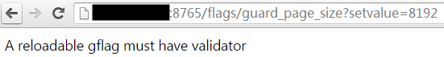

#flags

brpc uses gflags to manage configuration. If your program also uses gflags, then you should be able to modify the flags related to brpc. You can browse [flags service](http://brpc.baidu.com:8765/flags) to learn about the specific functions of each flag. If your program has not yet used gflags, we recommend that you use it for the following reasons:

- Both command lines and files can be passed in. The former is convenient for testing, and the latter is suitable for online operation and maintenance. The gflags placed in the file can be reloaded. The configure only supports reading the configuration from a file.
- You can view all gflags in the brpc server in your browser and modify them dynamically (if allowed). It is impossible for configure to do this.
- gflags are scattered in files closely related to their functions, so they can be better managed. The use of configure needs to be gathered into a huge read function.

# Usage of gflags

Gflags is generally defined in the source file that needs it. #include <gflags/gflags.h> after adding DEFINE_*\<type\>*(*\<name\>*, *\<default-value\>*, *\<description\>*); for example:

```c ++
#include <gflags/gflags.h>
...
DEFINE_bool(hex_log_id, false, "Show log_id in hexadecimal");
DEFINE_int32(health_check_interval, 3, "seconds between consecutive health-checkings");
```

Generally, ParseCommandLineFlags is used to process program parameters at the beginning of the main function:

```c ++
#include <gflags/gflags.h>
...
int main(int argc, char* argv[]) {
google::ParseCommandLineFlags(&argc, &argv, true/* means to delete the recognized parameters from argc/argv*/);
...
}
```

If you want to load gflags from conf/gflags.conf, you can add the parameter -flagfile=conf/gflags.conf. If you want to read from the file by default (no parameters are added), you can directly assign a value to the flagfile in the program, usually like this

```c ++
google::SetCommandLineOption("flagfile", "conf/gflags.conf");
```

When the program starts, it will check whether conf/gflags.conf exists. If it does not exist, an error will be reported:

```shell
$ ./my_program
conf/gflags.conf: No such file or directory
```

For more specific instructions, please read [Official Document](http://gflags.github.io/gflags/).

# flagfile

There is no need to add an equal sign between the parameter and the value in the command line, but it must be added in the flagfile. For example, `./myapp -param 7` is ok, but the gflags.conf corresponding to `./myapp -flagfile=./gflags.conf` must be written as **-param=7** or **-- param=7**, otherwise it is incorrect and no error will be reported.

Strings can be surrounded by single or double quotes in the command line, but cannot be added in the flagfile. For example, `./myapp -name="tom"` or `./myapp -name='tom'` are both ok, but in the gflags.conf corresponding to `./myapp -flagfile=./gflags.conf` It must be written as **-name=tom** or **--name=tom**. If it is written as -name="tom", the quotation marks will also be part of the value. The value in the configuration file can have spaces. For example, it is ok to write -name=value with spaces in gflags.conf, and the value of the parameter name is value with spaces, which should be enclosed in quotation marks in the command line.

The parameters in flagfile can start with a single horizontal line (such as -foo) or double horizontal lines (such as --foo), but cannot start with three horizontal lines or more, otherwise it will be an invalid parameter and no error will be reported!

Lines beginning with `# in flagfile are considered comments. The leading spaces and blank lines will be ignored. `

Flagfile can use `--flagfile to include another flagfile. `

# Change gflag on-the-fly

[flags service](http://brpc.baidu.com:8765/flags) can view all gflags in the server process. The modified flags will be highlighted in red. "Modified" refers to the modification of this behavior, even if it is changed back to the default value, it will still be displayed in red.

/flags: List all gflags

/flags/NAME: Query the gflag named NAME

/flags/NAME1,NAME2,NAME3: Query the gflag whose name is NAME1 or NAME2 or NAME3

/flags/foo*,b$r: Query the gflag whose name matches a certain wildcard, pay attention to use $ instead of? to match a single character, because? has a special meaning in the url.

Visit /flags/NAME?setvalue=VALUE to dynamically modify the value of a gflag, and the validator will be called.

In order to prevent incorrect modification, gflags that need to be dynamically modified must have a validator, and the name of such gflags must have an (R) suffix.


* After the modification is successful, the following information will be displayed*:


* Trying to modify gflags that are not allowed to modify will display the following error message*:



* Setting an unallowable value will display the following error (flag value will not change)*:


After r31658, it supports visual modification. When you visit on the browser, you will see an underscore under (R):


After clicking, modify the corresponding flag visually on an independent page:


Confirm after filling in true:


Return to /flags to see that the corresponding flag has been modified:


Regarding overloading gflags, focus on:

- Avoid calling the same gflag multiple times in a piece of code. The value of the gflag should be saved and called. Because the value of gflag may change at any time, resulting in unexpected results.
- Use google::GetCommandLineOption() to access string type gflag, direct access is not thread safe.
- The processing logic and side effects should be placed in the validator. For example, after modifying FLAGS_foo, you have to update the value of another place. If it is only written in the place where the program is initialized, rather than in the validator, then this logic will not run when reloading.

If you confirm that a gflag can be overloaded without additional thread synchronization and processing logic, you can register a validator that always returns true for it in the following way:

```c ++
DEFINE_bool(hex_log_id, false, "Show log_id in hexadecimal");
BRPC_VALIDATE_GFLAG(hex_log_id, brpc::PassValidate/*always true*/);
```

This flag is a simple switch, no other data needs to be updated after modification (no processing logic). If you see true before and then see false in the code, there will be no consequences (thread synchronization is not required), so we make it reproducible by default load.

For int32 and int64 types, there is a common validator to determine whether it is a positive number:

```c ++
DEFINE_int32(health_check_interval, 3, "seconds between consecutive health-checkings");
BRPC_VALIDATE_GFLAG(health_check_interval, brpc::PositiveInteger);
```

The above operations can be performed on the command line:

```shell
$ curl brpc.baidu.com:8765/flags/health_check_interval
Name | Value | Description | Defined At
---------------------------------------
health_check_interval (R) | 3 | seconds between consecutive health-checkings | src/brpc/socket_map.cpp
``

After 1.0.251.32399, -immutable_flags is added, all gflags cannot be modified dynamically after opening. When a service is sensitive to a certain gflag value and does not want to be changed by mistake online, you can turn on this switch. Turning on this switch also means that you cannot dynamically modify the online configuration. You must restart the program every time you modify it. It is not recommended to open it for programs that are still in the debugging stage or waiting to be converged.