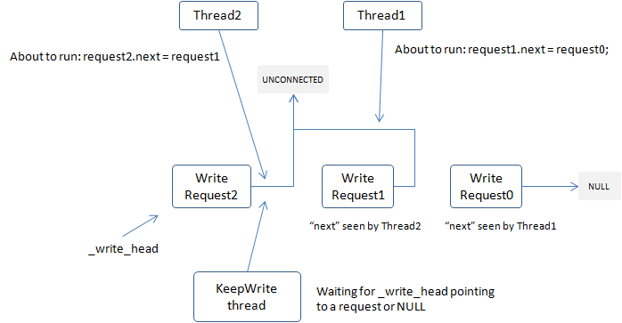
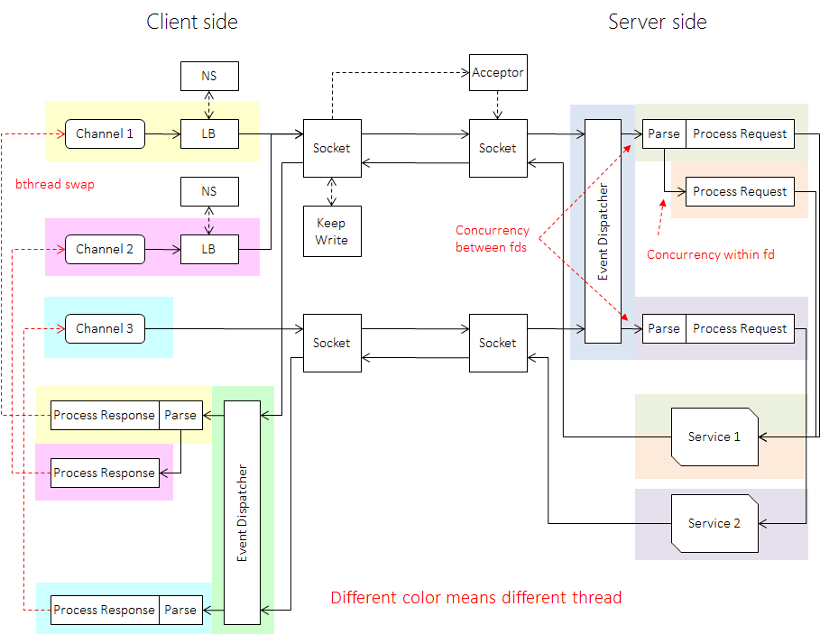

[中文版](../cn/io.md)

There are three mechanisms to operate IO in general:

- Blocking IO: once an IO operation is issued, the calling thread is blocked until the IO ends, which is a kind of synchronous IO, such as default actions of posix [read](http://linux.die.net/man/2/read) and [write](http://linux.die.net/man/2/write).
- Non-blocking IO: If there is nothing to read or too much to write, APIs that would block return immediately with an error code. Non-blocking IO is often used with IO multiplexing([poll](http://linux.die.net/man/2/poll), [select](http://linux.die.net/man/2/select), [epoll](http://linux.die.net/man/4/epoll) in Linux or [kqueue](https://www.freebsd.org/cgi/man.cgi?query=kqueue&sektion=2) in BSD).
- Asynchronous IO: Start a read or write operation with a callback, which will be called when the IO is done, such as [OVERLAPPED](https://msdn.microsoft.com/en-us/library/windows/desktop/ms684342(v=vs.85).aspx) + [IOCP](https://msdn.microsoft.com/en-us/library/windows/desktop/aa365198(v=vs.85).aspx) in Windows. Native AIO in Linux only supports files.

Non-blocking IO is usually used for increasing IO concurrency in Linux. When the IO concurrency is low, non-blocking IO is not necessarily more efficient than blocking IO, which is handled completely by the kernel. System calls like read/write are highly optimized and probably more efficient. But when IO concurrency increases, the drawback of blocking-one-thread in blocking IO arises: the kernel keeps switching between threads to do effective jobs, and a CPU core may only do a little bit of work before being replaced by another thread, causing CPU cache not fully utilized. In addition a large number of threads decrease performance of code dependent on thread-local variables, such as tcmalloc. Once malloc slows down, the overall performance of the program decreases as well. As a contrast, non-blocking IO is typically composed with a relatively small number of event dispatching threads and worker threads(running user code), which are reused by different tasks (in another word, part of scheduling work is moved to userland). Event dispatchers and workers run on different CPU cores simultaneously without frequent switches in the kernel. There's no need to have many threads, so the use of thread-local variables is also more adequate. All these factors make non-blocking IO faster than blocking IO. But non-blocking IO also has its own problems, one of which is more system calls, such as [epoll_ctl](http://man7.org/linux/man-pages/man2/epoll_ctl.2.html). Since epoll is implemented as a red-black tree, epoll_ctl is not a very fast operation, especially in multi-threaded environments. Implementations heavily dependent on epoll_ctl is often confronted with multi-core scalability issues. Non-blocking IO also has to solve a lot of multi-threaded problems, producing more complex code than blocking IO.

# Receiving messages

A message is a bounded binary data read from a connection, which may be a request from upstream clients or a response from downstream servers. brpc uses one or several [EventDispatcher](https://github.com/brpc/brpc/blob/master/src/brpc/event_dispatcher.cpp)(referred to as EDISP) to wait for events from file descriptors. Unlike the common "IO threads", EDISP is not responsible for reading or writing. The problem of IO threads is that one thread can only read one fd at a given time, other reads may be delayed when many fds in one IO thread are busy. Multi-tenancy, complicated load balancing and [Streaming RPC](streaming_rpc.md) worsen the problem. Under high workloads, regular long delays on one fd may slow down all fds in the IO thread, causing more long tails.

Because of a [bug](https://patchwork.kernel.org/patch/1970231/) of epoll (at the time of developing brpc) and overhead of epoll_ctl, edge triggered mode is used in EDISP. After receiving an event, an atomic variable associated with the fd is added by one atomically. If the variable is zero before addition, a bthread is started to handle the data from the fd. The pthread worker in which EDISP runs is yielded to the newly created bthread to make it start reading ASAP and have a better cache locality. The bthread in which EDISP runs will be stolen to another pthread and keep running, this mechanism is work stealing used in bthreads. To understand exactly how that atomic variable works, you can read [atomic instructions](atomic_instructions.md) first, then check [Socket::StartInputEvent](https://github.com/brpc/brpc/blob/master/src/brpc/socket.cpp). These methods make contentions on dispatching events of one fd [wait-free](http://en.wikipedia.org/wiki/Non-blocking_algorithm#Wait-freedom).

[InputMessenger](https://github.com/brpc/brpc/blob/master/src/brpc/input_messenger.h) cuts messages and uses customizable callbacks to handle different format of data. `Parse` callback cuts messages from binary data and has relatively stable running time; `Process` parses messages further(such as parsing by protobuf) and calls users' callbacks, which vary in running time. If n(n > 1) messages are read from the fd, InputMessenger launches n-1 bthreads to handle first n-1 messages respectively, and processes the last message in-place. InputMessenger tries protocols one by one. Since one connections often has only one type of messages, InputMessenger remembers current protocol to avoid trying for protocols next time. 

It can be seen that messages from different fds or even same fd are processed concurrently in brpc, which makes brpc good at handling large messages and reducing long tails on processing messages from different sources under high workloads.

# Sending Messages

A message is a bounded binary data written to a connection, which may be a response to upstream clients or a request to downstream servers. Multiple threads may send messages to a fd at the same time, however writing to a fd is non-atomic, so how to queue writes from different thread efficiently is a key technique. brpc uses a special wait-free MPSC list to solve the issue. All data ready to write is put into a node of a singly-linked list, whose next pointer points to a special value(`Socket::WriteRequest::UNCONNECTED`). When a thread wants to write out some data, it tries to atomically exchange the node with the list head(Socket::_write_head) first. If the head before exchange is empty, the caller gets the right to write and writes out the data in-place once. Otherwise there must be another thread writing. The caller points the next pointer to the head returned to make the linked list connected. The thread that is writing will see the new head later and write new data.

This method makes the writing contentions wait-free. Although the thread that gets the right to write is not wait-free nor lock-free in principle and may be blocked by a node that is still UNCONNECTED(the thread issuing write is swapped out by OS just after atomic exchange and before setting the next pointer, within execution time of just one instruction), the blocking rarely happens in practice. In current implementations, if the data cannot be written fully in one call, a KeepWrite bthread is created to write the remaining data. This mechanism is pretty complicated and the principle is depicted below. Read [socket.cpp](https://github.com/brpc/brpc/blob/master/src/brpc/socket.cpp) for more details.

Since writes in brpc always complete within short time, the calling thread can handle new tasks more quickly and background KeepWrite threads also get more tasks to write in one batch, forming pipelines and increasing the efficiency of IO at high throughputs.

# Socket

[Socket](https://github.com/brpc/brpc/blob/master/src/brpc/socket.h) contains data structures related to fd and is one of the most complex structure in brpc. The unique feature of this structure is that it uses 64-bit SocketId to refer to a Socket object to facilitate usages of fd in multi-threaded environments. Commonly used methods:

- Create: create a Socket and return its SocketId.
- Address: retrieve Socket from an id, and wrap it into a unique_ptr(SocketUniquePtr) that will be automatically released. When Socket is set failed, the pointer returned is empty. As long as Address returns a non-null pointer, the contents are guaranteed to not change until the pointer is destructed. This function is wait-free.
- SetFailed: Mark a Socket as failed and Address() on corresponding SocketId will return empty pointer (until health checking resumes the socket). Sockets are recycled when no one is referencing it anymore. This function is lock-free.

We can see that, Socket is similar to [shared_ptr](http://en.cppreference.com/w/cpp/memory/shared_ptr) in the sense of referential counting and SocketId is similar to [weak_ptr](http://en.cppreference.com/w/cpp/memory/weak_ptr). The unique `SetFailed` prevents Socket from being addressed so that the reference count can hit zero finally. Simply using shared_ptr/weak_ptr cannot guarantee this. For example, when a server needs to quit when requests are still coming in frequently, the reference count of Socket may not hit zero and the server is unable to stop quickly. What' more, weak_ptr cannot be directly put into epoll data, but SocketId can. These factors lead to design of Socket which is stable and rarely changed since 2014.

Using SocketUniquePtr or SocketId depends on if a strong reference is needed. For example, Controller is used thoroughly inside RPC and has a lot of interactions with Socket, it uses SocketUniquePtr. Epoll notifies events on fds and events of a recycled socket can be ignored, so epoll uses SocketId. 

As long as SocketUniquePtr is valid, the Socket enclosed will not be changed so that users have no need to care about race conditions and ABA problems, being safer to operate the shared socket. This method also circumvents implicit referential counting and makes ownership of memory more clear, producing better-quality programs. brpc uses SocketUniquePtr and SocketId a lot to simplify related issues.

In fact, Socket manages not only the native fd but also other resources, such as SubChannel in SelectiveChannel is also managed by Socket, making SelectiveChannel choose a SubChannel just like a normal channel choosing a downstream server. The faked Socket even implements health checking. Streaming RPC also uses Socket to reuse the code on wait-free write.

# The full picture

