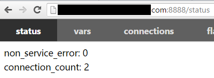

rpc_press pressure tests various rpc servers without writing code. The currently supported protocols are:

-baidu_std
-hulu-pbrpc
-sofa-pbrpc
-public_pbrpc
-nova_pbrpc

# Get tools

First compile brpc according to [Getting Started](getting_started.md), and then go to tools/rpc_press to compile.

If there is an error that libssl.so.4 cannot be found on CentOS 6.3, you can execute `ln -s /usr/lib64/libssl.so.6 libssl.so.4 temporary solution`

# Send pressure

rpc_press will dynamically load the proto file without compiling the proto file into a C++ source file. rpc_press will load an input file in json format, convert it into a pb request, and send it to the server. After receiving a pb reply, it will convert it to json and write it to the file specified by the user if necessary.

All options of rpc_press come from command line parameters, not configuration files.

The following command sends two pb requests to the downstream 0.0.0.0:8002 repeatedly with baidu_std, which are transferred from'{"message":"hello"} and "{"message":"world"}, and keep pressing until you press ctrl-c , Qps is 100.

json can also be written in a file. If ./input.json contains the above two requests, -input=./input.json is also possible.

Required parameters:

--proto: Specify the relevant proto file name.
--method: Specify the method name, the form must be package.service.method.
--server: When -lb_policy is empty, it is the ip:port of the server; when -lb_policy is not empty, it is the cluster address, such as bns://node-name, file://server_list, etc. See [naming service](client.md#naming service) for details.
--input: Specify the json request or the file containing the json request. No separator is required between json after r32157, and json before r32157 is separated by a semicolon.

Optional parameters:

--inc: contains the path of the imported proto file. rpc_press supports other proto files in the import directory by default, but if the proto file is in another directory, it must be specified by this parameter, and multiple paths are separated by semicolons (;).
--lb_policy: Specify the load balancing algorithm, the default is empty, the options are: rr random la c_murmurhash c_md5, see [Load Balancing](client.md#Load Balancing) for details.
--timeout_ms: Set timeout, the unit is milliseconds (milliseconds), the default is 1000 (1 second)
--max_retry: The maximum number of retries, the default is 3, generally no need to modify. For details of brpc's retry behavior, please see [here](client.md#retry).
--protocol: The protocol used to connect to the server, see [protocol](client.md#protocol) for options, the default is baidu_std
--connection_type: connection mode, the options are: single pooled short, see [connection mode](client.md#connection mode) for details. By default, it will be automatically selected according to the agreement, no need to specify.
--output: If it is not empty, the response will be converted to json and written into this file. The default is empty.
--duration: when it is greater than 0, it means to exit after sending so many seconds of pressure, otherwise it will keep sending until ctrl-c is pressed or the process is killed. The default is 0 (always send).
--qps: When greater than 0, it means sending at this pressure, otherwise sending at the maximum speed (adaptive). The default is 100.
--dummy_port: modify the port of dummy_server, the default is 8888

Common parameter combinations:

-To downstream 0.0.0.0:8002, use baidu_std to send all the requests in ./input.json repeatedly, and keep the pressure until you press ctrl-c and qps is 100.
./rpc_press -proto=echo.proto -method=example.EchoService.Echo -server=0.0.0.0:8002 -input=./input.json -qps=100
-Use the round-robin shunt algorithm to repeatedly send two pb requests with baidu_std to all downstream machines represented by bns://node-name, and keep the pressure until you press ctrl-c and qps is 100.
./rpc_press -proto=echo.proto -method=example.EchoService.Echo -server=bns://node-name -lb_policy=rr -input='{"message":"hello"} {"message":" world"}' -qps=100
-Downstream 0.0.0.0:8002, use the hulu protocol to send two pb requests repeatedly, and keep the pressure until you press ctrl-c and qps is 100.
./rpc_press -proto=echo.proto -method=example.EchoService.Echo -server=0.0.0.0:8002 -protocol=hulu_pbrpc -input='{"message":"hello"} {"message":"world" }'-qps=100
-Downstream 0.0.0.0:8002, use baidu_std to send two pb requests repeatedly, and keep the maximum pressure until you press ctrl-c.
./rpc_press -proto=echo.proto -method=example.EchoService.Echo -server=0.0.0.0:8002 -input='{"message":"hello"} {"message":"world"}' -qps =0
-Downstream 0.0.0.0:8002, use baidu_std to send two pb requests repeatedly, and continue the maximum pressure for 10 seconds.
./rpc_press -proto=echo.proto -method=example.EchoService.Echo -server=0.0.0.0:8002 -input='{"message":"hello"} {"message":"world"}' -qps =0 -duration=10
-The proto file in another directory is imported in echo.proto
./rpc_press -proto=echo.proto -inc=<another-dir-with-the-imported-proto> -method=example.EchoService.Echo -server=0.0.0.0:8002 -input='{"message": "hello"} {"message":"world"}' -qps=0 -duration=10

After rpc_press is started, it will start a dummy server on port 8888 by default to observe the operation of rpc_press itself:

```
./rpc_press -proto=echo.proto -service=example.EchoService -method=Echo -server=0.0.0.0:8002 -input=./input.json -duration=0 -qps=100
TRACE: 01-30 16:10:04: * 0 src/brpc/server.cpp:733] Server[dummy_servers] is serving on port=8888.
TRACE: 01-30 16:10:04: * 0 src/brpc/server.cpp:742] Check out http://xxx.com:8888 in your web browser.</code>
```

When dummy_server starts, the log will be printed on the terminal. Generally, you can directly open the corresponding built-in service page by pressing ctrl and clicking the link, like this:



Switch to the vars page and enter rpc_press in the Search box to see the delay distribution of the current pressure:


You can modify the port of dummy_server through the -dummy_port parameter, please make sure that the port can be accessed in the browser.

If you cannot open the browser, the command line will also print information regularly:

```
2016/01/30-16:19:01 sent:101 success:101 error:0 total_error:0 total_sent:28379     
2016/01/30-16:19:02 sent:101 success:101 error:0 total_error:0 total_sent:28480     
2016/01/30-16:19:03 sent:101 success:101 error:0 total_error:0 total_sent:28581     
2016/01/30-16:19:04 sent:101 success:101 error:0 total_error:0 total_sent:28682     
2016/01/30-16:19:05 sent:101 success:101 error:0 total_error:0 total_sent:28783     
2016/01/30-16:19:06 sent:101 success:101 error:0 total_error:0 total_sent:28884     
2016/01/30-16:19:07 sent:101 success:101 error:0 total_error:0 total_sent:28985     
2016/01/30-16:19:08 sent:101 success:101 error:0 total_error:0 total_sent:29086     
2016/01/30-16:19:09 sent:101 success:101 error:0 total_error:0 total_sent:29187     
2016/01/30-16:19:10 sent:101 success:101 error:0 total_error:0 total_sent:29288     
[Latency]
  avg 122 us
  50% 122 us
  70% 135 us
  90% 161 us
  95% 164 us
  97% 166 us
  99% 172 us
  99.9% 199 us
  99.99% 199 us
  max 199 us
```

The meaning of the fields above should be self-explanatory, so skip it here. Below is the delay information, the first item "avg" is the average delay in 10 seconds, the last item "max" is the maximum delay in 10 seconds, and the rest ending with a percent sign represents the delay quantile value , That is, there are so many request delays on the left that are less than the delay on the right (in microseconds). General performance testing needs to focus on the long tail region after 99%.

# FAQ

**Q: If the downstream is a service module based on the j-protobuf framework, how to configure the pressure tool? **

A: Because of protocol compatibility issues, you need to bring -baidu_protocol_use_fullname=false when starting rpc_press