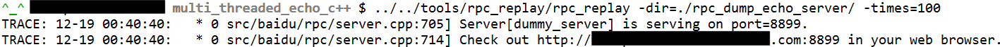

After r31658, brpc can randomly write part of the request into some files and play them back through the rpc_replay tool. Currently supported protocols are: baidu_std, hulu_pbrpc, sofa_pbrpc.

# Get tools

First compile brpc according to [Getting Started](getting_started.md), and then go to tools/rpc_replay to compile.

If there is an error that libssl.so.4 cannot be found on CentOS 6.3, you can execute `ln -s /usr/lib64/libssl.so.6 libssl.so.4 temporary solution`

# Sampling

brpc uses the following flags to open and control how to save the request. The flags containing the (R) suffix can be set dynamically.


Parameter Description:

--rpc_dump is the main switch, and other flags starting with rpc_dump are invalid when it is turned off. When -rpc_dump is turned on, brpc will collect requests with a certain probability. If the qps of the service is very high, brpc will adjust the sampling ratio so that the number of requests sampled per second does not exceed the value corresponding to -bvar_collector_expected_per_second. This value also affects rpcz and contention profiler at present, and generally does not need to be changed, and it will be independent for different applications in the future.
--rpc_dump_dir: set to store the directory requested by dump
--rpc_dump_max_files: Set the maximum number of files in the directory. When the limit is exceeded, old files will be deleted to make room.
--rpc_dump_max_requests_in_one_file: The maximum number of requests in a file, write a new file after exceeding.

brpc uses a [bvar::Collector](https://github.com/brpc/brpc/blob/master/src/bvar/collector.h) to aggregate sampled requests from different threads, and there is no competition between different threads , The overhead is small.

The written content is sequentially stored in multiple files in the rpc_dump_dir directory. This directory is by default in ./rpc_dump_<app>, where <app> is the program name. Different programs will write different directories when sampling at the same time in the same directory. If rpc_dump_dir already exists when the program starts, the directory will be emptied. Each file in the directory is named after requests.yyyymmdd_hhmmss_uuuuus to ensure that it is easy to find in time order, such as:


The number of files in the directory does not exceed rpc_dump_max_files, after which the oldest file is deleted to make room for new files.

The file is in a binary format, which is similar to the binary format of the baidu_std protocol. The binary layout of each request is as follows:

```
"PRPC" (4 bytes magic string)
body_size(4 bytes)
meta_size(4 bytes)
RpcDumpMeta (meta_size bytes)
serialized request (body_size-meta_size bytes, including attachment)
```

The requests are tightly packed. The number of requests in a file does not exceed rpc_dump_max_requests_in_one_file.

> A file may contain requests of multiple protocols, if the server is accessed by multiple protocols. The requested server during playback will also receive requests of different protocols.

brpc provides [SampleIterator](https://github.com/brpc/brpc/blob/master/src/brpc/rpc_dump.h) to sequentially read all sampled requests from all files in a sampling directory, users You can deserialize the serialized request into a protobuf request according to your needs, and do some secondary development.

```c++
#include <brpc/rpc_dump.h>
...
brpc::SampleIterator it("./rpc_data/rpc_dump/echo_server");         
for (brpc::SampledRequest* req = it->Next(); req != NULL; req = it->Next()) {
    ...                    
    // The type of req->meta is brpc::RpcDumpMeta, which is defined in src/brpc/rpc_dump.proto
    // The type of req->request is butil::IOBuf, which corresponds to "serialized request" in the format description
    // You must delete req after use.
}
```

# Replay

brpc provides a default playback tool in [tools/rpc_replay](https://github.com/brpc/brpc/tree/master/tools/rpc_replay/). The operation mode is as follows:



Main parameter description:

--dir specifies the directory where sample files are stored
--times specifies the number of loop playbacks. For other parameters, please add --help to run and view.
--connection_type: the way to connect to the server
--dummy_port: modify the port of dummy_server
--max_retry: Maximum number of retries, 3 times by default.
--qps: limit qps when greater than 0, the default is 0 (unlimited)
--server: the address of the server
--thread_num: The number of sending threads. When it is 0, it will be automatically adjusted according to qps, and the default is 0. Generally do not need to be set.
--timeout_ms: timeout
--use_bthread: Use bthread to send, the default is.

rpc_replay will start a dummy server for monitoring only by default. After opening, you can check the playback status. Among them, rpc_replay_error is the number of playback failures.


If you cannot open the browser, the command line will also print information regularly:

```
2016/01/30-16:19:01 sent:101 success:101 error:0 total_error:0 total_sent:28379     
2016/01/30-16:19:02 sent:101 success:101 error:0 total_error:0 total_sent:28480     
2016/01/30-16:19:03 sent:101 success:101 error:0 total_error:0 total_sent:28581     
2016/01/30-16:19:04 sent:101 success:101 error:0 total_error:0 total_sent:28682     
2016/01/30-16:19:05 sent:101 success:101 error:0 total_error:0 total_sent:28783     
2016/01/30-16:19:06 sent:101 success:101 error:0 total_error:0 total_sent:28884     
2016/01/30-16:19:07 sent:101 success:101 error:0 total_error:0 total_sent:28985     
2016/01/30-16:19:08 sent:101 success:101 error:0 total_error:0 total_sent:29086     
2016/01/30-16:19:09 sent:101 success:101 error:0 total_error:0 total_sent:29187     
2016/01/30-16:19:10 sent:101 success:101 error:0 total_error:0 total_sent:29288     
[Latency]
  avg 122 us
  50% 122 us
  70% 135 us
  90% 161 us
  95% 164 us
  97% 166 us
  99% 172 us
  99.9% 199 us
  99.99% 199 us
  max 199 us
```

The meaning of the fields above should be self-explanatory, so skip it here. Below is the delay information, the first item "avg" is the average delay within 10 seconds, the last item "max" is the maximum delay within 10 seconds, and the rest ending with a percent sign represents the delay quantile value , That is, there are so many request delays on the left that are less than the delay on the right (in microseconds). Performance testing needs to focus on the long tail region after 99%.