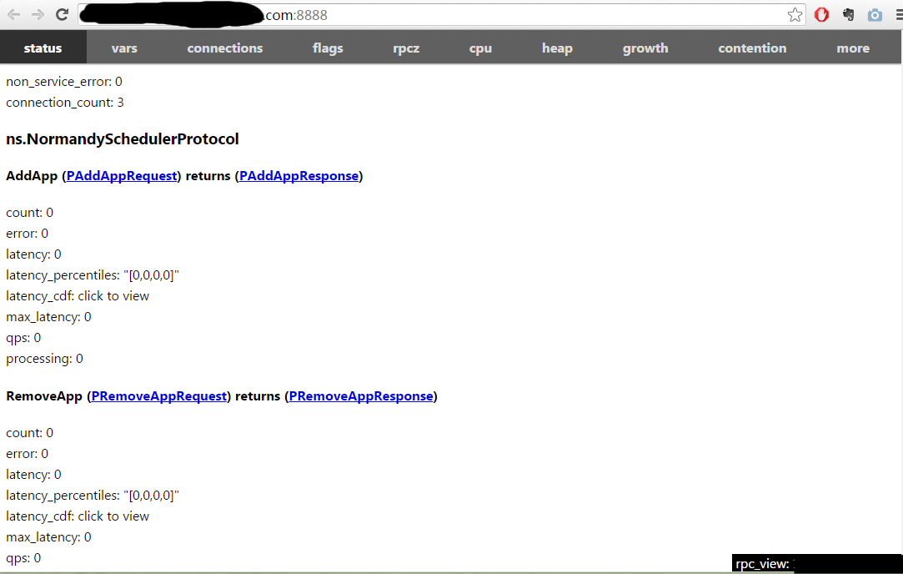
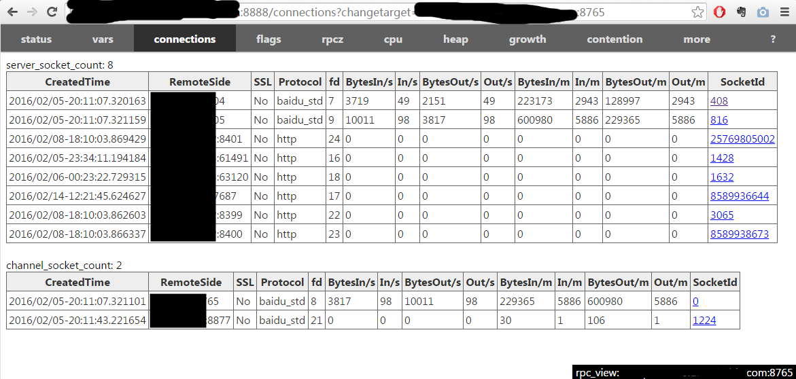

rpc_view can forward the built-in services of servers whose ports are restricted. For example, if the port of a service in Baidu is not 8000-8999, you can only use curl to view its built-in services under the command line. There is no historical trend and dynamic curve, and no link can be clicked. It is inconvenient to troubleshoot problems. rpc_view is a special http proxy: all visits to it are converted to visits to the target server. As long as the port of rpc_view can be accessed in the browser, we can use it to see the server that could not be seen directly.

# Get tools

First compile brpc according to [Getting Started](getting_started.md), and then go to tools/rpc_view to compile.

If there is an error that libssl.so.4 cannot be found on CentOS 6.3, you can execute `ln -s /usr/lib64/libssl.so.6 libssl.so.4 temporary solution`

# Visit the target server

Make sure that your machine can access the target server. The development machine should work, but some test machines may not. Just run ./rpc_view <server-address>.

for example:

```
$ ./rpc_view 10.46.130.53:9970
TRACE: 02-14 12:12:20: * 0 src/brpc/server.cpp:762] Server[rpc_view_server] is serving on port=8888.
TRACE: 02-14 12:12:20: * 0 src/brpc/server.cpp:771] Check out http://XXX.com:8888 in web browser.
```

Open the page provided by rpc_view on port 8888 (press and hold ctrl and click url in secureCRT):



This page is the built-in service of the target server. The prompt in the lower right corner tells us that this is provided by rpc_view. This page is basically the same as the real built-in service, you can do any operation.

# Replace the target server

You can stop rpc_view and change the target server at any time, but if you find it troublesome, you can also do it on the browser: add?changetarget=<new-server-address> to the url.

If we stayed on the /connections page of the original target server before:


After adding ?changetarge, it jumps to the /connections page of the new target server. Next click on other tabs to display the new target server.

