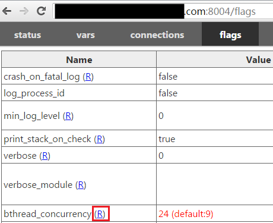
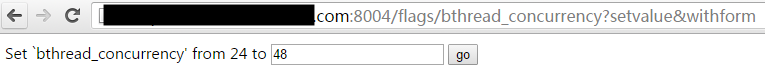
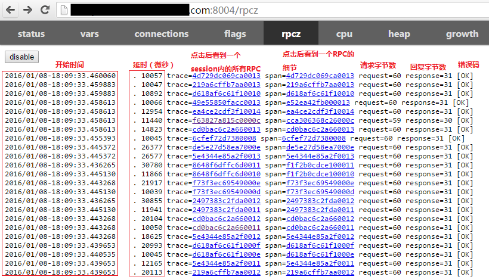
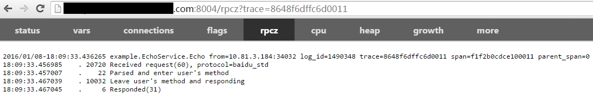
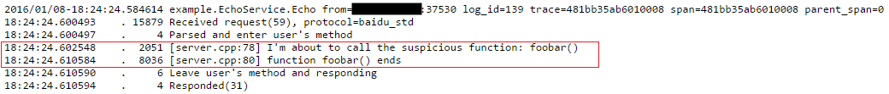
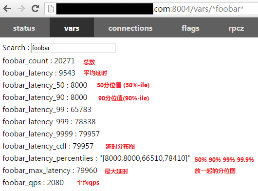

# 1. Check the number of worker threads

Check /vars/bthread_worker_**count** and /vars/bthread_worker_**usage**, which is the number of worker threads in total and being used, respectively.

> The number of usage and count being close means that worker threads are not enough.

For example, there are 24 worker threads in the following figure, among which 23.93 worker threads are being used, indicating all the worker threads are full of jobs and not enough.


There are 2.36 worker threads being used in the following figure. Apparently the worker threads are enough.


These two figures can be seen directly by putting /vars/bthread_worker_count;bthread_worker_usage?expand after service url, just like [this](http://brpc.baidu.com:8765/vars/bthread_worker_count;bthread_worker_usage?expand).

# 2. Check CPU usage

Check /vars/system_core_**count** and /vars/process_cpu_**usage**, which is the number of cpu core available and being used, respectively.

> The number of usage and count being close means that cpus are enough.

In the following figure the number of cores is 24, while the number of cores being used is 20.9, which means CPU is bottleneck.


The number of cores being used in the figure below is 2.06, then CPU is sufficient.


# 3. Locate problems

The number of process_cpu_usage being close to bthread_worker_usage means it is a cpu-bound program and worker threads are doing calculations in most of the time.

The number of process_cpu_usage being much less than bthread_worker_usage means it is an io-bound program and worker threads are blocking in most of the time.

(1 - process_cpu_usage / bthread_worker_usage) is the time ratio that spent on blocking. For example, if process_cpu_usage = 2.4, bthread_worker_usage = 18.5, then worker threads spent 87.1% of time on blocking.

## 3.1 Locate cpu-bound problem

The possible reason may be the poor performance of single server or uneven distribution to upstreams.

### exclude the suspect of uneven distribution to upstreams

Enter qps at [vars]((http://brpc.baidu.com:8765/vars) page of different services to check whether qps is as expected, just like this:


Or directly visit using curl in command line, like this:

```shell
$ curl brpc.baidu.com:8765/vars/*qps*
bthread_creation_qps : 95
rpc_server_8765_example_echo_service_echo_qps : 57
```

If the distribution of different machines is indeed uneven and difficult to solve, [Limit concurrency](server.md#user-content-limit-concurrency) can be considered to use.

### Improve performance of single server

Please use [CPU profiler](cpu_profiler.md) to analyze hot spots of the program and use data to guide optimization. Generally speaking, some big and obvious hot spots can be found in a cpu-bound program.

## 3.2 Locate io-bound problem

The possible reason:

- working threads are not enough.
- the client that visits downstream servers doesn't support bthread and the latency is too long.
- blocking that caused by internal locks, IO, etc.

If blocking is inevitable, please consider asynchronous method.

### exclude the suspect of working threads are not enough

If working threads are not enough, you can try to dynamically adjust the number of threads. Switch to the /flags page and click the (R) in the right of bthread_concurrency:



Just enter the new thread number and confirm:



Back to the /flags page, you can see that bthread_concurrency has become the new value.


However, adjusting the number of threads may not be useful. If the worker threads are largely blocked by visiting downstreams, it is useless to adjust the thread number since the real bottleneck is in the back-end and adjusting the thread number to a larger value just make the blocking time of each thread become longer.

For example, in our example, the worker threads are still full of work after the thread number is resized.


### exclude the suspect of lock

If the program is blocked by some lock, it can also present features of io-bound. First use [contention profiler](contention_profiler.md) to check the contention status of locks.

### use rpcz

rpcz can help you see all the recent requests and the time(us) spent in each phase while processing them.



Click on a span link to see when the RPC started, the spent time in each phase and when it ended.



This is a typical example that server is blocked severely. It takes 20ms from receiving the request to starting running, indicating that the server does not have enough worker threads to get the job done in time.

For now the information of this span is less, we can add some in the program. You can use TRACEPRINTF print logs to rpcz. Printed content is embedded in the time stream of rpcz.


After Re-running, you can check the span and it really contains the content we added by TRACEPRINTF.



Before running to the first TRACEPRINTF, the user callback has already run for 2051ms(suppose it meets our expectation), followed by foobar() that took 8036ms, which is expected to return very fast. The range has been further reduced.

Repeat this process until you find the function that caused the problem.

## Use bvar

TRACEPRINTF is mainly suitable for functions that called several times, so if a function is called many times, or the function itself has a small overhead, it is not appropriate to print logs to rpcz every time. You can use bvar instead.

[bvar](bvar.md) is a multi-threaded counting library, which can record the value passed from user at an extreme low cost and almost does not affect the program behavior compared to logging.

Follow the code below to monitor the runtime of foobar.

```c++
#include <butil/time.h>
#include <bvar/bvar.h>
 
bvar::LatencyRecorder g_foobar_latency("foobar");
 
...
void search() {
    ...
    butil::Timer tm;
    tm.start();
    foobar();
    tm.stop();
    g_foobar_latency << tm.u_elapsed();
    ...
}
```

After rerunning the program, enter foobar in the search box of vars. The result is shown as below:



Click on a bvar and you can see a dynamic figure. For example, after clicking on cdf:


Depending on the distribution of delays, you can infer the overall behavior of this function, how it behaves for most requests and how it behaves for long tails.

You can continue this process in the subroutine, add more bvar, compare the different distributions, and finally locate the source.

### Use brpc client only

You have to open the dummy server to provide built-in services, see [here](dummy_server.md).
