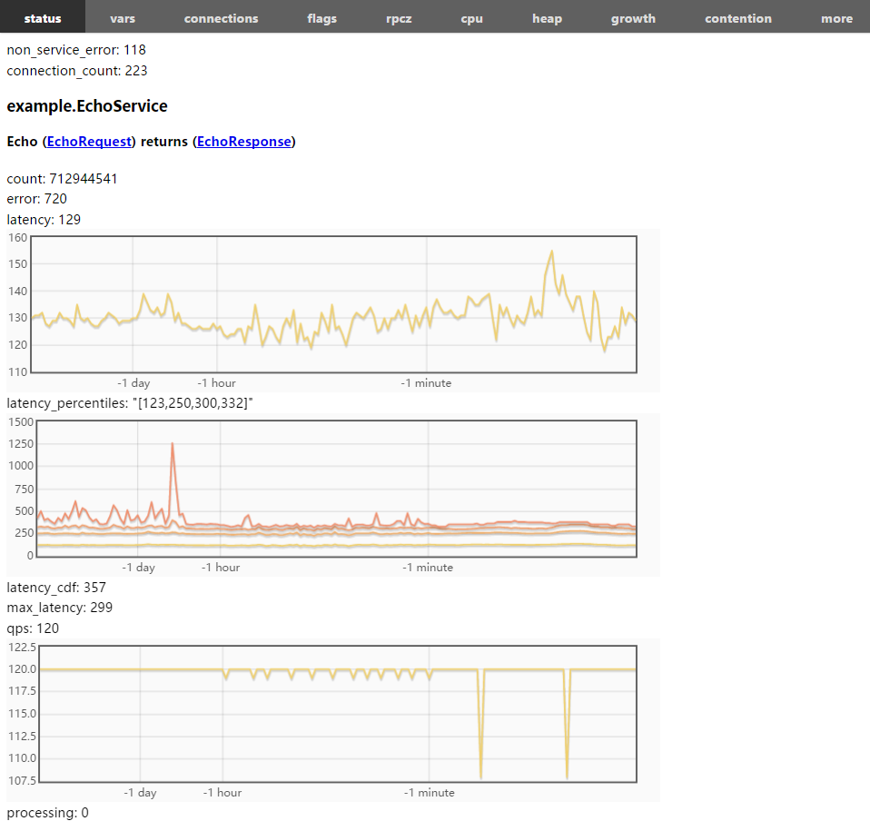
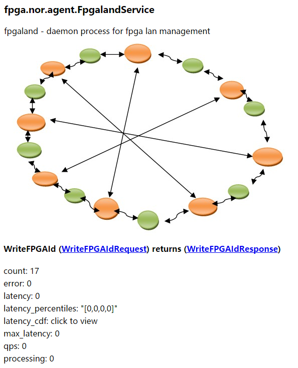

[中文版](../cn/status.md)

[/status](http://brpc.baidu.com:8765/status) shows primary statistics of services inside the server. The data sources are same with [/vars](vars.md), but stats are grouped differently.



Meanings of the fields above:

- **non_service_error**: number of errors raised outside processing code of the service. When a valid service is obtained, the subsequent error is regarded as *service_error*, otherwise it is regarded as *non_service_error* (such as request parsing failed, service name does not exist, request concurrency exceeding limit, etc.). As a contrast, failing to access back-end servers during the processing is an error of the service, not a *non_service_error*. Even if the response written out successfully stands for failure, the error is counted into the service rather than *non_service_error*.
- **connection_count**: number of connections to the server from clients, not including number of outward connections which are displayed at /vars/rpc_channel_connection_count.
- **example.EchoService**: Full name of the service, including the package name defined in proto.
- **Echo (EchoRequest) returns (EchoResponse)**: Signature of the method. A service can have multiple methods. Click links on request/response to see schemes of the protobuf messages.
- **count**: Number of requests that are succesfully processed.
- **error**: Number of requests that are failed to process.
- **latency**: average latency in recent *60s/60m/24h/30d* from *right to left* on html, average latency in recent 10s(by default, specified by [-bvar_dump_interval](http://brpc.baidu.com:8765/flags/bvar_dump_interval)) on plain texts.
- **latency_percentiles**: 80%, 90%, 99%, 99.9% percentiles of latency in 10 seconds(specified by[-bvar_dump_interval](http://brpc.baidu.com:8765/flags/bvar_dump_interval)). Curves with historical values are shown on html.
- **latency_cdf**: shows percentiles as [CDF](https://en.wikipedia.org/wiki/Cumulative_distribution_function), only available on html.
- **max_latency**: max latency in recent *60s/60m/24h/30d* from *right to left* on html, max latency in recent 10s(by default, specified by [-bvar_dump_interval](http://brpc.baidu.com:8765/flags/bvar_dump_interval)) on plain texts.
- **qps**: QPS(Queries Per Second) in recent *60s/60m/24h/30d* from *right to left* on html. QPS in recent 10s(by default, specified by [-bvar_dump_interval](http://brpc.baidu.com:8765/flags/bvar_dump_interval)) on plain texts.
- **processing**: (renamed to concurrency in master) Number of requests being processed by the method. If this counter can't hit zero when the traffic to the service becomes zero, the server probably has bugs, such as forgetting to call done->Run() or stuck on some processing steps.


Users may customize descriptions on /status by letting the service implement [brpc::Describable](https://github.com/brpc/brpc/blob/master/src/brpc/describable.h).

```c++
class MyService : public XXXService, public brpc::Describable {
public:
    ...
    void Describe(std::ostream& os, const brpc::DescribeOptions& options) const {
        os << "my_status: blahblah";
    }
};
```

For example:


